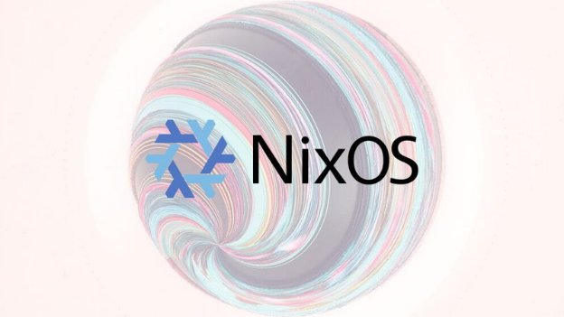

# How we use Nix at IOHK
 6 February 2019[ Rodney Lorrimar](/en/blog/authors/rodney-lorrimar/page-1/) 10 mins read

### [**Rodney Lorrimar**](/en/blog/authors/rodney-lorrimar/page-1/)
Software Engineer

Engineering

- 
- 

IOHK has a history of putting great research into practice. This includes the use of functional programming languages, adoption of formal methods, and — of course — implementing our own peer-reviewed research into blockchain consensus algorithms. We approach the problem of software deployment in similar vein, using ideas which have emerged from recent academic work. This system applies the principles of functional programming to the domain of software package management and system administration.

In this short technical article I will describe how we leverage Nix at IOHK, and share some of our plans for the future.
## **What are Nix, Nixpkgs, and NixOS?**
[NixOS](https://nixos.org "nixos.org") is a Linux distribution built on the Nix package manager.

What I personally like about the Nix package manager is its ability to install multiple versions of the same package, or easily apply a source code modification to a package. For Haskell development in particular, there are binary packages for an impressive number of compilers, tools, and Hackage packages available.

What sets NixOS apart is its configuration system. It includes a large collection of high-quality modules which are configured declaratively in a uniform way. This is a boon for system administrators who need to apply the same configuration to many systems, or integrate a wide variety of software into one system.

Underneath the Nix package manager and NixOS is the Nix language — a domain-specific, purely functional, lazily-evaluated language for software configuration and deployment.

The paper [NixOS: A purely functional Linux distribution](https://nixos.org/~eelco/pubs/nixos-jfp-final.pdf "NixOS: A purely functional Linux distribution, nixos.org") is an excellent introduction. It clearly sets out the problems which NixOS attempts to solve, many of which will be familiar to technical users.
## **Who is behind the NixOS project?**
NixOS was initially created in 2003 at Utrecht University as the research project of Eelco Dolstra, forming the main part of his [doctoral thesis](https://nixos.org/~eelco/pubs/phd-thesis.pdf). Fifteen years later, the NixOS project is run on [GitHub](https://github.com/NixOS/nixpkgs "Nix Packages collection, github.com") with hundreds of contributors involved, and the code base is currently improving at a rate of about 500 git commits per week.

The community also communicate through an active [IRC channel](javascript:void\(0\) "irc.freenode.net/#nixos") on Freenode, a [discussion board](https://discourse.nixos.org/ "discourse.nixos.org"), a (roughly) annual conference, and regular meetups.

Moreover, several companies provide Nix consulting services, such as [Tweag I/O](https://www.tweag.io/ "tweag.io") and [Mayflower](https://nixos.mayflower.consulting/ "nixos.mayflower.consulting").
## **Why Nix?**
There are many existing systems for software configuration management, some with far more users than Nix. However, we believe that Nix has the best available implementation of 'Infrastructure as Code', not only in terms of features, but also in its design and potential.

If you treat your deployment as a program written in a functional language, then you gain the advantages of functional programming like referential transparency, safe code reuse, and the ability to unit test your deployment. At its heart, the Nix 'derivation' abstracts details away and allows software modules to be built and used in more or less the same way, regardless of their source language.

A derivation is a function which takes source code, build tools, and library dependencies, and produces an immutable software package; because Nix is pure (in the functional programming sense), if any of the inputs change, then the result is a different software package. Alternatively, if a derivation with exactly the same inputs has already been built elsewhere (by continuous integration (CI), for example), Nix will just download that package, rather than building the derivation itself, reducing duplication of work.

The way Nix calculates whether a derivation input has changed is by taking its cryptographic hash. Dependencies are recursive, so this hash is actually a hash of hashes — a powerful concept instantly recognizable to blockchain enthusiasts.
## **How we use Nix**
Here are some examples of how we are using Nix at IOHK.
### **1. Deployment of the Cardano SL network**
We run around 200 compute nodes in AWS for the [various testnets](https://testnet.iohkdev.io "Cardano Testnets, testnet.iohkdev.io"), the Cardano SL Byron mainnet, and the Cardano SL staging deployment (an environment used to test upgrades).

These are all NixOS systems deployed with [NixOps](https://nixos.org/nixops/ "nixos.org/nixops").

We have written a tool called [iohk-ops](https://github.com/input-output-hk/iohk-ops "iohk-ops, github.com"), which *generates* a NixOps network from an abstract topology description. The topology description describes the number of Cardano SL relay nodes, which data center they are hosted in, and static routes between peers. iohk-ops calls on NixOps to execute the deployment.

The same tool allows deployment of smaller 'developer clusters' which are used for testing activities. These clusters share the same deployment code, and identical software versions, but are smaller and can be started and stopped as necessary.

The rollback features of NixOS and NixOps have already proved invaluable several times in our staging deployments: the whole network can be redeployed with a single command, or just specific nodes.

With NixOps we have the ability to apply configuration tweaks and code patches, then rebuild *at deploy-time*, confident that the result will be identical to what comes from CI, and can be undone without leaving a mess behind.
### **2. Reproducible deployment**
Extreme measures such as deploy-time code modification are usually not required, because the deployment environment can be reproduced and tested locally, ensuring any problems are caught well in advance.

As mentioned earlier, a Nix derivation is a pure function. The code can be run locally with exactly the same environment and libraries (up to the Linux kernel) as are used in production.
### **3. Fast rebuilds of Docker images**
Docker's strengths include its immutability, encapsulation, and reproducibility, traits shared by Nix. However, it is severely limited by its data model and restricted DSL.

The structure of software dependencies is a tree, not a sequence of layers, as modelled by Docker. A typical annoyance when building Docker images with a Dockerfile is that if a layer near the bottom changes, then everything above must be rebuilt. Furthermore, unless steps are taken to use multiple build stages, intermediate build products from lower layers will be included in the final image.

In contrast, a Nix package will only be rebuilt if its dependencies (or their dependencies) have changed. The minimum *closure* of a Nix package contains only what is necessary to run that software.

Thus we can generate Docker images from the closure of Nix derivations which are minimal and fast to rebuild. The build process can also be parameterized by defining it as a function in the Nix language.
### **4. Declarative deployment of macOS build slaves**
To produce the macOS installer packages of [Daedalus](https://daedaluswallet.io/#download), we maintain a small collection of macOS systems (hosted by [MacinCloud](https://www.macincloud.com/ "macincloud.com")). These systems were quite tedious to maintain until we started using [nix-darwin](https://github.com/LnL7/nix-darwin "Nix Darwin, github.com"). Nix-darwin allows declarative configuration of macOS systems in a similar way to NixOS.

We wrote [a script](https://github.com/input-output-hk/iohk-ops/tree/master/nix-darwin "iohk-ops/nix-darwin, github.com") to set up the Mac through SSH. All things are managed through Nix code, including the build environment, monitoring, and SSH access.
### **5. Cross-compiling Cardano SL for Windows**
To produce the Windows installer packages of [Daedalus](https://daedaluswallet.io/#download "Daedalus Wallet, daedaluswallet.io"), we needed to rely on resource-limited build instances of CI providers, or maintain a small collection of Windows systems. The Windows CI infrastructure has been a constant source of problems for us.

However, we are now able to cross-compile Haskell code for Windows on Linux! The next major version of Daedalus for Windows will ship with a cardano-node.exe that was built with Nix on Linux.

Due to the size of Cardano SL, this is quite an achievement, and the result of several months of hard work.
### **6. Development environments**
With nix-shell, we can provide development environments containing all tools and libraries necessary to build a project, pinned to precisely defined versions.

In [cardano-sl](https://github.com/input-output-hk/cardano-sl "Cardano SL, github.com"), the Nix shell supports either the stack workflow, or cabal new-build with Haskell pre-built dependencies downloaded from the IOHK binary cache.

In [daedalus](https://github.com/input-output-hk/daedalus "Daedalus, github.com"), the Nix shell provides yarn, and a method of running a Cardano SL blockchain and wallet locally.

Developers and users who are not familiar with build tools from other languages such as Cabal, Stack (Haskell), NPM, Yarn (Javascript), or Cargo (Rust), are still able to rebuild (or download a cached build from CI), just by running nix build.

There are other tools for providing reproducible development environments, such as Apache Maven, or Docker, but these are not easily composable. Because Nix is a functional language, development environments are the application of functions, which can be composed. So with Nix you can write a function that combines development environments, or just the parts that you need.
## **Future directions**
2019 will be an exciting year for IOHK, with several ambitious projects in the pipeline. We anticipate that Nix will play a large part in the success of these projects. Some of the things we have planned are:
### **Pure Daedalus build**
We currently build the Daedalus installers for Windows and macOS using a Haskell script. This is slower than necessary and needs to run on a Windows or macOS system: we would prefer to build on Linux with Nix so that software components can be cached as necessary.
### **iohk-nix**
IOHK is splitting the Cardano SL code base into independent modules, which must be integrated into a final product build. We have started a repository of common Nix code [iohk-nix](https://github.com/input-output-hk/iohk-nix "input-output-hk/iohk-nix, github.com") that can be re-used by each Cardano SL subproject.

As with all languages, Nix code can be written in a beautiful or an awful way — and because Nix does not have a static type system, the awful code is really bad. So part of this project will be an effort to improve the legibility and documentation of our Nix code so that it's easy to understand and maintain.
### **Tools for deploying a node or stake pool**
In 2019, Cardano SL will be decentralized. We would like to make it super easy for technical users to deploy one or more Cardano SL nodes, or operate a stake pool.

This will include:

- Smoothing the rough corners of iohk-ops to make it ready for public use.
- Providing a variety of build options such as Docker images, or fully statically-linked executables.
- Using the tools available in NixOS to provide a turn-key monitoring setup for all the necessary application-level metrics.
### **nix-tools Haskell Builder**
The Nix Haskell build infrastructure needed some significant rework in order to cross-compile Haskell to target Windows, mostly to track more information about compiler flags and dependencies.

The result is a more powerful Haskell builder, and a new implementation of stack2nix which runs faster, among other things. This Haskell build infrastructure is called [nix-tools](https://github.com/input-output-hk/nix-tools "input-output-hk/nix-tools, github.com"). We aim to fill in the missing parts and upstream it to Nixpkgs in the coming year.

This subject is so interesting that it deserves its own blog post, which we are looking forward to posting soon.
## **Conclusion**
This was a quick run-through of how we use Nix to help develop and deploy Cardano.

It's not all excellent of course. Users find that Nix has a steep learning curve, and that the community is relatively small. We also have our own wish-list of features and bug fixes for Nix that are not implemented yet.

If you are interested in learning more about Nix, then visit the [NixOS website](https://nixos.org "nixos.org"). If you like coding or system administration, it's very easy to start contributing to the NixOS project. It takes a little while to get oriented with the Nix language, but then you'll find that pretty much everything you need to know is in a single git repository.

At IOHK we regularly contribute back to the NixOS project. These contributions include improvements to packages and NixOS modules, and contracting developers to make larger improvements. Additionally, simply by using NixOS at a large scale in research and commercial projects, we contribute to the ecosystem — by publishing our source code under a free licence, submitting bug reports, or sharing our experiences with the community.
### **We are hiring**
The IOHK team is growing, and we are looking for the right people to join us. If helping develop a blockchain platform more advanced than any other is something that interests you, then check out our [job listings](/en/careers/ "Careers, iohk.io") and get in touch!

Artwork, 

[Mike Beeple](http://www.beeple-crap.com)
