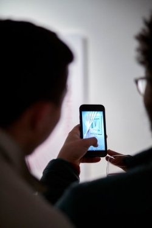

# The Symphony of Blockchains project comes to Bristol
### **The groundbreaking immersive blockchain experience was presented at the Arnolfini Gallery, Bristol**
 20 February 2019[ Amy Reeve](/en/blog/authors/amy-reeve/page-1/) 3 mins read

### [**Amy Reeve**](/en/blog/authors/amy-reeve/page-1/)
Technical Writer

Marketing and Communications

- 
- 

The [Symphony of Blockchains](https://symphony.iohk.io/ "symphony.iohk.io") project had its public debut last week at a packed event in Bristol’s [Arnolfini Gallery](https://www.arnolfini.org.uk/ "arnolfini.org.uk"). Over a hundred visitors took the chance to explore the bitcoin blockchain in full virtual reality (VR), at a joint presentation from IOHK creative partners [Kuva](https://www.kuva.io/ "kuva.io") and [IOHK's creative team](/en/team/#creative "IOHK Creative"). The Symphony project is an educational initiative, with the goal of creating new and innovative ways to teach people about blockchain technology. Andy Buchan, founder and creative director of Kuva, described the project as ‘an unprecedented opportunity to visualize new technology, and to establish a vocabulary for the blockchain industry,’ while IOHK creative director Richard Wild spoke of how the project had 'enabled creatives to engage with hard concepts in new ways.’

The exhibition itself spanned two rooms: one with a large, towering monolith in the centre and two VR headsets, and a second room with rows of augmented reality posters and a projector attached to a VR setup.

 **The large, imposing monolith which occupied one room of the exhibition**

In the first room, visitors queued to put on VR headsets and watch the monolith come to life, while a voiceover explains the fundamentals of blockchain technology. As you listen, bright streaks of light — transactions happening on bitcoin's blockchain in real time — shoot past, gravitating towards the heart of the monolith. There they blend into a glowing ball, a melting pot of transactions that viewers can manipulate, expanding the data into the room around them to explore in 3D.

In a second room, another VR experience — single-handedly created by IOHK creative coder [Scott Darby](/en/team/scott-darby/ "Scott Darby, IOHK Creative Coder") — saw visitors dive deeper into the raw, living data of the bitcoin blockchain. Here you can traverse the intricate structure of Merkle trees, surrounded by bitcoin transaction crystals which glow and hum as you explore. A more in-depth experience, this part of the VR exhibition allowed visitors to travel all the way back to the bitcoin genesis block, generating dynamic audio in real-time as users explored the virtual space.

 **A visitor exploring the blockchain**

Creating the Symphony project isn't just a stunning visual achievement for IOHK and Kuva, but a technical one too. Running the VR simulations requires simultaneously managing and syncing multiple data streams, from the audiovisual cues for the headsets to the lidar mapping the room — and of course, live data from the bitcoin blockchain itself.

 

**Augmented reality posters in action**

Everyone who attended the event seemed impressed, describing the experience as ‘mind-blowing.’ The opportunity to explore the constructs underpinning bitcoin in a tactile, physical way allowed even those with no blockchain experience to grasp fundamental concepts quickly, and visitors as young as twelve expressed a greater understanding of blockchain as a result.

The event in Bristol was just the start for the Symphony project: there'll be an even bigger exhibit at the [IOHK Summit](https://iohksummit.io "IOHK Summit 2019") in Miami next month, before Symphony goes on tour to educate people around the world about blockchain technology.

