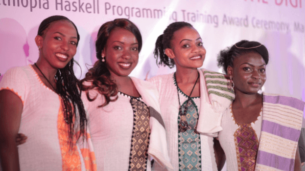
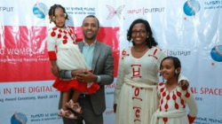
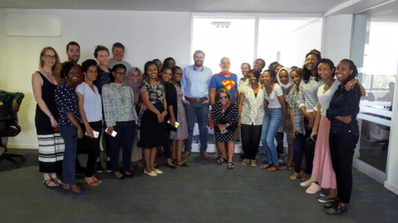
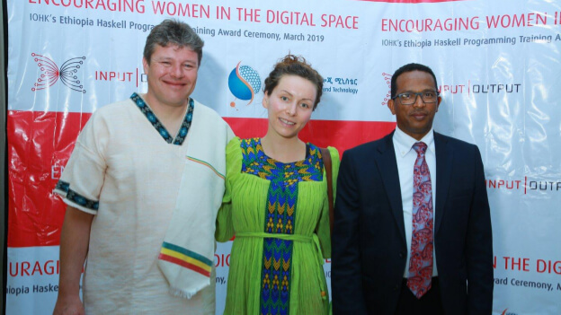

# Training blockchain developers in Africa
### **Women from Ethiopia and Uganda get to grips with Haskell**
 4 April 2019[ Lars Brünjes](/en/blog/authors/lars-brunjes/page-1/) 10 mins read

### [**Lars Brünjes**](/en/blog/authors/lars-brunjes/page-1/)
Education Director

Education

- 
- 
- 
- 

When I got off the plane at Bole airport in Addis Ababa on the evening of January 4, I did not know what to expect. It was my first time in [Ethiopia](https://bitcoinmagazine.com/articles/where-coffee-just-grows-connecting-ethiopian-agritech-blockchain/ "Connecting Ethiopian Agritech to the Blockchain, bitcoinmagazine.com"), and all I knew was that my Canadian colleague Dr [Polina Vinogradova](/en/team/polina-vinogradova/ "Polina Vinogradova, iohk.io"), an IOHK formal methods expert, and I were supposed to teach a three-month-long Haskell course to a class of young Ethiopian and Ugandan women. When our students graduated three months later on March 22, it was the highlight of my professional life. Words fail to describe how very proud I am of these courageous young women who sacrificed so much to attend the class, who worked tirelessly and hard, eager to start tackling some of the most pressing problems their countries face.

I stand humbled, not only by their fierce intelligence and passion, but also by their gentleness and kindness.

The course had been organized by [John O'Connor](/en/team/john-oconnor/ "John O'Connor, iohk.io"), IOHK's director of African operations, in co-operation with the [Ethiopian Ministry of Innovation and Technology](http://www.mcit.gov.et/ "Ethiopian Ministry of Innovation and Technology, mcit.gov.et"), and the [Ugandan government](https://www.gou.go.ug "Uganda National Web Portal, gou.go.ug"). We had 22 students, 18 from Ethiopia and four from Uganda. All the attendees had studied an IT-related subject at university, some were just graduating, others had worked for several years in software development or lecturing at university.

Most of the Ethiopian students were from Addis Ababa, but some were from far away and had to leave their family and friends behind to attend the course. The four Ugandan students lived in a hostel, spending three months in a country strange and foreign to them, not speaking the language and unfamiliar with local customs.

 

**The four students from Uganda were a long way from home.**

Teaching students with such diverse backgrounds sounds challenging, but the fact that none of them had any experience with functional programming in general or Haskell in particular made it easier: knowing other programming languages does not really help much when learning Haskell, and can even be counterproductive.

[Haskell](https://www.haskell.org/ "haskell.org") is the most important programming language used by IOHK. It is a functional language, whereas most well-known languages are imperative and object-oriented. Haskell is high-level, mathematical, extremely flexible and expressive, not really mainstream; an ideal language for setting out our complicated protocols and cryptographic algorithms efficiently and in a provably correct way.

 

**Bethelhem Teka with her family**

Haskell is difficult to teach and to learn — not because it is intrinsically more complicated than other languages, but because it forces the programmer to learn a new way of thinking, to approach problems in a way unfamiliar to developers used to Java, Python or JavaScript. Learning Haskell is a mind-opening (and mind-blowing!) experience. After learning it, even if you never use Haskell again, you have a much broader perspective and have learnt to see problems in a different light. You will be a better developer, no matter what.

This is what one of our Ethiopian students, Bethelhem Teka, says about Haskell and the course:

Despite coding on imperative programming languages for more than six years, I was a stranger to the functional programming basis of Haskell. Initially it was exciting to internalize its promises of being functional, lazy, pure, no side-effects, and so on. 

There are object-oriented concepts used in Haskell, but they are implemented differently, and it was weird to hear some facts like, no inheritance and no objects. 

Obviously, there were many tough times on the course, especially when interpreting concepts into code. Being a crucial element of the language, understanding and implementing monad to achieve purity functionality was even harder. 

There were many silly questions that came into my mind at different points, like wondering how Haskell kept its purity and avoided side-effects before discovery of monad, but these were soon answered by Lars or Polina or friends. 

There are also other points that I need to take into my own assignments and dig further into for the future. 

Finally, I feel lucky to have learnt the functional programming language paradigm as a whole and I find all its notions amazing and promising. 

I cannot say that I have understood each and every concept covered in the course, but it has given me the confidence to start working on it and read more. 

 

**Being 2,500m above sea level keeps Addis cool**

Circumstances were less than ideal, and we were facing problems all the time. The traffic was horrific and some of the students spent three hours every morning getting to class.

The internet was unreliable, and most of our students did not have access at home, which forced them to stay late after class to work on their assignments. Even in the classroom, we suffered many an internet failure and were forced to distribute material on USB sticks from laptop to laptop.

One evening, I got frantic messages on Telegram from those students who had stayed late to work on their assignments: they had been locked in! A security guard had decided it was time for his dinner, locked them in and left. It took some frantic phone calls, picking up a ministry employee with keys and driving to the building to free the students. They kept their good spirits, though!

 

**Free at last! The students had worked late and been locked in the building.**

Some of our students had problems with their laptops — insufficient memory, intolerably slow processors or faulty keyboards. After a slow and painful start, IOHK eventually provided better machines.

The Ugandan students neither liked the cool climate, nor were they happy with the unfamiliar Ethiopian food. Addis is 2,500m above sea level and the second-highest capital in the world, so the climate is cooler than one would expect from an African city. Polina and I felt so sorry for the four of them during the first weeks, they always looked so miserable!

 

**Ethiopian food: unfamiliar to the IOHK team and the Ugandan students.**

Another problem, at least in the beginning, was the fact that the students were used to an education system where asking ‘stupid’ questions was frowned upon and where teachers were often unapproachable. It took patience and encouragement to convince the students to open up, to show them that it was okay to ask questions and to interrupt us when there was something they did not understand.

The students also seemed to be used to a style of teaching and learning that focuses on theory. In the beginning, they followed our lectures well enough, but did quite poorly when it came to practical exercises and to applying what they had learned to actual code.

Once we realized this, we provided more examples and exercises, and had them write code as often as possible. Repeat the Haskell workflow over and over again. Write some code. Compile. Fix errors. Test. Repeat.

 

**Lunch with the students.**

It is a challenging course and goes far beyond a mere introduction into Haskell. Many advanced topics and concepts are covered, and a lot of material is squeezed in. This puts pressure on the students and requires them to work hard. But it is worth it! After completing the course, the students can be proud of a solid understanding of Haskell and are prepared to work on real problems.

For one project, the students had to implement a peer-to-peer protocol, and they were really excited to see how the abstract concepts they had learnt could be applied. In Bethelhem's words:

Working on assignments was the most favorite task among any of the activities in the course. 

I was trying to understand and work on every question. Even though it was group work, each assignment had something to do with practical points and It gave me discomfort to miss one. 

Therefore, if I didn’t code it, at least I discussed with the group to visualize it algorithmically. Working in a team was fun! It helped to know each other, and I do appreciate well organized and clean lecture slides. The screen recordings also helped a lot. 

 

**Philip Wadler in his Lambdaman costume with Charles Hoskinson next to him.**

[One novelty in this course](http://wadler.blogspot.com/2019/03/two-weeks-of-teaching-in-ethiopia.html "Two weeks of teaching in Ethiopia, Philip Wadler - blogspot.com") was a two-week section about Plutus, taught by Professor [Philip Wadler](/en/team/philip-wadler/ "Philip Wadler, iohk.io"), one of the creators of Haskell. Plutus is the smart contract language developed by IOHK for use on the Cardano blockchain; it has been implemented in Haskell and is very similar to Haskell, so our students were in an ideal position to learn about it.

Another student, Bethel Tadesse, had suggestions for the course and the Plutus part:

About the course I really like it and it is very interesting and useful for me, also inspiring me to work more and more. It's really optimal that we can bring this relevant and efficient technology to our developing country Ethiopia and also Africa. I also proudly say that I am lucky to learn this, a life-changing and solution-making infrastructure. 

It lets me see the brightest future. It is really helpful and well organized, except the time shortens and makes it stressful and more effort is needed from us. And in the smart contract session, honestly speaking, we take in only the basics not the details and in my conclusion we need a bit more clarification to work more on it further. And in the basics I found it really interesting and powerful in securing different areas which need to be handled by this technology. 

As a suggestion, I want to say that it might be better with the smart contract session if we get more time to internalize and see it more in advance how it works with the powerful language Haskell than dealing with it apart from the Haskell. 

After almost three months of hard work, many struggles, countless internet and power failures, after learning esoteric concepts like *monads* and *equational reasoning* and down-to-earth applications with web servers and databases, after disappointments about poor test results and elation about steady improvements and ‘aha!’ moments, after learning and studying and working and eating and having coffee together, after medical emergencies, family tragedies and sicknesses, after many little and larger triumphs, much laughter and much joy, after being scared of ghosts on rooftops in the night (no kidding...) and avoiding countless shoeshine boys, it finally culminated with a beautiful graduation ceremony at the [Sapphire Hotel](https://www.sapphireaddishotel.com/ "sapphireaddishotel.com") in Addis Ababa.

 

**Lars surrounded by the graduates.**

Watched by proud family and friends, diplomats and industry experts, and journalists and philanthropists, the students were awarded their certificates by Dr Getahun Mekuria Kuma, minister of innovation and technology, and [Charles Hoskinson](/en/team/charles-hoskinson/), chief executive and co-founder of IOHK.

 

**Lars, Polina, and Getahun Mekuria Kuma, the technology minister.**

Nobody was more proud, though, than me. The women were all wearing Ethiopian dresses, they were shining with excitement and joy; they looked so beautiful, I had to fight back the tears. According to my wife, ‘They had always been beautiful, but success made them gorgeous.’

Read Polina Vinogradova's blog - [In at the deep end in Addis](/en/blog/in-at-the-deep-end-in-addis "In at the deep end in Addis, iohk.io/blog")
