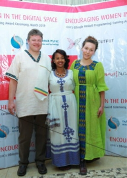

# In at the deep end in Addis
### **Keen students beat challenges to discover smart contracts**
 8 April 2019[ Polina Vinogradova](/en/blog/authors/polina-vinogradova/page-1/) 4 mins read

### [**Polina Vinogradova**](/en/blog/authors/polina-vinogradova/page-1/)
Research Engineer

Engineering

- 
- 
- 
- 

I started with IOHK in May 2018 as a formal methods developer working on two components of Cardano, neither of which involved writing Haskell code. Because of my expertise in logic, type theory, proof assistants, and theoretical computer science, I became part of the team without having much Haskell experience, even though it is the main language we use. So, I was surprised when my name came up last summer about who would be the teaching assistant for a Haskell course in Ethiopia this year. I had thought I would be a student, but then it became clear that loftier plans were being proposed for me.

While there were other qualified candidates, I imagine not everyone was willing to relocate to Africa for three months. Also, the Ethiopia 2019 class was distinguished from previous versions of the course because it was only open to women. For this reason, the idea of having a female assistant seemed particularly relevant. So, I found myself getting ready to learn, present in class, and assess material that was new to both me and the cohort of students from Ethiopia and Uganda!

 

**Addis Ababa, where twenty-two women from Ethiopia and Uganda gathered for the course.**

I was living in Canada, and had yet to meet any IOHK employees in person. I knew little about Ethiopia. So, I got my inoculations, my one-way ticket — I was not sure when the course was scheduled to end and how much longer I was expected to stay on afterwards — my visa (with my name spelt wrongly), and headed off to Africa for the first time in my life.

Once I got to Addis Ababa, the thing that stood out was the amount of livestock in parts of the city. Donkeys, cows, and goats were grazing, carrying heavy loads, and wandering about the streets. After the first drive through Addis, Lars Brünjes, director of education at IOHK, and John O’Connor, director of Africa operations, and I sat down for a cold drink at the hotel where Lars and I were staying. We had some laughs, talked a bit about ourselves and the course, and it began to seem as if I would be very happy working with my colleagues here for three months — what a relief.

From the first day until the last, which was almost three months, I was really engaged with both the students and the material. The course started at the Ministry of Innovation and Technology and the students showed incredible perseverance. Two had to drop out in the first week, but the rest stayed on, no matter how challenging it got — and no matter the transportation time to class given the crazy Addis traffic! 

Most of the students had a computer science degree, some also had a master’s or work experience. However, Haskell is different from anything they would have learned or used before. There were some difficult concepts to grasp, but Lars did an awesome job breaking down the material and providing plenty of relevant examples (as many as the students wanted, which was a lot).

 

**Lars, Bethel Tadesse, and Polina Volgradova.**

There is a saying that the best way to understand something is to teach it. For me, this was true for the entire duration of the course. I learned a lot, answering questions, delivering lectures, grading work, and especially making up the questions and answers for the final test. It was a special treat to learn about smart contracts, Marlowe, and Plutus in the last two weeks, too — new material for me and a great addition to the course. This part was taught by Phil Wadler, one of the creators of Haskell, and at the very end he delivered a special lecture on propositions as types, which was particularly engaging and open to a wider audience than just the students — it was a very nice way to end the class.

Throughout the three months, but especially at the beautiful graduation ceremony, I really felt the importance of what we were doing — giving people the skills and tools to address their problems locally. The best part was getting to know the wonderfully enthusiastic students and watching them develop their skills in this unusual and interesting programming language. I look forward to having the opportunity to work with some of these women in the future. Finally, getting to know my IOHK colleagues as we arrived in Ethiopia was a real treat as well!

Read Lars Brünjes's blog - [Training blockchain developers in Africa](/en/blog/training-blockchain-developers-in-africa "Training blockchain developers in Africa, iohk.io/blog")
