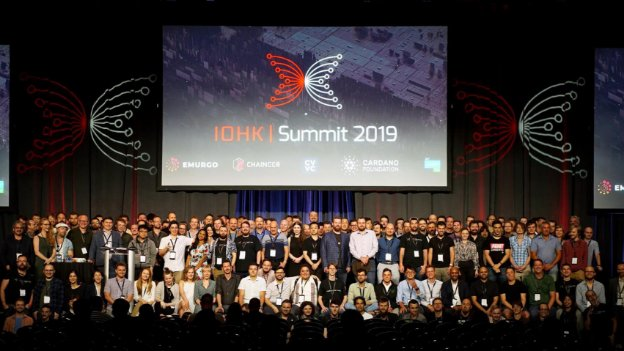

# Hundreds attend the IOHK Summit 2019 in Miami
### **New products, Cardano progress and industry issues in focus at event**
 29 April 2019[ Amy Reeve](/en/blog/authors/amy-reeve/page-1/) 7 mins read

### [**Amy Reeve**](/en/blog/authors/amy-reeve/page-1/)
Technical Writer

Marketing and Communications

- 
- 

Government ministers, industry professionals, and Cardano fans were at the IOHK Summit 2019 in Miami this month, excited to hear IOHK CEO Charles Hoskinson outline the future for Cardano and launch Atala, the company’s enterprise offering for business. Hosted at the Miami Beach Convention Center, the summit saw renowned speakers such as computer scientist Stephen Wolfram and cyberpunk author Rudy Rucker alongside government representatives, entrepreneurs, and enthusiastic community members. The summit reflected the broad appeal – and potential – of both blockchain technology and IOHK’s research. In total, the event had over 700 attendees, including IOHK staff: a rare and enjoyable opportunity for our decentralized company to meet and collaborate in person.

 

**IOHK has grown from fewer than 20 people in 2016 to almost 200 today**
## **IOHK Summit 2019**
To kick off the summit, IOHK CEO Charles Hoskinson discussed the goals and philosophy of IOHK: ‘we're not just building a decentralized system, we're building a decentralized infrastructure’ to invite billions of people – thus far ignored and unserved by legacy finance – into a new and flourishing economy.

IOHK holds a summit every year, but this was the first year that the event was open to the public. Attendees gathered between talks to network and discuss all aspects of blockchain and cryptocurrency, with stands from [Emurgo](https://emurgo.io/#/en "emurgo.io"), the [Cardano Foundation](https://cardanofoundation.org/en/ "cardanofoundation.org"), the [Cardano Effect](https://thecardanoeffect.libsyn.com/ "thecardanoeffect.libsyn.com") podcast and more lining the walls for attendees to visit.

 

**IOHK CEO Charles Hoskinson during his keynote speech**
## **Atala: our enterprise product**
Atala, the new Cardano enterprise offering, was a major piece of news from the summit. The enterprise-grade product will blend blockchain with new and existing technologies, providing a holistic, best-in-class offering for those with large and potentially complex use cases. Like everything else we do, Atala will be underpinned by IOHK's world-leading research. During his presentation, IOHK director of engineering Bruno Woltzenlogel Paleo outlined the fundamental vision for Atala: ‘to do for all data what bitcoin did for money’.

 

**To celebrate the launch of Atala 
\- named after a butterfly - one hundred
live native butterflies were released 
outside the convention center.**
## **Cardano development**
With the [formal specifications for Shelley](/en/blog/new-shelley-formal-specifications-complete/ "New Shelley Formal Specifications Complete, iohk.io") released just days before the summit, progress on Cardano development was in the spotlight too. There were talks from senior Cardano development team members Duncan Coutts, Philipp Kant, and Bruno Woltzenlogel Paleo, as well as open panel discussions about how blockchain – and Cardano, of course – will interact with future law and monetary policy. IOHK engineers have been working hard on the development of Shelley, and Charles took the opportunity to reiterate that the ultimate goal of Cardano isn’t just to ship a technology product, but to create a means of improving quality of life for millions of people around the world.
## **Government engagement**
Other exciting news from the event included the first public announcement of an MoU between IOHK and the Ethiopian government, with IOHK set to design and create a cryptocurrency for Ethiopian citizens. John O'Connor, IOHK director of African operations, announced the joint venture during his presentation about IOHK's recent [success running a Haskell course in the Ethiopian capital](/en/blog/training-blockchain-developers-in-africa/ "Training Blockchain Developers in Africa, iohk.io") Addis Ababa. Meanwhile Lars Brünjes, IOHK’s director of education, discussed the human impact of the initiative: not only is it a huge step forward for the industry to be engaged with government organizations, but leveraging blockchain technology in the developing world will improve the everyday lives of millions of people.

It isn’t just the Ethiopian government that IOHK is engaging with either: also at the summit were Caitlin Long and Tyler Lindholm, both members of the Wyoming legislature, discussing how the state is making huge strides to become a haven for the emerging markets of blockchain and cryptocurrency. Delegates from the Mongolian government were at the summit as well, including the minister of foreign affairs, along with CEO and entrepreneur Gerelmaa Batchuluun, explaining how ‘Mongolia is the next destination for the blockchain revolution’.
## **Community projects**
The summit was also an opportunity for members of our dedicated community to meet and collaborate directly with IOHK, and one of the most popular workshop sessions was run by two community members who only met a few months ago at the inaugural [PlutusFest](/en/blog/launching-plutus-and-marlowe-at-the-inaugural-plutusfest/ "Launching Plutus and MArlowe at the Inagural Plutusfest, iohk.io") event in Edinburgh, UK. In their talk, Cardano on the rocks, Markus Gufler and Robert Kornacki presented undeniable evidence of the potential reach of Cardano. They demonstrated how a full Cardano node can run on low-cost open-source hardware using less than ten watts of power, potentially provided by a solar panel, opening up the world of Cardano to anyone, anywhere. Not only that, but Markus and Robert run a free, community-driven education portal, [Clio.1](https://edu.clio.one/ "edu.clio.one"), where they’ll soon be sharing the details of their work for everyone to benefit from.

 

**Robert Kornacki and Markus Gufler, two Cardano community members, at the summit with their open-source hardware solution for Cardano**
## **That’s not all**
Also at the summit was the [Symphony of Blockchains project](/en/blog/symphony-of-blockchains-project-comes-to-bristol/ "Symphony of Blockchains Project Comes to Bristol, iohk.io"), beginning its much-anticipated world tour in Miami. The full virtual reality blockchain experience was available for attendees to explore, with augmented reality posters scattered around the summit, waiting to be discovered. Visitors to the exhibition described being ‘blown away’ by the simulated blockchain.

In addition to the talks, stands, workshops, and exhibits, summit attendees also had the option to take part in a [cryptopuzzle](https://forum.cardano.org/t/iohk-summit-cryptopuzzle/22567 "forum.cardano.org") with a $10,000 USD prize - won by a team of three community members working together - as well as a collaborative hackathon providing Plutus and Marlowe training.
## **Internal summit**
Before the public event, IOHK staff also took part in two days of internal presentations. As a decentralized company, the annual summit is a unique opportunity for IOHK employees to meet each other in person. Many IOHK employees arrived early to enjoy the beautiful Miami weather, spending time together on the beach and taking a trip to the Everglades before getting down to business.

 

**IOHK employees enjoyed a few days of well-earned rest on beautiful Miami Beach**

‘As a company,’ IOHK CEO Charles Hoskinson began his internal address, ‘we've touched and tackled every fundamental problem in the cryptocurrency space’. He spoke of the company's history, and its unprecedented growth from just a dozen employees in 2016 to almost two hundred now in 2019. As the blockchain industry matures, and IOHK with it, Charles discussed the challenges of 'being able to keep your principles while embracing pragmatism'.

Other internal talks covered everything from IOHK's educational efforts in Africa to the latest updates from the engineering team. Throughout the two company-only days, groups of IOHK employees could be seen all around the Loews Hotel location, hunched over laptops, deep in discussion. The mood was passionate and enthusiastic, no one wanting to waste the chance to collaborate, and meetings continued into the evening, spilling out into local bars and restaurants.

The IOHK Summit 2019 was an incredible event, not just for IOHK but for the industry, bringing together members of the blockchain community with politicians, legislators, and thinkers, all poised to define the future of this revolutionary technology. The event made it clear just how far IOHK has come - and how much further we're going to go.
