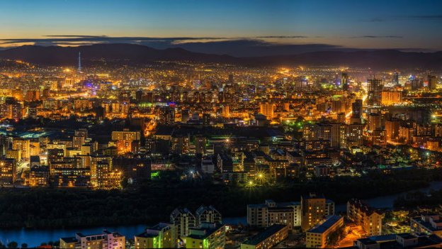
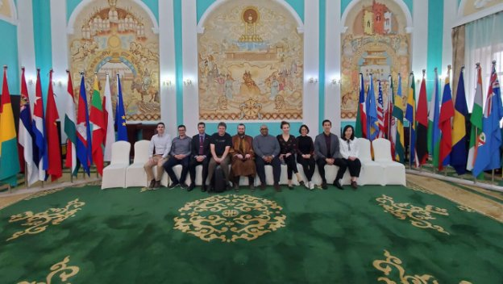
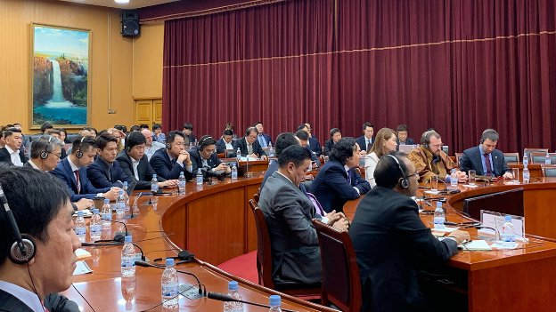

# Mongolia - great for Atala and Cardano pilots
### **Ministers and businesses are enthusiastic about blockchain**
 16 May 2019[ Charles Hoskinson](/en/blog/authors/charles-hoskinson/page-1/) 5 mins read

### [**Charles Hoskinson**](/en/blog/authors/charles-hoskinson/page-1/)
Chief Executive Officer

Founder

- 
- 
- 

Think about Mongolia and the image that’s likely to spring to mind is of sweeping grasslands, mountains, freezing winters and nomads. An unlikely place you might think for ground-breaking technology, but in fact it’s a great country to do blockchain pilots. The capital, Ulaanbaatar, has almost tripled in size since 1990 and now accounts for half of the country’s three million population. That growth has created problems, including what the [World Health Organization](https://www.who.int/bulletin/volumes/97/2/19-020219/en/ "Air pollution in Mongolia, who.int") has identified as some of the worst air pollution in the world.

In the winter, temperatures can drop to −40C and most people live in gers – round wood and canvas structures heated by fires. So, they turn to burning raw coal – and in some cases anything they can get their hands on, from dung to car tires – to stay warm. 

I’ve just got back from Ulaanbaatar, where we’ve been working out the potential for an internet-of-things project to assess air quality. The idea is to put sensors in place and gather the measurements using IOHK’s [Atala enterprise blockchain](https://www.forbes.com/sites/rachelwolfson/2019/04/30/cardano-founder-launches-enterprise-blockchain-framework-in-collaboration-with-ethiopian-government/#91fdc644e102 "Cardano Founder Launches Enterprise Blockchain Framework In Collaboration With Ethiopian Government, forbes.com"). Once in place, such a network could generate fraud-free, time-stamped data so the authorities know where the pollution is being generated and can focus on cleaning up the worst areas. Putting thousands of sensors in place is expensive but people could be encouraged to do so, and keep them working, by being paid using Cardano as the aggregated data comes through.

 

**The away team assembled by Charles Hoskinson for Mongolia included Manmeet Singh, 
information chief of Emurgo, and Lars Brünjes, IOHK’s director of education**

The focus in our discussions with ministers in Ulaanbaatar was on solving these sorts of problems, which occur in all fast-growing countries. Another example is that 40% of medicines in rural areas are counterfeited or adulterated or expired; the figure is 18% even in urban areas. So, we want to put a traceability project together for that using Atala. Bringing accountability and transparency to medical supply chains can help protect people from dangerous or counterfeit drugs – and save lives.

Then, there is the fact that almost everyone has access to a mobile phone network – and 30% of the population receive government disbursements of some kind at an enormous cost. Linking those two together using our blockchain technology could save the government a lot of money and make things easier for the recipients, even villagers living on the peaks of Mongolia.

Other potential areas for Atala and Cardano include two very different sectors: the cashmere industry and university accreditation. They actually make about half of the world’s cashmere in Mongolia. The wool is very expensive in the boutiques of Tokyo and Paris, but goat herders here sell to China at a very bad price, there’s a potential to improve things there with better logistics and proof of sourcing. As for the universities, there are 65 of them in Mongolia, most of which are in Ulaanbaatar. We're really interested to see if we can put graduates’ diplomas up on a blockchain so people can prove they are qualified.

When it comes to attracting investment, the Asian Development Bank has put hundreds of millions of dollars in for various projects, but the audit trail is not so good here. We can tackle that.

 

**Tsogtbaatar Damdin, Mongolia's foreign affairs minister,
addresses the Frontier Fintech summit in Ulaanbaatar**

These are real, complicated situations, and the blockchain comes in as part of these solutions. Atala can be used for processing and aggregating the data, which can then be fed through to Cardano to handle ada payments – so keeping huge volumes of data off the Cardano blockchain. 

While we were in Mongolia, we attended the Frontier Fintech summit. It was there that we announced we had taken the first step of signing a memorandum of understanding with the Mongolian Blockchain Technology and Cryptocurrency Association, and the Mongolian Fintech Association to advise on potential blockchain projects and develop blockchain education, but it’s early days. Building relationships, identifying the right partners and developing the technology and infrastructure takes time, so we need to be patient – projects like these are likely to take between three and seven years. That’s why education is such a central part of our mission, training people on the ground to build solid foundations, as we’ve already done with our recent [Haskell course in Ethiopia](https://www.youtube.com/watch?v=1gOajpcPCH0&t=3s "IOHK Ethiopia Haskell Course, youtube.com").

But providing solutions to these pressing problems is just the beginning. If we can get just one solution in place, we provide a gateway into the cryptocurrency ecosystem for hundreds of thousands of users. That expands the Cardano world, because these people will want insurance, bank transfers, and the other financial tools that we tend to take for granted in the developed world. And that creates business for the whole blockchain world.
