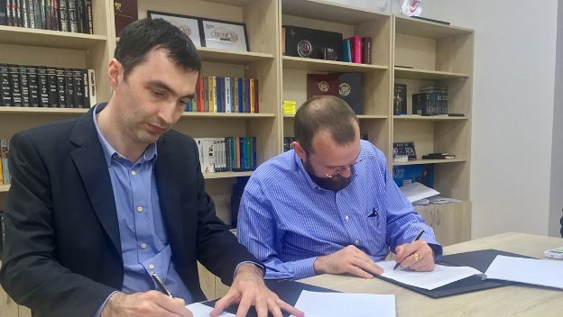

# IOHK announces partnership with Georgian government and universities
### **MoUs mean Cardano and Atala are up for use in education and beyond**
 18 June 2019[ Daniel Friedman](/en/blog/authors/daniel-friedman/page-1/) 3 mins read

### [**Daniel Friedman**](/en/blog/authors/daniel-friedman/page-1/)
Business Development Manager

Commercial

- 
- 

I’m in the Georgian capital Tbilisi this week, enjoying the sights and sounds of one of the most innovative regions of the Caucasus. After nearly a year of groundwork, I’m here with IOHK CEO Charles Hoskinson to sign Memorandum of Understanding (MoU) partnerships with the government and two of Georgia's largest universities. The MoUs with the [Ministry of Education](http://www.mes.gov.ge/?lang=eng "Ministry of Education, Science, Culture and Sport of Georgia, mes.gov.ge"), the [Free University of Tbilisi](http://www.freeuni.edu.ge/en "Free University of Tbilisi, Georgia, http://www.freeuni.edu.ge"), and the [Business and Technology University](https://btu.edu.ge/ "Business and Technology University, Tbilisi, btu.edu.ge") of Tbilisi mark a commitment by the Georgian administration to work with IOHK and use Cardano to fuel innovation in the country. After signing the MoU, Mikheil Batiashvili, the Minister of Education, Science, Culture, and Sport, spoke of Georgia’s rapid development, and how he hoped that “leveraging IOHK’s world-leading expertise, particularly in third-generation blockchain technology, will help us to progress even further toward our goal of being the world’s leading country for secure, digitally-enabled international business”.

One of the core goals of the MoUs signed this week is to enable the use of Cardano-backed blockchain technology to store, track, and verify educational credentials such as degree certificates, removing the need for time-consuming and expensive manual verification. The system will be implemented in Georgia first, with a further goal of using distributed ledger technology to support the Europe-wide [Bologna Process](https://ec.europa.eu/education/policies/higher-education/bologna-process-and-european-higher-education-area_en "The Bologna Process and the European Higher Education Area, ec.europa.eu"), an intergovernmental effort to improve the internationalization of higher education. IOHK has looked at a similar application of this technology already in Greece, where it worked with government education authorities to explore a pilot project to [verify student qualifications](https://bitcoinmagazine.com/articles/cardano-blockchains-first-use-case-proof-university-diplomas-greece "Cardano Blockchain’s First Use Case: Proof of University Diplomas in Greece, bitcoinmagazine.com") on the blockchain.

It’s not just the education sector that stands to benefit from collaboration with IOHK. Charles also met with the Minister of Agriculture and the Georgian prime minister to discuss other applications of blockchain technology for the country, such as supporting new fintech businesses, supply chain implementations, and integrating smart contract functionality into government processes.

 

**Georgian prime minister Mamuka Bakhtadze
with Charles Hoskinson**

“We are incredibly excited to be working with the Georgian government on a range of projects across business, education, and government services,” Charles said. “IOHK is pleased to be a part of the country’s journey and looks forward to developing the blockchain ecosystem in Georgia and helping its people to solve the challenges they face.”

IOHK has collaborated with Georgian institutions before. Research fellow Peter Gaži gave a lecture on Ouroboros, IOHK’s proof-of-stake protocol, at the Free University of Tbilisi. In January a Cardano meetup was sponsored by the Ministry of Economy and Sustainable Development of Georgia and the Georgian Innovation and Technology Agency, where Edsko de Vries, a Haskell consultant working on Cardano, gave a well-received talk.

This week’s agreements strengthen IOHK’s relationship with Georgia. The next steps will be to organize workshops, meetups, and forums to identify the most pressing challenges that can be tackled using Cardano, Atala, or a combination of both. IOHK and the Georgian government will work together to embed blockchain technology in systems across the country, proving just how valuable a digital, forward-thinking mindset can be.

 

**MoU signing At Tbilisi Business and Technology University**
