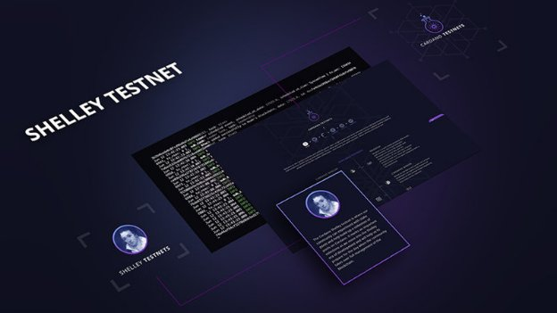

# Join the roll out of the Cardano Shelley testnet
### **Take part in our testing program**
 19 June 2019[ David Esser](/en/blog/authors/david-esser/page-1/) 6 mins read

### [**David Esser**](/en/blog/authors/david-esser/page-1/)
Senior Product Manager

Cardano

- 
- 

Many of you will have seen us talk about our [testnets](https://testnet.iohkdev.io/), where we run the versions of Cardano and other testing simulators so we can test our products and get feedback from the community. Some of you have already been playing with the code from our GitHub repos. So as we move from the Byron to the Shelley era, we want to extend that collaboration and learn more from the great talent in our Cardano community.

With the Rust codebase for Shelley now nearing primetime, we’re asking the community to help us build out a testnet. The Shelley era is all about decentralization, so we’re taking a more decentralized approach to testing and documentation. It’s an important step in expanding the Cardano technical community and ultimately preparing everyone for the day when the community takes over the blockchain. 

For some time, there has been a dedicated and vibrant best practice group on [Telegram](https://t.me/CardanoStakePoolWorkgroup)  – the Stake Pool Best Practices Telegram group (1,733 members). There’s clearly a lot of talent and interest out there. We recently pinned a survey in the channel to learn more about potential stake pool operators. We’ve had a really positive response, with over 150 full responses so far.

What’s the range of technical skills and knowledge in the community? What are people’s particular interests in staking? Are they keen hobbyists or entrepreneurs with plans to run a stake pool as a business? What equipment are they planning to use? Would marketing or other business support be useful? We asked lots of questions to learn as much as we could. Ultimately, our goal is to find out how we can support the community in implementing Shelley’s decentralized model in the most effective way we can. It is these people who’ll be helping to kick things off.

So, we’ve started harnessing the power of the Cardano community to roll out a staking testnet. We’ll be supporting this early group along the way in a number of ways. 

There’s now a dedicated 

code repository and log to support the test program, all open. We will soon release new Shelley 

testnet webpages on our Cardano testnets website. We’ll publish instructions, videos, tutorials and so on explaining what to do and how to do it. We're writing a pretty good set of documentation for the Rust client. There will be instructional videos on how to install and operate the node as well as report bugs and log issues using GitHub.

A key part of the testing program will be working with people with mixed levels of technical experience, working across different platforms and configurations. The feedback from this group will ultimately make our technology easier to install, configure, and operate for everyone who follows.

The testnet will have a series of releases rolling out in three main phases.
## **Phase 1: The self node, aka ‘blockchain in a box’**
The first stage is all about setting up and hosting a ‘self node’. You can think of a self node as ‘blockchain in a box’, a minimum viable product (MVP) for testing key capabilities. This is basically a set of tools and documentation to bootstrap your own genesis block and run a multi-node environment on your own machine, where you can see how stake pools actually operate. It’s like a complete network within a single instance.

We’ll provide instructions and invite people to run the node through various configurations and give us feedback on what they find. 

But what about the network? Isn’t this supposed to be a decentralized solution we’re testing? Well, although we’re starting with the self node, we’ve coded things so you can implement more features against this self node down the line. So, as we add more functionality – namely the network and incentives components – the code developed against the self node won't have to change much or at all. That’s the plan! 

So, the first phase is about establishing the basic configuration for your set-up that gives a sense of how well things are working locally. The early code will contain just the core functionality, designed to explore the fundamental capabilities. Across the stake pool task force, we’ll be learning about operating on different hardware, operating systems, cloud hosting environments, and technical skill levels. We'll get a much broader set of results data by collaborating with the task force.  
## **Phase 2: Connecting the network**
Once we’re happy with phase 1, and have a robust set of self nodes up and running, we’ll start connecting them up. The goal will be to create a single, unified testnet and to add more nodes as we go, scaling the network step by step. So, instead of experimenting within your own instance, you’ll now be moving to a system where you’re talking to nodes across the internet. You're gossiping, you're downloading blocks from peers. And then we’ll be learning from a whole new set of behaviors and potential risk scenarios.
## **Phase 3: The incentives system**
This is where we add in a networked incentive system. Moving blocks around is all very well. But Shelley’s true potential will be realized with staking. This is about demonstrating how staking rewards will go to the stake pools to encourage that.

So, at a high level, that's what you’ll see in the coming months. We'll also be working closely with the folks at EMURGO on this. They’ll be helping with testing and also ensuring that their Yoroi wallet has all this interoperability. [Seiza, their new blockchain explorer](https://emurgo.io/#/en/blog/seiza-all-new-cardano-ada-blockchain-explorer-developed-by-emurgo), will be a great tool for visualizing a lot of the things that we do that are unique in our ecosystem.

This testing program is an experiment in community collaboration. There’ll be a lot of testing, re-coding, improving documentation and training materials, tweaking, and so on along the way. We’ll be checking the integrity of individual components as well as demonstrating that those components play with each other nicely. The objective is clear, but it’ll be interesting to see how we get there. We’re committed to it because it fits: a decentralized process to test a decentralized system. And a broad collaboration with the community to test a system that will be owned by the community.

We’ll keep you all posted. For those who choose to step up and work with us in the program, a sincere thanks in advance to you for your partnership.
