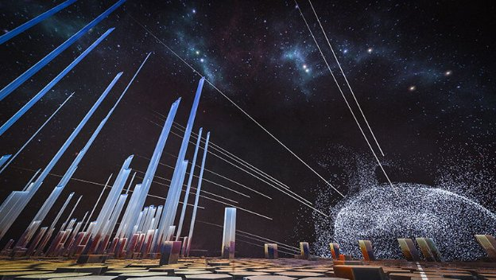
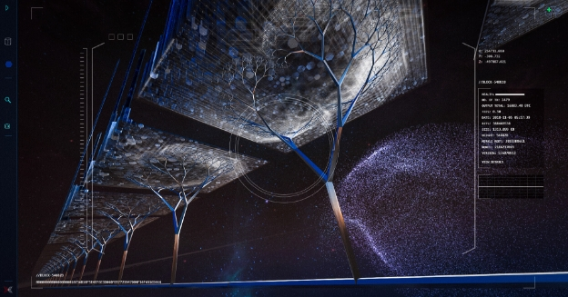

# Announcing the release of Symphony 2.0
### **Experience the blockchain like never before**
 5 July 2019[ Scott Darby](/en/blog/authors/scott-darby/page-1/) 5 mins read

### [**Scott Darby**](/en/blog/authors/scott-darby/page-1/)
Creative Developer

Marketing & Communications

- 
- 
- 
- 

The Symphony project began with a question: how do we represent blockchain technology in a way that is stimulating, entertaining, and audio-visually engaging for a wider audience, technical and non-technical. In other words, how do we explain the abstract and give form to the formless. It’s been over a year since we answered that question, and we’re still working to make Symphony the most interactive and immersive blockchain experience available. What began as a way to visualize the blockchain has evolved into a way to experience the blockchain: an immersive journey accessible through your device’s browser.

The result is [Symphony 2.0](https://symphony.iohk.io/ "symphony.iohk.io"): a 3D explorer through which anyone can traverse the topographic history of the Bitcoin blockchain, from the first transaction to the most recent. Compared with the first version, Symphony 2.0 goes deeper in every way. It drills down into transaction data to create a live soundscape – each block has its own unique audio signature – using data-driven sound synthesis. It looks like this:
### **How it Works**
As you can imagine, giving feeling to data isn’t easy. Creating a sound for each block was how I wanted to represent the uniqueness and permanence of the blockchain: once added, a block is there forever, making that same sound, containing those same transactions.

I used a technique called additive synthesis to generate sound on the fly, and utilized the parallel nature of graphics cards to synthesize a unique sound for each of the thousands of transactions that can make up a block. The sound signature that plays when you visit a block consists of each transaction producing eight sine waves (a fundamental pitch and seven harmonics). The fundamental pitch is determined by the transaction value, and the amount of randomness added to the harmonics partials is controlled by the fee-to-value ratio of the transaction. 

 

**Each block is connected to the blockchain by a Merkle tree**
### **Design Philosophy**
With Symphony 2.0, the blockchain’s mempool – which stores unconfirmed transactions – is visualized as a gravitational swell, around which confirmed transactions spiral in concentric rings. Think of Saturn’s rings but, instead of particles of ice and rock, we have transactions, continuously adding to the size of the rings as they extend outwards. Then, undergirding each block are Merkle trees represented, unsurprisingly, as trees. 

 

**The most recent block on the Bitcoin blockchain**

On top of each block, confirmed transactions are visualized as 3D hexagons. Their height corresponds to the transaction volume, and their width (note the rotund individuals to the right of the image above) corresponds to the health of the block. The result is an unprecedented imagining of the blockchain, with its representative parts synced and manifest, explorable block-by-block or through a flight-simulator mode. 
### **Ways to Experience Symphony**
Symphony 2.0 is now [live](https://symphony.iohk.io/ "symphony.iohk.io"). It can be accessed using any modern web browser, but is best experienced in Google Chrome. For laptop and mobile device users, it’s advised to select the Medium quality option and, for those with high-performance devices or dedicated graphics support, the High quality option. Performance optimizations will continue into the future.

Together with our friends at Kuva, a Bristol-based creative agency, we’ve also grown the project to include events and exhibition pieces. These events – one of which was held [this year in Bristol](/en/blog/symphony-of-blockchains-project-comes-to-bristol/ "IOHK Blog: The Symphony of Blockchains project comes to Bristol") – have included a number of exhibitions that showcase different parts of the project, including virtual reality (VR) and augmented reality (AR).

Using WebVR software, I built a VR experience based on the code for Symphony 2.0, which demonstrates the extensibility of the system. This will be exhibited at future events and, I hope, one day available for VR headsets at home. 
### **What’s Next**
We’re going on tour. We have the story, and now we need an audience. I’m also starting to build an Ethereum version using the same code base, which will feature explorable smart contracts, and, after that, Cardano. We know there are thousands of people out there who are only faintly familiar with blockchain technology and want to know more – and with Symphony 2.0, they’ll be able to cut through the confusion. A picture tells a thousand words, and an interactive audio-visual experience tells many more.

Symphony is a long-term project. It’s as much an adventure for us as our audience. We want to see how far we can take it – because blockchain technology is still developing, still growing, and the opportunity for education is only just beginning. The release of Symphony 2.0 marks a significant milestone for us, and we’re thrilled to be sharing it with you. There’s a lot of opportunity for Symphony, from optimizations and incorporation of other blockchains, to events and more ways to enjoy Symphony at home. So, stay tuned for more updates and, in the meantime, enjoy the world’s first interactive blockchain experience.

[Experience Symphony 2.0](https://symphony.iohk.io/ "symphony.iohk.io")
