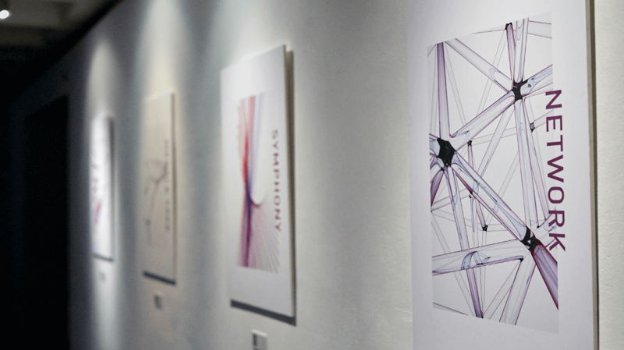

# Kuva symphony update: more events and a 3D blockchain transaction tracker
### **Kuva discusses Symphony project updates**
 16 July 2019[ Helen Broadbridge](/en/blog/authors/helen-broadbridge/page-1/) 5 mins read

### [**Helen Broadbridge**](/en/blog/authors/helen-broadbridge/page-1/)
Producer

Kuva

- 
- 
- 

Symphony is an experience unlike any other. We’ve [talked about it as an interactive, audio-visual exploration of the Bitcoin blockchain](/en/blog/symphony-of-blockchains/ "Symphony blog post, iohk.io/blog/symphony-of-blockchains"), but it’s becoming much more. Not just because we’re not stopping with Bitcoin – soon, Ethereum, then any blockchain thereafter – but because we’re continually optimizing and upgrading the experience, allowing the user to dive deeper into the blockchain through mixed-reality encounters. Part of what we wanted to create is a better way to absorb information. People aren’t sponges. Abstract concepts don’t always stick, and unfamiliarity breaks the narrative thread we need to engage with an idea. But when we can create that experience visually, interactively, we’re able to ground the abstract into an unforgettable experience that is, ultimately, fun: a living story. 
## **About Kuva**
Kuva is an interactive design and creative technology studio based in Bristol, UK. We’re a collection of artists, technologists, and engineers working with companies to blend art and technology into online and physical experiences. We’ve worked with IOHK on Symphony since the launch of the award-winning Symphony website in January 2018. 

Our [first gallery installation for Symphony](/en/blog/symphony-of-blockchains-project-comes-to-bristol/ "Symphony event, iohk.io/blog/symphony-of-blockchains-project-comes-to-bristol") was this year, in April, at the Arnolfini in Bristol and, soon after, we were in Miami for the IOHK summit. Since then, the teams at Kuva and IOHK have gone down slightly different paths, exploring different ways to expand the experience. You can learn more about IOHK’s work in [this blog post](/en/blog/announcing-the-release-of-symphony-2/ "Symphony 2.0 announcement, iohk.io/blog/announcing-the-release-of-symphony-2"). Here, I’ll go through what Kuva has been up to, and what the future holds for Symphony.

 

**The Symphony art exhibition at the Arnolfini**
## **Project Updates**
We have a global tour planned for Symphony to introduce the blockchain to more people. For the most part, the blockchain is known in uncertain terms (the cryptocurrency market has led to a few erroneous perceptions, which we’d love to correct). Elsewhere, it’s barely known at all. If it’s going to underpin the future – which we believe it is – then we have a responsibility to start education as soon as possible. And at Kuva, we believe the best way to educate is through experiential storytelling.

 

**Augmented reality posters are used to explain blockchain concepts**

This starts with our virtual reality (VR) and augmented reality (AR) projects. These experiences, which are demonstrated in this [video](https://www.youtube.com/watch?v=f0Pzg50QnI4/ "Symphony event video, youtube.com/watch?v=f0Pzg50QnI4"), are designed as educational pieces that use different approaches (such as our AR posters) to explain how the blockchain works. We take some of the most complex components underpinning blockchains and break them down into easy-to-digest, understandable elements. We want to show the usefulness of blockchains and, by extension, cryptocurrencies, by illustrating them in ways people can relate to. 

But the blockchain doesn’t start and end with Bitcoin. We’re also working on bringing an Ethereum chapter to these events, to demonstrate the evolution of cryptocurrencies and the technology as a whole. We’ll be able to explain and illustrate smart contracts, and show how blockchains can be used for more than financial transactions. Then, in the future, we’ll start looking at Cardano as a third-generation blockchain: how it’s different, and what it’s capable of achieving over others.
## **Mobile App**
The most exciting update is about our mobile app, soon to be [available on Android](https://play.google.com/store/apps/details?id=com.Kuva.TransactionTracker&hl=en_GB/ "Symphony mobile app on Google Play store, play.google.com/store/apps/details?id=com.Kuva.TransactionTracker&hl=en_GB"), and later on iOS. This contains a data visualization of the Bitcoin mempool in 3D and augmented reality, to show you the congestion and health of the Bitcoin blockchain at any time.

 

**The Symphony transaction tracker mobile app**

Using the app, you’ll be able to see whether it’s a good time to send a transaction. Visually, the busier the mempool is – ie, the more red lines it has swirling about it – the busier the network is, which means a higher fee. The average fee is precisely detailed in the app. 

Like our other VR and AR work, we’ll soon be creating the same experience for the Ethereum and Cardano blockchains, to help users evaluate and compare fees and network traffic. We want users to have consistently up-to-date information about how best to use their cryptocurrencies – bridging the gap between interest and understanding starts with clear, interactive representations of key concepts and components. 

We’re really excited about this app. It’ll not only be an easy way to grasp what’s happening on a blockchain at any moment, but a functional tool that provides transaction data in real-time. The app is already available on Android and an augmented reality iOS version will be released this summer. We’ll also soon be announcing updates for our world tour – so stay tuned, and get ready to discover the blockchain anew. 

To find out more about the world tour, or to see how you can play a part, [contact Kuva](https://www.kuva.io/ "Kuva's website, kuva.io/") today.
