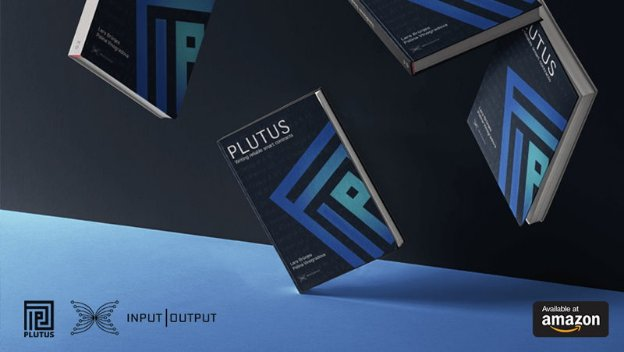

# Secure smart contracts with the Plutus ebook
### **Q&A with the IOHK Education team authors**
 31 July 2019[ Alejandro Garcia](/en/blog/authors/alejandro-garcia/page-1/) 6 mins read

### [**Alejandro Garcia**](/en/blog/authors/alejandro-garcia/page-1/)
Project Manager

Project Management

- 
- 
- 
- 

The IOHK education team this month released the first edition of their new Plutus ebook: *Plutus: Writing reliable smart contracts*. Available on [Amazon](https://www.amazon.com/Plutus-Writing-reliable-smart-contracts-ebook/dp/B07V46LWTW/ref=sr_1_1) and [LeanPub](https://leanpub.com/plutus-smart-contracts), it's a comprehensive introductory guide to [Plutus](https://testnet.iohkdev.io/plutus/), IOHK's Haskell-based smart contract language. Haskell is a functional programming language, which means it's easier to test and less prone to human error, so anything written in Haskell -- and by extension Plutus -- is more likely to be reliable and secure. Plutus can also be used for both on and off-chain code, simplifying the development experience and eliminating errors commonly introduced in the transition between languages on and off-chain.

The new Plutus ebook covers everything from how smart contracts interact with the blockchain down to working code examples with line-by-line explanations. I spoke to Lars Brünjes and Polina Vinogradova, the main authors of the book, for more details about the book and the future plans of the education team.
### **Please introduce yourselves!**
**Lars**: I am the director of education at IOHK, which means I run all our educational activities, such as Haskell courses, community videos, workshops, hackathons, books, and internal training. It's a deeply rewarding role: education is an extremely important part of our mission to bring financial services to the three billion people who don't have them. Teaching Haskell to bright young women in Ethiopia and running a Marlowe workshop in Mongolia have been unforgettable experiences for me, and I feel like I'm making a difference.        

**Polina**: I'm a formal methods software developer at IOHK. I've worked on the formal specifications of the Cardano ledger and the wallet, but I've been doing a lot of education things recently as well. I was the teaching assistant for the Haskell course in Ethiopia, and I'm looking forward to being part of other initiatives. IOHK takes education very seriously, and I've personally reaped the benefits of that when taking internal training courses this year -- I learned a lot about testing and formal specification, and could immediately apply it to my work.
### **What have you been up to recently?**
**Polina**: As the co-instructor on the [Haskell course in Ethiopia](https://iohk.io/blog/in-at-the-deep-end-in-addis/), I wrote and delivered several of the lectures. It was a unique experience, and it felt like I was really helping people to change their lives. After that, I took an IOHK internal training course and taught on Marlowe workshops in Mongolia and Israel. I've been writing the Plutus ebook with Lars as well. Last year, I worked on formal methods tasks, the Shelley ledger and the wallet, but because of all the traveling and writing, I haven't had much time to work on those this year.

**Lars**: I've helped set up the [three-month Haskell course](https://iohk.io/blog/training-blockchain-developers-in-africa/) for Ethiopian and Ugandan women in Addis Ababa, run a Marlowe workshop in Ulaanbaatar, Mongolia (and rode a camel and fell off a horse in the process) and another [workshop in Tel Aviv](https://iohk.io/blog/iohk-smart-contract-hackathon-and-meetup-in-tel-aviv/), Israel. I've been working on the ebook with Polina, as well as developing IOHK's education strategy and working on our incentives research stream, writing Haskell simulations to illustrate and support our theoretical results.
### **What was the inspiration for the ebook?**
**Lars**: The idea was to make it easier for people interested in writing high-assurance smart contracts to get started with Plutus. We tried to strike a balance between theory and practice, between background information and working code examples, to give interested readers the foundations to get started quickly. At IOHK we already know Plutus is great and we hope the book will help convince everyone else!

**Polina**: Besides a comprehensive step-by-step explanation of how to write Plutus smart contracts, the book also provides an overview of how accounting works in Cardano, what the benefits, goals, and challenges of smart contracts are, and where smart contracts fit into the Cardano architecture. We wrote -- and will be continuously improving and maintaining -- this book to give readers the tools not only to write the contracts but to come up with creative ways of using them.
### **Who is the ebook for and what will they learn from it?**
**Lars**: The book is aimed at software developers generally and smart contract developers in particular. Plutus is basically Haskell, so familiarity with Haskell or a willingness to learn the language is important. Plutus has been created as a safer and more secure way of creating smart contracts. So everybody dreaming of writing correct and reliable smart contracts is definitely in the target audience and should have a look at Plutus!

**Polina**: This is not just a book for developers with Haskell experience. It's also a good read for anyone interested in alternatives to relying on third parties, such as banks or the legal system, to make sure a contract is being adhered to. Plutus offers such an alternative, where trust is instead placed on high assurance, tested and documented code. If this sounds too good to be true, check out the details in the book!
### **What is your favorite part of the ebook?**
**Lars**: Hard to say -- I think the best aspect is the balance between the book's parts: theory and foundations on the one hand, easy-to-follow code examples on the other.

**Polina**: I would have to agree about the balance: the book includes both high-level explanations of how smart contracts work on the blockchain, as well as concrete examples of how to develop the code, with explanations at each line.
### **What's the next step for someone who's read the ebook?**
**Polina**: I would suggest that if the reader feels confident about their Plutus skills, they need to think big -- what problem could this technology be used to solve? Perhaps there is some new functionality they wish was available as part of the Cardano system, and they could work on that? For example, the book mentions two Plutus use cases: introducing special kinds of (non-fungible) tokens onto the blockchain, and a custom policy for signing off on spending -- ideas like these.

**Lars**: I firmly believe that to learn something you have to actually use it and -- ideally -- teach it. So the next step should be to use Plutus, to work on an exciting project and implement a couple of smart contracts yourself. Then go one step further and try to explain Plutus to others, at a meetup, for example.
### **What other education initiatives are going on at IOHK?**
**Lars** and **Polina**: We are preparing the next Plutus and Marlowe workshops, as well as the next Haskell course and working on turning that into a MOOC. We're already thinking about the next book, and how to expand our department to be able to deliver more educational content worldwide.
