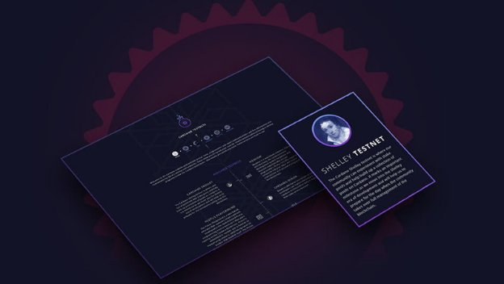

# Unboxing the blockchain – the Shelley testnet making its network debut
### **After a successful test run in London, the networked testnet is now available to the community**
 26 September 2019[ Tim Harrison](/en/blog/authors/tim-harrison/page-1/) 5 mins read

### [**Tim Harrison**](/en/blog/authors/tim-harrison/page-1/)
VP of Community & Ecosystem

Communications

- 
- 
- 
- 

Last week, a team from IOHK, along with Cardano ambassadors and representatives from the Cardano Foundation, met up at a co-working space in London. After a quick presentation, laptops were switched on and a few Rock Pi computers were booted up. An hour later, we had them all connected in a peer-to-peer network of nodes. It was the first instance of the [new networked Shelley testnet](https://www.youtube.com/watch?v=KIrhqbqiNLk), available for the community to join as of today.

A recent post about the [Shelley testnet](https://iohk.io/blog/taking-the-next-step-on-the-road-to-cardano-shelley/ "Taking the next step on the road to Cardano Shelley, iohk.io") covered the journey from the self-node phase of the testnet until now. This new phase is the first decentralized implementation of the Ouroboros Genesis consensus algorithm. While it’s still early days, this is an important milestone for the Shelley era of Cardano. 

The networked testnet phase allows IOHK – and more importantly, the community – to test the behavior of an Ouroboros-based decentralized network before making changes to mainnet. The current Cardano mainnet operates on a federated model, with all nodes in the network controlled by either the Cardano Foundation, IOHK, or EMURGO. As a project, the ultimate goal is complete decentralization, with the majority of nodes run by the community. Not only does that goal pose an engineering challenge, but the change must be sustainable for the network to flourish in the long term, so it has to be achieved in an incremental way.

After less than a year of development, debugging, and troubleshooting, the project is close to realizing complete network decentralization – but it can’t happen all at once. Steps are being taken to ensure this is done correctly. The 'private' network we initially set up in London allowed us to see the networked testnet operating in real-time, and to capture crucial information about its behavior in a live context.

This network is being built for the real world, but the real world is unpredictable. By testing the network capabilities in different scenarios, it’s possible to learn more and account for a broader set of variables. To derive understanding from real-world scenarios, wider community participation is required.

That’s where you come in. With the release of the networked testnet, we're inviting the community to help Cardano take things to the next level by running your own nodes and participating in the network. We encourage everyone to take part, and to help, we've made [documentation and instructions](https://testnet.iohkdev.io/cardano/shelley/ "Shelley Testnet Introduction, testnet.iohkdev.io") available to you.

We've already seen a brilliant response from the community during the self-node phase of the testnet. From today, we are inviting anyone who is interested to download and install the [latest version of the testnet node](https://github.com/input-output-hk/jormungandr/releases/ "Jormungandr GitHub repository releases page, github.com") and connect to the networked testnet.

We want to collect performance data in all circumstances and multiple use cases. So try to run a node from your local coffee shop, see if it works with their proxy. Try it from the free hotel Wi-Fi. Check out how it reacts with the firewall. All this ‘real world’ data is useful and the more communication we get from our community, the better. We are not expecting full stability at this point; by putting the network through its paces, we can get there, faster.

The Cardano ecosystem is built to be a community-focused decentralized network. As Shelley approaches, the ambassadors and supporters are integral to working through upcoming challenges, alongside technical support from the IOHK team. We expect instability in any testnet. There will be outages and lag in the network at the beginning, but that is inherent to all new platforms. With every iteration, we lay a stronger foundation for the future.

There will continue to be regular updates in the [Jörmungandr GitHub repository](https://github.com/input-output-hk/jormungandr/releases/ "Jormungandr GitHub repository, github.com"), where you can download the latest release of the testnet code. This codebase will be iterated on and improved over time based on bug reports and user feedback, with the goal of making the network as robust as possible before we move towards phase three of the rollout later this year: the incentivized testnet.

We’ll be keeping a close eye on how the network behaves over the next few days. The focus, for now, is on stabilization, so you can expect to see some ups and downs. Please make sure you continue to log issues in the [dedicated GitHub repository](https://github.com/input-output-hk/shelley-testnet/issues "Shelley testnet issues GitHub repository, github.com") and we’ll get to them. As this phase progresses, we’ll start sharing further documentation and content which will walk you through more advanced functionality, and set some tasks you can experiment with.

Launching the first private decentralized testnet was like rolling a small snowball down a mountain. It’s only going to get bigger from here. Cardano is growing, picking up speed, and moving closer to IOHK’s vision of a decentralized future. We want you to become a part of that growth. Click [here](https://testnet.iohkdev.io/cardano/shelley/get-started/configuring-your-network/ "Configuring your network, testnet.iohkdev.io") to launch your own node and join us.
