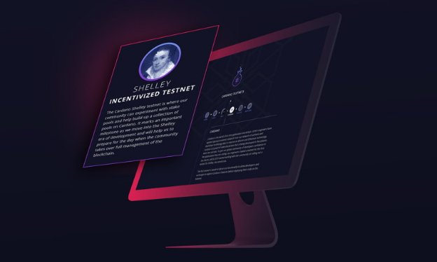
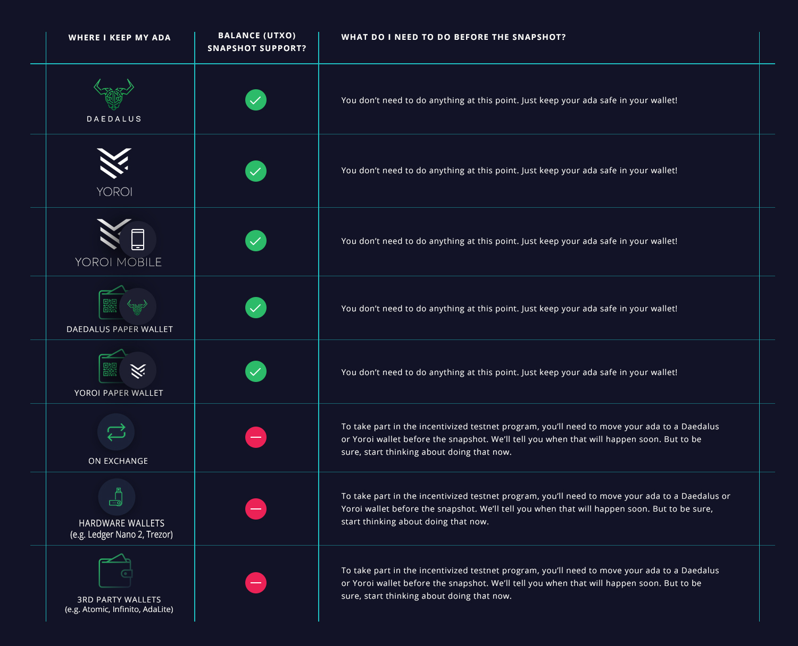

# Incentivized Testnet: what is it and how to get involved
### **Soon you’ll be able to earn real ada rewards as you support the rollout of Shelley. Here’s the lowdown**
 24 October 2019[ Dynal Patel](/en/blog/authors/dynal-patel/page-1/) 6 mins read

### [**Dynal Patel**](/en/blog/authors/dynal-patel/page-1/)
Chief Product Officer

Operations

- 
- 
- 

Over the past few months, we’ve been working towards a full release of the Shelley testnet. You may have been following our reports about progress on the [self-node](https://iohk.io/en/blog/posts/2019/09/06/taking-the-next-step-on-the-road-to-cardano-shelley/ "Shelley self-node testnet, testnet.iohkdev.io") and [networked](https://iohk.io/en/blog/posts/2019/09/26/unboxing-the-blockchain-%E2%80%93-the-shelley-testnet-making-its-network-debut/ "Shelley networked testnet, testnet.iohkdev.io") phases. Now, we’re on the third and final phase before the Shelley mainnet goes live: an Incentivized Testnet that all ada holders can join to earn real ada rewards.

This marks an acceleration in the Shelley testnet, and in Cardano’s development. Rewards earned from the Incentivized Testnet will be transferred to the mainnet: the ada earned from delegating your stake or operating a stake pool are real and will be transferred to the mainnet when it goes live.

The Incentivized Testnet is the beginning of Shelley’s rollout, which will culminate in the release of the codebase to the mainnet early next year and, with that, the realization of a secure, decentralized proof-of-stake (PoS) network. Exciting, unprecedented times.
## **Why the Incentivized Testnet?**
Cardano runs on the Ouroboros protocol: the most advanced and secure PoS protocol in development. With this innovation, however, comes complication, so, to ensure stable and robust foundations, we’ve chosen to implement it in a practical and responsible way. This is also why we’ve introduced new capability – the latest being the incentive mechanism – gradually to the Shelley testnet. Shelley is the foundation to everything yet to come; once we’ve achieved a working decentralized network, much more then becomes possible, including Goguen, which introduces smart contract functionality.

The Incentivized Testnet will allow us to see Cardano’s incentive mechanism operating in a near real-world context. These mechanisms are integral to the operation of the Ouroboros protocol; incentivization is how we guarantee network participation, promote growth, and ensure essential actors play their part.

Incentivization depends upon two things we hold dear: time and money. It’s essential that we get this right, and that Cardano’s users are appropriately rewarded for their investment. This is why real incentives are necessary to test incentivization. The mechanism was designed around game theory and behavioral economics, and it is ultimately human behavior that we are testing.

Lastly, the Incentivized Testnet allows us to lay the foundation for Shelley on the mainnet, test its core functionality in a controlled way, and gather essential community feedback. It will also help us build a stable and qualified group of decentralized stake pool operators in preparation for the mainnet.
## **How can I take part?**
This is different from our other testnets, and to most testnets. The Incentivized Testnet will begin with a UTXO snapshot of all the ada balances held across the mainnet. This snapshot will capture the value of your ada balance at the time. It is this balance value – not the ada itself – will then be transferred into the Incentivized Testnet.

Anybody that holds ada at the time of the balance snapshot can participate in the Incentivized Testnet. But you’ll need to ensure that you are holding it in an approved location. For technical reasons, ada held in exchanges or on hardware wallets will not be included in the snapshot. You can find details of which wallets are supported for the balance snapshot in the chart below.

Ada stored on exchanges or hardware wallets must be transferred to a supported software wallet – such as Daedalus or Yoroi – prior to the snapshot. Don’t worry. The snapshot works as a freeze-frame; ada held at the time can be freely exchanged and transferred immediately after.

The snapshot will happen during November, but we’ll also test it beforehand: to ensure everything’s working as intended and provide participants with an opportunity to check they’re able to download and configure the relevant software. Further details will be provided on when the snapshot will take place nearer the time, so you’ll be able to move your funds in advance. We don’t want anybody to miss out.
## **Stake delegation**
No technical knowledge is required to delegate your stake. To take part, you will need to download one of the special testnet Daedalus and Yoroi wallets. To avoid any confusion, these will be visually distinct from their mainnet counterparts.

After the snapshot, you’ll be able to access your testnet wallet as you would your mainnet wallet – by entering your mnemonic phrase – to view your Incentivized Testnet ada balance. The testnet wallets will feature an option to delegate your stake to one or more stake pools. You’ll be able to choose how you delegate from within the wallet.

The ada within the Incentivized Testnet can be used as it would be on the mainnet, to delegate or operate a stake pool. It cannot be spent and cannot be transferred out of the testnet. Once this phase is complete, however, the rewards accumulated within the testnet will be transferred to the mainnet, as a real, spendable payment. Ergo, the ada earned on the testnet represent a real incentive. This is real money driving real behavior, but within a controlled environment.
## **Running a stake pool**
Running a stake pool requires some technical know-how. At the least, stake pool operators should be comfortable with command-line interfaces and have some system operation and server administration skills. Ideal candidates are people who have run stake pools before, but anybody may learn how to run a stake pool using our step-by-step documentation. We’ll continue to expand our documentation and guides throughout the process.
## **What rewards can I expect?**
You will be able to work out the approximate rewards for delegating or operating a stake pool using a soon-to-be-released calculator, which will be hosted on a dedicated web page [we’re currently building](https://staking.cardano.org/en/ "Incentivized Testnet website"). Stay tuned for more news soon!
## **When does the Incentivized Testnet begin and end?**
The precise timing of November’s balance snapshot, and the beginning of the Incentivized Testnet, will be announced closer to the time through public and social media channels. It will run until the Shelley codebase is ready to be deployed on the mainnet.

At the end of the Incentivized Testnet program, we’ll provide a procedure that will allow you to import your testnet rewards into your mainnet wallet. As with the start date, the completion and termination of the Incentivized Testnet will be announced well in advance.

## **What does this mean for Cardano?**
The start of the Incentivized Testnet phase marks the beginning of the Shelley era. Cardano has more commits than any other blockchain project on GitHub, and we’re close to realizing our vision of a decentralized network: one with the functionality and performance to support enterprise adoption and empower people across the world. With your help, we’re beginning to see what the Cardano network will be capable of, with sufficient incentive for enterprise and everyday users to participate, create, and interact.
