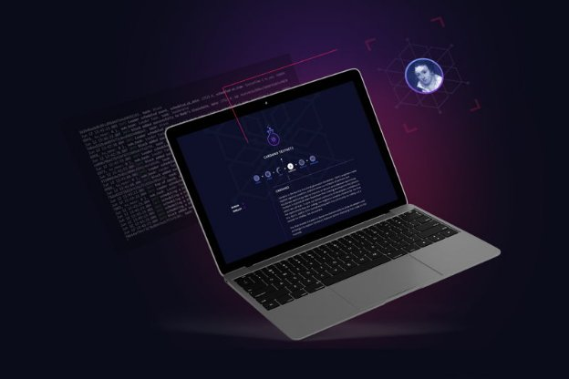

# Incentivized Testnet update: balance snapshot, wallets, and rewards
### **Get the latest information on the Incentivized Testnet as we prepare for the balance snapshot**
 27 November 2019[ Dynal Patel](/en/blog/authors/dynal-patel/page-1/) 5 mins read

### [**Dynal Patel**](/en/blog/authors/dynal-patel/page-1/)
Chief Product Officer

Operations

- 
- 
- 

The initial phases of the Incentivized Testnet are underway. We’ve already completed the balance check – a practice run that helped us identify a few bugs and issues – in preparation for the balance snapshot, scheduled for just after 12:00 UTC on November 29. 

As a reminder, the balance snapshot is a UTXO snapshot of ada balances held across the mainnet – and the amount of ada captured by the balance snapshot is the amount of testnet ada you’ll be able to use on the Incentivized Testnet, to delegate, operate a stake pool, and, ultimately, earn rewards.
## **What do I need to do?**
You can find all the information about the balance snapshot on our [Incentivized Testnet website](https://staking.cardano.org/), or by watching our [balance snapshot announcement video](https://www.youtube.com/watch?v=T8jaJef53tk). Here’s a summary: by November 29, you’ll need to have moved your ada into either a Daedalus or Yoroi wallet. Only ada held in these wallets will be captured for use on the Incentivized Testnet (for technical reasons, ada held in exchanges, third-party wallets, or hardware wallets will not be captured). This mainnet ada is in no way locked up. Once the balance snapshot has happened, any ada moved for the purposes of the balance snapshot can be moved back. A snapshot is an imprint: it records the ada held in Daedalus and Yoroi at a specific point in time, with no requirement for it to remain thereafter.
## **What happens after the balance snapshot?**
After the balance snapshot, there will be a short interim period before the Incentivized Testnet wallets are available. We’ll be using this time to onboard stake pool operators, and help them to set up their pools with videos and documentation hosted on the [Cardano testnet website](https://testnet.iohkdev.io/en/cardano/shelley/). We want to allow stake pool operators adequate time to get set up before delegation starts, and we’ll also use this period to gather information and metadata, address any issues that arise, and ensure the network is ready to scale. Stake pool operators will then be invited to formally register their stake pool. We’re aiming for the first week of December for the registration process to be up and running. Stake pool operators who have not yet signed up to the operator newsletter can do so via [this questionnaire](https://forms.gle/JqPjdMkR58tzj4Mn6), to register their interest and receive progress updates. 

We’ll be actively supporting stake pool operators during this onboarding period; for any queries or issues, operators can submit a ticket through our [support portal](https://iohk.zendesk.com/hc/en-us). To find out how to become a stake pool operator – and the specific requirements for running a stake pool – visit our[testnet website](https://testnet.iohkdev.io/en/cardano/shelley/). We’ll also be keeping the wider community informed as we progress. Our hope is that we can start the delegation phase of the Incentivized Testnet with around 20 stake pools operational, and increase that number over time.
## **Test, test, and evolve**
The provisional date for the rollout of delegation on the Incentivized Testnet is December 9. As is always the case – after all, this is a phased rollout designed to test and iterate functionality – this date is subject to meeting development milestones and fixing any issues identified through the balance snapshot. We’ll also need to address any bugs or issues discovered or reported by stake pool operators during their initial set up.

As the world’s first working incentive model on a proof-of-stake blockchain, we’re bound to encounter bumps in the road. This is an unprecedented opportunity for delegators and stake pool operators to earn ada rewards, but it is also, and fundamentally, a testnet. This means that its evolution will be provisioned by testing; some things will go wrong, but we’ll learn something each time they do. Everything we intend to make available – remember, the goal here is to create a facsimile of the mainnet incentive model – will be made available in due time. We aren’t going to rush. We’ll add features and capabilities as and when we’re confident to do so, expanding what’s included in the reward calculation as the testnet evolves.
## **A word on incentives**
The philosophy behind Ouroboros’ incentive mechanism is founded on the principle that systems can only survive if participants are adequately incentivized. If they are not, then participation ceases, and the system fails. We’ll talk more about the game theory underpinning the incentive mechanism in a future blog post.

For now, it’s important to remember that Cardano isn’t just intended for today: it’s intended for the future. The common use of the ‘Rome wasn’t built in a day’ adage can sometimes belie its true meaning: that systems with immense and long-lasting implications take time to develop, and can only be built incrementally. Every stone is one stone more, and it is the end result that matters. This is true for Cardano, and is similarly true for the Incentivized Testnet.

In that vein, stay tuned for more information on the Incentivized Testnet. Check back here, visit [the website](https://staking.cardano.org/), follow us on [Twitter](https://twitter.com/inputoutputHK), or [sign up](https://staking.cardano.org/) to our email list for the latest updates.
