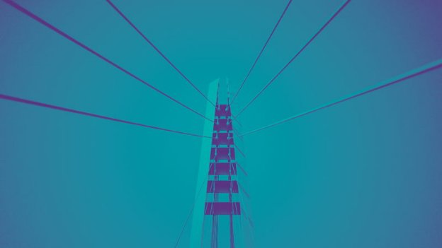

# Integrating and advancing with Adrestia
### **Taking the challenge out of fast-paced blockchain development**
 15 June 2020[ Eric Czuleger](/en/blog/authors/eric-czuleger/page-1/) 4 mins read

### [**Eric Czuleger**](/en/blog/authors/eric-czuleger/page-1/)
Senior Content Editor

Marketing & Communications

- 
- 
- 

For exchanges and developer partners, integrating with any blockchain can be challenging. The technology often moves so quickly that keeping up with the pace of change can be unrealistic. Cardano’s development and release process are now driving things forward apace. Managing parallel software development workstreams moving at different speeds can feel a bit like changing the tires on a truck while it’s driving at 60 miles per hour. 

Cardano’s vision is to provide unparalleled security and sustainability to decentralized applications, systems, and societies. It has been created to be the most technologically advanced and environmentally sustainable blockchain platform, offering a secure, transparent, and scalable template for how we work, interact, and create, as individuals, businesses, and societies.

In line with these ambitions, we needed to devise a way that our partners could swiftly, easily and reliably integrate with Cardano, regardless of what was going on under the hood. Whatever the pace and cadence of future rollouts, we wanted to develop a consistent method by which all updates to the core node could be easily adopted by everyone.

In order to make that integration and interaction with Cardano easier and faster, IOHK engineers formed the Adrestia team, to take responsibility for building all the web APIs and libraries that make Cardano accessible to developers and application builders. Developments to the node can then focus on performance and scalability, while users will always be able to interact with it effortlessly. The name Adrestia was chosen after the goddess of revolt because with these new interfaces we expect everyone to be able to integrate with Cardano, creating a ‘revolution’ in accessibility.
## **Enabling developers to keep pace with change**
The goal of the Adrestia team is to provide – via Web APIs – a consistent integration experience so that developers can know what to expect between Cardano roadmap releases. Whether they are a wallet developer or an exchange, users can flexibly explore the chain, make transactions and more.

The APIs are as follows:

- cardano-wallet: HTTP ReST API for managing UTXOs, and much more.
- cardano-submit-api: HTTP API for submitting signed transactions.
- cardano-graphql: HTTP GraphQL API for exploring the blockchain.

The SDK consists of several low-level libraries:

- cardano-addresses: Address generation, derivation & mnemonic manipulation.
- cardano-coin-selection: Algorithms for coin selection and fee balancing.
- cardano-transactions: Utilities for constructing and signing transactions.
- bech32: Haskell implementation of the Bech32 address format (BIP 0173).

In addition to providing a flexible and productive way to integrate with Cardano, maintenance is also made easier. With consistency, it can often require less time to update integrations between releases. This familiarity reduces maintenance costs. New software can then deploy in days rather than weeks. Ultimately, anyone can keep pace with change.
## **Get Started**
The results are now live in the Byron era of Cardano. Exchanges or third-party wallets using Cardano-SL, should now be integrating to prepare for the new Byron and upgrading to Shelley wallet. These need to happen consecutively to avoid any outages. Full details have been added to the Adrestia team repo and we continue to work with our partners to ensure there is no interruption in service for ada holders keeping their funds on exchanges or in third-party wallets. The chart below shows the difference between the Cardano-SL node and the upcoming Shelley node. The components in red are non-Shelley compatible and will break after the hard fork, while the other components are Shelley compatible and will be supported during and after the hard fork.

Consistency is key in creating a blockchain network that works for everyone. Cardano is not being built for the next five or ten years, but for the next fifty. Change to the system is inevitable in that time but Adrestia was made to ensure that everyone can connect with the Cardano node. To get started, check out the Adrestia project [repo](https://github.com/input-output-hk/adrestia) and read the[user guide](https://input-output-hk.github.io/adrestia/).
