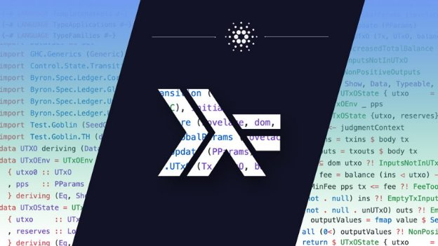

# IOHK sponsors new Haskell Foundation
### **Independent, open, non-profit body will support tools, libraries, education, and research**
 4 November 2020[ Moritz Angermann](/en/blog/authors/moritz-angermann/page-1/) 2 mins read

### [**Moritz Angermann**](/en/blog/authors/moritz-angermann/page-1/)
Software Engineering Lead

Engineering

- 
- 
- 
- 

Simon Peyton Jones [has just announced](https://youtu.be/MEmRarBL9kw) the launch of the Haskell Foundation at the Haskell eXchange virtual conference. The foundation is an independent, open, non-profit organization dedicated to broadening the adoption of the Haskell language, by supporting its ecosystem of tools, libraries, education, and research.

IOHK is one of the first sponsors of the Haskell Foundation because we believe in the power of functional programming, open-source software, and open governance. So, we are delighted to be able to join other key companies in supporting the community through an open and transparent process in which everyone can participate.
## **IOHK and Haskell**
All of IOHK’s core software is open-source, and where possible we do our work via standalone projects that will benefit the community too. We have contributed substantially to compilers like GHC, GHCJS and Asterius; created libraries for eliminating space leaks; and are even building the Plutus smart contract platform on Haskell.

For several years IOHK has been supporting the development of GHC itself and aims to continue doing so. Our engineers have contributed the ghc-bignum library, improved cross-compilation support, worked on support for ARM architectures, provided general code improvements, and fixed a number of bugs. We are keen to help other community efforts, for example by funding the work of others, and by helping to get the recently-merged Windows I/O manager across the finish line.

In addition to its direct technical involvement, IOHK has also invested in expanding the Haskell community, including developing online tutorials, education programmes, and delivering face-to-face training courses in places such as Athens, Barbados, Mongolia and Ethiopia. Through this and other programs, we are fully committed to the Haskell Foundation’s goals of enhancing diversity within the Haskell community.
## **Looking forward**
We are excited to be working with the Haskell Foundation to help move Haskell forward. IOHK has contributed to the Foundation’s technical agenda, and will help directly with technical work. Stay tuned for more exciting announcements!
