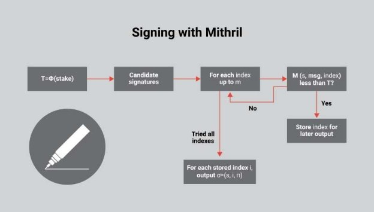
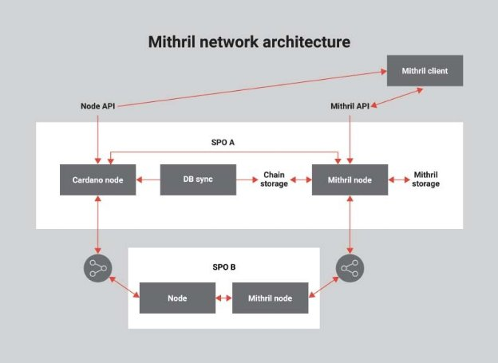

# Mithril: a stronger and lighter blockchain for better efficiency
### **A new IOHK-developed protocol acts as a stake-based threshold signature scheme allowing for transparent, secure, and lightweight stake leveraging**
 29 October 2021[ Olga Hryniuk](/en/blog/authors/olga-hryniuk/page-1/) 10 mins read

### [**Olga Hryniuk**](/en/blog/authors/olga-hryniuk/page-1/)
Technical Writer

Marketing & Communications

- 
- 

At the [Cardano Summit 2021](https://summit.cardano.org/), IOHK researchers Pyrros Chaidos and Roman Oliynykov presented the design and goals of Mithril – new research and engineering effort carried out by IOHK. Mithril will provide a stake-based threshold signature scheme that can be implemented as the protocol to solve chain synchronization, state bootstrapping, and trust issues in blockchain applications. 

Mithril is the name used for a fictional metal in Middle-Earth – a malleable material, very light in weight but strong as 'triple steel', which does not tarnish or dim. Thus, the name symbolizes strength in terms of security and a lightweight approach with regard to the developed protocol. 
## **Leveraging stake for signature aggregation**
Let’s start with some background information to understand Mithril's benefits for the development of blockchain solutions.

Cardano is a proof-of-stake blockchain, so the consensus algorithm randomly selects nodes to become block producers according to the stake they hold. For certain messages or actions, it is important that a particular number of stakeholders provide their cryptographic signatures. The consensus protocol determines how individual nodes assess the current state of the ledger system and has three main responsibilities:

- perform a leader check and decide if a block should be produced 
- handle chain selection 
- verify produced blocks.

To achieve greater scalability in a blockchain setting, it is essential to address the complexity of critical operations that depend logarithmically on the number of participants. This means that the higher the number of participants (which are assumed to be numerous), the more complex it becomes to *efficiently* aggregate their signatures. In a base scenario, to presume a signature that talks for the majority of stakeholders, every stakeholder needs to sign the appropriate individual message. Although this is possible, it is inefficient in terms of scalability and speed. 

Given the time it takes to validate a particular message, and the resource usage during chain synchronization, it is vital to provide a solution that makes multi-signature aggregation fast and efficient without compromising security features. 
## **Mithril protocol design**
Mithril is a protocol designed to:

- leverage stake to obtain higher efficiency
- ensure transparent setup while not requiring increased trust settings
- leverage trade-offs between size and efficiency, which is guaranteed by the modular component design.

Mithril works in a public setting where signers don’t need to interact with other signers to produce a valid signature. The aggregator combines all the signatures into one, and this process is logarithmic with respect to the number of signatures, which results in a sublinear performance for Mithril aggregation. For example, when applied to full node clients like Daedalus, Mithril can boost full node data synchronization ensuring speed and decreasing resource consumption. 

To represent a significant fraction of the total stake, Mithril uses the stake-based *threshold* setting. This behavior is different from the standard setting in which the given number of participants are required to validate a particular message. In the stake-based threshold setting, the protocol requires a fraction of the total stake to validate a given message to generate a correct signature.

Mithril also certifies consensus in a trustless setting. This means that it does not include any additional trust assumptions. It is possible to achieve consensus certification without including any additional assumptions, other than those already present in the proof of stake. For example, it can work within wallet-as-a-service, and the mobile client will use the certificate obtained from a Mithril node. With advanced security settings, such a procedure is potentially more efficient than SPO blockchain verification.

Finally, to ensure fast chain state bootstrapping, the signature scheme allows different stakeholders to validate only a given checkpoint of the chain. Stakeholders need not go through the whole transaction history of the given state – they simply need to go through the checkpoints to verify that the final stake is valid. This is beneficial for light client applications like light wallets that need to work fast without a full chain synchronization. Mithril signatures can be also useful for lightweight tally verification, or cryptocurrency governance decision making.
## **How it works**
Mithril enables a multi-party signature by holding a number of individual lotteries (*M*) and considering a message to be valid if it has been signed by a number of different winners (*K*) over those lotteries. Each user, therefore, attempts to sign the message and then passes its signature through what is considered a lottery function. This function allows individual users to check if their signatures are eligible as lottery winners and output those without waiting. This is different from a standard setting, where slot leaders need to wait until their slot is active to participate. Once there are case signatures over different lotteries, they can be aggregated into a single Mithril signature.

**Phases**

The design of Mithril involves three phases:

Figure 1. Phases of Mithril operation

**Parameter setup**

To set up a Mithril protocol, users need to:

- fix the group setting where the cryptography will take place
- select the index range *M*, which is the number of elections they will be holding
- set the quorum size *K*, which is the number of election winners that need to sign a signature for it to be accepted.

It is also important to provide a reference string for the proof system. This is possible in a transparent manner and does not require any high trust assumptions. 

**Initialization**

During this phase, users should *update the state distribution.* This lets every stakeholder know from what stake they are holding. Then, each stakeholder is responsible for *registering their keys*. This can happen either on or off the chain. 

Finally, users need to *distribute stake and compress their test keys*, which is done using the [Merkle tree](https://docs.cardano.org/glossary/#merkletree). This function allows Mithril signatures to be verified against a single hash that represents that Merkle tree. So, the size of the state needed to verify a signature can be kept low. 

**Operation**

While working with the chain, users can produce, aggregate, and verify Mithril signatures. Producing signatures involves users’ attempts to check if the signature they produced is actually a winner on one of the lotteries held in parallel. If true, the users will broadcast their signatures. If there are enough signatures supporting a particular message over different lotteries, they can be aggregated into a single Mithril signature. It can then be broadcast and verified by anyone using only the reference string for the proof system and the very short Merkle tree hash of stake distribution.

For example, a single user can create a signature with Mithril as follows:

Figure 2. Mithril signature creation

First, a user will check the amount of stake they hold and pass it through a score function to obtain their score threshold *T*. Then, they will attempt to produce a candidate signature *S*. For each index, they will evaluate whether the candidate's signature they produced paired with the message they have just signed. The index number of the lottery they're checking against should also produce a score value that is less than their threshold *T*. If that is true, then the candidate signature they produced has actually won the lottery on that particular index number. If not, they will make the next attempt. 

After trying all possible indexes, users will potentially have one or more indexes for which their signature *S* is valid. For each of those indexes, they can output an individual signature consisting of their candidate signature, the index number for which it is valid, and the proof that verifies that their score is consistent with the registered stake. 
## **Network architecture**
Implementing Mithril on Cardano, we can represent the software interaction as follows:

Figure 3. Mithril network architecture

A high-level representation of software around a stake pool operator (SPO) includes its connection to the Cardano peer-to-peer (P2P) network, the Mithril node’s P2P network, and the Mithril client connected to the node run by an SPO.

The Mithril node at the SPO platform accesses its verified blockchain at the local storage and runs the protocol to produce Mithril certificates that are kept at the Mithril storage. Produced Mithril certificates can be verifiably synchronized across the whole network. Thus, the SPO can share both the full Cardano blockchain *and* the list of valid Mithril certificates for it. When the Mithril client connects to the network, it requests a list of Mithril certificates and asks only for the longest chain of the Cardano blockchain. 

Several SPOs can also participate in such a setting. The Mithril client will then verify that certificates fully confirm the obtained Cardano blockchain. The whole procedure is lightweight and will not require the involvement of significant network storage or computational resources. Moreover, Cardano full node sync and fast sync with Mithril procedures are not mutually exclusive – they can be run in parallel. Mithril fast sync will be later confirmed by the full node sync. 
## **Use cases**
Let’s take a look at the use cases where Mithril applicability is highly beneficial.

Mithril boosts the efficiency of *full node clients* or applications such as [Daedalus](https://www.google.com/url?q=https://docs.cardano.org/cardano-components/daedalus-wallet&sa=D&source=editors&ust=1633506174851000&usg=AOvVaw1TSia4xDEiu6-d-ClvqO6a). It ensures fast and secure synchronization of the full node data, significantly improving time and required resources including computation, network exchange, and local storage while keeping high-level security guarantees.

Mithril is also applicable to *light clients and mobile applications*, ensuring a trustless approach. Another significant advantage is using Mithril signatures for running *sidechains*. The main blockchain can connect to different sidechains that can even have different consensus protocols. Mithril has benefits in lightweight blockchain state verification, and thus, certificates can validate the current state of the specific blockchain as well as the correctness of forward and backward transfers in a secure way. 

Finally, stake-based voting applications and governance solutions can use Mithril regardless of the voting protocol’s complexity. Mithril signatures can be utilized for secure and lightweight tally verification. This is also useful in governance when stakeholders go through a decentralized decision-making process and provide the final result in an easy and verifiable way. 
## **Implementations**
Several companies are already interested in Mithril implementation within their blockchain solutions. [Galois](https://galois.com/research-development/), an advanced R&D firm focused on formal methods, cryptography, and hardware, will be implementing the first Mithril prototype based on the research done by IOHK. Galois will be implementing Mithril in the Rust programming language due to its fast prototyping features. They plan first to present smaller signatures with BulletProofs, then followed by production-ready implementations, and finally formal proofs of correctness.

[Idyllic Vision](https://www.google.com/url?q=https://idyllicvision.com/%23/&sa=D&source=editors&ust=1633533919267000&usg=AOvVaw1sXpYwItx-H5CX6OgJ-wzT) is another company focused on building a self-sovereign identity protocol based on zero-knowledge proofs, a credential management system for organizations, and a mobile wallet for end users that supports interoperability between diverse society solutions. They are planning to implement the proof of concept of the Mithril node. In the following months, they will begin with creating a blueprint of solution architecture, defining a number of system components that should be developed and organically integrated into the existing infrastructure. This includes integration with the Mithril crypto library and the Cardano node, and a networking layer for communication between nodes. The result of this phase should be integrated into Cardano to enable fast bootstrapping of the node and support for extra functionality like lightweight clients as others. 

To find out more, read the [Mithril research paper](https://iohk.io/en/research/library/papers/mithrilstake-based-threshold-multisignatures/) and watch the [Cardano Summit presentation](https://summit.cardano.org/sessions/mithril-linking-together-a-stronger-and-lighter-blockchain).
