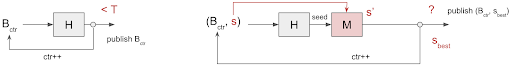
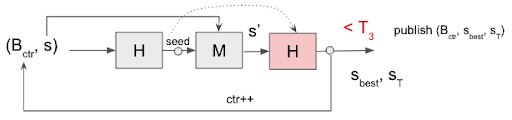
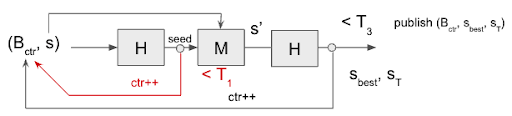
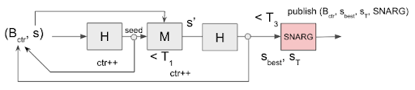
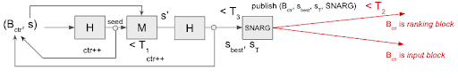

# Introducing Ofelimos: a proof-of-useful-work consensus protocol
### **IOG research introduces a new, provably secure, consensus protocol to minimize the energy wastage of proof-of-work blockchains**
 16 August 2022[ Olga Hryniuk](/en/blog/authors/olga-hryniuk/page-1/) 11 mins read

### [**Olga Hryniuk**](/en/blog/authors/olga-hryniuk/page-1/)
Technical Writer

Marketing & Communications

- 
- 

The minimization of proof of work's (PoW) energy cost and carbon footprint is one of the most hotly discussed topics in the crypto space. Substituting the PoW primitive in Nakamoto's longest-chain protocol with a proof of useful work (PoUW) has long been theorized as an ideal solution in many respects but, to this day, the concept has lacked a convincingly secure realization.

Today, at the leading international cryptology conference, [Crypto](https://crypto.iacr.org/2022/), Input Output Global, Inc (IOG) introduces *Ofelimos*, a novel PoUW-based blockchain protocol whose consensus mechanism simultaneously realizes a decentralized optimization-problem solver. The consensus mechanism utilizes the work to solve computational problems of practical interest to maintain the blockchain.
## **Proof of work versus proof of useful work**
PoW-based blockchain protocols capitalize on the work performed by protocol participants, called *miners*. PoW ensures the security of the ledger by encouraging miners to compete in solving computational problems to be eligible to produce a new block. This computational work maintains protocol security but requires significant power and resource usage. At the time of writing, Bitcoin has an [annualized energy expenditure](https://ccaf.io/cbeci/index) on par with many small to medium countries.

Proof of *useful* work addresses the problem of energy efficiency by repurposing the computational effort required to maintain protocol security to solve complex *real-world* problems such as optimizing company logistics or event scheduling, for instance.

One of the challenges of PoUW is to resolve the following dilemma: if the problems to be solved are truly useful (coming from the real world), the attacker may direct the system to pose easily solvable (or already solved by the attacker) problem instances. This would leverage the attacker’s resources to produce more blocks than an honest participant with the same amount of resources, and would thus reduce blockchain security. On the other hand, minimizing the attacker's ability to leverage their block production may require posing random problem instances, thus rendering the system's computations useless in practice.

Ofelimos solves this dilemma together with a formal security and usefulness analysis.
## **Ofelimos overview**
Clients publish problems to be solved and rewards to be paid to successful miners. Just as in PoW, miners work on these problems to participate in a lottery that decides eligibility for block creation.

In pure PoW, this lottery typically consists of repetitively hashing a challenge (together with a counter) against a given target value. The lottery is won if the hash value lies below the target. Note that in pure PoW, a single query is fast while the probability of reaching the target is very small.

For multiple reasons, in PoUW it is also advisable to keep a single query (relatively) fast, which minimizes the probability that multiple blocks are published concurrently, for instance. On the other hand, the client-problem instances should be non-trivial to solve so that outsourcing the computation is attractive. For PoUW, it is thus natural to aim at classes of computations that are complex as a whole, yet divisible into small ‘uniform’ steps. Each step should require the same amount of work (in expectation) and correspond to a single query of pure PoW.

Stochastic local search (SLS) is an obvious class of such computations. SLS algorithms are applied to optimization problems that no efficient deterministic algorithms are known for. Rather, SLS performs a random walk in the solution space trying to gradually optimize the solution using certain heuristics. As every exploration step in the random walk is a different instance of the same computation, SLS is an excellent candidate for PoUW according to the above requirements. Furthermore, SLS is of high practical relevance with real-economy applications in areas such as logistics planning, event scheduling, etc.
## **A stepwise transformation from PoW to PoUW**
Miners pick up and resolve client-problem instances posted on the blockchain. Problem updates are continuously stored in the blockchain until some termination criterion occurs, e.g., after a fixed number of exploration steps, or if an appropriate solution has been found. 

We now reconstruct how to transform pure PoW into PoUW in this setting.

1. In pure PoW, a miner must extend their longest chain by a new block, repetitively hashing the new block against a given target (by varying a counter included in the block). As a first step, we replace repetitive hashing with repeated computation of the SLS exploration step M on a prior exploration state s stored on-chain, where the block determines the random seed for the exploration step. See Figure 1 (right side): A prior exploration state s is extended by randomized exploration step M using the seed resulting from hashing the block together with state s, yielding a new (possibly better) exploration state s’. This process is repeated until a not-yet-specified condition ‘?’ is met, allowing the miner to publish the block. During this process, the miner keeps track of the best state sbest that has been found during this repetitive process.

Figure 1: Hashing against a target T (PoW, left). Repeating exploration step M (PoUW, right).

2. We now fix the missing success condition ‘?’. To achieve good stochastic properties that are unbiased by the concrete computation, finding a block is decoupled from the quality of the computed state s’, by appending, after the exploration step, a ‘post-hash’ to the exploration step (reusing the initial seed) – see Figure 2 – and the block is eligible for publication if this hash value is below some target T3. Besides the currently best solution sbest, this introduces a new state sT that must be published with the block, the state that leads to the hash below T3 – to prove eligibility for block publication. Note that only sbest serves as a state update (to be further explored by the miners) while sT only serves as a witness for eligibility to publish the block.

Figure 2: Randomizing eligibility to publish the block

3. Considering that M is harder to compute than H, and that not all instances of M may require the same amount of work, the adversary might grind for seeds that allow them to speed up their M-computation in comparison to an honest miner, thus gaining an advantage in producing blocks faster and degrading the security of the system. We mitigate such grinding by requiring the initial hash to be below a target T1. For example, before executing the exploration step M, the miner must find a low hash value by varying the block counter along the lines of pure PoW. See Figure 3. Concretely, T1 is chosen such that the expected work to find a hash value below target T1 costs at least as much as the worst-case time complexity of computing M – enforcing that grinding for an easy instance is as costly as computing an ‘inconvenient’ instance of M. A triplet (Bctr, sbest, sT) satisfying the above conditions thus constitutes a PoUW.

Figure 3: Defend against grinding by pre-hashing against target T1

4. In contrast to pure PoW, we cannot afford to have the nodes verify the PoUWs by repeating the miner’s M-computation, since this would imply a massive amount of replicated computation and thus dramatically reduce that fraction of truly useful computation in the system. To avoid this, upon 'finding’ a publishable block, the miner is required to create a succinct non-interactive argument (SNARG) to prove such success – with the benefit that the verification complexity becomes independent of the complexity to compute M. Additionally, correct computation of the best solution sbest is proven. See Figure 4.

Figure 4: Minimizing distributed verification by adding a non-interactive proof

5. To take advantage of distributed concurrent mining, the SLS instance is parallelized (eg, by maintaining multiple exploration paths) since, otherwise, all miners would be concurrently exploring the same state, introducing a lot of (essentially) redundant exploration steps. Note that, for security reasons, block production in standard ‘Nakamoto’ PoW is slow, and that state updates are tied to blocks. On the other hand, state updates should proceed fast to avoid miners exploring 'obsolete’ states. We thus introduce two types of blocks, ‘difficult to find’ ranking blocks with the same function as in Nakamoto consensus, and ‘easy to find’ input blocks that function like transactions to be eventually referenced by ranking blocks. This way, a miner’s best solution can be disseminated relatively fast, thus keeping all miners up to date. In particular, this is achieved by first evaluating the final hash against an ‘easy’ target T3. If it is below, it qualifies as a publishable block, but only if the target is below a ‘harder’ target T2, the block qualifies as a ‘consensus-relevant’ ranking block — otherwise it is defined as an input block. See Figure 5.

Figure 5: A post-hash below T2 qualifies the block as a ranking block. A post-hash between T2 and T3 qualifies the block as an input block
## **Protocol properties**
Giving a thorough security and usefulness analysis of the protocol is beyond the scope of this article. It may still be useful to reiterate some intuition why the protocol is secure and then conclude by examining protocol efficiency.

**Blockchain security:**

- **Grinding**: the adversary has no advantage by grinding for easy-to-compute instances of M. This is achieved by adapting the pre-hashing threshold T1 such that computing M on any instance is at most as hard as finding a new pre-hash below T1 (in expectation).
- **Resistance against adversarial advantage**: The adversary’s advantage in computing the PoUW faster than honest parties is limited. This is achieved by decoupling block success from the actual computation, and by pre-hashing below target T1. In particular, following the standard model in [[GKL14](https://eprint.iacr.org/2014/765), [PSS16](https://eprint.iacr.org/2016/454)], and assuming that the adversary has no advantage in computing M faster than honest parties, the protocol tolerates an adversary controlling any minority of computing power dedicated to the network – as does Bitcoin. In contrast, even if the adversary should be able to compute M at no cost on every instance, the protocol still tolerates an adversary controlling up to one third of all computational resources – as they would still operate at ‘half’ the cost due to pre-hashing against T1.
- **Variable difficulty**: In PoW/PoUW consensus protocols, the hardness to find a block must be continuously adapted to the current level of computing power that is dedicated to the system. In Ofelimos this is easily achieved by adapting target T2 for the (single) post-hash executed after the exploration step – that qualifies for the publication of a ranking block.

**Efficiency**:

- **Frequent updates**: The separation between ranking blocks and input blocks ensures that state updates are disseminated fast.
- **Usefulness**: By usefulness, we define the ratio of the overall computational work that is spent on the SLS problem (this is a simplification – a more careful definition, and analysis, can be found in this [paper](https://eprint.iacr.org/2021/1379.pdf)). The main sources of ‘useless’ work in the system are repetitive pre-hashing against T1, and the computation of the SNARG. Note that:
  - post-hashing is only performed once per invocation of M and, in comparison to the complexity of M, can be neglected for practical reasons.
  - the SNARG only has to be computed with respect to two out of many M-invocations, the one that yields sT (implying block success) and sbest (the best solution). The overhead caused by the computation of SNARGs can thus be minimized by lowering the threshold T3 that determines block success — in a trade-off against slower state updates.

Usefulness depends on the characteristics of M. If the runtime of M is sufficiently concentrated, the pre-hash hardness can be set to be close to the average-case complexity of M. Considering the above observations, the usefulness of roughly ½ is achieved as the miner spends roughly half of their time computing M. Many classical SLS problems seem to be in this category. However, if M is not ‘well-behaved’, usefulness may be close to zero. The choice of the concrete SLS algorithms and their exploration steps M is thus crucial to achieve PoUW with reasonable usefulness.
## **Conclusion**
Ofelimos is only a first step towards provably secure and useful PoUW. Whereas the current work readily gives provable security for levels of high corruption, more research is still needed on the algorithmical side to provide suitable classes of optimization problems for which high usefulness can be provably demonstrated.

The ‘[Ofelimos: Combinatorial Optimization via Proof-of-Useful-Work’](https://eprint.iacr.org/2021/1379.pdf) research paper was first published in October 2021.

*I’d like to thank [Matthias Fitzi](https://iohk.io/en/team/matthias-fitzi) for his input and support in preparing this blog post.*
