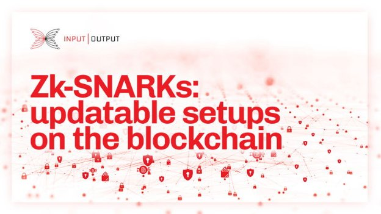
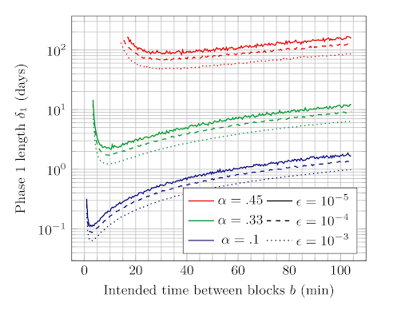

# Zk-SNARKs: updatable setups on the blockchain
### **Zk-SNARKs have proven to be a ‘Swiss army knife’ for blockchain and distributed ledgers, with applications in privacy, interoperability, and scalability**
 1 September 2022[ Thomas Kerber](/en/blog/authors/thomas-kerber/page-1/) 12 mins read

### [**Thomas Kerber**](/en/blog/authors/thomas-kerber/page-1/)
Technical Architect

Engineering

- 
- 
- 
- 

Since their introduction, zero-knowledge proofs (ZKPs) have been used to support potential applications ranging from verifiable outsourced computation to anonymous credentials, within a multitude of settings that require a balance between privacy and integrity. ZKPs enable one party to prove to another that a certain statement or claim is true, without revealing the contents of that statement. The application of ZKPs in a variety of on-chain use cases contributes to resolving privacy, interoperability, and scalability issues.

In this post, we take a look at the different types of ZKPs and their specific use cases. We also discuss zk-SNARKs, some known issues in its application, and propose a blockchain mechanism with secure characteristics under comparable conditions to the blockchain protocol. The article is based on the ‘[Mining for Privacy: How to Bootstrap a Snarky Blockchain](https://iohk.io/en/research/library/papers/mining-for-privacy-how-to-bootstrap-a-snarky-blockchain/)’ research paper written out by Thomas Kerber, Aggelos Kiayias, and Markulf Kohlweiss.
## **Different types of ZKPs**
In the blockchain setting, it is common for clients to download and verify every transaction published to the network. This means that small proof sizes and fast verification time are important for the practical deployment of zero-knowledge protocols. There are several practical schemes from which to choose, with a vast space of trade-offs in performance and cryptographic assumptions:

- **Non-interactive zero-knowledge arguments (NIZKs)**: this is the most general concept. NIZK can be non-succinct but, as a benefit, might rely on standard cryptographic assumptions and often satisfy strong security guarantees.
- **Succinct non-interactive zero-knowledge arguments (SNARGs)**: achieve succinctness at the cost of stronger cryptographic assumptions and often weaker security guarantees.
- **Succinct non-interactive zero-knowledge arguments of knowledge (SNARKs or sometimes zk-SNARKs)**: these are SNARGs that are also proofs of knowledge and zero-knowledge. The name is also popular because of Lewis Carrol’s nonsense poem ‘[The Hunting of the Snark](https://www.poetryfoundation.org/poems/43909/the-hunting-of-the-snark)’.
- **Succinct transparent arguments of knowledge (STARKs)**: transparent here refers to the setup only requiring a trusted hash function. This is beneficial but can come with a performance overhead.

Currently, the most attractive proving system from the verifier’s perspective is a (pre-processing) succinct non-interactive argument of knowledge, or zk-SNARK for short, which has a small constant proof size and constant-time verification costs even for arbitrarily large relations. Zk-SNARKs have proven to be a ‘Swiss army knife’ for blockchain and distributed ledgers, with applications in privacy, interoperability, and scalability.
### **Use cases**
Use cases of zk-SNARKs are very diverse. Sometimes SNARKs are employed to improve the performance and succinctness properties of the system. Other use cases employ zk-SNARKs to improve privacy. Some cases are mixed, where both aspects play a role.

In the blockchain setting, taking into account performance and succinctness, zk-SNARKS can greatly contribute to use cases such as:

- **Light clients**: to enhance the efficiency of parameters and the overall structure of applications. Efficient proof systems (without a zero-knowledge requirement) play an important role in bootstrapping light clients. Recursive proof systems also act as a good match for this use case to ensure security for unbounded recursion as well as the use of outside functions (for instance, hash functions) in recursive proofs.
- **Smart contracts**: to off-load possible ledger congestion because of public smart contract execution. The compilation of on-chain code to SNARKs, with constant or logarithmic verification time, can allow more complex validators.
- **Proof of useful work (PoUW)**: SNARKs can be the key to verifying ‘useful computations’ performed by miners, which would otherwise be expensive to validate on-chain.

From the privacy perspective, many applications employ zero-knowledge proofs for deploying secure payment solutions, exchanging options, managing identities, voting, auctions, verifiable statistics (a form of blockchain oracle), or incentivized anonymous communication. Use cases can include:

- **Private smart contracts**: SNARKs are integral to current private smart contract design. Two things are paramount: universality, to support user-deployed smart contracts, and ease of compilation. The expressiveness of smart contracts can be eliminated to reduce the problem space, for instance, by disallowing unbounded loops and recursion so recursive SNARK composition is not needed. Fundamentally, some subset of a high-level contract language can be compiled into a SNARK circuit.
- **Private payments**: assets can be seen as a particular form of identity claim that includes the modeling of scarcity. A proposal for private payments can also support multi-assets and non-fungible tokens, and connect these tokens to smart contracts.
- **Identity management**: In the context of verifiable credentials, issuers can assert claims about subjects by generating cryptographic objects (credentials). Subjects later present their credentials to other users that are acting as verifiers. Verifiers are then able to validate that an issuer asserted claims about the subject presenting the credential.
- **Voting and treasury**: ZK proofs can be used in treasury voting. A [treasury system for cryptocurrencies](https://eprint.iacr.org/2018/435.pdf) protocol, for instance, provides a privacy-preserving voting scheme, where voter's ballots are encrypted and later tallied using homomorphic computations. ZK proofs in the treasury are DLP-based non-interactive Sigma protocols used to prove the correctness of encrypted messages at various stages of the protocol (e.g., that the encrypted voter’s ballot contains a correctly composed ballot).

The mixed use-cases include:

- **Blockchain oracles**: SNARKs can reduce the verification cost when aggregating data from multiple sources, and they can reduce the size of on-chain data posted by including only the aggregated value and the proof, instead of all data points. To achieve these two properties, parties should be able to succinctly prove knowledge of signatures on a number of data points as well as the respective average/median/variance.
- **Sidechains**: one chain in a chain pegging configuration can act as a light client towards the other chain, verifying cross-chain transactions on the other chain without having to verify the entirety of that chain. The difference is that this pegging is often maintained long-term, and so the proofs can be provided regularly and in an ‘updatable’ fashion. See [Proof of stake Sidechains](https://eprint.iacr.org/2018/1239) for more information.
### **Known issues**
Non-interactive zero-knowledge requires some shared randomness, or a common reference string. For many succinct systems, a stronger property is necessary:

Not only is a shared random value needed, but it must adhere to a specific structure. A structured reference string (SRS) typically consists of related group elements, ie: gx^^i^^ for all i∈𝕫n.

The obvious way of sampling such a reference string from public randomness reveals the exponents used – and knowledge of these values breaks the soundness of the proof system itself. To make matters worse, the security of these systems typically relies (among other things) on the knowledge of exponent assumptions, which state that to create group elements related in such a way requires knowing the underlying exponents, and hence any SRS sampler will have to ‘know’ the exponents used and be trusted to erase them, becoming, in effect, a single point of failure for the underlying system. 

Secure multi-party computation (MPC) can be, and has been, used to reduce the trust placed on such a set-up process. However, the selection of the participants for the secure computation and the verification of the generation of the SRS by the MPC protocol retain an element of centralization. Using MPC remains a controversial element in the set-up of a decentralized system that requires SNARKs.
## **Resolving privacy issues with secure SRS generation**
An updatable structured reference string (uSRS) can be securely initialized using a distributed ledger by requiring block creators to perform updates on an evolving uSRS during an initial set-up period. After waiting for agreement on the final uSRS, it can be safely used. 

The proof of this relies on Nakamoto-style ledgers’ basic means of operation: different users can extend a chain of blocks if they can satisfy some condition, with this condition being associated with a type of hardness which ensures attackers are limited in the number of extensions they can perform. Given such a structure, we associate a uSRS update with each block before a time 𝛿1. This time is selected such that the security properties of the ledger ensure that at least one of the blocks is honest in each competitive chain at this point.

This can be constructed from a ledger functionality with an additional leadership state, which is derived from information that miners embed in their blocks to encode uSRS updates. This is left sufficiently general to allow other uses as well. The basic idea is to show that a ledger which performs uSRS updates in its leadership state is equivalent to the one that doesn’t, but is accompanied by a secure uSRS. After time 𝛿1, users wait a further time period 𝛿2 until the common prefix ensures that all parties agree on the reference string.
### **Proposed ledger abstraction**
Our construction of the updatable structured reference string functionality relies on the properties of the *common prefix*, *chain quality*, and *chain growth* defined in the Bitcoin backbone analysis by Garay et al., for Nakamoto style consensus algorithms:

- **Common prefix**. Given the current chains 𝛱1 and 𝛱2 of two parties, and removing *k* blocks from the first, it is a prefix of the second: 𝛱1⌊k ≺𝛱2.
- **Existential chain quality**. For any party’s current chain 𝛱, any consecutive *l* blocks in this chain will include at least one block created by an honest party.
- **Chain growth**. If a party’s chain is of length *c*, then *s* time slots later, it will be at least of length *c+𝛾*.
### **Decentralized uSRS construction**
Our proposed construction, detailed in the paper [*Mining for Privacy*](https://eprint.iacr.org/2020/401.pdf), is simple: each chain is associated with a specific uSRS, and when a miner extends a chain, they additionally perform a uSRS update. At the chain’s genesis, known randomness (or even no randomness) can be used. The principle behind this design is straightforward: the updatability of uSRS guarantees that if a single update is performed honestly (both using true randomness, and erasing this randomness after the update is performed), the resulting uSRS can be used safely. We rely on the *existential chain quality* property to guarantee this – once *l* blocks have been generated, at least one of these must be created by an honest miner, and therefore after *l* blocks, a chain’s uSRS is secure.

It’s not quite enough to know that a particular chain’s reference string is secure, however - for most practical applications, we want all users to agree on the reference string. This is provided by the *common prefix* property, which guarantees that for any chain *l+k* blocks long, all other users will have the same reference string as the one generated by this chain – provided users stop updating after *l* blocks!

Finally, *chain growth* guarantees that the event we are interested in – when everyone agrees on the reference string – will eventually occur. It guarantees that users will eventually have a chain of length *l+k*. Specifically, as every *s* units of time, blocks are generated, the event will occur at the latest at time ⌈(*l+k*)/*s*⌉.

This is all well in the abstract, but leaves questions of practicality: such abstract analyses assume updates can be created with little to no cost, and that they do not affect the standard mining procedure. However, this is not quite true for proof-of-work mining:

1. Updates are relatively costly, taking 5-10 minutes to compute, depending on the size of the targeted uSRS.
1. It is possible to cheat on updates, performing them faster but without adding the reference string’s security.

Combined, these factors pose a challenge, especially in the proof-of-work setting, where the update needs to be performed *before* a miner can start mining a block. This delays non-cheating miners, while their cheating counterparts are already mining! As a result, the mining difficulty (corresponding to the intended time between blocks) should not be too low, as the lower it is, the greater a cheating miner benefits. On the other hand, a high difficulty naturally leads to a longer time to reach consensus. This tradeoff is charted in Figure 1.

Provided the difficulty is calibrated appropriately, a simulation analysis shows that this effect does not damage overall security. Depending on the probability of failure (*є*) we are willing to tolerate, and the fraction of an attacker’s mining power (*а*) we want to protect against, the uSRS can be securely generated with the procedure either within a few hours, or within several months in a more pessimistic scenario, as shown in Figure 1.

Figure 1. The time needed until at least one honest update is guaranteed, as a function of the target block time

*Source: ‘[Mining for Privacy: How to Bootstrap a Snarky Blockchain](https://iohk.io/en/research/library/papers/mining-for-privacy-how-to-bootstrap-a-snarky-blockchain/)’ research paper*

A similar issue occurs when considering rational behavior – miners seeking only profit will also try to cheat on their updates, not out of malice, but simply because they can produce blocks faster if they do. This can be circumvented by additionally rewarding good behavior – a sampling of miners can be asked after the fact to provide the randomness for their updates, and demonstrate that it was sampled in an appropriate way (for instance, using a hash function). If they are able to do so, they can gain an additional reward, offsetting any loss they might have from not cheating.

In summary, the applicability of zk-SNARKs greatly benefits different on-chain use cases resolving privacy, interoperability, and scalability issues. While the trusted setup, required for many zk-SNARKs, appears to be at odds with the decentralized nature of distributed ledgers, it can be performed in a fully decentralized way for SNARKs with updatable reference strings. Although in principle it is also possible to use transparent SNARKs such as [Halo](https://eprint.iacr.org/2020/1536.pdf), the techniques described above allow SNARKs such as [Plonk](https://eprint.iacr.org/2019/953.pdf) (which may be more efficient depending on the circumstances), relying on updatable reference strings, to be also used safely for on-chain applications – it is no longer the case that SNARK setups are too opaque to trust, if they ever were.
