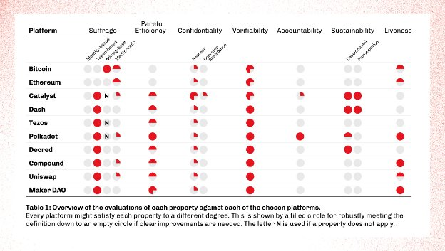

# Systematizing blockchain governance
### **Taking a look at IOG research on ‘Blockchain Governance’ and ways of establishing a robust governance system**
 29 September 2022[ Philip Lazos](/en/blog/authors/philip-lazos/page-1/) 8 mins read

### [**Philip Lazos**](/en/blog/authors/philip-lazos/page-1/)
Research Fellow

Academic Research

- 

The initial goal of blockchain systems was to achieve decentralized consensus with regard to monetary transactions. So far this has been a success, with different platforms offering a variety of decentralization levels, some of which are quite robust. Blockchains have since expanded to be capable of much more than what Bitcoin originally intended. 

However, the ‘code-is-law’ mentality remains prevalent and often comes at odds with the needs of the community. Traditionally, a hard fork would be the solution to such a misalignment, a fate that neither Bitcoin nor Ethereum were immune to. Philosophically, one could claim that this is reasonable and perhaps unavoidable. Perhaps this position would be easier to defend if its consequences were less drastic. Engineering talent and computational resources are split, digital assets are duplicated and many ambivalent users are forced to choose where to migrate, setting projects back and creating opportunities for fraud. 

This blog post offers a glimpse into Input Output Global, Inc. (IOG) research on ‘Blockchain Governance’ and in particular, ways of systematizing such a diverse field, applying this understanding to Cardano and some potential way forward for the industry. One of the first publications in this field, ‘[SoK: Blockchain Governance](https://arxiv.org/abs/2201.07188)’ offers a deeper dive, and more will appear in the future.
## **Establishing a robust governance system**
Many modern blockchains have opted to formally adopt some form of on- or off-chain governance, which is a more robust and elegant alternative. Of course, there is a vast amount of literature behind traditional forms of government, democracy, and voting that influences the current governance designs. However, there are many differences across blockchains, even if the end goals are similar. 

At IOG, we attempt to distill the governance approach using **seven** different properties. As is often the case in any complex design, there are significant trade-offs between such approaches and the right balance is what gives each governance system its particular characteristics. The properties can be further grouped into four categories, pictorially represented in the following figure: 

Figure 1. Blockchain governance properties

Before delving deeper, it is important to stress that the ‘inner workings’ of a governance system are not part of this systematization. We are only interested in achieving a good mix of those properties: whether the underlying system uses a foundation, DAO, governance tokens or otherwise is just a **mechanism**, in service of them. Furthermore, notice that the keywords *deliberation* and *execution* are grayed out. While critical for any governance system (eg, to ensure that the voters are sufficiently informed and the planned decisions implemented), they are outside of our scope, whose focus lies in the process between these two properties and assumes they are perfectly satisfied. Finally, it is important to note that ‘ticking’ all those properties would not make a governance system perfect. It is however important to consider all of them and carefully decide which to pursue.

Below we provide a short description of these properties.
### **Suffrage**
Clearly, the first consideration should be to determine which of the users should have the ability to participate in governance as voters or representatives. Although this might appear simple (despite the fact that thousands of years of human history prove otherwise), it is quite challenging in a blockchain system. There are many ways to interact with a cryptocurrency, including participating in the consensus protocol (by providing the underlying resource, such as hash power) or owning a stake. These roles can be even more diverse in decentralized finance (DeFi) applications. In addition, given the pseudonymous interaction, the possibility of Sybil attacks and ease of switching to a different blockchain, the voters are typically not treated equally but *weighted* according to their share of some on-chain resource. We identify the most common types of suffrage. These are *token-based* and *mining-based, meritocratic (*where rights are guaranteed given previous positive contributions), and *identity*-based, which is linked to proof of personhood and is yet to be seriously explored, given the clash with anonymity.
### **Pareto efficiency**
Having determined who should be able to vote, the next step is to convert their preferences into action. As expected, this is easier said than done, with the barriers being both practical and mathematical. On the theoretical side, it has proven to be impossible to even *define* what the ‘best’ (or most *desirable*) outcome would be. The typical assumption is that every voter has a ranking containing every alternative, which may even be associated with a numerical score describing how happy that voter would be if selected. These alternatives can be candidates, outcomes of referenda, etc. Intuitively, one could define the ‘optimal’ as the candidate who wins all *pairwise* (or heads-up) elections. This candidate is called the *Condorcet* winner but doesn’t always exist. In fact, when there are three or more alternatives, there is no ideal voting mechanism: roughly speaking, either voters would benefit by strategically misrepresenting their preferences or some far more fundamental property (than not choosing the Condorcet winner) would be violated. There are many such results, with [Arrow’s Theorem](https://en.wikipedia.org/wiki/Arrow%27s_impossibility_theorem) being the most famous.

Instead, voting rules try to capture some weaker guarantees. Pareto efficiency is arguably the weakest. A voting rule satisfies it if the selected alternative is not *strictly* worse than another. By strictly worse, we mean that every voter is either indifferent or prefers some other alternative. A governance system contains many voting rules (such as referenda or council elections), so our focus is to determine how likely it is that a clearly suboptimal alternative is chosen, and how much worse it can be.
### **Confidentiality and verifiability**
These two paired properties are all about legitimizing the result and supporting the trust put into the governance system by the users. At a high level, they are both straightforward. Confidentiality can be further broken down into secrecy (if an adversary cannot learn anything by observing the vote) and coercion-resistance, where the voters can actually deceive an attacker about their action, while secretly casting the vote they want. Both these properties are technically challenging and typically only a weak form of secrecy is satisfied, assuming the pseudonyms of the voters cannot be connected back to them. These properties are at odds with verifiability. The more secure a vote is, the trickier it is to independently verify the outcome without leaking information.
### **Accountability and sustainability**
So far, the previous properties apply in a single ‘round’ of governance. Accountability and sustainability are two complementary properties incentivizing long-term and effective participation. In particular, accountability is all about holding voters (or decision-makers in general) responsible for the changes they bring in. For this to happen it is not necessary to judge the quality of an outcome, but possible to take a milder form. For instance, voters in favor of some proposal could be unable to withdraw their funds or vote on another change for a specified duration. On the flip side, a governance system is sustainable if participating in it (by voting, managing, or developing it) is rewarded. These aspects require time and material investment and should arguably be rewarded directly, without just relying on the value of the coin rising. Often, an on-chain treasury approach is used for this purpose.
### **Liveness**
The final piece of the puzzle comes by the way of liveness, which is the ability of the governance system to incorporate inputs of urgency. So far, both extremes have been observed: the [DAO hack](https://www.coindesk.com/learn/2016/06/25/understanding-the-dao-attack/) was (in part) enabled by a sluggish governance response, while the [Beanstalk exploit](https://cointelegraph.com/news/beanstalk-farms-loses-182m-in-defi-governance-exploit) was triggered by a specific immediate action clause in the case of a supermajority. It should be clear from these examples that liveness is a necessary property that typically comes at a cost. To avoid any unforeseeable corner cases, often just an emergency shutdown functionality is offered. This would give users the necessary time to react, without significantly increasing the attack surface of the blockchain system. 
### **Evaluation**
In the following table, you can find an evaluation of the governance aspect of some prominent blockchains, which have been chosen to represent a wide variety of the current approaches, including governance tokens, council elections, treasuries, and more:

Finally, to establish a robust governance system, it is important to achieve a good mix of the properties discussed above while considering each but mainly focusing on the one that better suits the specific system design. 

For a detailed overview, see ‘[SoK: Blockchain Governance](https://iohk.io/en/research/library/papers/sok-blockchain-governance/)’ by Prof Aggelos Kiayias and Philip Lazos. This paper was also presented at the fourth ACM conference on Advances in Financial Technologies (AFT’22) on September 19-21, 2022, held at the MIT Media Lab.
