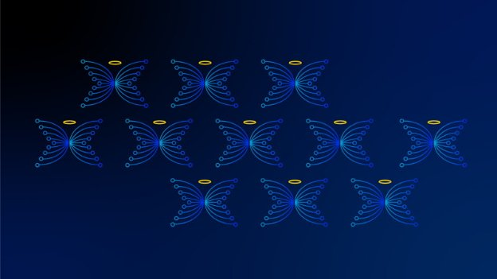

# The final days of Christmas
### **The past, present, and future of Cardano in the spirit of an olde English counting song**
 4 January 2021[ Anthony Quinn](tmp//en/blog/authors/anthony-quinn/page-1/) 3 mins read

### [**Anthony Quinn**](tmp//en/blog/authors/anthony-quinn/page-1/)
Editor

Marketing & Communications

- 
- 
- 
- 

These are our final two thoughts about the past, present and future of Cardano in the spirit of an olde English counting song. There's one for each of [The Twelve Days of Christmas](https://www.classicfm.com/discover-music/occasions/christmas/twelve-12-days-of-christmas-lyrics-meaning/), from December 25 to January 5, published in four batches. You can look back to the [first batch](https://iohk.io/en/blog/posts/2020/12/24/some-thoughts-for-the-next-12-days/), which went out on Christmas Eve.

Đây là hai suy nghĩ cuối cùng của chúng tôi về quá khứ, hiện tại và tương lai của Cardano theo tinh thần của một bài hát đếm tiếng Anh cũ.
Có một cho mỗi [mười hai ngày Giáng sinh] (https://www.classicfm.com/discover-music/cocasions/christmas/twelve-12-days-of-christmas- Lyrics-meaning/), từ ngày 25 tháng 12
đến ngày 5 tháng 1, được xuất bản trong bốn đợt.
Bạn có thể nhìn lại [Batch đầu tiên] (https://iohk.io/en/blog/posts/2020/12/24/some-houghts-for-the-next-12-days/), đã đi ra ngoài
Vào đêm Giáng sinh.

## **Day 11. Charles Morgan, head of cybersecurity**

## ** Ngày 11. Charles Morgan, Trưởng phòng an ninh mạng **

My brief takes in a wide range of activities, from the obvious aspects of securing our websites, to advising staff on their physical safety on their travels (such as putting a wedge under a hotel bedroom door!), and enforcing two-factor authentication for almost 250 people around the world ([Yubikeys](https://www.yubico.com/) are brilliant for this). And we’re having to deal with an awful lot more than Santa coming down the chimney, as you can see from these [security statistics over the past year](https://www.websitehostingrating.com/cybersecurity-statistics-facts/). Can you believe that one in five of the billions of files online are completely open for global access? Scary stuff if that’s your health records or financial information.

Bản tóm tắt của tôi trong một loạt các hoạt động, từ các khía cạnh rõ ràng của việc bảo vệ trang web của chúng tôi, đến tư vấn cho nhân viên về sự an toàn vật lý của họ trên các chuyến đi của họ (chẳng hạn như đặt một cái nêm dưới cửa phòng ngủ của khách sạn!), Và thực thi xác thực hai yếu tố để
Gần 250 người trên khắp thế giới ([Yubikeys] (https://www.yubico.com/) rất tuyệt vời cho việc này).
Và chúng tôi sẽ phải đối phó với rất nhiều so với ông già Noel xuống ống khói, như bạn có thể thấy từ [thống kê bảo mật này trong năm qua] (https://www.websitehostingrating.com
/).
Bạn có thể tin rằng một trong năm trong số hàng tỷ tệp trực tuyến hoàn toàn mở để truy cập toàn cầu không?
Công cụ đáng sợ nếu đó là hồ sơ sức khỏe hoặc thông tin tài chính của bạn.

I have three interesting items I am working on the moment. The first is theft detection, tracing and anti-money-laundering strategies for Cardano using machine cognition. Then, there’s the automation of security audits and anomaly detection. And, on a more personal level, I’m working towards my [Ethical Hacker v11](https://www.eccouncil.org/wp-content/uploads/2020/09/CEHv11-Brochure.pdf) certification.

Tôi có ba món đồ thú vị mà tôi đang làm việc vào lúc này.
Đầu tiên là các chiến lược phát hiện trộm cắp, truy tìm và chống rửa tiền cho Cardano bằng cách sử dụng nhận thức máy.
Sau đó, tự động hóa kiểm toán bảo mật và phát hiện bất thường.
Và, ở cấp độ cá nhân hơn, tôi đang làm việc cho [hacker erm v11] của tôi (https://www.eccouncil.org/wp-content/uploads/2020/09/cehv11-Brochure.pdf).

As for 2021, I am looking forward to having more team members in cybersecurity. This is going to allow us to be far more proactive in our security posture, in running dynamic and static audits of our products, and it will allow us to pursue [ISO/IEC 27001](https://www.iso.org/isoiec-27001-information-security.html) certification and compliance. This work is critical to Input Output becoming recognised globally as a technologically-stable company, which, thereby, will bolster confidence in Cardano and our products based on the blockchain platform.

Đối với năm 2021, tôi mong muốn có nhiều thành viên trong nhóm trong an ninh mạng.
Điều này sẽ cho phép chúng tôi chủ động hơn nhiều trong tư thế bảo mật của mình, trong việc chạy các kiểm toán động và tĩnh của các sản phẩm của chúng tôi và nó sẽ cho phép chúng tôi theo đuổi [ISO/IEC 27001] (https://www.iso.org/
isoiec-27001-information-security.html) Chứng nhận và tuân thủ.
Công việc này rất quan trọng để đầu vào đầu vào trở nên được công nhận trên toàn cầu là một công ty ổn định về mặt công nghệ, do đó, sẽ củng cố niềm tin vào Cardano và các sản phẩm của chúng tôi dựa trên nền tảng blockchain.

## **Day 12. Rob Moore, digital deliveries manager**

## ** Ngày 12. Rob Moore, Trình quản lý giao hàng kỹ thuật số **

The Shelley launch and the start of decentralization for Cardano was a monumental event for the project. The whole of the web team was on call in case anything unforeseen happened, but, of course, all we ended up doing was watching the transition take place. However, even playing that bit part in helping to make Shelley happen is something I won't forget in a hurry. 

Việc ra mắt Shelley và bắt đầu phân cấp cho Cardano là một sự kiện hoành tráng cho dự án.
Toàn bộ nhóm web đã được gọi trong trường hợp bất cứ điều gì không lường trước xảy ra, nhưng, tất nhiên, tất cả những gì chúng tôi đã làm là xem quá trình chuyển đổi diễn ra.
Tuy nhiên, ngay cả khi chơi phần bit đó trong việc giúp Shelley xảy ra là điều tôi sẽ không quên một cách vội vàng.

Setting ourselves up to deliver quality creative work has been absorbing much of my time recently. December’s [Mantis launch](https://iohk.io/en/blog/posts/2020/12/09/the-new-mantis-bringing-security-and-stability-to-the-ethereum-classic-ecosystem-1/) of a new client for [developers working with Ethereum Classic](https://mantisclient.io/) is a taste of things to come.

Thiết lập bản thân để cung cấp công việc sáng tạo chất lượng đã hấp thụ phần lớn thời gian của tôi gần đây.
[Ra mắt Mantis] tháng 12 (https://iohk.io/en/blog/posts/2020/12/09/the-new-mantis-breing-security-and-stable-to-thereum-classic
-ecosystem-1/) của một khách hàng mới cho [các nhà phát triển làm việc với Ethereum Classic] (https://mantisclient.io/) là một hương vị của những điều sắp tới.

Live music, seeing friends and family, having plans, meeting work colleagues in real life, going abroad. All the things we used to take for granted. These are the things I’ve been missing and hope to get back to in 2021.

Nhạc sống, gặp bạn bè và gia đình, có kế hoạch, gặp gỡ các đồng nghiệp trong cuộc sống thực, ra nước ngoài.
Tất cả những điều chúng tôi từng coi là đương nhiên.
Đây là những điều tôi đã mất tích và hy vọng sẽ trở lại vào năm 2021.

*That completes our Twelve Days of Christmas. We hope some of them – whether on Daedalus, Japanese poetry, decentralized identity or the thoughts of a dreaming octopus – have struck a chord with you.* *The rendition of [The Twelve Days of Christmas](https://www.classicfm.com/discover-music/occasions/christmas/twelve-12-days-of-christmas-lyrics-meaning/) by the choir of Clare College Cambridge has certainly raised plenty of laughs. Here's to an exciting 2021!*

*Điều đó hoàn thành mười hai ngày Giáng sinh của chúng tôi.
Chúng tôi hy vọng một số người trong số họ - cho dù trên Daedalus, thơ Nhật Bản, bản sắc phi tập trung hay những suy nghĩ của một con bạch tuộc mơ ước đã tạo ra một hợp âm với bạn.
/www.classicfm.com/discover-music/cocasions/christmas/twelve-12-days-of-cloistmas- Lyrics-meaning/) bởi dàn hợp xướng của Clare College Cambridge chắc chắn đã gây ra nhiều tiếng cười.
Đây là một năm 2021 thú vị!*

