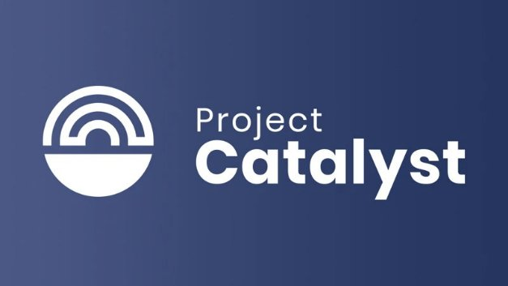

# Project Catalyst blasts off into 2021
### **New fund will commit $500k in ada to find groundbreaking ideas which accelerate Cardano development**
 6 January 2021[ Eric Czuleger](tmp//en/blog/authors/eric-czuleger/page-1/) 5 mins read

### [**Eric Czuleger**](tmp//en/blog/authors/eric-czuleger/page-1/)
Senior Content Editor

Marketing & Communications

- 
- 
- 

Project Catalyst is the first stage in our Voltaire roadmap, created to bring best-in-class governance to Cardano. Effective governance is vital to Cardano because it gives the power to shape the blockchain to its users. Anyone who signs up to Catalyst will be able to propose ideas, and then registered ada holders will vote on funding proposals focused on the continued evolution of Cardano as a platform and a community. This will not only accelerate development but also sustain the Cardano ecosystem in the long term. 

Project Catalyst là giai đoạn đầu tiên trong lộ trình Voltaire của chúng tôi, được tạo ra để mang lại sự quản trị tốt nhất cho Cardano.
Quản trị hiệu quả là rất quan trọng đối với Cardano vì nó mang lại sức mạnh để định hình blockchain cho người dùng.
Bất cứ ai đăng ký với Catalyst sẽ có thể đề xuất các ý tưởng, và sau đó chủ sở hữu ADA đã đăng ký sẽ bỏ phiếu về các đề xuất tài trợ tập trung vào sự phát triển liên tục của Cardano như một nền tảng và một cộng đồng.
Điều này sẽ không chỉ tăng tốc sự phát triển mà còn duy trì hệ sinh thái Cardano trong dài hạn.â

This journey began with two test funds, and then Catalyst swung into action for real with [Fund2 in September](https://iohk.io/en/blog/posts/2020/09/16/project-catalyst-introducing-our-first-public-fund-for-cardano-community-innovation/). With it we saw a very early – and remarkable – example of decentralized collaboration. Thousands of people came together – proposing teams, community advisers and ada-holding voters – to generate, refine and prioritize funding for proposals to drive Cardano forward.

Hành trình này bắt đầu với hai quỹ thử nghiệm, và sau đó Catalyst đã hành động thực sự với [Fund2 vào tháng 9] (https://iohk.io/en/blog/posts/2020/09/16/project-catalyst-producing-our của chúng tôi
-Những tiền vệ-fund-for-cardano-community-innovation/).
Với nó, chúng tôi đã thấy một ví dụ về sự hợp tác phi tập trung rất sớm và đáng chú ý về sự hợp tác phi tập trung.
Hàng ngàn người đã cùng nhau đề xuất các nhóm, cố vấn cộng đồng và cử tri tổ chức Ada để tạo ra, tinh chỉnh và ưu tiên tài trợ cho các đề xuất để thúc đẩy Cardano tiến lên.

Voting on Fund2 has just concluded and tallying of the votes is under way. Soon, the winning teams will receive funding to help make their proposals a reality. [Join our dedicated Telegram channel for Catalyst](https://t.me/cardanocatalyst) and stay tuned to our social channels for updates on this.

Việc bỏ phiếu trên Fund2 vừa kết thúc và kiểm soát phiếu bầu đang được tiến hành.
Chẳng mấy chốc, các đội chiến thắng sẽ nhận được tài trợ để giúp biến đề xuất của họ thành hiện thực.
[Tham gia kênh Telegram chuyên dụng của chúng tôi cho Catalyst] (https://t.me/cardanocatalyst) và theo dõi các kênh xã hội của chúng tôi để cập nhật về điều này.

**Challenge accepted**

** Thử thách được chấp nhận **

Meanwhile, with barely a beat, we’re moving forward with even greater purpose by harnessing the community momentum integral to Catalyst. Fund3 launches today and we want to expand the Catalyst community with every fund, encouraging ever more people to get involved.

Trong khi đó, chỉ với một nhịp, chúng ta sẽ tiến lên phía trước với mục đích thậm chí còn lớn hơn bằng cách khai thác sự tích hợp động lực của cộng đồng cho chất xúc tác.
Fund3 ra mắt ngày hôm nay và chúng tôi muốn mở rộng cộng đồng Catalyst với mọi quỹ, khuyến khích nhiều người tham gia hơn.

If you’re not familiar with Project Catalyst, this is how it works. Every funding round begins with a defined set of challenges. Each challenge represents an ‘intention’ by the Cardano community, a collective goal we’d like to achieve – we like to talk of return on intention as the way of measuring progress for the project! Each challenge is designed to be broad enough to inspire both technical and general ideas, while being specific enough to provide focus. As long as an idea addresses a challenge and makes a strong case for meeting the intended outcome, it will be considered. So we welcome all proposals, from marketing initiatives and infrastructure development, to content production and product enhancement. 

Nếu bạn không quen thuộc với Project Catalyst, đây là cách nó hoạt động.
Mỗi vòng tài trợ bắt đầu với một loạt các thách thức xác định.
Mỗi thử thách đại diện cho một cộng đồng Cardano, một mục tiêu tập thể, chúng tôi muốn đạt được - Chúng tôi muốn nói về việc trả lại ý định như cách đo lường tiến trình cho dự án!
Mỗi thử thách được thiết kế để đủ rộng để truyền cảm hứng cho cả ý tưởng kỹ thuật và chung, trong khi đủ cụ thể để cung cấp trọng tâm.
Miễn là một ý tưởng giải quyết một thách thức và đưa ra một trường hợp mạnh mẽ để đáp ứng kết quả dự định, nó sẽ được xem xét.
Vì vậy, chúng tôi hoan nghênh tất cả các đề xuất, từ các sáng kiến tiếp thị và phát triển cơ sở hạ tầng, đến sản xuất nội dung và nâng cao sản phẩm.

Project Catalyst relies on the ingenuity of a global network of participants so all ideas are encouraged and can always be ‘re-entered’ for future funds if they do not meet the challenge criteria at hand.

Project Catalyst phụ thuộc vào sự khéo léo của một mạng lưới người tham gia toàn cầu, vì vậy tất cả các ý tưởng đều được khuyến khích và luôn có thể trở thành-€ € ™ cho các quỹ trong tương lai nếu họ không đáp ứng các tiêu chí thách thức trong tay.

Fund2 contained a pool of ada worth $250,000 and Fund3 doubles that, distributing $500,000 in ada between proposers, voters, and community advisers. Fund3 has three challenges:

Fund2 chứa một nhóm ADA trị giá 250.000 đô la và gấp đôi Fund3, phân phối 500.000 đô la trong ADA giữa các nhà đề xuất, cử tri và cố vấn cộng đồng.
Fund3 có ba thử thách:

1. **Developer ecosystem challenge:** How can we encourage developers to build on Cardano in the next six months?

1. ** Thử thách hệ sinh thái của nhà phát triển: ** Làm thế nào chúng ta có thể khuyến khích các nhà phát triển xây dựng trên Cardano trong sáu tháng tới?

1. **DApp creation challenge:** What decentralized applications (DApps) should be funded to drive user adoption in the next six months?

1. ** Thử thách tạo DAPP: ** Những ứng dụng phi tập trung nào (DAPP) nên được tài trợ để thúc đẩy việc áp dụng người dùng trong sáu tháng tới?

1. **‘Community choice’ challenge:** This new category is where we ask the community itself to set one or more challenges, which will have their own funding round in Fund5. An additional $500,000 pool will be available to cover any goal the community wishes to set, whether it’s about executing the community roadmap, funding content or podcasts, encouraging non-profit work or whatever else is determined to be a priority.

1. ** Thử thách lựa chọn cộng đồng ": ** Thể loại mới này là nơi chúng tôi yêu cầu chính cộng đồng đặt ra một hoặc nhiều thách thức, sẽ có vòng tài trợ riêng trong Fund5.
Một nhóm 500.000 đô la sẽ có sẵn để bao gồm bất kỳ mục tiêu nào mà cộng đồng mong muốn đặt ra, cho dù đó là về việc thực hiện lộ trình cộng đồng, nội dung tài trợ hoặc podcast, khuyến khích công việc phi lợi nhuận hoặc bất cứ điều gì khác được xác định là ưu tiên.

So how do you participate in Project Catalyst?

Vậy làm thế nào để bạn tham gia vào Project Catalyst?

**From sharing insights to submitting ideas** 

** Từ việc chia sẻ những hiểu biết đến gửi ý tưởng ** â â

First of all, anyone wishing to get involved with the project, whether as a proposer, adviser or simply a voter, should sign up to our [collaboration platform](https://cardano.ideascale.com/a/index). You do not have to be an ada holder to propose an idea or take part in the discussion phase. 

Trước hết, bất kỳ ai muốn tham gia vào dự án, cho dù là người đề xuất, cố vấn hay đơn giản là cử tri, nên đăng ký [nền tảng cộng tác của chúng tôi] (https://cardano.ideascale.com/a/index).
Bạn không cần phải là người giữ ADA để đề xuất một ý tưởng hoặc tham gia vào giai đoạn thảo luận.

Fund3 begins with an insight-sharing phase in which people can give their perspectives on the challenge before proposals are launched. Think of this phase as a community brainstorming forum to inspire proposers.

Fund3 bắt đầu với một giai đoạn chia sẻ cái nhìn sâu sắc, trong đó mọi người có thể đưa ra quan điểm của họ về thách thức trước khi các đề xuất được đưa ra.
Hãy nghĩ về giai đoạn này như một diễn đàn động não cộng đồng để truyền cảm hứng cho các nhà đề xuất.

After the discussion of the challenge, participants with proposals will publicly submit an initial draft.

Sau khi thảo luận về thách thức, những người tham gia với các đề xuất sẽ công khai gửi một dự thảo ban đầu.

**Refining ideas, finalizing proposals and review**

** Ý tưởng tinh chỉnh, hoàn thiện các đề xuất và đánh giá **

Community members will be invited to provide constructive criticism, offer suggestions, give positive affirmations in the form of ‘kudos’, and even offer to form partnerships and collaborations with proposing teams. The goal is to pool community knowledge and expertise – and Catalyst members are a diverse crew with valuable life and professional experience to offer. The following graph shows the makeup of people who signed up for Fund2:

Các thành viên cộng đồng sẽ được mời để đưa ra những lời chỉ trích mang tính xây dựng, đưa ra các đề xuất, đưa ra những lời khẳng định tích cực dưới dạng "Kudosâ € ™, và thậm chí cung cấp để hình thành quan hệ đối tác và hợp tác với các nhóm đề xuất.
Mục tiêu là tập hợp kiến thức và chuyên môn cộng đồng - các thành viên Catalyst là một phi hành đoàn đa dạng với cuộc sống có giá trị và kinh nghiệm chuyên môn để cung cấp.
Biểu đồ sau đây cho thấy trang điểm của những người đã đăng ký Fund2:

After community feedback is given, proposers are afforded the opportunity to revise and finalize their plans.

Sau khi phản hồi của cộng đồng được đưa ra, những người đề xuất có cơ hội sửa đổi và hoàn thiện kế hoạch của họ.

Once proposals are ready, a group of expert reviewers, recruited as community advisers, will give a rating for how well each one addresses the challenge. After this, ada holders can register and then cast their vote. The votes, which are weighted according to the size of each voter’s holding, are then counted and requested funds distributed to the winning proposals.

Khi các đề xuất đã sẵn sàng, một nhóm các nhà phê bình chuyên gia, được tuyển dụng làm cố vấn cộng đồng, sẽ đưa ra xếp hạng cho việc mỗi người giải quyết thử thách tốt như thế nào.
Sau đó, chủ sở hữu ADA có thể đăng ký và sau đó bỏ phiếu.
Các phiếu bầu, được tính theo quy mô của mỗi cử tri, sau đó được tính và yêu cầu tiền phân phối cho các đề xuất chiến thắng.

**Looking forward**

**Nhìn về phía trước**

Fund2 generated incredible creativity and strong proposals, some of which will soon be funded into reality. We expect even greater things from Fund3 as we start building a thriving DApp ecosystem on Cardano. We call Project Catalyst an ‘experiment’ – and we intend to encourage this spirit for some time to come. But our intent is very real and very determined. Every week that goes by presents opportunities to improve and refine this groundbreaking program for, and with, the Cardano community.

Fund2 đã tạo ra sự sáng tạo đáng kinh ngạc và các đề xuất mạnh mẽ, một số trong đó sẽ sớm được tài trợ thành hiện thực.
Chúng tôi mong đợi những điều thậm chí còn lớn hơn từ Fund3 khi chúng tôi bắt đầu xây dựng một hệ sinh thái DAPP thịnh vượng trên Cardano.
Chúng tôi gọi Project Catalyst là một mục đích "và chúng tôi dự định khuyến khích tinh thần này trong một thời gian tới.
Nhưng ý định của chúng tôi là rất thực tế và rất quyết tâm.
Mỗi tuần đi qua các cơ hội để cải thiện và tinh chỉnh chương trình đột phá này và với cộng đồng Cardano.

*Join us in developing Cardano’s on-chain governance by signing up to our [IdeaScale](https://cardano.ideascale.com/) collaboration platform and our dedicated Catalyst [Telegram](https://t.me/cardanocatalyst) channel.*

*Tham gia với chúng tôi trong việc phát triển quản trị trên chuỗi của Cardano bằng cách đăng ký vào nền tảng hợp tác [IdeasCale] của chúng tôi (https://cardano.ideascale.com/) và chất xúc tác chuyên dụng của chúng tôi [Telegram] (https://t.me
/cardanocatalyst) kênh.*

