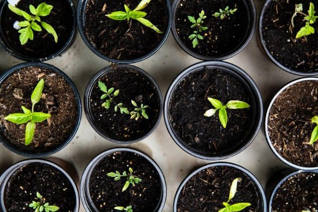

# Project Catalyst – the first winning proposals
### **The community has spoken and 11 projects will receive funding to advance the Cardano ecosystem**
 12 January 2021[ Dor Garbash](tmp//en/blog/authors/dor-garbash/page-1/) 4 mins read

### [**Dor Garbash**](tmp//en/blog/authors/dor-garbash/page-1/)
Head of Product

Commercial

- 
- 
- 

Project Catalyst is an ongoing experiment in exploring decentralized innovation and collaboration at its highest level. As the first stage in the Voltaire roadmap, it challenges participants to pool their ingenuity, creativity and passion to identify ground-breaking projects that support Cardano’s growth. 

Project Catalyst là một thử nghiệm đang diễn ra trong việc khám phá sự đổi mới và hợp tác phi tập trung ở cấp độ cao nhất.
Là giai đoạn đầu tiên trong lộ trình Voltaire, nó thách thức những người tham gia tập hợp sự khéo léo, sáng tạo và đam mê của họ để xác định các dự án đột phá hỗ trợ sự phát triển của Cardano.

Fund2 was the first time that Project Catalyst participants pitched, debated, refined, and voted on proposals using real ada. This was aimed at enhancing and bringing new value to Cardano. We challenged Fund2 participants to come up with ways to encourage Cardano ecosystem development in the next six months. With an available initial ada fund worth $250,000, we are able to fund 11 proposals.

Fund2 là lần đầu tiên những người tham gia Project Catalyst đưa ra, tranh luận, tinh tế và bỏ phiếu về các đề xuất sử dụng ADA thực.
Điều này nhằm mục đích nâng cao và mang lại giá trị mới cho Cardano.
Chúng tôi đã thách thức những người tham gia Fund2 đưa ra cách để khuyến khích sự phát triển hệ sinh thái Cardano trong sáu tháng tới.
Với một quỹ ADA ban đầu có sẵn trị giá 250.000 đô la, chúng tôi có thể tài trợ cho 11 đề xuất.

Today, we are thrilled to announce the funded proposals in Fund2.

Ngày nay, chúng tôi rất vui mừng được thông báo các đề xuất được tài trợ trong Fund2.

**PoolTool platform upgrade:** Opening avenues to build businesses and applications on Cardano that differentiate between stake pool operators by offering additional products. This upgrade is aimed at increasing infrastructure diversity across Cardano.

** Nâng cấp nền tảng pooltool: ** Mở đại lộ để xây dựng các doanh nghiệp và ứng dụng trên Cardano phân biệt giữa các nhà khai thác nhóm cổ phần bằng cách cung cấp các sản phẩm bổ sung.
Nâng cấp này nhằm mục đích tăng đa dạng cơ sở hạ tầng trên Cardano.

**Ouroboros over RINA:** Deploying a proof of concept stake pool and relay solution of Ouroboros over RINA using Ethernet/WDM at two sites in Tokyo, Japan. 

** Ouroboros trên Rina: ** Triển khai bằng chứng về nhóm cổ phần khái niệm và giải pháp chuyển tiếp của ouroboros trên Rina bằng Ethernet/WDM tại hai địa điểm ở Tokyo, Nhật Bản.

**Haskell/Plutus/Marlowe education:** Creating educational content that conveys complex information in a structured way, supplemented with examples that inspire ideas. This proposal makes it easier for new developers and entrepreneurs.

** Giáo dục Haskell/Plutus/Marlowe: ** Tạo nội dung giáo dục truyền tải thông tin phức tạp theo cách có cấu trúc, được bổ sung các ví dụ truyền cảm hứng cho các ý tưởng.
Đề xuất này giúp các nhà phát triển và doanh nhân mới dễ dàng hơn.

**Create a message-signing standard:** Generating a message-signing standard to prove reserves, identity, and stake pool delegation. 

** Tạo một tiêu chuẩn ký tin nhắn: ** Tạo một tiêu chuẩn ký tin nhắn để chứng minh dự trữ, danh tính và phái đoàn cổ phần.

**Liqwid: Cardano lending markets for decentralized finance:** Creating an open-source, non-custodial liquidity protocol to earn interest on deposits and borrow assets on Cardano.

** LIQWID: Thị trường cho vay Cardano cho tài chính phi tập trung: ** Tạo một giao thức thanh khoản không có nguồn gốc, không bị giam giữ để kiếm lãi cho tiền gửi và vay tài sản trên Cardano.

**Cardano for mobile DApp developers:** Turning mobile platforms into the first-class citizens of the DApp world with mobile SDKs, mobile-first DApp experience and app store compatibility. 

** Cardano cho các nhà phát triển DAPP di động: ** Biến nền tảng di động thành các công dân hạng nhất của thế giới DAPP với SDK di động, trải nghiệm DAPP đầu tiên trên thiết bị di động và khả năng tương thích của App Store.

**GimbaLabs – starter kits and tools:** GimbaLabs is a startup platform providing free and open source APIs, lessons, and project-based learning resources to help people bring their ideas to life on Cardano and so drive adoption of the blockchain.

** Gimbalabs-Bộ dụng cụ và công cụ khởi động: ** Gimbalabs là một nền tảng khởi nghiệp cung cấp các API nguồn mở, bài học và tài nguyên học tập dựa trên dự án để giúp mọi người đưa ý tưởng của họ vào cuộc sống của họ trên Cardano và do đó thúc đẩy việc áp dụng blockchain.

**Lovelace Academy for Marlowe and Plutus:** Establishing an online academy to attract, inspire and educate individuals and companies to create applications on Cardano's smart contract and native assets platform. 

** Học viện Lovelace cho Marlowe và Plutus: ** Thành lập một học viện trực tuyến để thu hút, truyền cảm hứng và giáo dục các cá nhân và công ty để tạo ra các ứng dụng trên nền tảng hợp đồng thông minh và tài sản bản địa của Cardano.

**Sign Tx Arduino:** Starting a library for code written in the C programming language that is compatible with the Arduino development environment.  Sign local Cardano transactions in advance of smart contracts being available to  enable applications for the internet of things (IoT). 

** Ký tên TX Arduino: ** Bắt đầu một thư viện cho mã được viết bằng ngôn ngữ lập trình C tương thích với môi trường phát triển Arduino.
Ký các giao dịch Cardano địa phương trước các hợp đồng thông minh có sẵn để cho phép các ứng dụng cho Internet of Things (IoT).

**Pet Registry DApp with ₳Pay:** Helping developers accept ada payments on websites. The Pet Registry DApp, built on ₳Pay, will service a global audience in a cheaper, better way. Devs are inspired by successful apps and the tools needed to build them, By creating both, we can inspire and accelerate devs and their solutions.

** PET Registry DAPP với ₳ Thanh toán: ** Giúp các nhà phát triển chấp nhận thanh toán ADA trên các trang web.
DAPP đăng ký thú cưng, được xây dựng trên ₳ pay, sẽ phục vụ khán giả toàn cầu một cách rẻ hơn, tốt hơn.
Các nhà phát triển được lấy cảm hứng từ các ứng dụng thành công và các công cụ cần thiết để xây dựng chúng, bằng cách tạo ra cả hai, chúng ta có thể truyền cảm hứng và tăng tốc các nhà phát triển và các giải pháp của chúng.

**Japan Cardano Governance Association: Meetings & Communities & Podcasts:** supporting online/offline meetups, governance podcasts etc. for our Japanese community.

** Hiệp hội quản trị Cardano Nhật Bản: Các cuộc họp & cộng đồng & podcast: ** Hỗ trợ các cuộc họp trực tuyến/ngoại tuyến, podcast quản trị, vv cho cộng đồng Nhật Bản của chúng tôi.

On behalf of the Project Catalyst team, we want to congratulate [all of these exciting projects](https://static.iohk.io/docs/catalyst/catalyst-voting-results-fund2.pdf). Each funded team will receive their ada by the end of January so they can begin bringing their ideas to life. We are looking forward to seeing the impact of these projects on the Cardano ecosystem. 

Thay mặt cho nhóm Catalyst Project, chúng tôi muốn chúc mừng [tất cả các dự án thú vị này] (https://static.iohk.io/docs/catalyst/catalyst-voting-results-fund2.pdf).
Mỗi nhóm được tài trợ sẽ nhận được ADA của họ vào cuối tháng 1 để họ có thể bắt đầu đưa ý tưởng của họ vào cuộc sống.
Chúng tôi rất mong được thấy tác động của các dự án này đối với hệ sinh thái Cardano.

We also want to extend our congratulations and gratitude to everyone else who participated in Fund2. Our proposers, community advisers, collaborators and voters all had a hand in making Fund2 a success. Project Catalyst is all about putting the community in command of Cardano and you have demonstrated that the future of our ecosystem is in very good hands. 

Chúng tôi cũng muốn gửi lời chúc mừng và lòng biết ơn của chúng tôi đến những người khác đã tham gia Fund2.
Những người đề xuất, cố vấn cộng đồng, cộng tác viên và cử tri của chúng tôi đều đã giúp Fund2 thành công.
Project Catalyst là tất cả về việc đưa cộng đồng vào chỉ huy của Cardano và bạn đã chứng minh rằng tương lai của hệ sinh thái của chúng ta nằm trong tay rất tốt.

Although 11 ideas have been funded this time, a number of strong contenders met the community voting threshold but missed out on funding this time. In the linked PDF, those projects highlighted in green have secured community funding. Those in yellow were approved for funding by the community, but the treasury did not have enough funding to support their proposals. We’ll be encouraging these proposers to resubmit their ideas for the just-launched Fund3 where relevant (with its focus on the DApp ecosystem) and we hope to see the best of these funded by the community next time.

Mặc dù 11 ý tưởng đã được tài trợ lần này, một số ứng cử viên mạnh mẽ đã đáp ứng ngưỡng bỏ phiếu của cộng đồng nhưng đã bỏ lỡ tài trợ lần này.
Trong PDF được liên kết, những dự án được nhấn mạnh trong Green đã bảo đảm tài trợ cho cộng đồng.
Những người có màu vàng đã được cộng đồng chấp thuận tài trợ, nhưng Kho bạc không có đủ tài trợ để hỗ trợ các đề xuất của họ.
Chúng tôi sẽ khuyến khích những người đề xuất này gửi lại ý tưởng của họ cho Fund3 vừa mới ra mắt, nơi có liên quan (tập trung vào hệ sinh thái DAPP) và chúng tôi hy vọng sẽ thấy những điều tốt nhất trong số này được cộng đồng tài trợ vào lần tới.

We have [bold and ambitious plans](https://youtu.be/GjPhxXDFv58?t=128) for Project Catalyst in 2021, with ada worth millions of dollars being made available to fund innovation on Cardano. Submission for proposals for Fund3 will open tomorrow, don’t miss out on the opportunity to make your voice heard.

Chúng tôi có [các kế hoạch táo bạo và đầy tham vọng] (https://youtu.be/gjphxxdfv58?t=128) cho chất xúc tác dự án vào năm 2021, với ADA trị giá hàng triệu đô la được cung cấp để tài trợ cho sự đổi mới trên Cardano.
Đệ trình cho các đề xuất cho Fund3 sẽ mở cửa vào ngày mai, đừng bỏ lỡ cơ hội để làm cho giọng nói của bạn được lắng nghe.

*If you’d like to join the Project Catalyst community as a proposer, community adviser, implementer or voter, please join us on [Ideascale](https://cardano.ideascale.com/a/index) and start innovating alongside our global network of participants. Sign up to the [Telegram](https://t.me/cardanocatalyst) announcement channel for the latest news.* 

*Nếu bạn muốn tham gia cộng đồng Project Catalyst với tư cách là người đề xuất, cố vấn cộng đồng, người thực hiện hoặc cử tri, vui lòng tham gia với chúng tôi trên [IdeasCale] (https://cardano.ideascale.com/a/index) và bắt đầu đổi mới bên cạnh chúng tôi
Mạng lưới toàn cầu của những người tham gia.
Đăng ký vào kênh thông báo [Telegram] (https://t.me/cardanocatalyst) cho tin tức mới nhất.*

