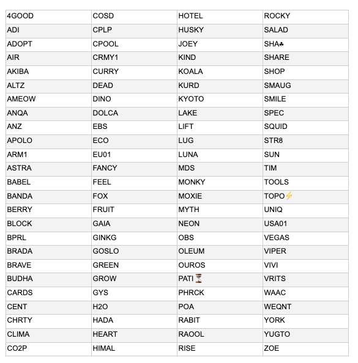

# Our new delegation strategy – announcing the pools we’re supporting
### **We are committed to a vibrant pool ecosystem and we’re supporting that by delegating to 100 community pools**
 22 January 2021[ Tim Harrison](tmp//en/blog/authors/tim-harrison/page-1/) 7 mins read

### [**Tim Harrison**](tmp//en/blog/authors/tim-harrison/page-1/)
VP of Community & Ecosystem

Communications

- 
- 
- 
- 

The Cardano stake pool community powers the Cardano network; the health and vitality of this critical operator ecosystem is essential to the effective running of the protocol. And as we continue to evolve Cardano’s utility through Goguen, this will become ever more important. Staking with quality pools is the very best way to give back to the Cardano community. 

Cộng đồng Cardano Stake Pool cung cấp năng lượng cho mạng Cardano;
Sức khỏe và sức sống của hệ sinh thái vận hành quan trọng này là điều cần thiết để chạy hiệu quả của giao thức.
Và khi chúng tôi tiếp tục phát triển tiện ích Cardano, thông qua Goguen, điều này sẽ trở nên quan trọng hơn bao giờ hết.
Cổ phần với các nhóm chất lượng là cách tốt nhất để trả lại cho cộng đồng Cardano.

Like any ecosystem, success comes from the balancing of interests, dissemination of power, and the variety and diversity of actors. And like an economy, a balance of commercial influence; bigger players, smaller players offering greater diversity and a healthy core in between. 

Giống như bất kỳ hệ sinh thái nào, thành công đến từ sự cân bằng của lợi ích, phổ biến quyền lực, và sự đa dạng và đa dạng của các diễn viên.
Và giống như một nền kinh tế, một sự cân bằng của ảnh hưởng thương mại;
Những người chơi lớn hơn, những người chơi nhỏ hơn cung cấp sự đa dạng hơn và cốt lõi lành mạnh ở giữa.

As much as ‘code is law’ (and features the judiciary?) we can all recognize the inputs, outputs, human behaviours and social dynamics that shape the community which surrounds and supports any blockchain protocol.

Nhiều như ‘mã là luật pháp (và có tính năng tư pháp?) Tất cả chúng ta đều có thể nhận ra đầu vào, đầu ra, hành vi của con người và động lực xã hội hình thành nên cộng đồng xung quanh và hỗ trợ bất kỳ giao thức blockchain nào.

So as part of our continuing commitment to healthy ecosystem growth, we recently outlined [our new strategy](https://iohk.io/en/blog/posts/2020/11/24/delegating-with-fresh-purpose/) for delegating IOG’s ada funds. We instigated this delegation strategy to support our long-term vision for Cardano’s growth and evolution and reaffirm the values we espouse. All in line with following a fiscally sound path which can maintain the commercial viability of our organization. 

Vì vậy, là một phần trong cam kết tiếp tục của chúng tôi đối với sự tăng trưởng hệ sinh thái lành mạnh, gần đây chúng tôi đã phác thảo [chiến lược mới của chúng tôi] (https://iohk.io/en/blog/posts/2020/11/24/delegating-with-fresh-purpose/)
để ủy thác các quỹ ADA của IOG.
Chúng tôi đã xúi giục chiến lược phái đoàn này để hỗ trợ tầm nhìn dài hạn của chúng tôi về sự phát triển và tiến hóa của Cardano, và khẳng định lại các giá trị mà chúng tôi tán thành.
Tất cả đều phù hợp với một con đường âm thanh có thể duy trì khả năng thương mại của tổ chức chúng tôi.

### **A positive response**

### ** Một phản ứng tích cực **

We put out the call for delegation in December. Our community responded very positively, and by the time we closed for entries just before the Christmas break, we had received just under 300 (299 in fact) applications for delegation. We have since retired all but one of our public pools – their creation was always an entirely tactical activity – and we’re now shifting toward our longer term strategic intent.

Chúng tôi đưa ra lời kêu gọi phái đoàn vào tháng 12.
Cộng đồng của chúng tôi đã trả lời rất tích cực và vào thời điểm chúng tôi đóng cho các mục ngay trước kỳ nghỉ Giáng sinh, chúng tôi đã nhận được dưới 300 (thực tế) các ứng dụng cho phái đoàn.
Chúng tôi đã nghỉ hưu tất cả trừ một trong những nhóm công cộng của chúng tôi - sáng tạo của họ luôn là một hoạt động hoàn toàn chiến thuật - và chúng tôi hiện đang chuyển sang mục đích chiến lược dài hạn của mình.

### **The process**

### **Quá trình**

Over the past two weeks, we have reviewed all entries from our call for delegation. The process has been relatively complex. We have tried to identify a cross section of pools based on a number of factors, all important on their own merit. Viewed holistically, these factors provide an invaluable map of the SPO environment. Among the key factors (and within them, variables) that we took into account were:

Trong hai tuần qua, chúng tôi đã xem xét tất cả các mục từ lời kêu gọi của chúng tôi.
Quá trình này đã tương đối phức tạp.
Chúng tôi đã cố gắng xác định một mặt cắt ngang của các nhóm dựa trên một số yếu tố, tất cả đều quan trọng về giá trị của chính họ.
Nhìn toàn diện, các yếu tố này cung cấp một bản đồ vô giá của môi trường SPO.
Trong số các yếu tố chính (và trong đó, các biến) mà chúng tôi đã tính đến là:

**Purpose** – is this a purely commercial venture, or is it doing something to give back or pay forward to the community or the wider world (content, education, support for the disadvantaged, sustainable practice, donations to charity, etc. )

** Mục đích ** - Đây có phải là một liên doanh thương mại thuần túy, hay nó đang làm một cái gì đó để trả lại hoặc trả tiền cho cộng đồng hoặc thế giới rộng lớn hơn (nội dung, giáo dục, hỗ trợ cho việc thực hành bền vững, bền vững, quyên góp cho tổ chức từ thiện, v.v.
)

**Geography** – are they an active and committed player in an under-represented region? 

** Địa lý **-Họ có phải là một người chơi tích cực và cam kết trong một khu vực được đại diện không?

**Technical contribution** – is the SPO running a best-in-class technical operation or building (tools, applications etc.) on Cardano? Have they been a contributor since the ITN – or longer?

** Đóng góp kỹ thuật **-SPO có đang chạy một hoạt động hoặc xây dựng kỹ thuật tốt nhất (công cụ, ứng dụng, v.v.) trên Cardano không?
Họ đã là người đóng góp kể từ ITN - hay lâu hơn?

**Stake and pledge ratio** – what is the ratio here? Is the amount of pledge ‘reasonable’ given their stake, or does this SPOs ‘commitment to the network’ –through pledge – suggest they ‘deserve’ a higher level of delegation from the community?

** Tỷ lệ Stake và Cam kết ** - Tỷ lệ ở đây là bao nhiêu?
Là số lượng cam kết ’hợp lý, có cổ phần của họ, hay sự cam kết của Spos này đối với mạng lưới cam kết của mạng - đề nghị họ xứng đáng với một mức độ ủy quyền cao hơn từ cộng đồng?

**Community engagement** – are they an active member of the SPO community? Are they adding value through positive role-modelling on social, or supporting other community members via contributing to guilds/alliances etc. Are they helping drive visibility and adoption in an ethical, sustainable way?

** Tham gia cộng đồng ** - Họ có phải là thành viên tích cực của cộng đồng SPO không?
Có phải họ đang thêm giá trị thông qua mô hình vai trò tích cực trên xã hội, hoặc hỗ trợ các thành viên khác trong cộng đồng thông qua việc đóng góp cho các bang hội/liên minh, v.v. Họ có giúp thúc đẩy khả năng hiển thị và áp dụng theo cách đạo đức, bền vững không?

The selection process has been challenging, iterative, illuminating and inspiring. 

Quá trình lựa chọn đã được thách thức, lặp đi lặp lại, chiếu sáng và truyền cảm hứng.

*Challenging* because we have not been able to delegate to every pool we might have liked to – our SPO community is hugely talented and not everyone got a delegation in this first cohort. While we applied some basic filters to narrow down the field from 299, we still had a long list of probably 75% of that number. So we had to look at factors more holistically; this was not a yes/no choice. Kudos, by the way, to [pooltool.io](https://pooltool.io/) and [adapools](https://adapools.org/) for providing additional data sources during the process.

* Thử thách* Bởi vì chúng tôi không thể ủy thác cho mọi nhóm mà chúng tôi có thể thích - cộng đồng SPO của chúng tôi rất tài năng và không phải ai cũng có một phái đoàn trong đoàn hệ đầu tiên này.
Mặc dù chúng tôi đã áp dụng một số bộ lọc cơ bản để thu hẹp trường từ 299, chúng tôi vẫn có một danh sách dài có lẽ 75% số lượng đó.
Vì vậy, chúng tôi đã phải xem xét các yếu tố toàn diện hơn;
Đây không phải là một sự lựa chọn có/không.
Nhân tiện, kudos đến [pooltool.io] (https://pooltool.io/) và [adapools] (https://adapools.org/) để cung cấp thêm các nguồn dữ liệu trong quá trình.

As our first-ever program, we had always regarded this as a ‘pilot’ we would evolve iteratively. Initially, we planned to classify pools separately. Pools centered on purpose or mission-driven objectives vs. those focused on more technocratic factors. For a start, we were surprised at the number of mission driven pools within the ecosystem. Given our broader mission as a community, perhaps this shouldn't have been a surprise. However, once we dug into the data, it became clear that many pools were hard to classify, adding value in a number of ways; purpose, technical contribution, geographic spread, community contribution. The very best pools here set the standard for all.

Là chương trình đầu tiên của chúng tôi, chúng tôi luôn coi đây là một ‘phi công, chúng tôi sẽ phát triển một cách lặp đi lặp lại.
Ban đầu, chúng tôi đã lên kế hoạch phân loại các nhóm riêng biệt.
Các nhóm tập trung vào mục đích hoặc các mục tiêu dựa trên nhiệm vụ so với những người tập trung vào các yếu tố công nghệ hơn.
Để bắt đầu, chúng tôi đã rất ngạc nhiên về số lượng các nhóm điều khiển nhiệm vụ trong hệ sinh thái.
Với nhiệm vụ rộng lớn hơn của chúng tôi như một cộng đồng, có lẽ điều này không phải là một bất ngờ.
Tuy nhiên, một khi chúng tôi đào sâu vào dữ liệu, rõ ràng là nhiều nhóm khó phân loại, thêm giá trị theo một số cách;
Mục đích, đóng góp kỹ thuật, lan truyền địa lý, đóng góp cộng đồng.
Các hồ bơi tốt nhất ở đây đặt tiêu chuẩn cho tất cả.

### **Choosing pools**

### ** Chọn hồ bơi **

The selection process was illuminating due to the richness of the data set, which reflected the diversity and breadth of our community. We gained some powerful insights. So much so, in fact, that we plan to anonymize the data set and share a subset with the community a little further down the line, both to identify elements we need to iterate, and to provide a snapshot of community growth and evolution over time. Think of it as a quarterly ‘census’ of the SPO community. 

Quá trình lựa chọn được chiếu sáng do sự phong phú của bộ dữ liệu, điều này phản ánh sự đa dạng và bề rộng của cộng đồng chúng tôi.
Chúng tôi đã đạt được một số hiểu biết mạnh mẽ.
Trên thực tế, chúng tôi có kế hoạch ẩn danh tập dữ liệu và chia sẻ một tập hợp con với cộng đồng xa hơn một chút, cả hai để xác định các yếu tố chúng tôi cần lặp lại và cung cấp một ảnh chụp nhanh về sự phát triển và tiến hóa của cộng đồng theo thời gian
.
Hãy nghĩ về nó như một cuộc điều tra dân số hàng quý của cộng đồng SPO.

That same richness has been truly inspiring – SPOs in dozens of countries, across every continent (except Antarctica… hmm… now there’s a challenge for someone to take up!). Tangible evidence of a young, but fast-maturing community committed to excellence, collaboration, and making a positive difference in the world. All through Cardano.

Sự phong phú tương tự đó đã thực sự truyền cảm hứng - Spos ở hàng chục quốc gia, trên khắp các châu lục (ngoại trừ Nam Cực Hmm, bây giờ có một thách thức cho ai đó tham gia!).
Bằng chứng hữu hình của một cộng đồng trẻ, nhưng có ý thức nhanh đã cam kết xuất sắc, hợp tác và tạo ra sự khác biệt tích cực trên thế giới.
Tất cả thông qua Cardano.

So let’s meet the pools we have selected: 

Vì vậy, hãy để gặp gỡ các nhóm chúng tôi đã chọn:

Congratulations to our very first 100-strong pool cohort. We’ll start delegating to our selected pools from the end of January/early February (based on operational considerations), staking IOG funds of 3.2M ada per pool to support block production. Each quarter through 2021, we shall recruit a fresh cohort and update this list accordingly.

Xin chúc mừng đoàn hệ bể bơi 100 đầu tiên của chúng tôi.
Chúng tôi sẽ bắt đầu ủy thác cho các nhóm được chọn từ cuối tháng 1/đầu tháng 2 (dựa trên các cân nhắc hoạt động), đặt quỹ IOG là 3,2M ADA mỗi nhóm để hỗ trợ sản xuất khối.
Mỗi quý đến năm 2021, chúng tôi sẽ tuyển dụng một đoàn hệ mới và cập nhật danh sách này cho phù hợp.

We want to make our approach as visible as possible. We have created a dedicated Twitter list, so you can follow our first cohort. And while we have no formal guidelines, we see these delegations as bootstrapping; pools should continue doing what they do within the community and look to organically grow their delegate base, while we delegate to them.

Chúng tôi muốn làm cho cách tiếp cận của chúng tôi có thể nhìn thấy nhất có thể.
Chúng tôi đã tạo ra một danh sách Twitter chuyên dụng, vì vậy bạn có thể theo dõi đoàn hệ đầu tiên của chúng tôi.
Và trong khi chúng tôi không có hướng dẫn chính thức, chúng tôi thấy các phái đoàn này là bootstrapping;
Các hồ bơi nên tiếp tục làm những gì họ làm trong cộng đồng và tìm cách phát triển cơ sở đại biểu của họ, trong khi chúng tôi ủy thác cho họ.

To check out some of these pools, visit [pooltool.io](https://pooltool.io/) or [adapools](https://adapools.org/delegations/input-output?test) and search on each ticker. You will also shortly be able to filter by dedicated lists. Additionally, we’ll also be introducing some of them here on the blog and to our monthly show over the weeks and months ahead.

Để kiểm tra một số nhóm này, hãy truy cập [pooltool.io] (https://pooltool.io/) hoặc [adapools] (https://adapools.org/delegation
.
Bạn cũng sẽ sớm có thể lọc theo danh sách chuyên dụng.
Ngoài ra, chúng tôi cũng sẽ giới thiệu một số trong số họ ở đây trên blog và chương trình hàng tháng của chúng tôi trong các tuần và tháng tới.

### **Looking ahead**

### ** Nhìn về phía trước **

If you were not selected this time, take heart. We had many more pools than we could delegate to this time. We encourage all pools that missed out to apply again for the fresh cohort in Q2; we’ll make a new call for applications at the end of March and rotate delegations at the end of April. 

Nếu bạn không được chọn lần này, hãy lấy lòng.
Chúng tôi đã có nhiều hồ bơi hơn chúng tôi có thể ủy thác cho đến thời điểm này.
Chúng tôi khuyến khích tất cả các hồ bơi đã bỏ lỡ để áp dụng lại cho đoàn hệ mới trong quý 2;
Chúng tôi sẽ thực hiện một cuộc gọi mới cho các ứng dụng vào cuối tháng 3 và xoay các phái đoàn vào cuối tháng Tư.

*Every* pool will need to reapply. However, we shall simplify the process for pools that missed out this time. It is also important to note that as the ecosystem grows, we are seeing some strong community contributors emerge who did ***not*** apply for delegation. We also welcome community feedback on how we can continue to grow and evolve the process.

* Mỗi* Pool sẽ cần phải áp dụng lại.
Tuy nhiên, chúng tôi sẽ đơn giản hóa quy trình cho các nhóm đã bỏ lỡ lần này.
Cũng cần lưu ý rằng khi hệ sinh thái phát triển, chúng ta đang chứng kiến một số người đóng góp cộng đồng mạnh mẽ xuất hiện, những người đã làm *** không áp dụng cho phái đoàn.
Chúng tôi cũng hoan nghênh phản hồi của cộng đồng về cách chúng tôi có thể tiếp tục phát triển và phát triển quá trình.

Please check out the program and if you want some support bootstrapping your pool operation (or providing ‘block security’ while you grow your organic delegate base) don't miss out next time. 

Vui lòng kiểm tra chương trình và nếu bạn muốn một số hỗ trợ bootstrapping hoạt động của bạn (hoặc cung cấp bảo mật khối trong khi bạn phát triển cơ sở đại biểu hữu cơ của mình) đừng bỏ lỡ lần sau.

We are delighted to see many pools grow from strength to strength. Equally, when a smaller pool calls out that they are stalling, we must listen. Alongside this program, your choice as a delegator is key to supporting a pool ecosystem of abundance and generosity. Because there lies growth and the community we all desire. This is what we do. As the leading crypto community, it is something we should all be very proud of. 

Chúng tôi rất vui mừng khi thấy nhiều hồ bơi phát triển từ sức mạnh đến sức mạnh.
Một cách công bằng, khi một hồ bơi nhỏ hơn gọi rằng họ đang bị đình trệ, chúng ta phải lắng nghe.
Bên cạnh chương trình này, sự lựa chọn của bạn với tư cách là ủy viên là chìa khóa để hỗ trợ một hệ sinh thái nhóm có sự phong phú và hào phóng.
Bởi vì có sự tăng trưởng và cộng đồng mà tất cả chúng ta đều mong muốn.
Đây là những gì chúng ta làm.
Là cộng đồng tiền điện tử hàng đầu, đó là điều mà tất cả chúng ta nên rất tự hào.

IOG is committed to seeing the Cardano ecosystem grow and flourish. We will continue to play our part. And remember, as a community, we all have our parts to play.

IOG cam kết nhìn thấy hệ sinh thái Cardano phát triển và phát triển.
Chúng tôi sẽ tiếp tục chơi phần của chúng tôi.
Và hãy nhớ rằng, với tư cách là một cộng đồng, tất cả chúng ta đều có những phần của mình để chơi.

