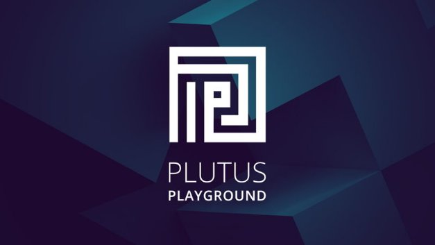

# Introducing the new Plutus Playground
### **Developers are invited to test out our improved smart contract tools before full release**
 25 January 2021[ Olga Hryniuk](tmp//en/blog/authors/olga-hryniuk/page-1/) 4 mins read

### [**Olga Hryniuk**](tmp//en/blog/authors/olga-hryniuk/page-1/)
Technical Writer

Marketing & Communications

- 
- 

Goguen is Cardano’s development theme that focuses on utility, smart contract support, and native token issuance. While delivering it as a system of interactive components, we are gradually adding all the building blocks to add smart contracts to the Cardano platform.

Goguen là chủ đề phát triển của Cardano, tập trung vào tiện ích, hỗ trợ hợp đồng thông minh và phát hành mã thông báo gốc.
Trong khi cung cấp nó dưới dạng một hệ thống các thành phần tương tác, chúng tôi đang dần thêm tất cả các khối xây dựng để thêm hợp đồng thông minh vào nền tảng Cardano.

Goguen brings native token support along with Plutus and Marlowe to help develop the smart contracts that are essential to establishing a global, decentralized financial system. To lay the groundwork, we have introduced [transaction metadata](https://iohk.io/en/blog/posts/2020/11/03/getting-to-grips-with-metadata-on-cardano/), upgraded the ledger to support [token locking](https://iohk.io/en/blog/posts/2020/12/02/goguen-brings-token-locking-to-cardano/) (which is essential for complex smart contracts), and will soon deploy [native token](https://developers.cardano.org/en/development-environments/native-tokens/native-tokens/) support for multi-assets. We are also building devnets to bring in [other developer communities](https://developers.cardano.org/).

Goguen mang đến hỗ trợ mã thông báo gốc cùng với Plutus và Marlowe để giúp phát triển các hợp đồng thông minh rất cần thiết để thiết lập một hệ thống tài chính toàn cầu, phi tập trung.
Để đặt nền tảng, chúng tôi đã giới thiệu [siêu dữ liệu giao dịch] (https://iohk.io/en/blog/posts/2020/11/03/getting-to-grips-with-metadata-on-cardano/), nâng cấp
sổ cái để hỗ trợ [khóa mã thông báo] (https://iohk.io/en/blog/posts/2020/12/02/goguen-rings-token-locking-to-cardano/) (rất cần thiết cho các hợp đồng thông minh phức tạp
) và sẽ sớm triển khai [mã thông báo gốc] (https://developers.cardano.org/en/development-environments/native-tokens/native-tokens/) hỗ trợ cho nhiều người khác.
Chúng tôi cũng đang xây dựng DevNets để mang lại [các cộng đồng nhà phát triển khác] (https://developers.cardano.org/).

Now, we have refreshed and upgraded the Plutus Playground and we are encouraging developers to contribute to its growth by testing the pre-release version.

Bây giờ, chúng tôi đã làm mới và nâng cấp Sân chơi Plutus và chúng tôi đang khuyến khích các nhà phát triển đóng góp cho sự tăng trưởng của nó bằng cách thử nghiệm phiên bản trước khi phát hành.

## **What is the Plutus Playground?**

## ** Sân chơi Plutus là gì? **

*Plutus Playground* provides an environment for writing and testing smart contracts before they are released on the Cardano blockchain. *Plutus Core*, which is the smart-contract language embedded into the ledger, is based on Haskell formal programming principles and allows developers to write high-assurance applications that interact with Cardano. Haskell was chosen as the basis for the Plutus Platform because it stands out from other programming languages for offering the ability to write more secure code. Using Haskell for smart contract deployment ensures that contracts are programmed to do exactly what they are expected to and can be tested for accuracy before implementation. 

* Plutus Playground* Cung cấp một môi trường để viết và thử nghiệm các hợp đồng thông minh trước khi chúng được phát hành trên blockchain Cardano.
*Plutus Core*, là ngôn ngữ hợp đồng thông minh được nhúng vào sổ cái, dựa trên các nguyên tắc lập trình chính thức của Haskell và cho phép các nhà phát triển viết các ứng dụng bảo hiểm cao tương tác với Cardano.
Haskell được chọn làm cơ sở cho nền tảng Plutus vì nó nổi bật so với các ngôn ngữ lập trình khác để cung cấp khả năng viết mã an toàn hơn.
Sử dụng Haskell để triển khai hợp đồng thông minh đảm bảo rằng các hợp đồng được lập trình để thực hiện chính xác những gì họ dự kiến và có thể được kiểm tra độ chính xác trước khi thực hiện.

As well as providing a web-based simulator for writing and executing smart contracts, the new Plutus Playground also allows users to access popular smart contracts that have already been written. An early version was previewed at PlutusFest in December 2018. Since then, the project has expanded considerably and this new release of Plutus Playground reflects that. 

Cùng với việc cung cấp một trình mô phỏng dựa trên web để viết và thực hiện các hợp đồng thông minh, Plutus Playground mới cũng cho phép người dùng truy cập các hợp đồng thông minh phổ biến đã được viết.
Một phiên bản ban đầu đã được xem trước tại Plutusfest vào tháng 12 năm 2018. Kể từ đó, dự án đã mở rộng đáng kể và bản phát hành mới của Plutus Playground phản ánh điều đó.

## **Who is it for?**

## ** Đó là ai để làm? **

Plutus Playground is for people creating decentralized applications (DApps), and smart contract programmers who wish to work with Cardano. Plutus will become a platform for building DApps for supply chains, track and trace, medical records, identity voting, property registration, P2P payments, and financial systems. Thus, it will serve the needs of audiences such as:

Plutus Playground dành cho những người tạo ra các ứng dụng phi tập trung (DAPP) và các lập trình viên hợp đồng thông minh muốn làm việc với Cardano.
Plutus sẽ trở thành một nền tảng để xây dựng DAPP cho chuỗi cung ứng, theo dõi và theo dõi, hồ sơ y tế, bỏ phiếu nhận dạng, đăng ký tài sản, thanh toán P2P và hệ thống tài chính.
Do đó, nó sẽ phục vụ nhu cầu của khán giả như:

- companies, large and small

- Các công ty, lớn và nhỏ

- governments

- Chính phủ

- the Cardano community and ada holders

- Cộng đồng Cardano và chủ sở hữu Ada

- entrepreneurs.

- Doanh nhân.

## **Plutus Playground features and improvements**

## ** Các tính năng và cải tiến sân chơi Sao Diêm Vương **

So, now is the time for developers to start building Plutus contracts and testing them prior to the deployment of Plutus on the Cardano mainnet later this year. Plutus Playground works through your web browser and there is no need to install software. There are tutorials on compiling and simulating smart contracts written by the Plutus team.

Vì vậy, bây giờ là thời gian để các nhà phát triển bắt đầu xây dựng các hợp đồng Plutus và thử nghiệm chúng trước khi triển khai Plutus trên Cardano Mainnet vào cuối năm nay.
Plutus Playground hoạt động thông qua trình duyệt web của bạn và không cần phải cài đặt phần mềm.
Có các hướng dẫn về biên soạn và mô phỏng các hợp đồng thông minh được viết bởi nhóm Plutus.

Improvements have been made to the backend software, reported issues have been addressed, and the interface is even better.

Những cải tiến đã được thực hiện cho phần mềm phụ trợ, các vấn đề được báo cáo đã được giải quyết và giao diện thậm chí còn tốt hơn.

Figure 1. The old Plutus Playground editor (left) compared with the new interface, which is now available

Hình 1. Trình chỉnh sửa sân chơi Plutus cũ (trái) so với giao diện mới, hiện có sẵn

As with the existing Plutus Playground, the interface is split into three sections:

Cũng như Sân chơi Plutus hiện tại, giao diện được chia thành ba phần:

- editor

- Biên tập viên

- simulation

- Mô phỏng

- transactions.

- Giao dịch.

The simulator shows how a contract will behave on the Cardano blockchain. An important aspect of this is that it can act as a training tool for people who do not have advanced developer skills because it demonstrates the working principles. Users can define and modify the wallets that interact with a contract, as well as the actions that affect the outcome. The results can then be evaluated to see what happens on the blockchain and how transactions occur.

Trình mô phỏng cho thấy hợp đồng sẽ hoạt động như thế nào trên blockchain Cardano.
Một khía cạnh quan trọng của điều này là nó có thể hoạt động như một công cụ đào tạo cho những người không có kỹ năng phát triển nâng cao vì nó thể hiện các nguyên tắc làm việc.
Người dùng có thể xác định và sửa đổi các ví tương tác với hợp đồng, cũng như các hành động ảnh hưởng đến kết quả.
Kết quả sau đó có thể được đánh giá để xem những gì xảy ra trên blockchain và cách giao dịch xảy ra.

The Plutus Playground offers a choice of keyboard setups. Developers can choose between Vim and Emacs options or stick with the default keyboard. 

Sân chơi Plutus cung cấp một sự lựa chọn của các thiết lập bàn phím.
Các nhà phát triển có thể chọn giữa các tùy chọn VIM và EMACS hoặc gắn bó với bàn phím mặc định.

We have also refreshed the look and feel with UX improvements. Finally, the simulator is more realistic in the way it runs Plutus applications, and as previously, it can be linked with GitHub accounts to save contracts and any work in progress. You can find a [full technical walkthrough here](https://youtu.be/DhRS-JvoCw8).

Chúng tôi cũng đã làm mới cái nhìn và cảm nhận với những cải tiến của UX.
Cuối cùng, trình giả lập thực tế hơn theo cách nó chạy các ứng dụng Plutus và như trước đây, nó có thể được liên kết với các tài khoản GitHub để lưu hợp đồng và bất kỳ công việc nào đang được tiến hành.
Bạn có thể tìm thấy một [hướng dẫn kỹ thuật đầy đủ ở đây] (https://youtu.be/dhrs-jvocw8).

## **How to get involved**

## **Làm thế nào để tham gia**

We are now encouraging experienced developers (and less experienced ones too!) to test Plutus Playground before the final offering. If you are interested in smart contracts and wish to get involved, we are eager to hear your feedback.

Chúng tôi hiện đang khuyến khích các nhà phát triển có kinh nghiệm (và những người ít kinh nghiệm hơn!) Để thử nghiệm Plutus Playground trước khi cung cấp cuối cùng.
Nếu bạn quan tâm đến các hợp đồng thông minh và muốn tham gia, chúng tôi rất mong muốn được nghe phản hồi của bạn.

The Playground refresh goes live today at <https://playground.plutus.iohkdev.io/>. You can join Plutus discussions at the [Cardano Forum](https://forum.cardano.org/c/developers/cardano-plutus/148) and visit the [Plutus GitHub repository](https://github.com/input-output-hk/plutus). For access to additional support and resources, register your interest by filling out [this Typeform](https://input-output.typeform.com/to/gQ0t9ep5) for us to add you to our Slack community.

Sân chơi làm mới được phát trực tiếp hôm nay tại <https://playground.plutus.iohkdev.io/>.
Bạn có thể tham gia các cuộc thảo luận của Plutus tại [Diễn đàn Cardano] (https://forum.cardano.org/c/developers/cardano-plutus/148) và truy cập vào kho lưu trữ [Plutus github] (https://github.com/input
-Output-hk/plutus).
Để truy cập vào hỗ trợ và tài nguyên bổ sung, hãy đăng ký sở thích của bạn bằng cách điền vào [Loại này] (https://input-oundput.typeform.com/to/gq0t9ep5) để chúng tôi thêm bạn vào cộng đồng Slack của chúng tôi.

