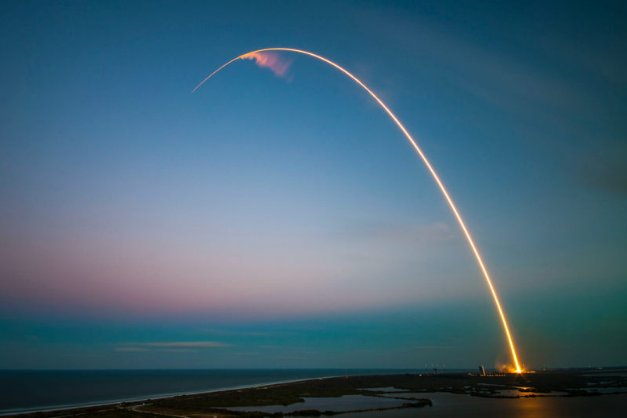

# Our million-dollar baby: Project Catalyst
### **The next Catalyst funding round will be our most accessible and ambitious round of funding yet**
 12 February 2021[ Dor Garbash](tmp//en/blog/authors/dor-garbash/page-1/) 3 mins read

### [**Dor Garbash**](tmp//en/blog/authors/dor-garbash/page-1/)
Head of Product

Commercial

- 
- 
- 

We launched Project Catalyst six months ago as a series of experiments to advance on-chain governance and accelerate community-driven innovation on Cardano. The project seeks to achieve the highest levels of community collaboration and to seed the best ideas with development funding via a community-moderated process. Community, innovation, funding, value, growth – Catalyst creates powerful synergies, and ultimately a self-sustaining engine of growth for Cardano’s future. 

Chúng tôi đã ra mắt Project Catalyst sáu tháng trước như một loạt các thí nghiệm để thúc đẩy quản trị chuỗi và tăng tốc đổi mới dựa trên cộng đồng trên Cardano.
Dự án tìm cách đạt được mức độ hợp tác cộng đồng cao nhất và tạo ra những ý tưởng tốt nhất với tài trợ phát triển thông qua quy trình được điều chỉnh cộng đồng.
Cộng đồng, Đổi mới, Tài trợ, Giá trị, Tăng trưởng-Chất xúc tác tạo ra sự hợp lực mạnh mẽ và cuối cùng là một động cơ tăng trưởng tự duy trì cho tương lai của Cardano.

Each funding round has grown in its scope, level of funding, and community engagement. We already have 7,000 members on the IdeaScale innovation platform with 1,800 active voters. Adoption is growing by 10% every week and we have only just begun. 

Mỗi vòng tài trợ đã phát triển trong phạm vi, mức độ tài trợ và sự tham gia của cộng đồng.
Chúng tôi đã có 7.000 thành viên trên nền tảng đổi mới ý tưởng với 1.800 cử tri tích cực.
Việc nhận con nuôi đang tăng 10% mỗi tuần và chúng tôi chỉ mới bắt đầu.

Fund4 will be our most accessible and ambitious round yet and our first million dollar round – that’s the size of the ada pot to fund development projects on Cardano. Proposal teams will use these funds to develop tooling, build decentralized applications, launch education and training initiatives for developers, and so much more. Every fresh contribution adds fresh value to the ecosystem. And since the community is at the core of Catalyst, 20% of treasury funds are set aside to reward and incentivize community advisers, referrers and participating voters for their contribution.

Fund4 sẽ là vòng đấu dễ tiếp cận và đầy tham vọng nhất của chúng tôi và vòng triệu đô la đầu tiên của chúng tôi - đó là quy mô của ADA Pot để tài trợ cho các dự án phát triển trên Cardano.
Các nhóm đề xuất sẽ sử dụng các quỹ này để phát triển dụng cụ, xây dựng các ứng dụng phi tập trung, khởi động các sáng kiến giáo dục và đào tạo cho các nhà phát triển, và nhiều hơn nữa.
Mỗi đóng góp mới thêm giá trị mới cho hệ sinh thái.
Và vì cộng đồng là cốt lõi của Catalyst, 20% quỹ Kho bạc được dành để thưởng và khuyến khích các cố vấn cộng đồng, người giới thiệu và cử tri tham gia vì sự đóng góp của họ.

Throughout 2021, we will continue to encourage engagement with the project across the Cardano community by making it more accessible. In Fund3, voter registration has been significantly improved. Registration is now fully integrated with the Daedalus wallet, within a new registration center. This replaces a separate user-unfriendly and time-consuming process we had to use in Fund2 for technical reasons, now addressed. For Yoroi light wallet users, a browser extension provides easy registration. Voters will then use a dedicated mobile voting app – downloadable on iOS or Android – to complete the process. In a future Daedalus release, users will ultimately be able to register *and* vote from the wallet. To participate in voting you need to meet a threshold currently set at 3,000 ada - a threshold set to help protect the voting system from malicious attacks. To get a Cardano wallet, make sure to download [Daedalus](https://daedaluswallet.io/) only from its official site or use the official [Yoroi](https://yoroi-wallet.com/#/) browser extension.

Trong suốt năm 2021, chúng tôi sẽ tiếp tục khuyến khích sự tham gia với dự án trên toàn cộng đồng Cardano bằng cách làm cho nó dễ tiếp cận hơn. Trong Fund3, đăng ký cử tri đã được cải thiện đáng kể. Đăng ký hiện được tích hợp đầy đủ với ví Daedalus, trong một trung tâm đăng ký mới. Điều này thay thế một quy trình không thân thiện với người dùng và tốn thời gian riêng biệt mà chúng tôi phải sử dụng trong Fund2 vì lý do kỹ thuật, hiện được giải quyết. Đối với người dùng ví ánh sáng Yoroi, tiện ích mở rộng trình duyệt cung cấp đăng ký dễ dàng. Sau đó, cử tri sẽ sử dụng một ứng dụng bỏ phiếu di động chuyên dụng - có thể tải xuống trên iOS hoặc Android để hoàn thành quy trình. Trong bản phát hành Daedalus trong tương lai, người dùng cuối cùng sẽ có thể đăng ký * và * bỏ phiếu từ ví. Để tham gia bỏ phiếu, bạn cần đáp ứng một ngưỡng hiện đang ở mức 3.000 ADA - một ngưỡng để giúp bảo vệ hệ thống bỏ phiếu khỏi các cuộc tấn công độc hại. Để lấy ví Cardano, hãy đảm bảo tải xuống [Daedalus] (https://daedaluswallet.io/) chỉ từ trang web chính thức của nó hoặc sử dụng trình duyệt chính thức [yoroi] (https://yoroi-wallet.com/#/) sự mở rộng.

In less than half a year, Project Catalyst has grown to become the world’s largest decentralized autonomous organization (DAO). It is a fulcrum of future development and sustainable innovation, driven by the Cardano community, for the Cardano community. This latest fund is a huge step up for the proposers, advisers, and voters collaborating already. We want to encourage everyone to become part of bringing on-chain governance to Cardano.

Trong vòng chưa đầy nửa năm, Project Catalyst đã phát triển để trở thành tổ chức tự trị phi tập trung lớn nhất thế giới (DAO).
Đó là một điểm tựa của sự phát triển trong tương lai và đổi mới bền vững, được thúc đẩy bởi cộng đồng Cardano, cho cộng đồng Cardano.
Quỹ mới nhất này là một bước tiến lớn cho các nhà đề xuất, cố vấn và cử tri đã hợp tác.
Chúng tôi muốn khuyến khích tất cả mọi người trở thành một phần của việc quản lý chuỗi cho Cardano.

*If you are an ada holder and you want to influence and contribute to the future direction for Cardano, then bring your ideas and join us at [Project Catalyst](https://cardano.ideascale.com/a/index).*

*Nếu bạn là chủ sở hữu ADA và bạn muốn ảnh hưởng và đóng góp cho hướng đi trong tương lai cho Cardano, thì hãy mang ý tưởng của bạn và tham gia với chúng tôi tại [Project Catalyst] (https://cardano.ideascale.com/a/index).*

\**Please note, due to an editing error, a previous version of this blog erroneously stated that voter registration **and** voting would be included in the forthcoming Daedalus release. Our apologies for any confusion.*

\ ** Xin lưu ý, do lỗi chỉnh sửa, phiên bản trước của blog này đã tuyên bố sai rằng đăng ký cử tri ** và ** bỏ phiếu sẽ được đưa vào bản phát hành Daedalus sắp tới.
Chúng tôi xin lỗi về bất kỳ sự nhầm lẫn nào.*

