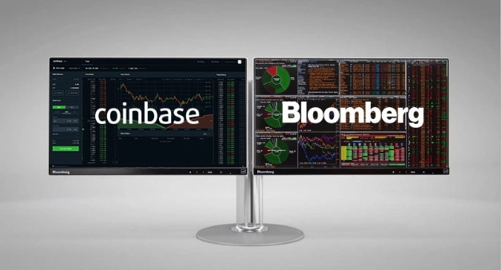

# Momentum continues as Coinbase lists ADA and Bloomberg adds Cardano
### **Cardano reaches another important milestone as financial data powerhouse Bloomberg adds Cardano to its ‘Terminal’ real-time market information platform and leading exchange Coinbase lists ADA**
 17 March 2021[ Tim Harrison](tmp//en/blog/authors/tim-harrison/page-1/) 4 mins read

### [**Tim Harrison**](tmp//en/blog/authors/tim-harrison/page-1/)
VP of Community & Ecosystem

Communications

- 
- 
- 
- 

While their impact on Roman emperor Julius Caesar was less than favorable, the [Ides of March](https://en.wikipedia.org/wiki/Ides_of_March) have proved propitious for Cardano, as ada has this week been [listed on Coinbase Pro](https://blog.coinbase.com/cardano-ada-is-launching-on-coinbase-pro-694b1cb8c778) and also [added to the prestigious Bloomberg Terminal](https://decrypt.co/61413/cardano-added-to-bloomberg-terminal). These are both major developments, reinforcing Cardano's position in the cryptocurrency landscape. One brings ada to an entirely new customer base, while the other offers a whole new level of visibility for Cardano to the global finance industry. 

Trong khi tác động của họ đối với Hoàng đế La Mã Julius Caesar không thuận lợi, [Ides of March] (https://en.wikipedia.org/wiki/ides_of_march) đã chứng minh cho Cardano, vì ADA đã được liệt kê trong tuần này
Pro] (https://blog.coinbase.com/cardano-ada-is-launching-on-coinbase-pro-694b1cb8c778) và cũng [thêm vào thiết bị đầu cuối Bloomberg uy tín] (https://decrypt.co/6141/
Cardano-tăng-bloomberg-terminal).
Đây là cả hai phát triển chính, củng cố vị trí của Cardano trong bối cảnh tiền điện tử.
Một người đưa ADA đến một cơ sở khách hàng hoàn toàn mới, trong khi cái còn lại cung cấp một mức độ hiển thị hoàn toàn mới cho Cardano cho ngành tài chính toàn cầu.

## **Coinbase – coming of age?**

## ** Coinbase - Đến tuổi? **

The Coinbase listing marks something of a coming of age for Cardano, with the potential to bring millions of new ada holders to the ecosystem at an exciting time. [Coinbase Pro](https://pro.coinbase.com/) is designed for individual traders, providing direct access to Coinbase Markets, the company’s ‘single source of liquidity’, as an upgrade path for consumer Coinbase customers.

Danh sách Coinbase đánh dấu một cái gì đó sắp tới của Cardano, với tiềm năng đưa hàng triệu người nắm giữ ADA mới vào hệ sinh thái vào thời điểm thú vị.
.

From the early success of the incentivized testnet in 2019, to the introduction of staking last summer, the momentum has been steadily building for Cardano. Now, as we continue our Goguen rollout, decentralization continues apace, with full responsibility for block production being assigned to stake pools at the end of this month, on [D=0 day](https://iohk.io/en/blog/posts/2021/03/04/not-long-till-d-0-day/). Arguably 100x times more decentralized than the Bitcoin blockchain and, with 2,000+ registered stake pools, we can lay claim to being the most successful, most distributed Proof of Stake network in the world.

Từ sự thành công ban đầu của Testnet được khuyến khích vào năm 2019, đến việc giới thiệu đặt cược vào mùa hè năm ngoái, động lực đã được xây dựng đều đặn cho Cardano.
Bây giờ, khi chúng tôi tiếp tục triển khai Goguen, phân cấp tiếp tục, với trách nhiệm hoàn toàn đối với việc sản xuất khối được giao cho các nhóm cổ phần vào cuối tháng này, vào [d = 0 ngày] (https://iohk.io/en/blog
/Bài viết/2021/03/04/không dài-D-D-0-Day/).
Được cho là có thể phân cấp gấp 100 lần so với blockchain bitcoin và, với hơn 2.000 nhóm cổ phần đã đăng ký, chúng ta có thể đưa ra tuyên bố là bằng chứng thành công nhất, phân tán nhất về mạng cổ phần trên thế giới.

The timing is good. After years of research and development effort, the wider industry is now starting to properly recognize the potential that the incredible Cardano community has long believed in. Our network of stake pool operators has helped us create a blockchain that is provably secure, environmentally sustainable and scalable to the needs of a new generation of services.

Thời gian là tốt.
Sau nhiều năm nỗ lực nghiên cứu và phát triển, ngành công nghiệp rộng lớn hơn hiện đang bắt đầu nhận ra chính xác tiềm năng mà cộng đồng Cardano đáng kinh ngạc từ lâu đã tin tưởng.
theo nhu cầu của một thế hệ dịch vụ mới.

The Goguen rollout is bringing a new level of utility to the platform – from metadata and native tokens, NFTs, DeFi and smart contracts. Our open innovation funding platform for development on Cardano, Project Catalyst, has already funded a number of proposals to enrich the Cardano ecosystem. Millions more dollars of funding will be made available for community innovation this year, drawn from a total Cardano treasury worth $400M+ today.

Việc giới thiệu Goguen đang mang đến một mức độ tiện ích mới cho nền tảng - từ siêu dữ liệu và mã thông báo gốc, NFTS, DEFI và hợp đồng thông minh.
Nền tảng tài trợ đổi mới mở của chúng tôi để phát triển trên Cardano, Project Catalyst, đã tài trợ cho một số đề xuất để làm phong phú thêm hệ sinh thái Cardano.
Hàng triệu đô la tài trợ sẽ được cung cấp cho đổi mới cộng đồng trong năm nay, được rút ra từ tổng số Kho bạc Cardano trị giá 400 triệu đô la ngày nay.

## **A technical achievement**

## ** Một thành tích kỹ thuật **

As well as an important driver of future growth, the listing on Coinbase has been an important technical collaboration, carried out using the open-source [Rosetta standard,](https://github.com/coinbase/rosetta-specifications) which we are championing together with Coinbase. Rosetta is now an integral part of our integration armory, for future interoperability projects. Rosetta has the ability to seamlessly interlink numerous blockchains, allowing institutions to manage multiple assets, without spending months researching the various technical implementations.

Một động lực quan trọng của sự tăng trưởng trong tương lai, danh sách trên Coinbase là một sự hợp tác kỹ thuật quan trọng, được thực hiện bằng cách sử dụng nguồn mở [Rosetta Standard,] (https://github.com/coinbase/rosetta-Specification) mà chúng tôi
đang vô địch cùng với Coinbase.
Rosetta hiện là một phần không thể thiếu trong kho vũ khí tích hợp của chúng tôi, cho các dự án tương tác trong tương lai.
Rosetta có khả năng liên kết liền mạch với nhiều blockchains, cho phép các tổ chức quản lý nhiều tài sản, mà không mất nhiều tháng để nghiên cứu các triển khai kỹ thuật khác nhau.

## **Bloomberg goes live**

## ** Bloomberg phát trực tiếp **

Also, this week we received the news that financial data powerhouse Bloomberg has added Cardano to its informational roster. Since it was launched in 1982, Bloomberg Terminal has established a reputation among the finance industry as an essential source of real-time information for markets. As the company states, it helps “the world’s business and financial decision-makers surface relevant information in an ever-expanding ocean of data – and quickly act on it.”

Ngoài ra, tuần này chúng tôi đã nhận được tin tức rằng sức mạnh dữ liệu tài chính Bloomberg đã thêm Cardano vào danh sách thông tin của mình.
Kể từ khi được ra mắt vào năm 1982, Bloomberg Terminal đã thiết lập danh tiếng trong ngành tài chính như một nguồn thông tin thời gian thực thiết yếu cho thị trường.
Như công ty tuyên bố, nó giúp các nhà sản xuất công việc tài chính và kinh doanh thế giới trên thế giới thông tin liên quan đến một đại dương dữ liệu ngày càng mở rộng-và nhanh chóng hành động theo nó.

## **So, what does this mean for Cardano & crypto**

## ** Vậy, điều này có ý nghĩa gì đối với Cardano & Crypto **

Bitcoin was [added to the Bloomberg terminal](https://www.bloomberg.com/company/press/bitcoin-now-bloomberg/) back in 2014 and Cardano now joins a number of coins added to the roster since. More recently, cryptocurrencies, and digital assets in general, have seen a resurgence in interest from Bloomberg’s customers. Bitcoin recently hit an all-time high of $60,000. Meanwhile, non-fungible tokens (NFTs) have entered the mainstream, following the recent sale of artist Beeple’s entirely digital work, [Everydays: the first 5000 days](https://www.smithsonianmag.com/smart-news/entirely-digital-artwork-just-sold-major-auction-first-time-180977039/) for $69m, just as Cardano has launched native tokens on the network.

Bitcoin đã được [thêm vào thiết bị đầu cuối Bloomberg] (https://www.bloomberg.com/company/press/bitcoin-now-boomberg/) vào năm 2014 và Cardano hiện tham gia một số đồng tiền được thêm vào danh sách kể từ đó.
Gần đây, tiền điện tử và tài sản kỹ thuật số nói chung, đã chứng kiến sự hồi sinh được quan tâm từ các khách hàng của Bloomberg.
Bitcoin gần đây đã đạt mức cao nhất mọi thời đại là 60.000 đô la.
Trong khi đó, các mã thông báo không bị nấm (NFT) đã bước vào dòng chính, sau khi bán tác phẩm hoàn toàn kỹ thuật số hoàn toàn của Artist Beeple, [mỗi ngày: 5000 ngày đầu tiên] (https://www.smithsonianmag.com/smart-news/entirely-
Digital-artwork-Just-Sing-Major-JUST-FIRST-TIME-TIME-180977039/) với giá 69 triệu đô la, giống như Cardano đã ra mắt mã thông báo gốc trên mạng.

The addition of ada to Bloomberg Terminal is the latest chapter in a year of continuing momentum and growing credibility in the eyes of the financial industry. It is important to place this news in perspective. Cardano’s mission remains clear and focused on bringing real utility and value to billions of people around the world – in particular, those currently without access to financial services and infrastructure. Our focus continues to be on delivering the enabling technology to achieve this while empowering the community which will ultimately deliver the platform’s growth. Nonetheless, it remains a validation of the work the whole community has done to get here and a powerful marker of our continuing momentum.

Việc bổ sung ADA vào Terminal Bloomberg là chương mới nhất trong một năm tiếp tục động lực và uy tín ngày càng tăng trong con mắt của ngành tài chính.
Điều quan trọng là đặt tin tức này trong quan điểm.
Nhiệm vụ của Cardano, vẫn rõ ràng và tập trung vào việc mang lại tiện ích và giá trị thực sự cho hàng tỷ người trên thế giới - đặc biệt, những người hiện không có quyền truy cập vào các dịch vụ tài chính và cơ sở hạ tầng.
Trọng tâm của chúng tôi tiếp tục là cung cấp công nghệ cho phép đạt được điều này trong khi trao quyền cho cộng đồng cuối cùng sẽ mang lại sự phát triển của nền tảng.
Tuy nhiên, nó vẫn là một sự xác nhận của công việc mà cả cộng đồng đã làm để có được ở đây và một dấu hiệu mạnh mẽ cho động lực tiếp tục của chúng tôi.

