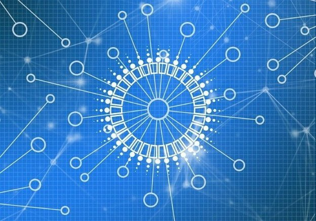

# Decentralization: to D=0 Day and beyond
### **Stake pool operators today take over block production and their role is set only to grow**
 31 March 2021[ Tim Harrison](tmp//en/blog/authors/tim-harrison/page-1/) 7 mins read

### [**Tim Harrison**](tmp//en/blog/authors/tim-harrison/page-1/)
VP of Community & Ecosystem

Communications

- 
- 
- 
- 

Today at 21:44:51 GMT, block production on Cardano will be fully decentralized. That is a watershed. From a federated network of seven core nodes run by IOHK, Emurgo, and the Cardano Foundation, we’ll emerge into a decentralized landscape where the stake pool operator (SPOs) community will produce 100% of blocks. 

Hôm nay lúc 21:44:51 GMT, việc sản xuất khối trên Cardano sẽ được phân cấp hoàn toàn.
Đó là một đầu nguồn.
Từ một mạng lưới liên kết gồm bảy nút cốt lõi do IOHK, Emurgo và Cardano Foundation điều hành, chúng tôi sẽ xuất hiện vào một cảnh quan phi tập trung nơi cộng đồng vận hành nhóm cổ phần (SPO) sẽ sản xuất 100% khối.

Cardano is a proof-of-stake blockchain platform, founded on peer-reviewed research and delivered through evidence-based software development processes, by a team of world-leading researchers and engineers. From this technocratic core, Cardano exists to steadily redistribute power to the edges – to a community of individuals. And to empower them as an enabling force for change and progress. 

Cardano là một nền tảng blockchain bằng chứng, được thành lập trên nghiên cứu được đánh giá ngang hàng và được cung cấp thông qua các quy trình phát triển phần mềm dựa trên bằng chứng, bởi một nhóm các nhà nghiên cứu và kỹ sư hàng đầu thế giới.
Từ cốt lõi kỹ thuật này, Cardano tồn tại để phân phối lại sức mạnh đều đặn cho các cạnh - cho một cộng đồng của các cá nhân.
Và để trao quyền cho họ như một lực lượng cho phép thay đổi và tiến bộ.

Our SPO community has been instrumental in bringing Cardano to this point. When *d*, the decentralization parameter, [reaches zero](https://iohk.io/en/blog/posts/2021/03/04/not-long-till-d-0-day/), SPOs will become responsible for creating all blocks on Cardano.

Cộng đồng SPO của chúng tôi đã là công cụ đưa Cardano đến điểm này.
Khi *d *, tham số phân cấp, [đạt không
Trở nên có trách nhiệm tạo ra tất cả các khối trên Cardano.

### **Why decentralization?**

### ** Tại sao phân cấp? **

In everyday terms, decentralization is the delegation of power from a central authority to a wider group of bodies. But that definition only scrapes the surface in the context of cryptocurrencies and blockchain. 

Theo thuật ngữ hàng ngày, phân cấp là phái đoàn quyền lực từ một cơ quan trung ương đến một nhóm các cơ quan rộng lớn hơn.
Nhưng định nghĩa đó chỉ cạo bề mặt trong bối cảnh tiền điện tử và blockchain.

Cardano's technical journey to full decentralization continues through phased developments that include degrees of block-production from SPOs, peer-to-peer (P2P) network discovery, and ‘gossip’ with peers exchanging information among themselves. It involves the deployment of advanced community-led governance and decision-making frameworks, culminating in fully decentralized software and protocol updates. Ultimately, it will result in the creation of a platform wholly and democratically operated and controlled through a global community of SPOs, developers and ada holders.

Hành trình kỹ thuật của Cardano để phân cấp hoàn toàn tiếp tục thông qua các phát triển theo từng giai đoạn bao gồm mức độ sản xuất khối từ các SPO, khám phá mạng ngang hàng (P2P) và "Grossipâ € ™ với các đồng nghiệp trao đổi thông tin.
Nó liên quan đến việc triển khai các khung quản trị và ra quyết định do cộng đồng tiên tiến lãnh đạo, lên đến đỉnh điểm trong các bản cập nhật phần mềm và giao thức phi tập trung hoàn toàn.
Cuối cùng, nó sẽ dẫn đến việc tạo ra một nền tảng được vận hành hoàn toàn và dân chủ và được kiểm soát thông qua một cộng đồng toàn cầu gồm các Spos, nhà phát triển và chủ sở hữu ADA.

Decentralization is a core value and driver for Cardano, and we are far from alone in this. The mainstream financial world has recognised that blockchain and the decentralized finance (DeFi) technology it enables has the potential to spawn a new financial system as revolutionary as the internet itself. And that is just part of a trend towards decentralization. Open protocols between renters and providers of data storage that anyone can use have the potential to disrupt the dominant centralized cloud server providers such as Amazon and Microsoft, and there are similar trends affecting video and communication networks and gaming. Cryptocurrencies first brought people into the blockchain world and now the buzz around [non-fungible tokens (NFTs)](https://iohk.io/en/blog/posts/2021/02/18/building-native-tokens-on-cardano-for-pleasure-and-profit/) is encouraging them to interact with blockchain in a new, fun way. These trends are introducing blockchain to the mass market.

Phân cấp là một giá trị cốt lõi và trình điều khiển cho Cardano, và chúng tôi không còn cô đơn trong việc này.
Thế giới tài chính chính thống đã công nhận rằng blockchain và công nghệ tài chính phi tập trung (DEFI) mà nó cho phép có khả năng sinh ra một hệ thống tài chính mới mang tính cách mạng như chính Internet.
Và đó chỉ là một phần của xu hướng phân cấp.
Các giao thức mở giữa người thuê và nhà cung cấp lưu trữ dữ liệu mà bất kỳ ai cũng có thể sử dụng đều có khả năng phá vỡ các nhà cung cấp máy chủ đám mây tập trung thống trị như Amazon và Microsoft, và có xu hướng tương tự ảnh hưởng đến mạng video và giao tiếp và chơi game.
Tiền điện tử lần đầu tiên đưa mọi người vào thế giới blockchain và bây giờ là tiếng vang xung quanh [mã thông báo không phải là không thể giảm
-Cardano-for-por-and-Profit/) đang khuyến khích họ tương tác với blockchain theo một cách mới, thú vị.
Những xu hướng này đang giới thiệu blockchain cho thị trường đại chúng.

### **Power to the edges**

### ** Sức mạnh cho các cạnh **

Centralization has shifted the balance of power, from the people to corporations such as Facebook and Google, creating a virtual information monopoly. Because of their unchallenged market positions, centralized authorities enjoy data hegemony over their consumers. 

Tập trung hóa đã chuyển sự cân bằng quyền lực, từ mọi người sang các tập đoàn như Facebook và Google, tạo ra sự độc quyền thông tin ảo.
Vì các vị trí thị trường không bị cản trở của họ, các cơ quan tập trung được hưởng quyền bá chủ dữ liệu đối với người tiêu dùng của họ.

Decentralization is the antidote to this concentration of power and the risks that it brings. Decentralization empowers the individual to make choices and decisions, it returns ownership of personal information to where it belongs, it pushes power to the edges and enables every participant in the network (or ada holder) to have a stake.

Phân cấp là thuốc giải độc cho nồng độ quyền lực này và những rủi ro mà nó mang lại.
Phân cấp trao quyền cho cá nhân đưa ra các lựa chọn và quyết định, nó trả lại quyền sở hữu thông tin cá nhân về nơi nó thuộc về, nó đẩy sức mạnh đến các cạnh và cho phép mọi người tham gia vào mạng (hoặc chủ sở hữu ADA) có cổ phần.

There are three pillars to Cardano's decentralization: block production, networking, and governance. These are intrinsically linked to one another, and work synergistically to create a unified outcome: full decentralization, which lies at their confluence.

Có ba trụ cột để phân cấp của Cardano: sản xuất khối, kết nối mạng và quản trị.
Chúng thực sự được liên kết với nhau, và làm việc hiệp đồng để tạo ra một kết quả thống nhất: sự phân cấp đầy đủ, nằm ở nơi hợp lưu của họ.

### **Pillar one: block production**

### ** Trụ cột một: Sản xuất khối **

Every blockchain relies on the addition of new blocks to grow and thrive. With the Byron era deployment, core nodes – managed by IOHK, Emurgo, and the Cardano Foundation – were wholly responsible for creating blocks and maintaining the network. The [advent of Shelley](https://iohk.io/en/blog/posts/2020/04/29/from-byron-to-shelley-part-one-the-testnets/) and the Incentivized Testnet in 2019 served as testing ground for decentralized block production. The results demonstrated the viability of such an initiative. In other words, the [Incentivized Testnet experiment proved](https://iohk.io/en/blog/posts/2020/02/07/shelley-incentivized-testnet-story-in-numbers/) that Cardano could be reliably sustained by a network of community-run stake pools. As of epoch 170 on June 3, 2020, there were 1,299 registered stake pools, 413 of which were creating blocks. 

Mỗi blockchain phụ thuộc vào việc bổ sung các khối mới để phát triển và phát triển mạnh.
Với việc triển khai thời đại Byron, các nút cốt lõi - được quản lý bởi IOHK, Emurgo và Cardano Foundation - hoàn toàn chịu trách nhiệm tạo ra các khối và duy trì mạng.
[Mùa Vọng của Shelley] (https://iohk.io/en/blog/posts/2020/04/29/from-byron-to-shelley-part-one-the-testnet/) và Testnet được khuyến khích vào năm 2019
phục vụ như là nơi thử nghiệm để sản xuất khối phi tập trung.
Các kết quả đã chứng minh khả năng tồn tại của một sáng kiến như vậy.
Nói cách khác, [Thử nghiệm TestNet được khuyến khích đã chứng minh] (https://iohk.io/en/blog/posts/2020/02/07/shelley
Được duy trì bởi một mạng lưới các cổ phần do cộng đồng điều hành.
Kể từ Epoch 170 vào ngày 3 tháng 6 năm 2020, có 1.299 nhóm cổ phần đã đăng ký, 413 trong số đó đang tạo ra các khối.

Today, we now have about 2,300 pools, with a healthy proportion creating blocks and rewarding delegates. Some are controlled by exchanges, others by single-pool community operators. All bring value to the network. The former through their ability to bring new ada holders into the ecosystem, the latter through their contribution to continuing decentralization and encouraging grassroots engagement. We are committed to encouraging decentralization, and adjustments this year to parameters such as [k (maximum pool size) and pledge](https://iohk.io/en/blog/posts/2021/03/04/not-long-till-d-0-day/) along with our community delegation strategy – and more on that later this week – will continue to propel this agenda forward.

Ngày nay, chúng ta hiện có khoảng 2.300 hồ bơi, với tỷ lệ lành mạnh tạo ra các khối và các đại biểu thưởng.
Một số được kiểm soát bởi các trao đổi, một số khác bởi các nhà khai thác cộng đồng một nhóm.
Tất cả mang lại giá trị cho mạng.
Cái trước thông qua khả năng đưa chủ sở hữu ADA mới vào hệ sinh thái, sau đó thông qua đóng góp của họ để tiếp tục phân cấp và khuyến khích sự tham gia của cơ sở.
Chúng tôi cam kết khuyến khích phân cấp và điều chỉnh trong năm nay đối với các tham số như [K (kích thước nhóm tối đa) và cam kết] (https://iohk.io/en/blog/posts/2021/03/04/not-long-
Till-D-0 ngày/) cùng với chiến lược phái đoàn cộng đồng của chúng tôi-và nhiều hơn nữa về điều đó vào cuối tuần này-sẽ tiếp tục thúc đẩy chương trình nghị sự này.

### **Pillar two: networking**

### ** Trụ cột hai: Mạng **

The second pillar of Cardano's decentralization is the implementation of peer-to-peer (P2P) networking, which has also been tested with Shelley. The aim here is to link together geographically distributed pools to provide a secure and robust blockchain platform.

Trụ cột thứ hai của sự phân cấp của Cardano là việc thực hiện mạng lưới ngang hàng (P2P), cũng đã được thử nghiệm với Shelley.
Mục đích ở đây là liên kết các nhóm phân phối theo địa lý để cung cấp một nền tảng blockchain an toàn và mạnh mẽ.

On mainnet, this feature will use a [set of mini-protocols](https://iohk.io/en/blog/posts/2020/07/09/cardanos-path-to-decentralization-by-marcin-szamotulski/) and a classification of cold, warm, and hot peers so a given node can make the best decision when selecting connections. From a networking perspective, we are in a hybrid phase where manual processes are required from SPOs to maintain network connections. When *d*=0, all the core nodes will be retired as SPOs take over block production. IOHK will continue to maintain relays but, increasingly, the SPO network will also take on this role. To dig deeper into this, check out this segment of [March’s Cardano360 show](https://youtu.be/mXYIQDUitYI), where Cardano chief architect Duncan Coutts laid out the P2P roadmap.

Trên Mainnet, tính năng này sẽ sử dụng [bộ protocols mini] (https://iohk.io/en/blog/posts/2020/07/09/cardanos-path-to-decentralization-by-marcin-szamotulski/
) và phân loại các đồng nghiệp lạnh, ấm và nóng để một nút nhất định có thể đưa ra quyết định tốt nhất khi chọn kết nối.
Từ góc độ kết nối mạng, chúng tôi đang ở trong giai đoạn lai trong đó các quy trình thủ công được yêu cầu từ Spo để duy trì các kết nối mạng.
Khi *d *= 0, tất cả các nút cốt lõi sẽ được nghỉ hưu khi các SPO tiếp quản sản xuất khối.
IOHK sẽ tiếp tục duy trì rơle nhưng, ngày càng nhiều, mạng SPO cũng sẽ đảm nhận vai trò này.
Để tìm hiểu sâu hơn về vấn đề này, hãy xem phân đoạn này của chương trình Cardano360 [https://youtu.be/mxyiqduityi), nơi kiến trúc sư trưởng của Cardano Duncan Coutts đã đưa ra lộ trình P2P.

### **Pillar three: governance**

### ** Trụ cột ba: Quản trị **

The Goguen roll-out has already introduced transaction metadata *and* [native tokens](https://iohk.io/en/blog/posts/2021/02/04/native-tokens-to-bring-new-utility-to-life-on-cardano/) to Cardano. Arguably, this has been the most apparent manifestation of growth and progress for Cardano since the Shelley launch. 

Việc triển khai Goguen đã giới thiệu siêu dữ liệu giao dịch * và * [mã thông báo gốc] (https://iohk.io/en/blog/posts/2021/02/04/native-tokens-to-cring-new-utility-
cuộc sống trên cardano/) cho cardano.
Có thể cho rằng, đây là biểu hiện rõ ràng nhất của sự tăng trưởng và tiến bộ cho Cardano kể từ khi Shelley ra mắt.

Yet, at the same time, we have also seen the rise of something even more powerful: an engaged community of builders, creators, and entrepreneurs within Project Catalyst. At the time of writing, the Catalyst community includes 17,000+ worldwide members. This pool of decentralized talent includes entrepreneurs, experts, and specialists across many areas, and provides a vast reservoir of ingenuity to ensure the best and brightest ideas get the funding they deserve. 

Tuy nhiên, đồng thời, chúng ta cũng đã thấy sự gia tăng của một thứ gì đó thậm chí còn mạnh mẽ hơn: một cộng đồng người xây dựng, người sáng tạo và doanh nhân tham gia trong Project Catalyst.
Tại thời điểm viết bài, cộng đồng Catalyst bao gồm hơn 17.000 thành viên trên toàn thế giới.
Nhóm tài năng phi tập trung này bao gồm các doanh nhân, chuyên gia và chuyên gia trên nhiều lĩnh vực, và cung cấp một hồ chứa sự khéo léo rộng lớn để đảm bảo những ý tưởng tốt nhất và sáng nhất có được tài trợ mà họ xứng đáng.

A layer of solid governance supports the very core of what Cardano is trying to ultimately achieve: a blockchain where a community of stakeholders makes practical decisions about the chain’s protocol and evolution. Catalyst is the precursor to [Voltaire](https://iohk.io/blog/posts/2020/09/10/project-catalyst-voltaire-bring-power-to-the-people/), the development theme that will introduce the third and final level of decentralization through the integration of governance and on-chain decision-making/voting. 

Một lớp quản trị vững chắc hỗ trợ chính cốt lõi của những gì Cardano đang cố gắng cuối cùng đạt được: một blockchain nơi một cộng đồng các bên liên quan đưa ra quyết định thực tế về giao thức và tiến hóa của chuỗi.
Chất xúc tác là tiền thân của [Voltaire] (https://iohk.io/blog/posts/2020/09/10/project-catalyst-voltaire
Giới thiệu cấp độ phân cấp thứ ba và cuối cùng thông qua việc tích hợp quản trị và ra quyết định/bỏ phiếu trên chuỗi.

Voltaire will introduce: 

Voltaire sẽ giới thiệu:

- Access to funding via a decentralized treasury (worth some $400m at the current ada price) within a governance framework where the community will have the power, through their ada stake, to influence Cardano's future direction

- Tiếp cận tài trợ thông qua Kho bạc phi tập trung (trị giá khoảng 400 triệu đô la với giá ADA hiện tại) trong khung quản trị nơi cộng đồng sẽ có quyền lực, thông qua cổ phần ADA của họ, để ảnh hưởng đến định hướng tương lai của Cardano

- Decentralized decision-making on enhancements, network improvements, and parameter updates

- Ra quyết định phi tập trung về các cải tiến, cải tiến mạng và cập nhật tham số

- Fully decentralized software updates: the process enabling decentralized, open participation for fair voting on decisions about system and protocol advancements

- Cập nhật phần mềm phi tập trung hoàn toàn

### **Conclusion: the fall of centralization**

### ** Kết luận: Sự sụp đổ của tập trung **

Decentralized block production – done. P2P networking – rolling out from April. Governance? Project Catalyst is on a roll and there is much more to come. 

Sản xuất khối phi tập trung - đã thực hiện.
Mạng P2P - Truyền ra từ tháng Tư.
Quản trị?
Project Catalyst đang trên một cuộn và có nhiều hơn nữa.

From a federated chain with centralized block production, to a chain with blocks wholly minted by the community. We are well on our way. When we have completed building all three pillars, we shall have created something truly unique. A network that is robust and resilient, yet flexible and adaptable to future growth. A platform that serves its users today, while empowering them to build fresh value and functionality for tomorrow. All within a democratic framework where the community makes the calls. True decentralization, standing atop those three pillars.

Từ một chuỗi liên kết với sản xuất khối tập trung, đến một chuỗi với các khối hoàn toàn được cộng đồng đúc.
Chúng tôi đang trên con đường của chúng tôi.
Khi chúng tôi hoàn thành việc xây dựng cả ba trụ cột, chúng tôi sẽ tạo ra một cái gì đó thực sự độc đáo.
Một mạng lưới mạnh mẽ và kiên cường, nhưng linh hoạt và thích nghi với sự phát triển trong tương lai.
Một nền tảng phục vụ người dùng của nó ngày hôm nay, đồng thời trao quyền cho họ xây dựng giá trị và chức năng mới cho ngày mai.
Tất cả trong một khuôn khổ dân chủ nơi cộng đồng thực hiện các cuộc gọi.
Phân cấp thực sự, đứng trên ba trụ cột đó.

