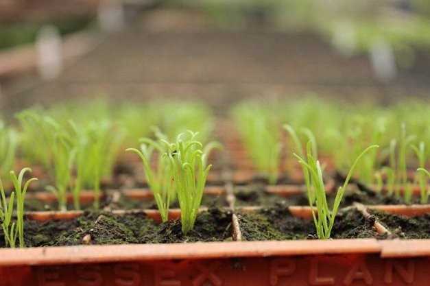

# Announcing a new round of community stake pool delegation
### **We’re using our ada to support operators running single pools helping support the Cardano network and community** 
 1 April 2021[ Ben O'Hanlon](tmp//en/blog/authors/ben-ohanlon/page-1/) 4 mins read

### [**Ben O'Hanlon**](tmp//en/blog/authors/ben-ohanlon/page-1/)
Head of Community Engagement & Insights

Marketing and Communications

- 
- 
- 
- 

As we celebrated in yesterday’s [blog about D=0 day](https://iohk.io/en/blog/posts/2021/03/31/decentralization-to-d-0-day-and-beyond/), block production is now 100% in the hands of the Cardano stake pool operator (SPO) community. Community pools are the lifeblood of the network. And earlier this year we confirmed our [commitment to a vibrant proof-of-stake (PoS) ecosystem](https://iohk.io/blog/posts/2021/01/22/our-new-delegation-strategy-announcing-the-pools-we-are-supporting/) when we delegated over 300M ada to our first cohort of community stake pools.

Như chúng tôi đã ăn mừng trong [blog về d = 0 ngày] (https://iohk.io/en/blog/posts/2021/03/31/decentralization-to-d-0-ay-and-beyond/),
Sản xuất khối hiện là 100% trong tay của cộng đồng vận hành nhóm Cardano Stake (SPO).
Các nhóm cộng đồng là nguồn sống của mạng.
Và đầu năm nay, chúng tôi đã xác nhận [cam kết của chúng tôi đối với một hệ sinh thái Proof-Of-Stake (POS) sống động] (https://iohk.io/blog/posts/2021/01/22/our-new-delegation-strargy-announcing
-The-pools-we-are-hỗ trợ/) khi chúng tôi ủy thác hơn 300m ADA cho nhóm cổ phần cộng đồng đầu tiên của chúng tôi.

The number of pools now stands at over 2,000 – responsible for nearly three-quarters of the ada in circulation. Their efforts sustain the network and greatly contribute to the success and recognition of the Ouroboros protocol, setting a clear standard for any [competing PoS protocol.](https://pageviews.toolforge.org/?project=en.wikipedia.org&platform=all-access&agent=user&redirects=0&start=2020-10-29&end=2021-03-29&pages=Cardano_\(cryptocurrency_platform\)%7CPolkadot_\(cryptocurrency\)%7CPeercoin%7CGridcoin%7CNxt%7CEOS.IO%7CTezos%7CTRON_\(cryptocurrency\))

Số lượng hồ bơi hiện ở mức hơn 2.000-chịu trách nhiệm cho gần ba phần tư của ADA đang lưu hành.
Những nỗ lực của họ duy trì mạng lưới và đóng góp rất lớn vào sự thành công và công nhận giao thức OuroBoros, thiết lập một tiêu chuẩn rõ ràng cho bất kỳ [giao thức POS cạnh tranh nào.]
All-Access & Agent = user & Redirects = 0 & start = 2020-10-29 & end = 2021-03-29 & pages = cardano _ \ (cryptocurrency_platform \)%7cpolkadot
\))

At the start of the year, we committed to making fresh delegations quarterly to help bootstrapping community pools. Running a successful small pool is hard, and needs to be entered into like any other business endeavour, with fixed and variable costs planned, hours needed to operate, reach break even point, plan marketing approach, etc. With each delegation round, our goal is to delegate enough ada to every SPO that they can create blocks, giving them a certain level of financial security while they look to grow their delegation base.

Vào đầu năm, chúng tôi cam kết thực hiện các phái đoàn mới hàng quý để giúp các nhóm cộng đồng bootstrapping.
Chạy một hồ bơi nhỏ thành công là khó khăn và cần phải được tham gia như bất kỳ nỗ lực kinh doanh nào khác, với chi phí cố định và thay đổi được lên kế hoạch, giờ cần thiết để vận hành, đạt đến điểm dừng, kế hoạch tiếp thị, v.v.
là ủy thác đủ ADA cho mọi SPO mà họ có thể tạo ra các khối, cung cấp cho họ một mức độ an ninh tài chính nhất định trong khi họ tìm cách phát triển cơ sở phái đoàn của họ.

We’re again asking every operator out there to seek delegation from IOHK’s ada funds. We’ve already done a survey of the existing pools to guide our progress, and now we want every pool to fill in our survey to apply. Besides supporting your own application, your answers will help us shape our community delegation approach based on factors such as potential impact and each stake pool’s goals.

Chúng tôi một lần nữa yêu cầu mọi nhà điều hành ngoài kia tìm kiếm phái đoàn từ các quỹ ADA của IOHK.
Chúng tôi đã thực hiện một cuộc khảo sát về các nhóm hiện có để hướng dẫn tiến trình của chúng tôi và bây giờ chúng tôi muốn mọi nhóm điền vào khảo sát của chúng tôi để áp dụng.
Bên cạnh việc hỗ trợ ứng dụng của riêng bạn, câu trả lời của bạn sẽ giúp chúng tôi định hình phương pháp ủy quyền cộng đồng dựa trên các yếu tố như tác động tiềm năng và từng mục tiêu của nhóm cổ phần.

We favour operators running single pools, and we ask for details in support of each application. We are also looking for pools with a clear sense of [mission or purpose](https://iohk.io/en/blog/posts/2020/11/24/delegating-with-fresh-purpose/) – pool operators need to be in it for more than just the ada. We also look for an ability to ‘market’ – whether it’s through content creation, clear articulation of mission etc. Evidence of technical commitment to supporting the Cardano system is also likely to influence our decisions, so a clear statement of your pool’s goals and motivation is vital. You may have created educational content; have strong environmental credentials; or run the pool to raise funds for charitable works – tell us about it and provide evidence of your successes. For ease of reference, here’s an outline of what we’ll ask you in the application form.

Chúng tôi ủng hộ các nhà khai thác chạy các nhóm đơn và chúng tôi yêu cầu chi tiết hỗ trợ cho từng ứng dụng.
Chúng tôi cũng đang tìm kiếm các hồ bơi với ý thức rõ ràng về [sứ mệnh hoặc mục đích] (https://iohk.io/en/blog/posts/2020/11/24/delegating-with-fresh-purpose/)-Người vận hành hồ bơi cần
ở trong đó không chỉ là ADA.
Chúng tôi cũng tìm kiếm một khả năng 'thị trường' - cho dù đó là thông qua sáng tạo nội dung, rõ ràng về nhiệm vụ, v.v ... Bằng chứng về cam kết kỹ thuật để hỗ trợ hệ thống Cardano cũng có khả năng ảnh hưởng đến các quyết định của chúng tôi, vì vậy một tuyên bố rõ ràng về mục tiêu và động lực của nhóm bạn
là quan trọng.
Bạn có thể đã tạo ra nội dung giáo dục;
có thông tin môi trường mạnh mẽ;
Hoặc chạy nhóm để gây quỹ cho các công trình từ thiện - hãy cho chúng tôi biết về nó và cung cấp bằng chứng về những thành công của bạn.
Để dễ tham khảo, ở đây, một phác thảo về những gì chúng tôi sẽ hỏi bạn trong mẫu đơn.

- Your name

- Tên của bạn

- The **region** and **country** your pool is located in

- vùng ** ** và ** quốc gia ** hồ bơi của bạn nằm ở

- Your pool ticker

- Ticker Pool của bạn

- When you established your pool

- Khi bạn thành lập hồ bơi của mình

- Details of any SPO group or guild affiliation (e.g., SPOCRA, Guild, SPA etc.)

- Chi tiết về bất kỳ nhóm SPO hoặc liên kết bang hội nào (ví dụ: Spocra, Guild, Spa, v.v.)

- Details of your web presence, Twitter handle, Telegram, YouTube, etc. so we can better understand how you market your pool

- Chi tiết về sự hiện diện web của bạn, xử lý Twitter, Telegram, YouTube, v.v. để chúng tôi có thể hiểu rõ hơn về cách bạn tiếp thị hồ bơi của mình

- Number of pools (we favor operators running single pool)

- Số lượng nhóm (chúng tôi ủng hộ các nhà khai thác chạy nhóm đơn)

- Your mission statement and the goals of your pool

- Tuyên bố sứ mệnh của bạn và các mục tiêu của hồ bơi của bạn

- Whether you or your Stake Pool have created **educational content** that is publicly available and the language it is in

- Cho dù bạn hoặc nhóm cổ phần của bạn đã tạo ra ** Nội dung giáo dục ** có sẵn công khai và ngôn ngữ của nó

- Links to evidence of that content and any successes

- Liên kết đến bằng chứng về nội dung đó và bất kỳ thành công nào

- If you host a meetup, what the results have been

- Nếu bạn tổ chức một cuộc gặp gỡ, kết quả đã được

- Your pool’s environmental credentials (carbon offset/renewables etc.)

- Thông tin về môi trường của bạn (bù/tái tạo carbon, v.v.)

- Whether your stake pool is a charity or runs on behalf of a charity, non-profit, or non-governmental organization, with details

-Cho dù nhóm cổ phần của bạn là một tổ chức từ thiện hay thay mặt cho tổ chức từ thiện, phi lợi nhuận hoặc phi chính phủ, với các chi tiết

- If your stake pool has ever been bootstrapped or compensated by another organization, including - but not limited to - the Cardano Foundation or EMURGO

- Nếu nhóm cổ phần của bạn đã từng được khởi động hoặc được bồi thường bởi một tổ chức khác, bao gồm - nhưng không giới hạn ở - Quỹ Cardano hoặc Emurgo

- Details of any contribution that you have made to the community or ecosystem not mentioned above that support your application for the delegation (e.g., running a pool on the ITN, technical contribution, GitHub PRs, CIPs, content/marketing contribution etc...)

- Chi tiết về bất kỳ đóng góp nào mà bạn đã thực hiện cho cộng đồng hoặc hệ sinh thái không được đề cập ở trên hỗ trợ ứng dụng của bạn cho phái đoàn (ví dụ: chạy một nhóm về ITN, đóng góp kỹ thuật, GitHub PRS, CIP, đóng góp nội dung/tiếp thị, v.v.
)

To apply, you can access the [typeform here](https://input-output.typeform.com/to/Ho4O5enm).

Để áp dụng, bạn có thể truy cập [typeform tại đây] (https://input-oundput.typeform.com/to/ho4o5enm).

While we ask all SPOs applying to warrant that the information they have supplied is truthful and accurate, we do not ‘police’ pool activity or forensically examine claims for accuracy. We do however expect transparency from every member of the community.

Mặc dù chúng tôi yêu cầu tất cả các SPO áp dụng để đảm bảo rằng thông tin họ đã cung cấp là trung thực và chính xác, chúng tôi không ‘cảnh sát hoạt động hồ bơi hoặc kiểm tra pháp y các khiếu nại về độ chính xác.
Tuy nhiên, chúng tôi mong đợi tính minh bạch từ mọi thành viên trong cộng đồng.

Stake pools can apply for delegation from today; applications will close for this cohort at **midnight UTC on Thursday 15th April**. We will then review all the applications and announce which SPOs will receive delegation, which will be made in early May. We look forward to your applications.

Bể cổ phần có thể áp dụng cho phái đoàn từ hôm nay;
Các ứng dụng sẽ đóng cho đoàn hệ này tại ** Midnight UTC vào thứ Năm ngày 15 tháng 4 **.
Sau đó, chúng tôi sẽ xem xét tất cả các ứng dụng và thông báo những SPO nào sẽ nhận được phái đoàn, sẽ được thực hiện vào đầu tháng 5.
Chúng tôi mong muốn các ứng dụng của bạn.

