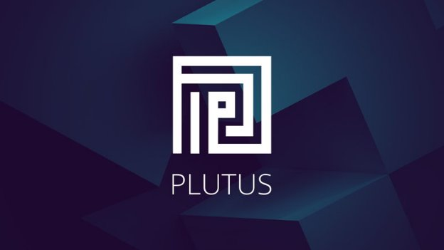

# Everything you need to know about our new Plutus Pioneer Program
### **Learn Plutus and become a certified Plutus Pioneer with our new series of interactive training courses – starting next week**
 1 April 2021[ Niamh Ahern](tmp//en/blog/authors/niamh-ahern/page-1/) 5 mins read

### [**Niamh Ahern**](tmp//en/blog/authors/niamh-ahern/page-1/)
Education Manager

Education

- 
- 
- 
- 

Next week sees the start of the first in a series of our Plutus pioneer training programs where participants can learn the fundamentals of Plutus and help to test the code before the official release of our new smart contract language. This new innovative program aims to recruit and train developers within the ecosystem so that they are fully prepared when Plutus is deployed to the Cardano mainnet later this year.

Tuần tới chứng kiến sự khởi đầu của lần đầu tiên trong một loạt các chương trình đào tạo Pioneer Plutus của chúng tôi, nơi người tham gia có thể tìm hiểu các nguyên tắc cơ bản của Plutus và giúp kiểm tra mã trước khi phát hành chính thức ngôn ngữ hợp đồng thông minh mới của chúng tôi.
Chương trình sáng tạo mới này nhằm mục đích tuyển dụng và đào tạo các nhà phát triển trong hệ sinh thái để họ được chuẩn bị đầy đủ khi Plutus được triển khai cho Cardano Mainnet vào cuối năm nay.

Since we announced this new course on [March’s Cardano360 show](https://youtu.be/ULBLgPgxtN8?t=3731) we have had a huge expression of interest from our developer community, both from developers who want to create decentralized applications (DApps), and smart contract programmers who want to work with Cardano’s principal development language. This week we have contacted everyone interested (over 2,000) to get a better idea of their experience and expertise. Those of you who have been selected for the first round of this program will hear from us very soon. If you don’t receive an invitation at this stage, don’t worry as we will be running several rounds of this program, so please do stay in touch!

Kể từ khi chúng tôi công bố khóa học mới này trên chương trình Cardano360 của tháng 3] (https://youtu.be/ulblgpgxtn8?t=3731) Chúng tôi đã có một biểu hiện rất quan tâm từ cộng đồng nhà phát triển của chúng tôi, cả từ các nhà phát triển muốn tạo các ứng dụng phân cấp (
DAPPS), và các lập trình viên hợp đồng thông minh muốn làm việc với ngôn ngữ phát triển chính của Cardano.
Tuần này chúng tôi đã liên hệ với tất cả mọi người quan tâm (hơn 2.000) để có ý tưởng tốt hơn về kinh nghiệm và chuyên môn của họ.
Những người bạn đã được chọn cho vòng đầu tiên của chương trình này sẽ sớm được nghe từ chúng tôi.
Nếu bạn không nhận được lời mời ở giai đoạn này, đừng lo lắng vì chúng tôi sẽ chạy vài vòng của chương trình này, vì vậy xin vui lòng giữ liên lạc!

## **Course structure**

## **Cấu trúc khóa học**

The first iteration of the new program starts next week. The cohort joining this program will be true pioneers. As well as being part of a group that will have *early access* to a set of learning modules, your feedback will help us develop and iterate the overall learning experience.

Lần lặp đầu tiên của chương trình mới bắt đầu vào tuần tới.
Các đoàn hệ tham gia chương trình này sẽ là những người tiên phong thực sự.
Cũng như là một phần của một nhóm sẽ có * truy cập sớm * vào một tập hợp các mô -đun học tập, phản hồi của bạn sẽ giúp chúng tôi phát triển và lặp lại trải nghiệm học tập tổng thể.

The course will teach you the core principles of how to code in both Haskell and Plutus. The course modules will cover the building blocks of Haskell and Plutus, including functions and data types, type classes, monads, template Haskell, using the [Plutus Playground](https://iohk.io/en/blog/posts/2021/01/25/introducing-the-new-plutus-playground/), the [Extended UTXO model](https://iohk.io/en/blog/posts/2021/03/11/cardanos-extended-utxo-accounting-model/), working with Plutus on and off the chain, minting policies, state machines, the Plutus application framework, as well as some case studies and practical exercises. 

Khóa học sẽ dạy cho bạn các nguyên tắc cốt lõi của cách viết mã trong cả Haskell và Plutus.
Các mô -đun khóa học sẽ bao gồm các khối xây dựng của Haskell và Plutus, bao gồm các chức năng và loại dữ liệu, loại loại, monads, mẫu Haskell, sử dụng [Plutus Playground] (https://iohk.io/en/blog/posts/2021/
01/25/Giới thiệu-The-New-Plutus-Playground/), [Mô hình UTXO mở rộng] (https://iohk.io/en/blog/posts/2021/03/11/cardanos-extends-utxo-accounting
-Model/), làm việc với Plutus trên và ngoài chuỗi, chính sách khai thác, máy nhà nước, khung ứng dụng Plutus, cũng như một số nghiên cứu trường hợp và các bài tập thực tế.

The course will follow a modular approach and will be highly interactive – each week we will be releasing new teaching videos from our director of education, Lars Brünjes, along with a set of practical exercises to complete during the week as part of each module. We will also be holding regular Q&A sessions and you will have access to a dedicated community channel on Discord, created especially to help you to connect with other course participants as you learn. 

Khóa học sẽ tuân theo một cách tiếp cận mô -đun và sẽ có tính tương tác cao - mỗi tuần chúng tôi sẽ phát hành các video giảng dạy mới từ Giám đốc Giáo dục của chúng tôi, Lars Brünjes, cùng với một tập hợp các bài tập thực tế để hoàn thành trong tuần như một phần của mỗi mô -đun.
Chúng tôi cũng sẽ tổ chức các phiên hỏi đáp thường xuyên và bạn sẽ có quyền truy cập vào một kênh cộng đồng chuyên dụng trên Discord, được tạo đặc biệt để giúp bạn kết nối với những người tham gia khóa học khác khi bạn học.

Outside the exercises and videos, students will be encouraged to learn at a pace that is right for them and to collaborate with fellow students. As with all learning experiences, the more you put in the more you will get out! We encourage all participants to *engage with each other* and work collaboratively to answer questions and solve problems. 

Bên ngoài các bài tập và video, sinh viên sẽ được khuyến khích học hỏi với tốc độ phù hợp với họ và hợp tác với các sinh viên.
Như với tất cả các kinh nghiệm học tập, bạn càng đặt nhiều hơn bạn sẽ ra ngoài!
Chúng tôi khuyến khích tất cả những người tham gia * tham gia với nhau * và hợp tác làm việc để trả lời các câu hỏi và giải quyết vấn đề.

We will have a small team of moderators who will check in from time to time to help facilitate and assist. They can also help triage issues or questions that may come up in your learning during the week. These moderators are all graduates of the [Mongolia class of 2020](https://iohk.io/en/blog/posts/2020/12/21/online-learning-with-haskell-the-mongolia-class-of-2020/) that completed the Haskell MOOC and are well placed to assist with questions and challenges. At the close of each week, Lars will engage directly with the group to resolve more complex technical questions and provide feedback on the subject matter covered that week. 

Chúng tôi sẽ có một nhóm nhỏ người điều hành, những người sẽ kiểm tra theo thời gian để giúp tạo điều kiện và hỗ trợ.
Họ cũng có thể giúp xử lý các vấn đề hoặc câu hỏi có thể xuất hiện trong việc học của bạn trong tuần.
Những người điều hành này đều là những sinh viên tốt nghiệp của [lớp Mông Cổ năm 2020] (https://iohk.io/en/blog/posts/2020/12/21/online-learning-with-haskell-the-mongolia-class-of-
2020/) đã hoàn thành MOOC Haskell và được đặt tốt để hỗ trợ các câu hỏi và thách thức.
Vào cuối mỗi tuần, Lars sẽ tham gia trực tiếp với nhóm để giải quyết các câu hỏi kỹ thuật phức tạp hơn và cung cấp phản hồi về vấn đề được đề cập trong tuần đó.

## **Prior experience**

## **Kinh nghiệm trước**

As Plutus is based largely on Haskell, having some prior experience with Haskell (or another functional programming language), will be very helpful. At a minimum, you should have some programming experience and a mathematical and technical mindset. You should be as keen to learn as to help us; while we have run a number of successful courses already, this is the first time we have challenged ourselves to teach at this scale. So be prepared for road bumps along the way as we learn and improve, too!

Vì Plutus chủ yếu dựa trên Haskell, có một số kinh nghiệm trước đó với Haskell (hoặc một ngôn ngữ lập trình chức năng khác), sẽ rất hữu ích.
Tối thiểu, bạn nên có một số kinh nghiệm lập trình và tư duy toán học và kỹ thuật.
Bạn nên muốn học hỏi như chúng tôi;
Mặc dù chúng tôi đã điều hành một số khóa học thành công, nhưng đây là lần đầu tiên chúng tôi thử thách bản thân để dạy ở quy mô này.
Vì vậy, hãy chuẩn bị cho những cú va chạm trên đường đi khi chúng ta học và cải thiện, quá!

Bear in mind that this course is not for coding beginners. While you do not need to be an expert in formal methods, programming experience and a general aptitude for logical and mathematical thinking are highly desirable. The course will include advanced features like Template Haskell, type-level programming, and effect systems. If you need a refresher or get an introduction to Haskell, we recommend that you read the [Learn You a Haskell guide](http://learnyouahaskell.com/) before you participate in the course. We’ll open several new cohorts this year, so you won’t miss out.

Hãy nhớ rằng khóa học này không dành cho người mới bắt đầu mã hóa.
Mặc dù bạn không cần phải là một chuyên gia về phương pháp chính thức, kinh nghiệm lập trình và năng khiếu chung cho tư duy logic và toán học là rất mong muốn.
Khóa học sẽ bao gồm các tính năng nâng cao như Mẫu Haskell, lập trình cấp độ và hệ thống hiệu ứng.
Nếu bạn cần bồi dưỡng hoặc giới thiệu về Haskell, chúng tôi khuyên bạn nên đọc [Tìm hiểu bạn Hướng dẫn Haskell] (http://learnyouahaskell.com/) trước khi bạn tham gia khóa học.
Chúng tôi sẽ mở một số đoàn hệ mới trong năm nay, vì vậy bạn đã giành chiến thắng.

## **When does the course start?**

## ** Khi nào khóa học bắt đầu? **

The course starts next week and will run concurrently for ten weeks through to mid June. It will involve approximately ten hours a week of your time and effort each week. 

Khóa học bắt đầu vào tuần tới và sẽ chạy đồng thời trong mười tuần đến giữa tháng Sáu.
Nó sẽ liên quan đến khoảng mười giờ một tuần thời gian và công sức của bạn mỗi tuần.

## **Will there be other pioneer programs?**

## ** Sẽ có các chương trình tiên phong khác? **

Yes, we are keen to be as inclusive as we can on our path to rolling out smart contracts. We are also developing education programs for both [Marlowe](https://docs.cardano.org/marlowe/learn-about-marlowe) and [Glow](https://developers.cardano.org/en/programming-languages/glow/overview/), so don't feel like you have missed out if this Plutus course is not for you. We’re still keen to have you onboard, so do watch this space for details of these other courses!

Vâng, chúng tôi rất muốn được bao gồm như chúng tôi có thể trên con đường của chúng tôi để triển khai các hợp đồng thông minh.
Chúng tôi cũng đang phát triển các chương trình giáo dục cho cả hai [Marlowe] (https://docs.cardano.org/marlowe/learn-about- marlowe) và [Glow] (https://developers.cardano.org/en/programming-langage
/phát sáng/tổng quan/), vì vậy đừng cảm thấy như bạn đã bỏ lỡ nếu khóa học Plutus này không dành cho bạn.
Chúng tôi vẫn muốn có bạn trên tàu, vì vậy hãy xem không gian này để biết chi tiết về các khóa học khác này!

## **Certification**

## ** Chứng nhận **

We will reward participants for their efforts in participating in this course and certify those pioneers that complete the entire program and are successful. These Plutus pioneer certificates will be represented as non fungible tokens (on the testnet) and locked by a Plutus contract. Pioneers can demonstrate their knowledge and qualification by constructing an appropriate transaction to unlock their individual token.

Chúng tôi sẽ thưởng cho những người tham gia vì những nỗ lực của họ trong việc tham gia khóa học này và chứng nhận những người tiên phong hoàn thành toàn bộ chương trình và thành công.
Các chứng chỉ Pioneer Plutus này sẽ được đại diện dưới dạng mã thông báo không gây nấm (trên testnet) và bị khóa bởi hợp đồng Plutus.
Những người tiên phong có thể chứng minh kiến thức và trình độ của họ bằng cách xây dựng một giao dịch phù hợp để mở khóa mã thông báo cá nhân của họ.

## **Ready to start**

## ** Sẵn sàng để bắt đầu **

We are excited to have so many developers from our ecosystem on board and ready to get started and learn Plutus. You’ll not only be learning yourselves, but acting as a pioneer to help us determine the best way to teach and deliver this course – truly helping pave the way for future cohorts who enroll! We look forward to bringing you on this learning journey before we launch Plutus to the world!

Chúng tôi rất vui mừng khi có rất nhiều nhà phát triển từ hệ sinh thái của chúng tôi trên tàu và sẵn sàng để bắt đầu và học Plutus.
Bạn không chỉ học chính mình, mà còn là người tiên phong để giúp chúng tôi xác định cách tốt nhất để dạy và cung cấp khóa học này - thực sự giúp mở đường cho các đoàn hệ trong tương lai đăng ký!
Chúng tôi mong muốn đưa bạn vào hành trình học tập này trước khi chúng tôi khởi động Plutus ra thế giới!

