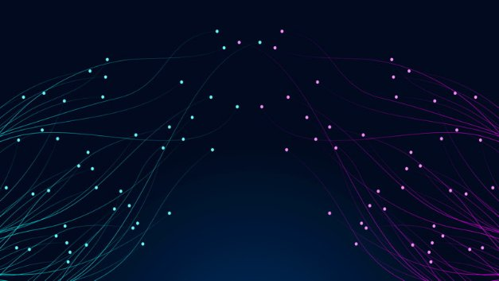

# Boosting network decentralization with P2P
### **Peer-to-peer communication between stake pools will make Cardano more dynamic and more efficient as the network grows**
 6 April 2021[ Olga Hryniuk](tmp//en/blog/authors/olga-hryniuk/page-1/) 7 mins read

### [**Olga Hryniuk**](tmp//en/blog/authors/olga-hryniuk/page-1/)
Technical Writer

Marketing & Communications

- 
- 

The decentralization of Cardano puts responsibility for running the blockchain in the hands of stake pools. An essential element in this is reliable and effective connections between all the distributed nodes, and ensuring that the network is resilient to failure.

Việc phân cấp Cardano đặt trách nhiệm chạy blockchain trong tay các nhóm cổ phần.
Một yếu tố thiết yếu trong vấn đề này là các kết nối đáng tin cậy và hiệu quả giữa tất cả các nút phân tán và đảm bảo rằng mạng có khả năng phục hồi thất bại.

With the simpler Byron version of the blockchain, federated (OBFT) nodes controlled by the Cardano Foundation, Emurgo, and IOHK were wholly responsible for managing block production and network connections. This maintained the network, while building up a system of thousands of distributed nodes, operated by stake pools. To achieve decentralization, Cardano has now ended the prevalence of the federated nodes that have supported the system since its creation in 2017. 

Với phiên bản Byron đơn giản hơn của blockchain, các nút liên kết (OBFT) được điều khiển bởi Quỹ Cardano, Emurgo và IOHK hoàn toàn chịu trách nhiệm quản lý các kết nối sản xuất và kết nối mạng.
Điều này duy trì mạng, trong khi xây dựng một hệ thống gồm hàng ngàn nút phân tán, được vận hành bởi các nhóm cổ phần.
Để đạt được sự phân cấp, Cardano hiện đã chấm dứt sự phổ biến của các nút liên kết đã hỗ trợ hệ thống kể từ khi thành lập vào năm 2017.

On December 6, 2020, we set the [*k* parameter to 500](https://iohk.io/en/blog/posts/2020/11/05/parameters-and-decentralization-the-way-ahead/) to expand the number of ‘viable’ pools and further promote decentralization. We have also [gradually reduced *d*](https://iohk.io/en/blog/posts/2021/03/04/not-long-till-d-0-day/) to put the power of block production entirely into the hands of the community. 100% of blocks are now being produced by the stake pool operator (SPO) community, which means that block production in Cardano is completely decentralized. These parameter changes support long-term chain sustainability and encourage the spreading of stake and potential rewards more evenly among stake pools.

Vào ngày 6 tháng 12 năm 2020, chúng tôi đặt tham số [* K* thành 500] (https://iohk.io/en/blog/posts/2020/11/05/parameters-and-decentralization-the-way-ahead/
) để mở rộng số lượng các nhóm "khả thi và thúc đẩy sự phân cấp hơn nữa.
Chúng tôi cũng đã giảm dần *D *] (https://iohk.io/en/blog/posts/2021/03/04/not-long-till-d-0-day/) để đặt sức mạnh của khối khối khối
Sản xuất hoàn toàn vào tay cộng đồng.
100% các khối hiện đang được sản xuất bởi cộng đồng Nhà điều hành Pool Stake (SPO), điều đó có nghĩa là sản xuất khối ở Cardano được phân cấp hoàn toàn.
Những thay đổi tham số này hỗ trợ tính bền vững chuỗi dài hạn và khuyến khích sự lây lan của cổ phần và phần thưởng tiềm năng hơn giữa các nhóm cổ phần.

In just over six months, we have evolved from a system reliant upon a handful of federated nodes, into a proof-of-stake system run by the community, with thousands of blocks produced every epoch by over 2,000 stake pools. 

Chỉ trong hơn sáu tháng, chúng tôi đã phát triển từ một hệ thống phụ thuộc vào một số ít các nút được liên kết, thành một hệ thống chứng minh do cộng đồng điều hành, với hàng ngàn khối được sản xuất mỗi kỷ nguyên với hơn 2.000 nhóm cổ phần.

## **The network**

## **Mạng lưới**

Cardano’s networking layer is a physical infrastructure that combines nodes and their interaction into a unified system. The network distributes information about transactions and block creation among all active nodes. In this way, the system validates and adds blocks to the chain and verifies transactions. Thus, a distributed network of nodes must keep communication delays to a minimum, and be resilient enough to cope with failures, capacity constraints, or hackers.

Lớp mạng của Cardano là một cơ sở hạ tầng vật lý kết hợp các nút và tương tác của chúng vào một hệ thống thống nhất.
Mạng phân phối thông tin về các giao dịch và chặn tạo giữa tất cả các nút hoạt động.
Theo cách này, hệ thống xác nhận và thêm các khối vào chuỗi và xác minh các giao dịch.
Do đó, một mạng lưới các nút phân tán phải giữ sự chậm trễ giao tiếp ở mức tối thiểu và đủ khả năng phục hồi để đối phó với các lỗi, hạn chế công suất hoặc tin tặc.

Under the old federated system, nodes were connected by a static configuration defined in a topology file. Since the introduction of Shelley, the system has been functioning in a hybrid mode, where nodes connect to federated relays and to other SPO’s relays. This connectivity is partially manually constructed, however, SPOs can exchange block and transaction information without relying on federated nodes. 

Trong hệ thống liên kết cũ, các nút được kết nối bằng cấu hình tĩnh được xác định trong tệp cấu trúc liên kết.
Kể từ khi giới thiệu Shelley, hệ thống đã hoạt động ở chế độ lai, nơi các nút kết nối với rơle liên kết và các rơle khác của Spo.
Kết nối này được xây dựng thủ công một phần, tuy nhiên, các SPO có thể trao đổi thông tin khối và giao dịch mà không cần dựa vào các nút được liên kết.

In his article '[Cardano’s path to decentralization](https://iohk.io/en/blog/posts/2020/07/09/cardanos-path-to-decentralization-by-marcin-szamotulski/)', Marcin Szamotulski discussed the network’s design and explained Cardano’s approach to network decentralization with the advent of Shelley. Now that we have reached full decentralization in terms of block production, it is also essential that the network connectivity is decentralized too. Cardano will achieve this through a shift to peer-to-peer (P2P) connectivity. 

Trong bài viết của anh ấy '[con đường phân cấp của Cardano] (https://iohk.io/en/blog/posts/2020/07/09/cardanos-path-to-decentralization-by-marcin-szamotulski/)'
, Marcin Szamotulski đã thảo luận về thiết kế của mạng và giải thích cách tiếp cận của Cardano để phân cấp mạng với sự ra đời của Shelley.
Bây giờ chúng tôi đã đạt được sự phân cấp đầy đủ về sản xuất khối, điều cần thiết là kết nối mạng cũng được phân cấp.
Cardano sẽ đạt được điều này thông qua việc chuyển sang kết nối ngang hàng (P2P).

## **P2P networking**

## ** Mạng P2P **

At this point, we should talk about the network ‘stack’, a set of software tools recently enhanced by our engineering team to cope with a larger, more dynamic, and complex network.

Tại thời điểm này, chúng ta nên nói về mạng - một bộ công cụ phần mềm được tăng cường gần đây bởi nhóm kỹ thuật của chúng tôi để đối phó với một mạng lớn hơn, năng động hơn và phức tạp hơn.

P2P communication will enhance the flow of information between nodes, thus reducing (and ultimately removing) the network’s reliance on the federated nodes, and enabling the decentralization of Cardano. To achieve the desired resilience, IOHK’s networking team has been busy improving the network stack with advanced P2P capabilities. These improvements do not require a protocol change, but rather enable automated peer selection and communication. 

Giao tiếp P2P sẽ tăng cường luồng thông tin giữa các nút, do đó giảm (và cuối cùng là loại bỏ) sự phụ thuộc của mạng vào các nút liên kết và cho phép phân cấp Cardano.
Để đạt được khả năng phục hồi mong muốn, nhóm kết nối của IOHK đã bận rộn cải thiện ngăn xếp mạng với khả năng P2P tiên tiến.
Những cải tiến này không yêu cầu thay đổi giao thức, mà là cho phép lựa chọn và giao tiếp ngang hàng tự động.

The P2P networking is enabled due to the use of the following components:

Mạng P2P được bật do sử dụng các thành phần sau:

Figure 1. P2P architecture

Hình 1. Kiến trúc P2P

Let's take a closer look at the process of how node connections are established and see how the latest developments streamline data exchange between nodes. 

Chúng ta hãy xem xét kỹ hơn quá trình kết nối nút được thiết lập và xem cách phát triển mới nhất hợp lý hóa dữ liệu giữa các nút.

**Mini protocols**

** Giao thức mini **

A set of mini protocols enables communication between nodes. Each protocol implements a basic information exchange requirement, such as informing peers of the latest block, sharing blocks, or processing transactions. *Chain-sync*, *block-fetch*, and *tx-submission* protocols have been used to distribute chains of blocks and transactions for node-to-node communication in the network:

Một tập hợp các giao thức mini cho phép giao tiếp giữa các nút.
Mỗi giao thức thực hiện một yêu cầu trao đổi thông tin cơ bản, chẳng hạn như thông báo cho các đồng nghiệp về khối mới nhất, chia sẻ khối hoặc giao dịch xử lý.
*Chuỗi-sync*,*-fetch*, và*TX-Submission*đã được sử dụng để phân phối chuỗi các khối và giao dịch để giao tiếp nút đến nút trong mạng:

- *block-fetch* draws information from the chain database.

- * Khối-Fetch * Lấy thông tin từ cơ sở dữ liệu chuỗi.

- *chain-sync* synchronizes fetched data across the network.

- * Chuỗi-sync * đồng bộ hóa dữ liệu được tìm nạp trên mạng.

- *tx-submission2* consumes transactions from peer mempools and adds them to the local mempool, which enables peers to submit their transactions to the node. This is a modification of the current *tx-submission* protocol. 

- * TX-Submission2 * tiêu thụ các giao dịch từ các mempools ngang hàng và thêm chúng vào mempool cục bộ, cho phép các đồng nghiệp gửi các giao dịch của họ đến nút.
Đây là một sửa đổi của giao thức Submission * TX * hiện tại.

These mini protocols support the Ouroboros consensus protocol. To ensure optimal networking service, the team has implemented additional protocols:

Các giao thức mini này hỗ trợ giao thức đồng thuận Ouoboros.
Để đảm bảo dịch vụ mạng tối ưu, nhóm đã triển khai các giao thức bổ sung:

- *keep-alive*: this ensures continuous connection between nodes and minimizes performance faults. 

- *Keep-Alive *: Điều này đảm bảo kết nối liên tục giữa các nút và giảm thiểu các lỗi hiệu suất.

- *tip-sample*: this provides information about which peers offer better connectivity in terms of performance. 

- *Mẹo-mẫu *: Điều này cung cấp thông tin về việc đồng nghiệp cung cấp kết nối tốt hơn về mặt hiệu suất.

You can find out more about the network architecture and mini protocol examples on the [Cardano documentation website](https://docs.cardano.org/en/latest/explore-cardano/cardano-network.html).

Bạn có thể tìm hiểu thêm về kiến trúc mạng và ví dụ giao thức mini trên trang web [trang web tài liệu Cardano] (https://docs.cardano.org/en/latest/explore-cardano/cardano-network.html).

**Connection management**

** Quản lý kết nối **

The networking service supports Linux, Windows, and macOS, but the number of connections supported by each operating system varies.

Dịch vụ mạng hỗ trợ Linux, Windows và MacOS, nhưng số lượng kết nối được hỗ trợ bởi mỗi hệ điều hành khác nhau.

To avoid system overloading, a [multiplexer](https://docs.cardano.org/en/latest/explore-cardano/cardano-architecture-overview/connection-management.html#multiplexing) combines several channels into a single Transmission Control Protocol (TCP) connection channel. This offers two advantages: One, bidirectional communication between peers (so any peer can initiate communication with no restrictions as both parties have read and write permissions within the same channel), and enhanced node-to-node communication without affecting performance.

Để tránh quá tải hệ thống, một [bộ ghép kênh] (https://docs.cardano.org/en/latest/explore-cardano/cardano-architecture-overview/connection-man quản lý.html#multiplexing)
Kênh kết nối giao thức (TCP).
Điều này cung cấp hai lợi thế: một, giao tiếp hai chiều giữa các đồng nghiệp (vì vậy bất kỳ đồng nghiệp nào cũng có thể bắt đầu giao tiếp mà không có giới hạn vì cả hai bên đã đọc và ghi quyền trong cùng một kênh) và tăng cường giao tiếp nút trên nút mà không ảnh hưởng đến hiệu suất.

The networking team has implemented a bidirectional-aware ‘connection manager’ that integrates with the P2P governor, which is currently undergoing final testing before deployment. Additionally, the multiplexer’s API has been upgraded to monitor new connections and protocols. This enhancement introduces more efficient connection management and improved issue tracking. 

Nhóm kết nối mạng đã thực hiện một người quản lý kết nối hai chiều, tích hợp với Thống đốc P2P, hiện đang trải qua thử nghiệm cuối cùng trước khi triển khai.
Ngoài ra, API của bộ ghép kênh đã được nâng cấp để theo dõi các kết nối và giao thức mới.
Tăng cường này giới thiệu quản lý kết nối hiệu quả hơn và cải thiện theo dõi vấn đề.

**P2P governor functionality**

** Chức năng thống đốc P2P **

The Cardano network involves multiple peer nodes. Some are more active than others, some have established connections, and some should be promoted to ensure the best system performance. As discussed in '[Cardano’s path to decentralization](https://iohk.io/en/blog/posts/2020/07/09/cardanos-path-to-decentralization-by-marcin-szamotulski/)', peers are mapped into three categories:

Mạng Cardano liên quan đến nhiều nút ngang hàng.
Một số hoạt động mạnh hơn những người khác, một số đã thiết lập các kết nối và một số nên được quảng bá để đảm bảo hiệu suất hệ thống tốt nhất.
Như đã thảo luận trong con đường phân cấp của Cardano để phân cấp] (https://iohk.io/en/blog/posts/2020/07/09/cardanos-path-to-decentralization-by-marcin-szamotulski/) ''
, đồng nghiệp được ánh xạ thành ba loại:

- cold peers

- Những người đồng nghiệp lạnh

- warm peers

- Đồng nghiệp ấm áp

- hot peers

- Tương phản nóng

To establish bidirectional connections between them, it is crucial that we know which connections are active. 

Để thiết lập các kết nối hai chiều giữa chúng, điều quan trọng là chúng ta biết kết nối nào đang hoạt động.

Figure 2. Peer discovery on Cardano

Hình 2. Khám phá ngang hàng trên Cardano

The [P2P governor](https://input-output-hk.github.io/ouroboros-network/ouroboros-network/Ouroboros-Network-PeerSelection-Governor.html) manages connections and provides information on which peers are active and performing well. This feature promotes peer connections for enhanced system performance and also provides excellent visibility by building and maintaining a connectivity map of the entire network. The governor will simplify the process of connection definitions by handling these automatically so a few central stake pools no longer have to configure them manually. The governor promotes or demotes peers between cold, warm, and hot states, and also interacts with the connection manager to open new connections or reuse existing ones.

Thống đốc [P2P] (https://input-output
Tốt.
Tính năng này thúc đẩy các kết nối ngang hàng cho hiệu suất hệ thống nâng cao và cũng cung cấp khả năng hiển thị tuyệt vời bằng cách xây dựng và duy trì bản đồ kết nối của toàn bộ mạng.
Thống đốc sẽ đơn giản hóa quá trình định nghĩa kết nối bằng cách xử lý các định nghĩa này một cách tự động để một vài nhóm cổ phần trung tâm không còn phải định cấu hình chúng theo cách thủ công.
Thống đốc thúc đẩy hoặc hạ bệ các đồng nghiệp giữa các trạng thái lạnh, ấm và nóng, và cũng tương tác với người quản lý kết nối để mở các kết nối mới hoặc sử dụng lại các kết nối hiện có.

## **P2P deployment roadmap**

## ** Lộ trình triển khai P2P **

The IOHK networking team is in the final stages of quality testing the P2P governor integration with the node. After this, the team will extend the network stack with more protocols – *gossip*, in particular, which will provide seamless data exchange between peers and help construct a decentralized communication map. 

Nhóm kết nối mạng IOHK đang trong giai đoạn cuối của thử nghiệm chất lượng tích hợp thống đốc P2P với nút.
Sau đó, nhóm sẽ mở rộng ngăn xếp mạng với nhiều giao thức hơn - Đặc biệt, *tin đồn *, điều này sẽ cung cấp trao đổi dữ liệu liền mạch giữa các đồng nghiệp và giúp xây dựng bản đồ truyền thông phi tập trung.

These technical upgrades allow us to simplify Cardano node interfaces and improve the system’s configuration. When testing is finalized, all SPOs will be able to update and simplify their configuration preferences for enhanced connectivity. 

Các nâng cấp kỹ thuật này cho phép chúng tôi đơn giản hóa các giao diện nút Cardano và cải thiện cấu hình của hệ thống.
Khi thử nghiệm được hoàn thành, tất cả các SPO sẽ có thể cập nhật và đơn giản hóa tùy chọn cấu hình của chúng để kết nối nâng cao.

This involves the following stages before full P2P deployment:

Điều này liên quan đến các giai đoạn sau trước khi triển khai P2P đầy đủ:

Figure 3. P2P deployment roadmap

Hình 3. Lộ trình triển khai P2P

For a walkthrough of the plan from chief architect Duncan Coutts, check out this video from the [March Cardano360 show](https://youtu.be/mXYIQDUitYI). 

Để biết hướng dẫn của kế hoạch từ kiến trúc sư trưởng Duncan Coutts, hãy xem video này từ [chương trình Cardano360 tháng 3] (https://youtu.be/mxyiqduityi).

*While governance played an important role in the network establishment, maintenance and support, only with decentralization we can achieve true network sustainability to ensure equal opportunities for all stake pools. Thus, the goal of stack improvements is to allow all stake pools to run the same configurations, establishing equal capabilities within a decentralized environment.*

*Mặc dù quản trị đóng một vai trò quan trọng trong việc thành lập, bảo trì và hỗ trợ mạng, nhưng chỉ với sự phân cấp, chúng ta có thể đạt được sự bền vững mạng thực sự để đảm bảo cơ hội bình đẳng cho tất cả các nhóm cổ phần.
Do đó, mục tiêu của các cải tiến ngăn xếp là cho phép tất cả các nhóm cổ phần chạy cùng một cấu hình, thiết lập các khả năng như nhau trong một môi trường phi tập trung.*

*We’ll keep providing more development updates in this blog, and you can also follow Cardano [status updates](https://roadmap.cardano.org/en/status-updates/) to learn about recent improvements and developments.*

*Chúng tôi sẽ tiếp tục cung cấp nhiều cập nhật phát triển hơn trong blog này và bạn cũng có thể theo dõi Cardano [Cập nhật trạng thái] (https://roadmap.cardano.org/en/status-updates/) để tìm hiểu về các cải tiến và phát triển gần đây.
*

