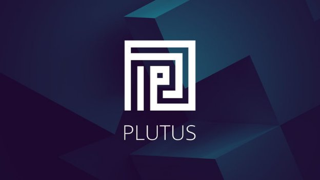

# Plutus: what you need to know
### **Developers are now preparing for the arrival of Cardano smart contracts, enabled by Plutus and the Alonzo protocol upgrade**
 13 April 2021[ Lars Brünjes](tmp//en/blog/authors/lars-brunjes/page-1/) 9 mins read

### [**Lars Brünjes**](tmp//en/blog/authors/lars-brunjes/page-1/)
Education Director

Education

- 
- 
- 
- 

In our previous blog post, we discussed [*Alonzo*](https://iohk.io/en/blog/posts/2021/04/08/smart-contracts-%E2%80%93-here-we-come/) ‒ our name given to the protocol upgrade that will introduce smart contract support on Cardano. Alonzo will establish the infrastructure and add tools for functional smart contract development using Plutus.

Trong bài đăng trên blog trước đây của chúng tôi, chúng tôi đã thảo luận [*alonzo*] (https://iohk.io/en/blog/posts/2021/04/08/smart-contracts-%E2%80%93
/) - Tên của chúng tôi được đặt cho nâng cấp giao thức sẽ giới thiệu hỗ trợ hợp đồng thông minh trên Cardano.
Alonzo sẽ thiết lập cơ sở hạ tầng và thêm các công cụ để phát triển hợp đồng thông minh chức năng bằng cách sử dụng Plutus.

The Plutus platform provides a native smart contract language for the Cardano blockchain. To understand and become proficient in Plutus, one has to understand three concepts:

Nền tảng Plutus cung cấp ngôn ngữ hợp đồng thông minh bản địa cho blockchain Cardano.
Để hiểu và thành thạo Plutus, người ta phải hiểu ba khái niệm:

- The *Extended UTXO model (EUTXO)*

- Mô hình UTXO *mở rộng (EUTXO) *

- *Plutus Core* ‒ the ‘on-chain’ part of Plutus

- * Core Plutus *- Phần ’trên chuỗi của Plutus

- *The Plutus Application Framework (PAF)* ‒ the ‘off-chain’ part of Plutus that enables interaction with smart contracts.

- * Khung ứng dụng Plutus (PAF) *- phần ’Off chuỗi của Plutus cho phép tương tác với các hợp đồng thông minh.

Plutus contracts consist of parts that run on the blockchain (on-chain code) and parts that run on a user’s machine (off-chain or client code). Both the on-chain and off-chain code are written in Haskell, and Plutus smart contracts are effectively Haskell programs. Off-chain code can be written using PAF and this code is then compiled by the GHC (Glasgow Haskell Compiler), whereas on-chain code (written using the Plutus Core) is compiled by the Plutus compiler. 

Các hợp đồng của Plutus bao gồm các phần chạy trên blockchain (mã trên chuỗi) và các bộ phận chạy trên máy người dùng (Off-chuỗi hoặc mã máy khách).
Cả mã trên chuỗi và mã ngoài chuỗi đều được viết bằng Haskell và các hợp đồng thông minh Plutus là các chương trình Haskell một cách hiệu quả.
Mã Off-chuỗi có thể được viết bằng PAF và mã này sau đó được biên dịch bởi GHC (Trình biên dịch Glasgow Haskell), trong khi mã trên chuỗi (được viết bằng lõi Plutus) được biên dịch bởi Trình biên dịch Plutus.

It is crucial to understand the relationship between these Plutus concepts and native tokens functionality to see how their interaction turns the latter into a more useful and powerful feature.

Điều quan trọng là phải hiểu mối quan hệ giữa các khái niệm Plutus này và chức năng mã thông báo gốc để xem cách tương tác của chúng biến cái sau thành một tính năng hữu ích và mạnh mẽ hơn.

## **The Extended UTXO model**

## ** Mô hình UTXO mở rộng **

Cardano (like Bitcoin) uses the unspent (U) transaction (TX) output (O) accounting model. In the UTXO model, a *transaction* has *inputs* and *outputs*, where the **inputs** are unspent outputs from previous transactions. As soon as an output is used as input in a transaction, it becomes *spent* and can never be used again. The **output** is specified by an *address* (a public key or public key hash) and a *value* (consisting of an ada amount and optional, additional native token amounts). An output’s address determines which transactions are allowed to ‘unlock’ the output and use it as an input. A transaction must be *signed* by the owner of the private key corresponding to the address. Think of an address as a ‘lock’ that can only be ‘unlocked’ by the right ‘key’ ‒ the correct signature.

Cardano (như bitcoin) sử dụng mô hình kế toán giao dịch (tx) (O) (O) (O).
Trong mô hình UTXO, một*giao dịch*có*đầu vào*và*đầu ra*, trong đó ** đầu vào ** là các đầu ra chưa được sử dụng từ các giao dịch trước đó.
Ngay khi đầu ra được sử dụng làm đầu vào trong một giao dịch, nó sẽ * chi tiêu * và không bao giờ có thể được sử dụng lại.
Đầu ra ** ** được chỉ định bởi một*địa chỉ*(khóa công khai hoặc băm khóa công khai) và giá trị**(bao gồm một số tiền ADA và số lượng mã thông báo gốc tùy chọn, bổ sung).
Một địa chỉ đầu ra, xác định các giao dịch nào được phép mở khóa đầu ra và sử dụng nó làm đầu vào.
Một giao dịch phải được * ký * bởi chủ sở hữu của khóa riêng tương ứng với địa chỉ.
Hãy nghĩ về một địa chỉ như một ‘khóa, chỉ có thể được mở khóa bởi quyền‘ khóa - chữ ký chính xác.

The EUTXO model *extends* this model in two directions: 

Mô hình EUTXO * mở rộng * Mô hình này theo hai hướng:

1. It generalizes the concept of ‘address’ by using the lock-and-key analogy. Instead of restricting locks to public keys and keys to signatures, addresses in the EUTXO model can contain arbitrary logic in the form of *scripts*. For example, when a node validates a transaction, the node determines whether or not the transaction is allowed to use a certain output as an input. The transaction will look up the script provided by the output's address and will execute the script if the transaction can use the output as an input.

1. Nó khái quát hóa khái niệm ‘địa chỉ bằng cách sử dụng sự tương tự khóa và khóa.
Thay vì hạn chế khóa đối với các khóa và khóa công khai cho chữ ký, các địa chỉ trong mô hình EUTXO có thể chứa logic tùy ý dưới dạng *tập lệnh *.
Ví dụ: khi một nút xác thực một giao dịch, nút xác định xem giao dịch có được phép sử dụng một đầu ra nhất định làm đầu vào hay không.
Giao dịch sẽ tra cứu tập lệnh được cung cấp bởi địa chỉ đầu ra và sẽ thực thi tập lệnh nếu giao dịch có thể sử dụng đầu ra làm đầu vào.

1. The second difference between UTXO and EUTXO is that outputs can carry (almost) arbitrary data in addition to an address and value. This makes scripts much more powerful by allowing them to carry *state*.

1. Sự khác biệt thứ hai giữa UTXO và EUTXO là các đầu ra có thể mang dữ liệu tùy ý (gần như) ngoài địa chỉ và giá trị.
Điều này làm cho các tập lệnh mạnh mẽ hơn nhiều bằng cách cho phép chúng mang *trạng thái *.

When validating an address, the script will access the data being carried by the output, the transaction being validated, and some additional pieces of data called *redeemers*, which the transaction provides for every input. By looking up all this information, the script has enough context to give a ‘yes’ or ‘no’ answer in what can be highly complex situations and use cases.

Khi xác thực một địa chỉ, tập lệnh sẽ truy cập dữ liệu được thực hiện bởi đầu ra, giao dịch đang được xác thực và một số phần dữ liệu bổ sung được gọi là *Redeemers *, mà giao dịch cung cấp cho mọi đầu vào.
Bằng cách tìm kiếm tất cả thông tin này, kịch bản có đủ ngữ cảnh để đưa ra câu trả lời ’có hoặc‘ không có câu trả lời nào trong những tình huống có thể rất phức tạp và các trường hợp sử dụng.

To summarize, EUTXO extends the UTXO model by allowing output addresses to contain complex logic to decide which transactions can unlock them, and by adding *custom* data to *all* outputs.

Để tóm tắt, EUTXO mở rộng mô hình UTXO bằng cách cho phép các địa chỉ đầu ra chứa logic phức tạp để quyết định giao dịch nào có thể mở khóa chúng và bằng cách thêm dữ liệu * tùy chỉnh * vào tất cả * đầu ra.

The EUTXO model offers unique advantages over other accounting models. The success or failure of transaction validation depends only on the transaction itself and its inputs, and *not* on anything else on the blockchain. As a consequence, the validity of a transaction can be checked *off-chain*, before the transaction is sent to the blockchain. A transaction can still fail if some other transaction concurrently consumes an input that the transaction is expecting, but if all inputs are still present, the transaction is *guaranteed* to succeed.

Mô hình EUTXO cung cấp các lợi thế độc đáo so với các mô hình kế toán khác.
Sự thành công hay thất bại của xác thực giao dịch chỉ phụ thuộc vào chính giao dịch và đầu vào của nó và * không * trên bất cứ thứ gì khác trên blockchain.
Do đó, tính hợp lệ của một giao dịch có thể được kiểm tra *ngoài chuỗi *, trước khi giao dịch được gửi đến blockchain.
Một giao dịch vẫn có thể thất bại nếu một số giao dịch khác tiêu thụ đồng thời một đầu vào mà giao dịch đang mong đợi, nhưng nếu tất cả các đầu vào vẫn còn, giao dịch được đảm bảo * sẽ thành công.

This contrasts with an account-based model (as used by Ethereum), where a transaction can fail in mid-script execution. This can never happen in EUTXO. Also, transaction execution costs can be determined off-chain before transmission – another feature impossible on Ethereum.

Điều này tương phản với một mô hình dựa trên tài khoản (như được sử dụng bởi Ethereum), trong đó một giao dịch có thể thất bại trong việc thực hiện giữa bản viết.
Điều này không bao giờ có thể xảy ra ở Eutxo.
Ngoài ra, chi phí thực hiện giao dịch có thể được xác định ngoài chuỗi trước khi truyền-một tính năng khác không thể trên Ethereum.

Finally, because of the ‘local’ nature of transaction validation, a high degree of parallelism is possible: a node could, in principle, validate transactions in parallel, if those transactions do not try to consume the same input. This is great both for efficiency and for reasoning, simplifying the analysis of possible outcomes, and proving that ‘nothing bad’ can happen. You can dive deeper into the [EUTXO model in the previous blog post](https://iohk.io/en/blog/posts/2021/03/12/cardanos-extended-utxo-accounting-model-part-2/).

Cuối cùng, do tính chất ’cục bộ của xác thực giao dịch, có thể có mức độ song song cao: về nguyên tắc, một nút có thể xác nhận các giao dịch song song, nếu các giao dịch đó không cố gắng tiêu thụ cùng một đầu vào.
Điều này là tuyệt vời cho cả hiệu quả và lý luận, đơn giản hóa việc phân tích các kết quả có thể xảy ra và chứng minh rằng ‘không có gì xấu có thể xảy ra.
Bạn có thể đi sâu hơn vào mô hình [EUTXO trong bài đăng trên blog trước đó] (https://iohk.io/en/blog/posts/2021/03/12/cardanos-extends-utxo-acacounting-model-part-2/
).

## **Plutus Core**

## ** Core Plutus **

To implement the EUTXO model, it is necessary to clearly define the terms *script* and *data*. Scripts require a definite, well-specified scripting language, and it is also important to define the type of data that is attached to outputs and used as redeemers.

Để thực hiện mô hình EUTXO, cần xác định rõ các thuật ngữ *tập lệnh *và *dữ liệu *.
Các tập lệnh yêu cầu một ngôn ngữ kịch bản xác định, được chỉ định rõ ràng và điều quan trọng là phải xác định loại dữ liệu được đính kèm với đầu ra và được sử dụng làm chất chuộc.

This is where *Plutus Core* comes in. Plutus Core is the scripting language used by Cardano. It is a simple functional language similar to Haskell, and a large subset of Haskell can be used to write Plutus Core scripts. As a contract author you don’t write any Plutus Core. All Plutus Core programs are generated by a Haskell compiler plugin.

Đây là nơi * Plutus Core * xuất hiện. Plutus Core là ngôn ngữ kịch bản được sử dụng bởi Cardano.
Nó là một ngôn ngữ chức năng đơn giản tương tự như Haskell và một tập hợp con lớn của Haskell có thể được sử dụng để viết các tập lệnh cốt lõi Plutus.
Là một tác giả hợp đồng, bạn không viết bất kỳ Core Plutus.
Tất cả các chương trình cốt lõi Plutus được tạo bởi một plugin trình biên dịch Haskell.

These scripts will be executed by nodes during transaction validation ‘live’ on the chain. They will either lock UTXOs in the form of *validator scripts* or as *minting policies*, which control the minting and burning of native tokens (see below).

Các tập lệnh này sẽ được thực thi bởi các nút trong quá trình xác thực giao dịch ‘trực tiếp trên chuỗi.
Họ sẽ khóa utxos dưới dạng *tập lệnh xác thực *hoặc như *chính sách khai thác *, kiểm soát việc khai thác và đốt mã thông báo gốc (xem bên dưới).

Redeemer data is a simple (algebraic) data type that can be defined easily in Haskell, which is another reason why Haskell is a good option for writing Plutus Core scripts. In practice, a smart contract developer will write validator scripts in Haskell, which will then be automatically [compiled into Plutus Core](https://iohk.io/en/blog/posts/2021/02/02/plutus-tx-compiling-haskell-into-plutus-core/).

Dữ liệu Redeemer là một loại dữ liệu đơn giản (đại số) có thể được xác định dễ dàng trong Haskell, đó là một lý do khác tại sao Haskell là một lựa chọn tốt để viết các tập lệnh cốt lõi của Plutus.
Trong thực tế, một nhà phát triển hợp đồng thông minh sẽ viết các tập lệnh xác thực trong Haskell, sau đó sẽ được tự động [được biên dịch vào Plutus Core] (https://iohk.io/en/blog/posts/2021/02/02/plutus-tx-
biên dịch-haskell-into-plutus-core/).

Appropriate Haskell libraries simplify writing such validation logic by providing core data types for the inspection of transactions during validation, and by offering many helper functions and higher level abstractions, allowing contract authors to concentrate on the business logic and not have to worry about too many low-level details. 

Các thư viện Haskell phù hợp đơn giản hóa việc viết logic xác thực như vậy bằng cách cung cấp các loại dữ liệu cốt lõi để kiểm tra các giao dịch trong quá trình xác thực và bằng cách cung cấp nhiều chức năng trợ giúp và trừu tượng hóa cấp cao hơn, cho phép các tác giả hợp đồng tập trung vào logic kinh doanh và không phải lo lắng về quá nhiều thấp
-Các chi tiết.

## **The Plutus Application Framework (PAF)**

## ** Khung ứng dụng Plutus (PAF) **

The on-chain state of validator scripts can only be modified by transactions that spend and produce script output. When writing a Plutus application, we need to consider not only the on-chain part of the application (the Plutus Core scripts) but also the off-chain part that builds and submits transactions.

Trạng thái trên chuỗi của các tập lệnh xác thực chỉ có thể được sửa đổi bằng các giao dịch chi tiêu và tạo ra đầu ra tập lệnh.
Khi viết một ứng dụng Plutus, chúng ta cần xem xét không chỉ phần trên chuỗi của ứng dụng (tập lệnh cốt lõi Plutus) mà còn là phần ngoài chuỗi xây dựng và gửi các giao dịch.

The off-chain code is written in Haskell, just like the on-chain code. That way we only need to write the business logic once. Then we can use it in the validator script and in the code that builds the transactions that run the validator script. 

Mã ngoài chuỗi được viết bằng Haskell, giống như mã trên chuỗi.
Bằng cách đó chúng ta chỉ cần viết logic kinh doanh một lần.
Sau đó, chúng ta có thể sử dụng nó trong tập lệnh trình xác thực và trong mã xây dựng các giao dịch chạy tập lệnh xác thực.

Many applications need to watch the UTXO set for changes to particular addresses, so if we write our contract as a state machine, we need to track the unspent output that represents the current state of the machine and update our local state when the on-chain state changes. Likewise, many apps need to communicate with the wallet backend to access the crypto currency that they are using for transactions.

Nhiều ứng dụng cần xem UTXO đặt cho các thay đổi đối với các địa chỉ cụ thể, vì vậy nếu chúng tôi viết hợp đồng của mình làm máy trạng thái, chúng tôi cần theo dõi đầu ra chưa được đại diện cho trạng thái hiện tại của máy và cập nhật trạng thái cục bộ của chúng tôi khi
thay đổi trạng thái.
Tương tự như vậy, nhiều ứng dụng cần liên lạc với phụ trợ ví để truy cập vào loại tiền điện tử mà họ đang sử dụng cho các giao dịch.

The PAF provides easy access to services that are commonly used by Plutus applications. Applications deployed using the framework’s libraries can be run on the Plutus application backend, which provides runtime support for access to the blockchain and other concerns such as persistence, logging, and monitoring. Applications written on top of the PAF automatically provide an HTTP and WebSocket interface that can be used to interact with the application from the web browser. 

PAF cung cấp quyền truy cập dễ dàng vào các dịch vụ thường được sử dụng bởi các ứng dụng Plutus.
Các ứng dụng được triển khai bằng các thư viện khung có thể được chạy trên phụ trợ ứng dụng Plutus, cung cấp hỗ trợ thời gian chạy để truy cập vào blockchain và các mối quan tâm khác như kiên trì, ghi nhật ký và giám sát.
Các ứng dụng được viết trên đầu PAF tự động cung cấp giao diện HTTP và WebSocket có thể được sử dụng để tương tác với ứng dụng từ trình duyệt web.

## **Native tokens**

## ** mã thông báo gốc **

*Native tokens* became available on Cardano with February’s *Mary* hard fork. Any user can create their own tokens, and tokens can be sent and received freely, just like ada. Each native token comes with its own [*minting policy*](https://docs.cardano.org/en/latest/native-tokens/learn-about-native-tokens.html#minting-policy), which determines the conditions under which tokens can be minted and burnt.

* Tokens gốc* trở nên có sẵn trên Cardano với tháng hai* Mary* hard fork.
Bất kỳ người dùng nào cũng có thể tạo mã thông báo của riêng họ và mã thông báo có thể được gửi và nhận tự do, giống như ADA.
Mỗi mã thông báo gốc đi kèm với chính sách của riêng mình
Các điều kiện theo mã thông báo có thể được đúc và bị cháy.

At the moment, these minting policies consist of combinations of simple rules specifying *signatures* and *timelocks*. For example, a policy can state that only transactions that are signed by two out of five possible signatures are allowed to mint or burn tokens. Another policy can allow minting only before or after a specific time slot.

Hiện tại, các chính sách khai thác này bao gồm các kết hợp các quy tắc đơn giản chỉ định *chữ ký *và *Timelocks *.
Ví dụ, một chính sách có thể nêu rõ rằng chỉ các giao dịch được ký bởi hai trong số năm chữ ký có thể được phép đúc hoặc ghi mã thông báo.
Một chính sách khác chỉ có thể cho phép khai thác trước hoặc sau một khe thời gian cụ thể.

Powerful as these basic building blocks are, they do not cover every conceivable use. It is, for example, possible, but awkward, to model non-fungible tokens (NFTs) using such simple policies. This could be done using a timelock to mint an NFT, by limiting the minting operation to a specific time point. If only one token is minted before that time point is reached, the token is technically non-fungible (because there is only one). But to check this, it is not enough to simply check the minting policy. We’d need to look at the minting history of the token to ensure it had, indeed, only been minted once.

Mạnh mẽ như các khối xây dựng cơ bản này, chúng không bao gồm mọi cách sử dụng có thể hiểu được.
Ví dụ, có thể, nhưng khó xử, để mô hình hóa các mã thông báo không bị nấm (NFT) bằng các chính sách đơn giản như vậy.
Điều này có thể được thực hiện bằng cách sử dụng Timelock để đúc một NFT, bằng cách giới hạn hoạt động khai thác đến một thời điểm cụ thể.
Nếu chỉ có một mã thông báo được đúc trước khi đạt được điểm thời gian đó, mã thông báo về mặt kỹ thuật là không thể thay đổi về mặt kỹ thuật (vì chỉ có một).
Nhưng để kiểm tra điều này, nó không đủ để chỉ đơn giản là kiểm tra chính sách khai thác.
Chúng tôi cần phải xem xét lịch sử khai thác của mã thông báo để đảm bảo nó thực sự có một lần.

With the deployment of Plutus, users will be able to write minting policies using Plutus core. During minting or burning, the Plutus Core policy script will be executed in the context of the minting or burning transaction, and the script will have to approve or forbid the action. This will further accelerate the growth of NFTs on Cardano by enabling the creation of much more complex minting policies, and allowing the creation of NFTs in a trustless manner.

Với việc triển khai Plutus, người dùng sẽ có thể viết các chính sách khai thác bằng cách sử dụng Plutus Core.
Trong quá trình khai thác hoặc đốt, tập lệnh chính sách cốt lõi của Plutus sẽ được thực thi trong bối cảnh giao dịch khai thác hoặc đốt, và tập lệnh sẽ phải phê duyệt hoặc cấm hành động.
Điều này sẽ tiếp tục tăng tốc sự phát triển của NFT trên Cardano bằng cách cho phép tạo ra các chính sách khai thác phức tạp hơn nhiều và cho phép tạo ra NFT theo cách không đáng tin cậy.

Alonzo is being gradually deployed to the mainnet via several testnets, so our partners and [Plutus pioneers](https://iohk.io/en/blog/posts/2021/04/01/everything-you-need-to-know-about-our-new-plutus-pioneer-program/) will be able to test Plutus Core by writing applications on Cardano throughout May and June prior to a code freeze. This will also be the period of quality assurance and user acceptance testing by exchanges to ensure that the platform is fully ready at the time of the Alonzo mainnet upgrade. If you are a developer and want to learn more about Plutus, consider joining a [future pioneer cohort](https://developers.cardano.org/en/plutus-pioneer-program/). Alternatively, take a look at [Plutus GitHub](https://github.com/input-output-hk/plutus) repositories, and engage in the discussions about Plutus at [Cardano Forum](https://forum.cardano.org/c/developers/cardano-plutus/148). 

Alonzo đang dần được triển khai đến Mainnet thông qua một số TestNet, vì vậy các đối tác của chúng tôi và [Pioneers Plutus] (https://iohk.io/en/blog/posts/2021/04/01/everything-you-need-to-know
-About-ur-New-Plutus-Pioneer-Program/) sẽ có thể kiểm tra Core Plutus bằng cách viết các ứng dụng trên Cardano trong suốt tháng 5 và tháng 6 trước khi đóng băng mã.
Đây cũng sẽ là khoảng thời gian đảm bảo chất lượng và kiểm tra chấp nhận người dùng bằng cách trao đổi để đảm bảo rằng nền tảng đã sẵn sàng hoàn toàn tại thời điểm nâng cấp Alonzo Mainnet.
Nếu bạn là nhà phát triển và muốn tìm hiểu thêm về Plutus, hãy xem xét tham gia một [đoàn hệ tiên phong trong tương lai] (https://developers.cardano.org/en/plutus-pioneer-program/).
Ngoài ra, hãy xem [Plutus github] (https://github.com/input-oundput-hk/plutus) kho lưu trữ và tham gia vào các cuộc thảo luận về Plutus tại [Diễn đàn Cardano] (https: //forum.cardano.
org/c/nhà phát triển/cardano-plutus/148).

*I’d like to acknowledge Jann Müller for additional input and contribution to this blog post.*

*Tôi muốn thừa nhận Jann Müller về đầu vào và đóng góp bổ sung cho bài đăng trên blog này.*

