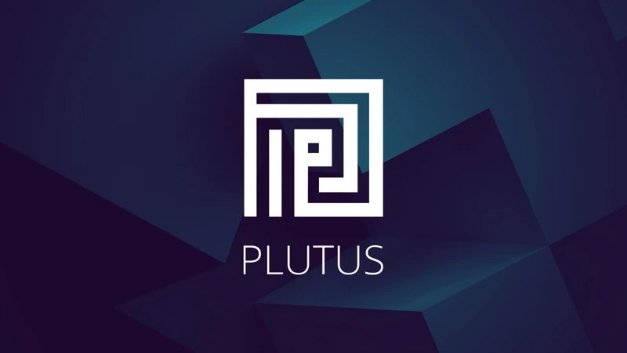

# Strategic partners pave way for Plutus smart contracts
### **Metalamp and Runtime Verification among developers priming Cardano for the age of DeFi** 
 12 May 2021[ Anthony Quinn](tmp//en/blog/authors/anthony-quinn/page-1/) 6 mins read

### [**Anthony Quinn**](tmp//en/blog/authors/anthony-quinn/page-1/)
Editor

Marketing & Communications

- 
- 
- 
- 

The technical infrastructure is being laid for Plutus smart contracts on Cardano. But such infrastructure for decentralized finance (DeFi) is like a road with no cars if there aren’t the developers to write the contracts that will drive platform adoption and usage. 

Cơ sở hạ tầng kỹ thuật đang được đặt cho các hợp đồng thông minh Plutus trên Cardano.
Nhưng cơ sở hạ tầng như vậy cho tài chính phi tập trung (DEFI) giống như một con đường không có xe hơi nếu có các nhà phát triển viết các hợp đồng sẽ thúc đẩy việc áp dụng nền tảng và sử dụng.

The [Plutus pioneer program](https://iohk.io/en/blog/posts/2021/04/01/everything-you-need-to-know-about-our-new-plutus-pioneer-program/) was kicked off in April, as part of an evolving scheme for developer education that began over two years ago. The goal? To provide structured training for anyone who wants to learn about functional programming, so they can begin using Haskell and Plutus, and start building their first apps. Alongside this keen and committed group of about 1,500 ‘trainee’ Plutus developers, we’ve also formed partnerships with experienced software development houses to build a number of [decentralized applications](https://github.com/input-output-hk/plutus-use-cases) (DApps) to stress-test the network, provide some early proof-of-concept applications, and assess our processes and support for the army of developers that follow.

[Chương trình Pioneer Plutus] (https://iohk.io/en/blog/posts/2021/04/01/everything-you-need-to-know-about-our-new-plutus-pioneer-program/)
đã được khởi động vào tháng Tư, như một phần của kế hoạch phát triển cho giáo dục nhà phát triển bắt đầu từ hai năm trước.
Mục đích?
Để cung cấp đào tạo có cấu trúc cho bất kỳ ai muốn tìm hiểu về lập trình chức năng, vì vậy họ có thể bắt đầu sử dụng Haskell và Plutus, và bắt đầu xây dựng các ứng dụng đầu tiên của họ.
Bên cạnh nhóm nhạy bén và cam kết này khoảng 1.500 nhà phát triển Plutus, chúng tôi cũng đã thành lập quan hệ đối tác với các nhà phát triển phần mềm có kinh nghiệm để xây dựng một số [ứng dụng phi tập trung] (https://github.com/input-
Đầu ra-HK/PLUTUS-CASE) (DAPPS) để kiểm tra ứng suất mạng, cung cấp một số ứng dụng chứng minh sớm về khái niệm và đánh giá các quy trình và hỗ trợ của chúng tôi cho quân đội của các nhà phát triển theo sau.

The plan for Plutus is to have ‘professional developers complement the work of the pioneer program and help fast-track our quality assurance and testing process towards the Alonzo hard fork,’ says Silviu Petricescu, director of product strategy. 

Kế hoạch cho Plutus là có các nhà phát triển chuyên nghiệp bổ sung cho công việc của chương trình Tiên phong và giúp theo dõi nhanh chóng quá trình đảm bảo và thử nghiệm chất lượng của chúng tôi đối với Alonzo Hard Fork, "Silviu Petricescu, giám đốc chiến lược sản phẩm.

‘The Cardano community has been integral to us testing, improving and rolling out the network since the days of the incentivized testnet,’ he adds. Professional developers add another element to the process – in terms of expertise, sitting somewhere between the core internal team and the pioneers – ‘to scrutinize everything’, he adds. ‘Starting with documentation, tools and all the support elements that we are going to provide, they are going to be the first to test it all and give us feedback. We will include that in our internal testing and quality assurance processes.’

"Cộng đồng Cardano đã không thể thiếu đối với chúng tôi thử nghiệm, cải thiện và triển khai mạng kể từ những ngày của Testnet được khuyến khích," ông nói thêm.
Các nhà phát triển chuyên nghiệp thêm một yếu tố khác vào quy trình - về chuyên môn, ngồi ở đâu đó giữa nhóm nội bộ cốt lõi và những người tiên phong - để xem xét kỹ lưỡng mọi thứ, ông nói thêm.
Bắt đầu với tài liệu, công cụ và tất cả các yếu tố hỗ trợ mà chúng tôi sẽ cung cấp, chúng sẽ là người đầu tiên kiểm tra tất cả và cung cấp cho chúng tôi phản hồi.
Chúng tôi sẽ bao gồm điều đó trong các quy trình kiểm tra nội bộ và đảm bảo chất lượng của chúng tôi.

It’s a two-pronged approach: the pioneer scheme will be training up an army of developers, while the partner scheme will bring in heavyweight expertise to make sure everything works – that way, everyone is ready when Plutus is deployed to the mainnet as the final component of [Goguen](https://roadmap.cardano.org/en/goguen/) on the Cardano roadmap. ‘Having these developers as part of this is a way for us to ensure that our quality of build towards the next hard fork will be at the level that we want,’ says Petricescu.

Đó là một cách tiếp cận hai hướng: kế hoạch tiên phong sẽ được đào tạo một đội quân của các nhà phát triển, trong khi chương trình đối tác sẽ mang lại chuyên môn hạng nặng để đảm bảo mọi thứ hoạt động theo cách đó, mọi người đã sẵn sàng khi Plutus được triển khai cho
Mainnet là thành phần cuối cùng của [Goguen] (https://roadmap.cardano.org/en/goguen/) trên lộ trình Cardano.
Petricescu cho biết, những nhà phát triển này là một phần của việc này là cách để chúng tôi đảm bảo rằng chất lượng xây dựng của chúng tôi đối với hard fork tiếp theo sẽ ở cấp độ mà chúng tôi muốn, "Petricescu nói.

Gerard Moroney, director of operations, has been bringing these software houses into the scheme. ‘We've been talking to companies that have experience with blockchain, and blockchain consultancies, and others that are not necessarily crypto but know distributed computing. We've also looked at consultancies that have solid Haskell experience.’ Enthusiasm and passion are also part of the equation: ‘We're working with companies that really want to try something new, something innovative and interesting. Fundamentally, we're backing people who want to be brave and be ahead of the curve.’ 

Gerard Moroney, giám đốc điều hành, đã đưa các nhà phần mềm này vào kế hoạch này.
"Chúng tôi đã nói chuyện với các công ty có kinh nghiệm với blockchain và tư vấn blockchain, và những người khác không nhất thiết phải là tiền điện tử nhưng biết điện toán phân tán.
Chúng tôi cũng đã xem xét các chuyên gia tư vấn có kinh nghiệm Haskell. "Sự nhiệt tình và đam mê cũng là một phần của phương trình:" Chúng tôi đang làm việc với các công ty thực sự muốn thử một cái gì đó mới, sáng tạo và thú vị.
Về cơ bản, chúng tôi đang ủng hộ những người muốn dũng cảm và đi trước đường cong.

Of course, the blockchain never sleeps and the search has taken him far and wide, holding talks with consultancy companies across Europe, Asia Pacific, and the Americas. ‘Some of them were entirely new to us,’ he says, ‘but they already knew about Cardano and Plutus – and that's been really interesting.’

Tất nhiên, blockchain không bao giờ ngủ và cuộc tìm kiếm đã đưa anh ta đi xa, tổ chức các cuộc đàm phán với các công ty tư vấn trên khắp châu Âu, châu Á Thái Bình Dương và châu Mỹ.
"Một số người trong số họ hoàn toàn mới đối với chúng tôi," anh ấy nói, "nhưng họ đã biết về Cardano và Plutus - điều đó thực sự thú vị."

These are companies that have experience in the finance sector and business so ‘they've all got great ideas’ he adds. ‘We're giving them guidance about what we want them to work against at the beginning, but they're also coming up with new ideas – and that’s a lot of fun.’ 

Đây là những công ty có kinh nghiệm trong lĩnh vực tài chính và kinh doanh, vì vậy, tất cả họ đều có những ý tưởng tuyệt vời mà ông nói thêm.
"Chúng tôi sẽ cho họ hướng dẫn về những gì chúng tôi muốn họ làm việc chống lại lúc đầu, nhưng họ cũng đưa ra những ý tưởng mới - đó là rất nhiều niềm vui."

March’s [Cardano360 show](https://www.youtube.com/watch?v=ULBLgPgxtN8&t=4406s) ran interviews with some of the partner companies. When it comes to software engineering, their expertise soon becomes clear. [Obsidian Systems](https://obsidian.systems/), for example, provided many of the tools and the technical support for the block validators who maintain the Tezos proof-of-stake blockchain. 

[Chương trình Cardano360 của tháng ba] (https://www.youtube.com/watch?v=ulblGPGXTN8&t=4406) đã chạy các cuộc phỏng vấn với một số công ty đối tác.
Khi nói đến kỹ thuật phần mềm, chuyên môn của họ sẽ sớm trở nên rõ ràng.
[Hệ thống Obsidian] (ví dụ, https://obsidian.systems/) đã cung cấp nhiều công cụ và hỗ trợ kỹ thuật cho các trình xác nhận khối duy trì blockchain bằng chứng Tezos.

On a visit to the [Metalamp](https://en.metalamp.io/) offices, you’d find yourself in the city of Omsk in Siberia among a team that thrives on ‘complex and time-consuming projects’, often built on the Haskell programming language. ‘The company had heard about Cardano and knew that ‘it is one of the most fascinating projects written in Haskell’. Some of their teams had already played with Plutus before the companies came into contact. Metalamp has experience with financial technology and has built applications involving lenders, loans, and ledgers. 

Trong chuyến thăm [Metalamp] (https://en.metalamp.io/)
€ ™, thường được xây dựng trên ngôn ngữ lập trình Haskell.
"Công ty đã nghe về Cardano và biết rằng" Đó là một trong những dự án hấp dẫn nhất được viết bằng Haskellâ € ™.
Một số đội của họ đã chơi với Plutus trước khi các công ty tiếp xúc.
Metalamp có kinh nghiệm với công nghệ tài chính và đã xây dựng các ứng dụng liên quan đến người cho vay, các khoản vay và sổ cái.

Other companies supporting the rollout include:

Các công ty khác hỗ trợ triển khai bao gồm:

- [Eleks](https://eleks.com/): custom software engineering and consulting services since 1991. Based in Ukraine.

- [Eleks] (https://eleks.com/): Dịch vụ tư vấn và kỹ thuật phần mềm tùy chỉnh từ năm 1991. có trụ sở tại Ukraine.

- [Node Factory](https://nodefactory.io/): blockchain research and development specialist in Zagreb.

- [Nhà máy nút] (https://nodefactory.io/): Chuyên gia nghiên cứu và phát triển blockchain ở Zagreb.

- [MLabs](https://www.mlabs.city/): develops compilers, artificial intelligence, and DevOps applications, mostly in Haskell, Python, and Typescript. 

- [MLABS] (https://www.mlabs.city/): Phát triển trình biên dịch, Trí tuệ nhân tạo và các ứng dụng DevOps, chủ yếu là ở Haskell, Python và TypeScript.â

- [BinarApps](https://binarapps.com/): based in Poland, this developer specializes in projects for the retail and loyalty sectors.

- [Binarapps] (https://binarapps.com/): Có trụ sở tại Ba Lan, nhà phát triển này chuyên về các dự án cho các lĩnh vực bán lẻ và lòng trung thành.

Developers are looking forward to exploring applications involving digital exchanges and online sources called ‘oracles’ that bring information – whether it be commodity prices, exchange rates, airline timetables, or logistics schedules – into blockchains. The [Essential Cardano](https://github.com/input-output-hk/essential-cardano/blob/main/essential-cardano-list.md) page on GitHub maps the Cardano ecosystem and links to a library of resources. 

Các nhà phát triển đang mong muốn khám phá các ứng dụng liên quan đến trao đổi kỹ thuật số và các nguồn trực tuyến được gọi là ", việc mang lại thông tin cho dù đó là giá hàng hóa, tỷ giá hối đoái, thời gian biểu của hãng hàng không, hoặc lịch trình hậu cần - thành Blockchains.
[Cardano thiết yếu] (https://github.com/input-output-hk
.MỘT

## **A long time in the making**

## ** Một thời gian dài trong việc tạo ra **

Of course, Plutus will be used for complex financial smart contracts. There is a lot of money at stake with these contracts – it is reckoned that $43 billion is already locked into contracts using the Ethereum system. Yet DeFi is still at a very early stage and, as we showed in our recent [#CardanoAfrica](https://africa.cardano.org/) event, there is a whole new market out there for [real world use cases](https://www.youtube.com/watch?v=MhIYXIMJNno&t=1012s) (or RealFi as we call it).

Tất nhiên, Plutus sẽ được sử dụng cho các hợp đồng thông minh tài chính phức tạp.
Có rất nhiều tiền bị đe dọa với các hợp đồng này - Người ta cho rằng 43 tỷ đô la đã bị khóa trong các hợp đồng sử dụng hệ thống Ethereum.
Tuy nhiên, Defi vẫn đang ở giai đoạn rất sớm và, như chúng tôi đã trình bày trong sự kiện [#cardanoafrica] gần đây của chúng tôi (https://africa.cardano.org/), có một thị trường hoàn toàn mới cho [trường hợp sử dụng trong thế giới thực]]
.

Implementing secure smart contracts for the long term is hard, and software schedules are notoriously difficult! But the progress made by our blockchain engineers and the acceleration in the way the pieces of the Goguen jigsaw are falling into place are clear to see in the Plutus timeline below. The [Plutus Playground](https://playground.plutus.iohkdev.io/) is up and running. We have about 1,500 developers building their skills within the Pioneer program, writing scripts and building prototype apps. A series of Alonzo development testnets will soon begin rolling out – with core functionality at first, followed by a process of fast iteration with new capability and new user groups added in the weeks ahead. All the while, we are advancing steadily towards deployment of Alonzo on the mainnet and the start of smart contracts on Cardano.

Việc thực hiện các hợp đồng thông minh an toàn trong thời gian dài là khó khăn và lịch trình phần mềm nổi tiếng là khó khăn!
Nhưng tiến trình được thực hiện bởi các kỹ sư blockchain của chúng tôi và sự gia tốc theo cách các mảnh ghép của Goguen Ghimw đang rơi vào vị trí rõ ràng để thấy trong dòng thời gian Plutus bên dưới.
Theâ [Plutus Playground] (https://playground.plutus.iohkdev.io/) Â đang hoạt động.
Chúng tôi có khoảng 1.500 nhà phát triển xây dựng các kỹ năng của họ trong chương trình Tiên phong, viết kịch bản và xây dựng các ứng dụng nguyên mẫu.
Một loạt các bài kiểm tra phát triển Alonzo sẽ sớm bắt đầu triển khai - với chức năng cốt lõi lúc đầu, sau đó là một quá trình lặp nhanh với khả năng mới và các nhóm người dùng mới được thêm vào trong những tuần tới.
Trong khi đó, chúng tôi đang tiến lên ổn định để triển khai Alonzo trên Mainnet và bắt đầu các hợp đồng thông minh trên Cardano.

It’s going to be an exciting summer as everyone in the Cardano community – partners, pioneers and developers of every stripe – works tirelessly to ensure that the Plutus smart contract platform hits the ground running. The secure, energy-efficient system that decentralized finance has been waiting for.

Đây sẽ là một mùa hè thú vị khi tất cả mọi người trong cộng đồng Cardano - các đối tác, người tiên phong và nhà phát triển của mỗi Stripe - hoạt động không mệt mỏi để đảm bảo rằng nền tảng hợp đồng thông minh Plutus lên mặt đất.
Hệ thống an toàn, tiết kiệm năng lượng mà tài chính phi tập trung đã chờ đợi.

*We’re in the final stages of preparing the first Alonzo testnet, aiming for the end of the month. Keep an eye on our social channels this week for an update. You can try out the [Plutus Playground](https://playground.plutus.iohkdev.io/) for yourself, and join [Plutus discussions](https://forum.cardano.org/c/developers/cardano-plutus/148) at the Cardano Forum. There is also a [Plutus GitHub](https://github.com/input-output-hk/plutus) repository. You can [register your interest](https://input-output.typeform.com/to/gQ0t9ep5) and join our [Slack community](https://iohkdevcommunity.slack.com/join/shared_invite/zt-mdvb06fr-8Tv8pjl~iR0~lGrimqK_yg#/shared-invite/email).*

*Chúng tôi trong giai đoạn cuối của việc chuẩn bị Alonzo Testnet đầu tiên, nhắm vào cuối tháng.
Hãy để mắt đến các kênh xã hội của chúng tôi trong tuần này để cập nhật.
Bạn có thể dùng thử [Sân chơi Plutus] (https://playground.plutus.iohkdev.io/) cho chính mình và tham gia [Thảo luận Plutus] (https://forum.cardano.org/c/developers/cardano-plutus
/148) tại Diễn đàn Cardano.
Ngoài ra còn có một [PLUTUS GITHUB] (https://github.com/input-output-hk/plutus) Kho lưu trữ.
Bạn có thể [đăng ký sự quan tâm của mình] (https://input-oundput.typeform.com/to/gq0t9ep5) và tham gia [cộng đồng Slack] của chúng tôi (https://iohkdevcommunity.slack.com/join/shared_invite/zt-mdvb06fr-
8tv8pjl ~ ir0 ~ lgrimqk_yg#/chia sẻ invite/email).*

