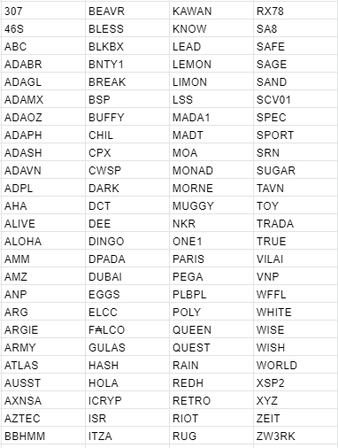

# Announcing new stake pools chosen for our delegation strategy
### **Committing to the health and diversity of the Cardano network, we are now announcing the new round of winners for delegation**
 14 May 2021[ Christian Lindgren](tmp//en/blog/authors/christian-lindgren/page-1/) 9 mins read

### [**Christian Lindgren**](tmp//en/blog/authors/christian-lindgren/page-1/)
Software Engineer

Engineering

- 
- 
- 

Cardano continues to grow, powered by a stake pool operator (SPO) community working toward a vision of an independent, globally decentralized ecosystem. Stake pools have always been the driving force of the Cardano network and we launched our delegation strategy to recognize and bootstrap the promising pools.

Cardano tiếp tục phát triển, được cung cấp bởi một cộng đồng người điều hành nhóm cổ phần (SPO) làm việc hướng tới tầm nhìn về một hệ sinh thái độc lập, phi tập trung toàn cầu.
Các nhóm cổ phần luôn là động lực của mạng Cardano và chúng tôi đã đưa ra chiến lược phái đoàn của mình để nhận ra và khởi động các nhóm đầy hứa hẹn.

To support our long-term vision for Cardano’s growth and network decentralization, we have already delegated the stake from retired IO Global pools to a number of promising stake pools in the ecosystem – to bootstrap their business and support community development goals, technical contributions, and geographical distribution. Our analysis has shown that our contribution helped them to become more stable in the network and attract delegators and community members who share their ideas and development objectives.

Để hỗ trợ tầm nhìn dài hạn của chúng tôi về sự tăng trưởng và phân cấp mạng của Cardano, chúng tôi đã ủy thác cổ phần từ các nhóm toàn cầu IO đã nghỉ hưu cho một số nhóm cổ phần đầy hứa hẹn trong hệ sinh thái-
, đóng góp kỹ thuật, và phân phối địa lý.
Phân tích của chúng tôi đã chỉ ra rằng sự đóng góp của chúng tôi đã giúp họ trở nên ổn định hơn trong mạng lưới và thu hút các ủy viên và thành viên cộng đồng chia sẻ ý tưởng và mục tiêu phát triển của họ.

## **Diversity & distribution**

## ** Đa dạng & phân phối **

Any community ecosystem needs its engineers and entrepreneurs, its technocrats, and its diplomats – globally. Equally, the pool ecosystem needs a balance of larger established players, a strong core, and an inflow of new entrants primed to build further success upon strong fundamentals.

Bất kỳ hệ sinh thái cộng đồng nào cũng cần các kỹ sư và doanh nhân, các nhà kỹ trị của nó và các nhà ngoại giao của nó - trên toàn cầu.
Một cách công bằng, hệ sinh thái hồ bơi cần sự cân bằng của những người chơi được thiết lập lớn hơn, cốt lõi mạnh mẽ và một dòng người mới tham gia để xây dựng thành công hơn nữa dựa trên các nguyên tắc cơ bản mạnh mẽ.

The problem that many stake pools currently face is their recognition within the ecosystem or rather visibility that allows the attraction of community support to ensure stable and consistent pool operation. Running a stake pool is not an easy process; unlike mining, it does not presume straightforward funds earning from just setting up a pool on the machine. You cannot buy your way to success through a better and better kit – indeed, Cardano is designed to be relatively light on computing resources. Stake pool operation is a complex business that has the hallmarks of both a commodity and a distributed market, and requires a blend of skills, persistence, and luck. 

Vấn đề mà nhiều nhóm cổ phần hiện đang phải đối mặt là sự công nhận của họ trong hệ sinh thái hoặc khả năng hiển thị đúng hơn cho phép thu hút hỗ trợ cộng đồng để đảm bảo hoạt động nhóm ổn định và nhất quán.
Chạy một nhóm cổ phần không phải là một quá trình dễ dàng;
Không giống như khai thác, nó không cho rằng các khoản tiền đơn giản kiếm được từ việc chỉ thiết lập một nhóm trên máy.
Bạn không thể mua theo cách của mình để thành công thông qua bộ dụng cụ tốt hơn và tốt hơn - Thật vậy, Cardano được thiết kế để tương đối nhẹ vào tài nguyên điện toán.
Hoạt động của nhóm cổ phần là một doanh nghiệp phức tạp có dấu hiệu của cả hàng hóa và thị trường phân tán, và đòi hỏi sự pha trộn của các kỹ năng, sự kiên trì và may mắn.

There are many factors that influence the pool’s success and differentiate it from the others. First of all, these are technical factors such as:

Có nhiều yếu tố ảnh hưởng đến thành công của nhóm và phân biệt nó với những yếu tố khác.
Trước hết, đây là những yếu tố kỹ thuật như:

- **Parameters**: this includes pledge influence factor, relative pool saturation size, stake delegated to the pool, and stake pledged by the owners.

- ** Các tham số **: Điều này bao gồm yếu tố ảnh hưởng cam kết, kích thước bão hòa nhóm tương đối, cổ phần được ủy quyền vào nhóm và cổ phần được cam kết bởi các chủ sở hữu.

- **Fiscal**: variable fee, fixed fee, and pledge should be all taken into account to ensure that the pool functions effectively, produces blocks, and earns rewards for its delegators.

- ** Tài chính **: Phí biến, phí cố định và cam kết phải được tính đến để đảm bảo rằng các chức năng của nhóm một cách hiệu quả, tạo ra các khối và kiếm phần thưởng cho các ủy viên của mình.

- **Performance**: calculated according to the pool’s expected activity as the ratio of the number of blocks a stake pool produces in a given epoch versus the number it was capable of producing.

- ** Hiệu suất **: Được tính theo hoạt động dự kiến của nhóm là tỷ lệ của số khối mà nhóm cổ phần tạo ra trong một kỷ nguyên nhất định so với số lượng mà nó có khả năng sản xuất.

- **Overall mission**: even if the pool meets all of the above requirements, this does not mean that it becomes totally recognized or drives straightforward attention. With over 2000 active pools in the ecosystem, it is essential to reveal to the community the mission that a certain pool is trying to achieve and explain why this exact choice is beneficial for others.

- ** Nhiệm vụ tổng thể **: Ngay cả khi nhóm đáp ứng tất cả các yêu cầu trên, điều này không có nghĩa là nó trở nên hoàn toàn được công nhận hoặc thúc đẩy sự chú ý đơn giản.
Với hơn 2000 nhóm hoạt động trong hệ sinh thái, điều cần thiết là tiết lộ cho cộng đồng, nhiệm vụ mà một nhóm nhất định đang cố gắng đạt được và giải thích lý do tại sao lựa chọn chính xác này có lợi cho người khác.

The ability to differentiate is key, and that is where the **marketing** factor steps in. Just like any business seeking ‘customers’ in a competitive market, no pool will get recognized unless it announces itself, tells a story, builds trust. So, commitment to raising awareness sits alongside vigilance towards node maintenance. Like any small business – and that's what this is – it requires clear objectives, and of course, goals that add value to the community while meeting the bottom line. 

Khả năng phân biệt là chìa khóa, và đó là yếu tố tiếp thị ** ** bước vào. Giống như bất kỳ doanh nghiệp nào đang tìm kiếm -
, xây dựng niềm tin.
Vì vậy, cam kết nâng cao nhận thức nằm cùng với sự cảnh giác đối với việc bảo trì nút.
Giống như bất kỳ doanh nghiệp nhỏ nào - và đó là những gì đây là - nó đòi hỏi các mục tiêu rõ ràng, và tất nhiên, các mục tiêu làm tăng giá trị cho cộng đồng trong khi đáp ứng điểm mấu chốt.

## **Opportunities**

## **Những cơ hội**

We announced a new stage of application submission earlier in April, and are now committing to redelegate our funds to a new cohort of stake pools and – we hope – help them grow to their potential.

Chúng tôi đã công bố một giai đoạn mới nộp đơn nộp đơn vào đầu tháng Tư, và hiện đang cam kết tái phân phối tiền của chúng tôi cho một nhóm nhóm cổ phần mới và chúng tôi hy vọng chúng tôi hy vọng sẽ giúp họ phát triển tiềm năng của họ.

Even though we may *want* every pool to be successful, not every pool will be. With our delegation, we are committing to help those stake pools that ultimately, have not yet reached the desired level of awareness. One of the critical issues a stake pool operator comes across is uncertainty and the inability to rely on consistent rewards. This is like with venture capital investments – stakeholders invest in those projects where they see returns on investment. But what if the mission is highly important and promising, but there is no capital to kick it off? In such cases, many companies receive initial support (investment) in order to boost their development and reach desired goals. 

Mặc dù chúng tôi có thể * muốn * mọi nhóm thành công, nhưng không phải mọi nhóm sẽ được.
Với phái đoàn của chúng tôi, chúng tôi đang cam kết giúp đỡ những nhóm cổ phần mà cuối cùng, vẫn chưa đạt được mức độ nhận thức mong muốn.
Một trong những vấn đề quan trọng mà một nhà điều hành nhóm cổ phần gặp phải là sự không chắc chắn và không có khả năng dựa vào phần thưởng nhất quán.
Điều này giống như với các khoản đầu tư đầu tư mạo hiểm - các bên liên quan đầu tư vào những dự án nơi họ thấy lợi tức đầu tư.
Nhưng điều gì sẽ xảy ra nếu nhiệm vụ rất quan trọng và hứa hẹn, nhưng không có vốn để khởi động nó?
Trong những trường hợp như vậy, nhiều công ty nhận được hỗ trợ ban đầu (đầu tư) để tăng cường phát triển và đạt được các mục tiêu mong muốn.

In the same way, we are willing to support promising stake pools, and help them get established within the ecosystem by evening out more predictable rewards and, thus, attracting a higher number of delegators to support their mission. 

Theo cách tương tự, chúng tôi sẵn sàng hỗ trợ các nhóm cổ phần đầy hứa hẹn và giúp họ được thành lập trong hệ sinh thái vào buổi tối phần thưởng dễ dự đoán hơn và do đó, thu hút số lượng ủy viên cao hơn để hỗ trợ nhiệm vụ của họ.

Differentiation is key to success, and we hope that we can provide the chosen stake pools with opportunities to establish themselves and keep sustainable and stable operations without relying on the luckiness factor. We can now share details of the fresh cohort of stake pools chosen to take part in our new delegation round. But first, a closer look into objectives and the process.

Sự khác biệt là chìa khóa thành công và chúng tôi hy vọng rằng chúng tôi có thể cung cấp cho nhóm cổ phần được chọn cơ hội để thiết lập bản thân và giữ các hoạt động bền vững và ổn định mà không cần dựa vào yếu tố may mắn.
Bây giờ chúng tôi có thể chia sẻ chi tiết về đoàn hệ Fresh of Stake Pool được chọn để tham gia vào vòng phân phối mới của chúng tôi.
Nhưng trước tiên, hãy xem xét kỹ hơn các mục tiêu và quá trình.

## **The process**

## **Quá trình**

Choosing the pools for delegation is always a complex process. Every active pool is making a contribution to the globally decentralized network. Last time, when assessing the pools and their contributions, we have been guided by such factors as their goals and purpose, geographical location, technical contribution, stake & pledge ratio, and community/social media engagement. 

Chọn các nhóm cho phái đoàn luôn là một quá trình phức tạp.
Mỗi nhóm hoạt động đang đóng góp cho mạng lưới phi tập trung toàn cầu.
Lần trước, khi đánh giá các nhóm và đóng góp của chúng, chúng tôi đã được hướng dẫn bởi các yếu tố như mục tiêu và mục đích của chúng, vị trí địa lý, đóng góp kỹ thuật, tỷ lệ cổ phần & cam kết và sự tham gia của cộng đồng/phương tiện truyền thông xã hội.

With 700 pools to assess, we were always going to disappoint many pools and some may feel they have been unfairly overlooked. Even after some initial filtering, we had a field of some 300 pools that met many of the criteria we identified. Thanks again to [pooltool.io](https://pooltool.io/) and [adapools.org](https://adapools.org/) for providing additional data sources during the process.

Với 700 hồ bơi để đánh giá, chúng tôi luôn làm thất vọng nhiều hồ bơi và một số có thể cảm thấy chúng đã bị bỏ qua một cách không công bằng.
Ngay cả sau một số bộ lọc ban đầu, chúng tôi đã có một trường gồm khoảng 300 nhóm đáp ứng nhiều tiêu chí mà chúng tôi đã xác định.
Một lần nữa cảm ơn [pooltool.io] (https://pooltool.io/) và [adapools.org] (https://adapools.org/) đã cung cấp thêm các nguồn dữ liệu trong quá trình.

Purpose and mission remain an important part of Cardano so this was again part of the mix. Greater weight this time was also given towards other key aspects such as *geographic distribution*, *social/community activity*, and *support for the lower-middle sized part of the network*. Pragmatically, sustainable support needs to focus on pools that are neither strongest nor weakest. The following delegation distribution was defined:

Mục đích và nhiệm vụ vẫn là một phần quan trọng của Cardano vì vậy đây một lần nữa là một phần của sự pha trộn.
Trọng lượng lớn hơn lần này cũng được đưa ra cho các khía cạnh quan trọng khác như *phân phối địa lý *, *hoạt động xã hội/cộng đồng *và *hỗ trợ cho phần có kích thước trung bình thấp hơn của mạng *.
Một cách thực tế, hỗ trợ bền vững cần tập trung vào các nhóm không mạnh nhất cũng không yếu nhất.
Phân phối ủy quyền sau đây đã được xác định:

- 50% of our dedicated stake to the geographically distributed pools 

- 50% cổ phần dành riêng của chúng tôi cho các nhóm phân phối địa lý

- 25% to socially active pools with solid technical potential

- 25% cho các nhóm hoạt động xã hội có tiềm năng kỹ thuật vững chắc

- 25% to the lower-middle sized pools to even out the network balance

- 25% cho các nhóm có kích thước trung bình thấp hơn để vượt qua số dư mạng

Let’s take a closer look at the factors that influenced our choice to understand the reasoning behind it.

Hãy xem xét kỹ hơn các yếu tố ảnh hưởng đến sự lựa chọn của chúng tôi để hiểu lý do đằng sau nó.

**Geographical distribution**

**Phân bố địa lý**

Cardano is a decentralized, distributed network of nodes that work together to verify block production and transaction validity in the network. Decentralization is key to this process as only independence from governing entities establishes trust and confidence in handling financial activities. To ensure that the network is resilient to connectivity failures, it is essential that stake pool operation nodes are distributed across the globe without significant concentration in one location. This is beneficial for setting up connections between different regions and eliminates a single point of failure. A minimum of two relays was another factor in play as part of this.

Cardano là một mạng lưới các nút phân tán, phân phối hợp tác với nhau để xác minh khối hợp lệ sản xuất và giao dịch trong mạng.
Phân cấp là chìa khóa cho quá trình này vì chỉ có sự độc lập từ các thực thể quản lý thiết lập niềm tin và niềm tin trong việc xử lý các hoạt động tài chính.
Để đảm bảo rằng mạng kiên cường với các lỗi kết nối, điều cần thiết là các nút hoạt động của nhóm cổ phần được phân phối trên toàn cầu mà không có sự tập trung đáng kể ở một vị trí.
Điều này có lợi cho việc thiết lập các kết nối giữa các vùng khác nhau và loại bỏ một điểm thất bại duy nhất.
Tối thiểu hai rơle là một yếu tố khác trong trò chơi như một phần của điều này.

**Social/community activity**

** Hoạt động xã hội/cộng đồng **

Our survey earlier in the year helped us understand that a critical issue SPOs face is the inability to differentiate. For this reason, we used a social impact score from [Pulsar](https://www.pulsarplatform.com/) to help us understand which stake pools were gaining traction across potential delegators. 

Khảo sát của chúng tôi hồi đầu năm đã giúp chúng tôi hiểu rằng một vấn đề quan trọng mà Spos phải đối mặt là không có khả năng phân biệt.
Vì lý do này, chúng tôi đã sử dụng điểm tác động xã hội từ [Pulsar] (https://www.pulsarplatform.com/) để giúp chúng tôi hiểu được nhóm cổ phần nào đạt được lực kéo trên các ủy viên tiềm năng.

As well as ‘ambassadors’ for the network, we have evaluated socially active stake pools that operate to support business goals in their countries or for the betterment of various community activities. We have chosen those pools that have great social presence and community engagement but face difficulties in gaining a stronger position in terms of reward predictability. To be clear, technical performance is still the most important factor – no amount of tweets or Reddit posts is going to make up for missed blocks.

Cũng như "bassadors "cho mạng, chúng tôi đã đánh giá các nhóm cổ phần hoạt động xã hội hoạt động để hỗ trợ các mục tiêu kinh doanh tại quốc gia của họ hoặc để cải thiện các hoạt động cộng đồng khác nhau.
Chúng tôi đã chọn những nhóm có sự hiện diện xã hội tuyệt vời và sự tham gia của cộng đồng nhưng phải đối mặt với những khó khăn trong việc đạt được một vị trí mạnh mẽ hơn về khả năng dự đoán phần thưởng.
Để rõ ràng, hiệu suất kỹ thuật vẫn là yếu tố quan trọng nhất - Không có số lượng tweet hoặc bài đăng reddit nào sẽ bù đắp cho các khối bị bỏ lỡ.

**Network balance**

** Cân bằng mạng **

With such a variety of stake pools all functioning for different purposes, we are also distinguishing potentially strong pools that have been working hard to keep the network activities and support block production and transaction validation. Delegating to these pools, we support smaller-middle size businesses and help their delegators earn stable rewards. 

Với một loạt các nhóm cổ phần như vậy, tất cả các hoạt động cho các mục đích khác nhau, chúng tôi cũng đang phân biệt các nhóm có khả năng mạnh mẽ đã làm việc chăm chỉ để giữ các hoạt động mạng và hỗ trợ xác thực sản xuất và giao dịch khối.
Ủy thác cho các nhóm này, chúng tôi hỗ trợ các doanh nghiệp có quy mô trung bình nhỏ hơn và giúp các ủy viên của họ kiếm được phần thưởng ổn định.

Due to the security properties of the Ouroboros protocol, the selection process for block production is ultimately randomized, and the probability of creating a block is proportional to the amount of delegated stake.

Do tính chất bảo mật của giao thức OuroBoros, quy trình lựa chọn sản xuất khối cuối cùng là ngẫu nhiên và xác suất tạo một khối tỷ lệ thuận với số lượng cổ phần được ủy quyền.

Such a condition is well-applicable for long-term reward behavior, however, in terms of shorter timespans (one or several epochs), this randomness can yield an unpredictable amount of rewards. This effect increases the smaller amount of delegation the pool has, which in turn might have an undesired side effect disconcerting delegators who expect a predictable amount of return on their stake.

Một điều kiện như vậy là có thể áp dụng tốt cho hành vi phần thưởng dài hạn, tuy nhiên, về mặt thời gian ngắn hơn (một hoặc một số kỷ nguyên), sự ngẫu nhiên này có thể mang lại một lượng phần thưởng không thể đoán trước.
Hiệu ứng này làm tăng số lượng phái đoàn nhỏ hơn mà nhóm có, từ đó có thể có một hiệu ứng phụ không mong muốn gây khó chịu cho các ủy quyền mong đợi một khoản lợi nhuận có thể dự đoán được trên cổ phần của họ.

## **Meeting the winners**

## ** Gặp gỡ những người chiến thắng **

Here’s a list of 100 stake pools chosen for our new round of delegation. If you’re interested to find out more about these pools and their mission, you can easily do so at [adafolio.com](https://adafolio.com/portfolio/c5df0868-b4cf-11eb-8c63-0242c0a86003) or [adapools.org](https://adapools.org/delegations/input-output). 

Dưới đây là danh sách 100 nhóm cổ phần được chọn cho vòng ủy quyền mới của chúng tôi.
Nếu bạn quan tâm để tìm hiểu thêm về các nhóm này và nhiệm vụ của họ, bạn có thể dễ dàng làm như vậy tại [adafolio.com] (https://adafolio.com/portfolio
[adapools.org] (https://adapools.org/delegations/input-oundput).

We are aiming to delegate to these pools at the end of May/early June, so SPOs can expect to receive ada from then for a period of three months. 

Chúng tôi đang nhắm đến việc ủy thác cho các nhóm này vào cuối tháng 5/đầu tháng 6, vì vậy các Spos có thể mong đợi nhận được ADA từ đó trong khoảng thời gian ba tháng.

## **Looking ahead**

## ** Nhìn về phía trước **

As much as we are happy to recognize 100 stake pools that we believe have solid potential in reaching business objectives and supporting ecosystem sustainability, we still understand that there are many more contributors that we are not able to delegate to this time. We would like to thank you for all you do and if you were not selected this time, please note that we’ll have a new delegation round three months from now. 

Nhiều như chúng tôi rất vui khi nhận ra 100 nhóm cổ phần mà chúng tôi tin rằng có tiềm năng vững chắc trong việc tiếp cận các mục tiêu kinh doanh và hỗ trợ bền vững hệ sinh thái, chúng tôi vẫn hiểu rằng có nhiều người đóng góp hơn mà chúng tôi không thể ủy thác cho đến thời điểm này.
Chúng tôi muốn cảm ơn bạn vì tất cả những gì bạn làm và nếu bạn không được chọn lần này, xin lưu ý rằng chúng tôi sẽ có một phái đoàn mới vòng ba tháng kể từ bây giờ.

So, we encourage all pools that missed out to apply again for the fresh cohort during Q3, and we’ll make a new call for applications in June to rotate delegations in July. While technical analysis is the primary way that pools are identified for delegation, we always welcome community feedback on how we can continue to improve the process. We are committed to seeing the Cardano ecosystem go from strength to strength. Together we have created the world’s leading proof-of-stake ecosystem and we want to do what we can to maintain and improve it as it matures.

Vì vậy, chúng tôi khuyến khích tất cả các nhóm đã bỏ lỡ để áp dụng lại cho đoàn hệ mới trong quý 3 và chúng tôi sẽ thực hiện một cuộc gọi mới cho các ứng dụng vào tháng 6 để xoay các phái đoàn vào tháng Bảy.
Mặc dù phân tích kỹ thuật là cách chính mà các nhóm được xác định cho phái đoàn, chúng tôi luôn hoan nghênh phản hồi của cộng đồng về cách chúng tôi có thể tiếp tục cải thiện quy trình.
Chúng tôi cam kết thấy hệ sinh thái Cardano đi từ sức mạnh đến sức mạnh.
Chúng tôi đã cùng nhau tạo ra hệ sinh thái chứng minh hàng đầu của thế giới và chúng tôi muốn làm những gì có thể để duy trì và cải thiện nó khi nó trưởng thành.

*Thanks to Ben O’Hanlon, Colin Edwards, Francisco Landino, Sam Leathers, Olga Hryniuk & Tim Harrison for support and additional contributions.*

*Cảm ơn Ben Oâ € ™ Hanlon, Colin Edwards, Francisco Landino, Sam Leathers, Olga Hryniuk & Tim Harrison đã hỗ trợ và đóng góp bổ sung.*

