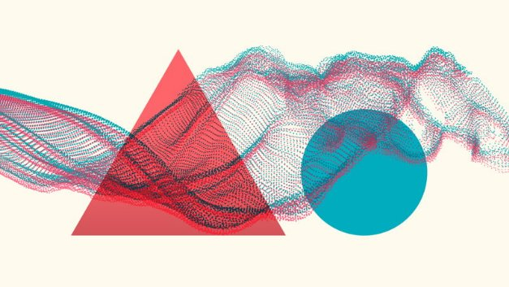
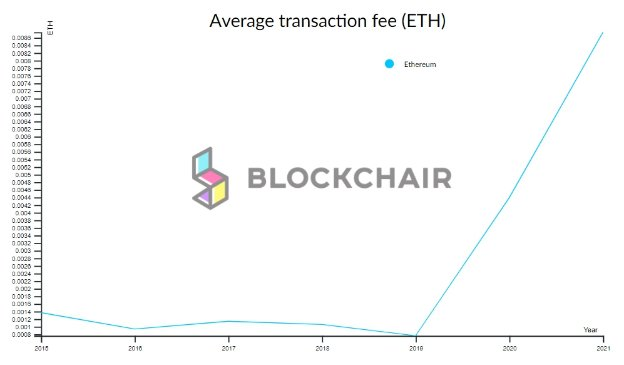

# Bringing ERC20 to Cardano
### **Our new ERC20 converter will allow Ethereum tokens like AGI to run on our proof-of-stake blockchain – coming soon to testnet**
 17 May 2021[ Francisco Landino](tmp//en/blog/authors/francisco-landino/page-1/) 7 mins read

### [**Francisco Landino**](tmp//en/blog/authors/francisco-landino/page-1/)
Project Manager

Commercial

- 
- 

Connecting blockchain protocols and collaborating on applications are essential to achieving the promise of decentralized finance (DeFi) and provide an alternative to the traditional banking system.

Kết nối các giao thức blockchain và hợp tác trên các ứng dụng là điều cần thiết để đạt được lời hứa về tài chính phi tập trung (DEFI) và cung cấp một giải pháp thay thế cho hệ thống ngân hàng truyền thống.

According to DeFi Pulse, a tracking website, cryptocurrency to a total value of over ‘[$75 billion is now locked up](https://defipulse.com/)’ in DeFi. A year ago, the total was just $700 million. Most of this value is in the form of crypto-assets based on the ERC20 token standard. 

Theo Defi Pulse, một trang web theo dõi, tiền điện tử với tổng giá trị trên ‘[75 tỷ đô la hiện đã bị khóa] (https://defipulse.com/) trong DEFI.
Một năm trước, tổng số chỉ là 700 triệu đô la.
Hầu hết các giá trị này là ở dạng tài sản tiền điện tử dựa trên tiêu chuẩn mã thông báo ERC20.

But Ethereum’s proof-of-work infrastructure is challenged with ever-rising costs. We foresaw this issue and providing an alternative was one of the founding principles we set for Cardano. This is about to come into fruition.

Nhưng cơ sở hạ tầng bằng chứng làm việc của Ethereum đã bị thách thức với chi phí ngày càng tăng.
Chúng tôi đã thấy trước vấn đề này và cung cấp một giải pháp thay thế là một trong những nguyên tắc sáng lập mà chúng tôi đặt ra cho Cardano.
Điều này sắp đi vào kết quả.

To expand the variety of use cases for application developers and businesses, Cardano will support the ERC20 token migration to its platform. The Alonzo hard fork and Plutus smart contracts are on the way. Once deployed, users of supported Ethereum tokens will be able to bring them over from Ethereum's congested network and take advantage of Cardano's transaction capacity and lower fees, while enjoying enhanced security, reduced cost, and interoperability. 

Để mở rộng sự đa dạng của các trường hợp sử dụng cho các nhà phát triển và doanh nghiệp ứng dụng, Cardano sẽ hỗ trợ di chuyển mã thông báo ERC20 sang nền tảng của mình.
Các hợp đồng thông minh Alonzo Hard và Plutus đang trên đường.
Sau khi được triển khai, người dùng mã thông báo Ethereum được hỗ trợ sẽ có thể mang chúng từ mạng bị tắc nghẽn của Ethereum và tận dụng khả năng giao dịch của Cardano và phí thấp hơn, trong khi tận hưởng bảo mật nâng cao, giảm chi phí và khả năng tương tác.

## **Why ERC20?**

## ** Tại sao ERC20? **

Let’s take a closer look at the nature of ERC20 to understand why this standard fits the market trends in terms of business needs. First, of course, Ethereum brought the concept of smart contracts and ‘programmable money’ to the blockchain in 2015. Since then, tokenization and the ERC20 token have gained popularity because of utility in everyday business transactions. Applications built on a blockchain can provide tokens that can serve as:

Hãy cùng xem xét kỹ hơn về bản chất của ERC20 để hiểu lý do tại sao tiêu chuẩn này phù hợp với xu hướng thị trường về nhu cầu kinh doanh.
Đầu tiên, tất nhiên, Ethereum đã đưa khái niệm về hợp đồng thông minh và tiền có thể lập trình cho blockchain vào năm 2015. Kể từ đó, mã thông báo và mã thông báo ERC20 đã trở nên phổ biến vì tiện ích trong các giao dịch kinh doanh hàng ngày.
Các ứng dụng được xây dựng trên một blockchain có thể cung cấp các token có thể phục vụ như:

- a payment unit

- Đơn vị thanh toán

- a transaction unit

- Một đơn vị giao dịch

- access to digital services

- Truy cập vào các dịch vụ kỹ thuật số

- a reward or incentive 

- Một phần thưởng hoặc khuyến khích

- a right to vote 

- Quyền bỏ phiếu

- an investment mechanism

- Một cơ chế đầu tư

Well-designed ERC20 tokens address many needs, and the more useful they become, the more demand grows and so their value grows accordingly. That is why these tokens are widely used and are so well supported by wallets and exchanges. 

Các mã thông báo ERC20 được thiết kế tốt giải quyết nhiều nhu cầu, và chúng càng hữu ích, nhu cầu càng tăng và do đó giá trị của chúng tăng lên theo.
Đó là lý do tại sao các mã thông báo này được sử dụng rộng rãi và được hỗ trợ rất tốt bởi ví và trao đổi.

## **Ethereum v Cardano**

## ** Ethereum v Cardano **

The ERC20 standard was invented for Ethereum, and as of today, there are [over 400,000 contracts based on this token standard](https://etherscan.io/tokens) with examples including Binance coin (BNB), Tether (USDT), Uniswap (UNI), and Dai (DAI) to name a few. 

Tiêu chuẩn ERC20 được phát minh cho Ethereum và cho đến ngày nay, có [hơn 400.000 hợp đồng dựa trên tiêu chuẩn mã thông báo này] (https://etherscan.io/tokens) với các ví dụ bao gồm Binance Coin (BNB), Tether (USDT),
UNISWAP (UNI) và DAI (DAI) để đặt tên cho một số.

Ethereum is a popular and functional blockchain platform, but it is slowing down and becoming more expensive. As more network participants interact with decentralized applications, the ‘gas’ fees paid for validating transactions are rising sharply (Figure 1).

Ethereum là một nền tảng blockchain phổ biến và chức năng, nhưng nó đang chậm lại và trở nên đắt đỏ hơn.
Khi nhiều người tham gia mạng tương tác với các ứng dụng phi tập trung, các khoản phí gas gas được trả cho các giao dịch xác thực đang tăng mạnh (Hình 1).

Figure 1. Ethereum gas fees are increasing

Hình 1. Phí khí Ethereum đang tăng

The problems being experienced by Ethereum users have also been identified by a Cointelegraph survey cited in ‘[DeFi Adoption 2020](https://s3.cointelegraph.com/storage/uploads/view/48c6c4e03f85bc722d76f88c2676478b.pdf?_ga=2.42938214.270418488.1602500005-1231871226.1593587737)’:

Các vấn đề đang gặp phải bởi người dùng Ethereum cũng đã được xác định bởi một cuộc khảo sát của Cointelegraph được trích dẫn trong '[Defi áp dụng 2020] (https://s3
1231871226.1593587737) ':

45% of platforms built on Ethereum name scalability and high gas costs among the top three problems constraining mass DeFi adoption.

45% nền tảng được xây dựng dựa trên khả năng mở rộng tên Ethereum và chi phí khí cao trong số ba vấn đề hàng đầu hạn chế áp dụng xác định hàng loạt.

Ethereum has not yet resolved these challenges and is unlikely to do so in the short term. So many businesses will want to consider other options. 

Ethereum vẫn chưa giải quyết những thách thức này và khó có thể làm như vậy trong thời gian ngắn.
Vì vậy, nhiều doanh nghiệp sẽ muốn xem xét các lựa chọn khác.

*By enabling the migration of ERC20 tokens to Cardano, we focus on delivering a value proposition that leverages Cardano’s advantages over Ethereum. In particular, Cardano's higher capacity for transaction processing and lower fees when compared with Ethereum's high cost and often congested traffic.*

*Bằng cách cho phép di chuyển mã thông báo ERC20 sang Cardano, chúng tôi tập trung vào việc cung cấp một đề xuất giá trị tận dụng lợi thế của Cardano, so với Ethereum.
Cụ thể, khả năng xử lý giao dịch cao hơn của Cardano và phí thấp hơn khi so sánh với chi phí cao của Ethereum và lưu lượng truy cập thường bị tắc nghẽn.*

## **Enabled by Ouroboros**

## ** Được kích hoạt bởi OuroBoros **

The key to addressing the problem of network congestion and high fees is Cardano’s Ouroboros proof-of-stake consensus mechanism. Compared with Ethereum’s proof-of-work protocol, Ouroboros needs far less energy to process network transactions; it runs using amounts of electricity on the scale of a large house, rather than a small country. Because of this, Ouroboros is not only eco-friendly but also needs far lower fees to process transactions. 

Chìa khóa để giải quyết vấn đề tắc nghẽn mạng và phí cao là cơ chế đồng thuận chống cổ phần của Cardano.
So với giao thức bằng chứng làm việc của Ethereum, Ouroboros cần ít năng lượng hơn để xử lý các giao dịch mạng;
Nó chạy bằng cách sử dụng lượng điện trên quy mô của một ngôi nhà lớn, thay vì một quốc gia nhỏ.
Bởi vì điều này, Ouroboros không chỉ thân thiện với môi trường mà còn cần các khoản phí thấp hơn nhiều để xử lý các giao dịch.

Additionally, Cardano does not require smart contract execution costs as the ledger supports native token functionality with its built-in accounting model. This means that the tracking, transfer, and ownership of different types of assets are handled by the ledger instead of smart contracts. Whereas the creation and transfer of ERC20 tokens on Ethereum require the manual modification of the standard contract type, the logic for this is built into Cardano, which also eliminates the risk of errors and vulnerabilities.

Ngoài ra, Cardano không yêu cầu chi phí thực hiện hợp đồng thông minh vì sổ cái hỗ trợ chức năng mã thông báo gốc với mô hình kế toán tích hợp.
Điều này có nghĩa là việc theo dõi, chuyển nhượng và quyền sở hữu các loại tài sản khác nhau được xử lý bởi sổ cái thay vì hợp đồng thông minh.
Trong khi việc tạo và chuyển các mã thông báo ERC20 trên Ethereum đòi hỏi phải sửa đổi thủ công loại hợp đồng tiêu chuẩn, logic cho điều này được tích hợp thành Cardano, cũng loại bỏ nguy cơ lỗi và lỗ hổng.

## **How the ERC20 converter works**

## ** Cách chuyển đổi ERC20 hoạt động **

Cardano currently supports ada and [native tokens](https://iohk.io/en/blog/posts/2021/02/18/building-native-tokens-on-cardano-for-pleasure-and-profit/), which have proven successful with over 160,000 tokens minted. We are now launching an ERC20 converter to ensure better interoperability in the future as well as lay a solid background for extended business opportunities.

Cardano hiện hỗ trợ ADA và [mã thông báo gốc] (https://iohk.io/en/blog/posts/2021/02/18/building-avative-tokens-on-cardano-for-pleasure-and-profit/),
đã được chứng minh thành công với hơn 160.000 mã thông báo.
Chúng tôi hiện đang ra mắt bộ chuyển đổi ERC20 để đảm bảo khả năng tương tác tốt hơn trong tương lai cũng như đặt nền tảng vững chắc cho các cơ hội kinh doanh mở rộng.

Our ERC20 converter is a tool that will allow issuing organizations and their users to handle ERC20 token migration to Cardano. It is designed for token issuers (organizations that wish to enable the migration of their tokens to Cardano), and their users (token holders) to use the tool to move their ERC20 tokens to the Cardano network.

Bộ chuyển đổi ERC20 của chúng tôi là một công cụ cho phép phát hành các tổ chức và người dùng của họ để xử lý việc di chuyển mã thông báo ERC20 sang Cardano.
Nó được thiết kế cho các tổ chức phát hành mã thông báo (các tổ chức muốn cho phép di chuyển mã thông báo của họ sang Cardano) và người dùng của họ (chủ sở hữu mã thông báo) sử dụng công cụ để chuyển mã thông báo ERC20 của họ sang mạng Cardano.

Users can convert their Ethereum tokens in just a few clicks, and when moved across, these tokens will be ‘translated’ into a special native token on Cardano that has the same value and works just like an ERC20. Additionally, if the user wishes to do so at a later stage, they can move their tokens back to the source network by burning them on Cardano. Two-way convertibility is baked in. 

Người dùng có thể chuyển đổi mã thông báo Ethereum của họ chỉ trong vài lần nhấp và khi di chuyển qua, các mã thông báo này sẽ được dịch thành một mã thông báo gốc đặc biệt trên Cardano có cùng giá trị và hoạt động giống như ERC20.
Ngoài ra, nếu người dùng muốn làm như vậy ở giai đoạn sau, họ có thể chuyển mã thông báo của họ trở lại mạng nguồn bằng cách đốt chúng trên Cardano.
Chuyển đổi hai chiều được nướng vào.

We’ll soon spin up a version of the ERC20 converter tool on a dedicated testnet. IO Global is currently working with partners for migration to Cardano, and [SingularityNET](https://singularitynet.io/) will be the first of these. The ERC20 converter will introduce a new [SingularityNET AGIX token](https://blog.singularitynet.io/singularitynet-phase-ii-launch-sequence-activated-agi-token-to-be-hard-forked-to-10ede4b6c89), the deployment of which marks the first milestone in the SingularityNET to Cardano migration plan. The initial testnet will allow users to assess the process of migration while working with AGIX tokens both in Cardano and Ethereum Kovan testnets.

Chúng tôi sẽ sớm quay một phiên bản của công cụ chuyển đổi ERC20 trên testnet chuyên dụng.
IO Global hiện đang làm việc với các đối tác để di chuyển sang Cardano và [SingularityNet] (https://singularitynet.io/) sẽ là lần đầu tiên trong số này.
Bộ chuyển đổi ERC20 sẽ giới thiệu một mã thông báo [SingularityNet Agix mới] (https://blog.singularitynet.io/singularitynet-ase-ii-launch-sorence-activated
), việc triển khai đánh dấu cột mốc đầu tiên trong Kế hoạch di chuyển Singularitynet đến Cardano.
TestNet ban đầu sẽ cho phép người dùng đánh giá quá trình di chuyển trong khi làm việc với các mã thông báo Agix cả trong Cardano và Ethereum Kovan Testnets.

It will be possible to authenticate an account using Metamask (an extension for the Chrome browser) with more options to come later. Users will also need to add their Daedalus testnet address so they can migrate their tokens to Cardano and easily track balances and transactions. 

Có thể xác thực một tài khoản bằng Metamask (một tiện ích mở rộng cho trình duyệt Chrome) với nhiều tùy chọn hơn sẽ đến sau.
Người dùng cũng sẽ cần thêm địa chỉ Daedalus Testnet của họ để họ có thể di chuyển mã thông báo của họ sang Cardano và dễ dàng theo dõi số dư và giao dịch.

When users log into their ERC20 converter account, they will see SingularityNET tokens listed and available for migration, and, by clicking on a token ‒ details such as token balance. They will just need to select the token, indicate the amount they would like to convert, and then migrate them by specifying a Cardano address. When tokens migrate to the address, it will be possible to use them for payments and transactions from the Daedalus wallet. All the activities will be visible both within Etherscan and the Cardano Explorer. 

Khi người dùng đăng nhập vào tài khoản chuyển đổi ERC20 của họ, họ sẽ thấy các mã thông báo SingularityNet được liệt kê và có sẵn để di chuyển, và, bằng cách nhấp vào mã thông báo - các chi tiết như cân bằng mã thông báo.
Họ sẽ chỉ cần chọn mã thông báo, cho biết số tiền họ muốn chuyển đổi, sau đó di chuyển chúng bằng cách chỉ định địa chỉ Cardano.
Khi mã thông báo di chuyển đến địa chỉ, sẽ có thể sử dụng chúng để thanh toán và giao dịch từ ví Daedalus.
Tất cả các hoạt động sẽ được nhìn thấy cả trong Etherscan và Cardano Explorer.

Figure 2. ERC20 converter dashboard

Hình 2. Bảng điều khiển chuyển đổi ERC20

At later stages, users will see different types of tokens within the dashboard. Tokens available for migration will be listed first, and if not yet eligible – it will be possible to subscribe for updates about any changes.

Ở giai đoạn sau, người dùng sẽ thấy các loại mã thông báo khác nhau trong bảng điều khiển.
Mã thông báo có sẵn để di chuyển sẽ được liệt kê trước và nếu chưa đủ điều kiện - có thể đăng ký để cập nhật về bất kỳ thay đổi nào.

## **A glance ahead**

## ** Một cái nhìn thoáng qua **

As the number of ERC20 converter partnerships increases, the range of token types supported will grow. Currently, our partners need to be custodians of their tokens, however, we will achieve greater interoperability while onboarding organizations when Plutus smart contracts operate on mainnet. 

Khi số lượng quan hệ đối tác chuyển đổi ERC20 tăng lên, phạm vi của các loại mã thông báo được hỗ trợ sẽ tăng lên.
Hiện tại, các đối tác của chúng tôi cần phải là người giám sát mã thông báo của họ, tuy nhiên, chúng tôi sẽ đạt được khả năng tương tác cao hơn trong khi lên tàu khi các hợp đồng thông minh Plutus hoạt động trên Mainnet.

Our goal is to support many tokens to create possibilities for business deals. So, further down the road, with a variety of tokens, the ERC20 converter will act as a bridge between blockchains, and this will promote effective cross-chain communication. 

Mục tiêu của chúng tôi là hỗ trợ nhiều mã thông báo để tạo ra các khả năng cho các giao dịch kinh doanh.
Vì vậy, xa hơn xuống đường, với một loạt các mã thông báo, bộ chuyển đổi ERC20 sẽ hoạt động như một cầu nối giữa các blockchains, và điều này sẽ thúc đẩy giao tiếp chuỗi chéo hiệu quả.

*The ERC20 converter testnet is now in the final stages of quality assurance testing before the public launch. This stage will allow us to test the user journey and improve their experience along with fixing any occurring issues. We will also soon provide the dedicated testnet environment with relevant documentation and instructions on how users can test the converter capabilities.*

*TestNet chuyển đổi ERC20 hiện đang trong giai đoạn cuối của thử nghiệm đảm bảo chất lượng trước khi ra mắt công chúng.
Giai đoạn này sẽ cho phép chúng tôi kiểm tra hành trình của người dùng và cải thiện trải nghiệm của họ cùng với việc khắc phục mọi vấn đề xảy ra.
Chúng tôi cũng sẽ sớm cung cấp cho môi trường TestNet chuyên dụng các tài liệu và hướng dẫn có liên quan về cách người dùng có thể kiểm tra các khả năng của bộ chuyển đổi.*

*We’ll share an update on May’s Cardano360 show. Meanwhile, stay tuned and follow our [Twitter announcements](https://twitter.com/InputOutputHK?ref_src=twsrc%5Egoogle%7Ctwcamp%5Eserp%7Ctwgr%5Eauthor) to find out more in due course!*

*Chúng tôi sẽ chia sẻ một bản cập nhật trên chương trình May Card Cardano360.
Trong khi đó, hãy theo dõi và theo dõi [thông báo Twitter của chúng tôi] (https://twitter.com/inputoutputhk?ref_src=twsrc%5egoogle%7ctwcamp%5eserp%7ctwgr%5eauthor)

