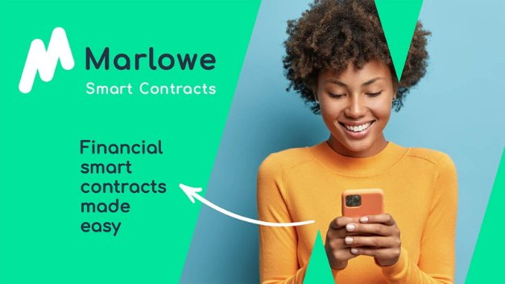

# Reimagining peer to peer finance with Marlowe
### **Marlowe decentralizes financial tools allowing anyone to create and execute peer-to-peer financial agreements**
 26 May 2021[ Shruti Appiah](tmp//en/blog/authors/shruti-appiah/page-1/) 6 mins read

### [**Shruti Appiah**](tmp//en/blog/authors/shruti-appiah/page-1/)
Head of Product

Engineering

- 
- 

A while ago, I logged in to my stock trading platform to buy some exchange-traded funds (ETFs). Alas, the platform was down! It turned out that the surge in the GameStop stock had forced quite a few trading platforms to shut down temporarily. We weren’t in the middle of a financial crisis, and I never expected that my bank or brokerage would block me from using my own funds without warning. I had assumed that I would always be able to access my funds, place trades, and reap profits or losses – a service for which I pay a handsome fee. 

Cách đây một thời gian, tôi đã đăng nhập vào nền tảng giao dịch chứng khoán của mình để mua một số quỹ giao dịch trao đổi (ETF).
Than ôi, nền tảng đã xuống!
Hóa ra, sự gia tăng trong cổ phiếu Gamestop đã buộc khá nhiều nền tảng giao dịch phải đóng cửa tạm thời.
Chúng tôi không phải là một cuộc khủng hoảng tài chính và tôi không bao giờ mong đợi rằng ngân hàng hoặc môi giới của tôi sẽ ngăn tôi sử dụng tiền của riêng mình mà không cần cảnh báo.
Tôi đã cho rằng tôi sẽ luôn có thể truy cập vào tiền của mình, giao dịch và gặt hái lợi nhuận hoặc lỗ - một dịch vụ mà tôi phải trả một khoản phí đẹp trai.

In the following days, several other stock brokers and trading platforms began blocking their users from performing trades that didn’t favour the brokers’ own agenda. Robinhood – which positions itself as the platform that *democratizes* finance – completely censored its users from buying GameStop stock. Are we ever truly in control of our money?

Trong những ngày tiếp theo, một số nhà môi giới chứng khoán và nền tảng giao dịch khác đã bắt đầu ngăn chặn người dùng của họ thực hiện các giao dịch không ủng hộ chương trình nghị sự của các nhà môi giới.
Robinhood - vị trí của mình là nền tảng * dân chủ hóa * tài chính - hoàn toàn kiểm duyệt người dùng của mình khỏi việc mua cổ phiếu gamestop.
Chúng ta có bao giờ thực sự kiểm soát tiền của mình không?

Almost all of us have given custody of our funds to some third-party, leaving us at their discretion to decide if and when those funds can be accessed, used, or even viewed. The commonality between these third-party banks and brokers is that there is a central point of control. In the case of Robinhood and GameStop, we have seen how this centralization can lead to failure. The central point of control can be influenced, attacked, or manipulated by an external self-interested actor, making it the antithesis of *democratized* finance.

Hầu như tất cả chúng tôi đã trao quyền nuôi các quỹ của chúng tôi cho một số bên thứ ba, khiến chúng tôi theo quyết định của họ để quyết định xem và khi nào các quỹ đó có thể được truy cập, sử dụng hoặc thậm chí được xem.
Điểm chung giữa các ngân hàng bên thứ ba này và các nhà môi giới là có một điểm kiểm soát trung tâm.
Trong trường hợp của Robinhood và Gamestop, chúng ta đã thấy làm thế nào tập trung này có thể dẫn đến thất bại.
Điểm kiểm soát trung tâm có thể bị ảnh hưởng, tấn công hoặc thao túng bởi một diễn viên tự quan tâm bên ngoài, làm cho nó trở thành phản đề của tài chính * dân chủ hóa *.

This is the core motivator of decentralized finance, commonly known as DeFi. DeFi offers a similar set of financial tools offered by Wall Street such as lending, escrows, derivatives, swaps, and securities. What makes DeFi platforms stand out is their ability to offer these financial instruments without the need for central market makers, banks, or brokers. Each financial agreement is represented as a smart contract on the blockchain, and is settled algorithmically. Their decentralized nature makes them far more resilient to market manipulation or the failure of a centralized system. 

Đây là động lực cốt lõi của tài chính phi tập trung, thường được gọi là defi.
Defi cung cấp một bộ công cụ tài chính tương tự được cung cấp bởi Phố Wall như cho vay, ký quỹ, phái sinh, hoán đổi và chứng khoán.
Điều làm cho các nền tảng Defi nổi bật là khả năng của họ để cung cấp các công cụ tài chính này mà không cần các nhà sản xuất thị trường trung tâm, ngân hàng hoặc môi giới.
Mỗi thỏa thuận tài chính được thể hiện dưới dạng hợp đồng thông minh trên blockchain và được giải quyết theo thuật toán.
Bản chất phi tập trung của họ làm cho họ kiên cường hơn nhiều đối với thao tác thị trường hoặc sự thất bại của một hệ thống tập trung.

We are currently developing a suite of Marlowe products to democratize finance and enable easy access to financial agreements. This includes **Marlowe Run**, a new product that will allow users to seamlessly execute off-the-shelf financial agreements with friends or clients in a secure fashion, and on their own. With added automation features and no need for third-parties, this peer-to-peer solution will be cost-effective, and more importantly, *democratizing*.

Chúng tôi hiện đang phát triển một bộ sản phẩm Marlowe để dân chủ hóa tài chính và cho phép dễ dàng truy cập vào các thỏa thuận tài chính.
Điều này bao gồm ** Marlowe Run **, một sản phẩm mới cho phép người dùng thực hiện liền mạch các thỏa thuận tài chính ngoài luồng với bạn bè hoặc khách hàng một cách an toàn và tự mình.
Với các tính năng tự động hóa bổ sung và không cần đối với các bên thứ ba, giải pháp ngang hàng này sẽ có hiệu quả về chi phí và quan trọng hơn là *dân chủ hóa *.

## **What is the Marlowe suite?**

## ** Bộ Marlowe là gì? **

With Marlowe, we aim to democratize finance by facilitating peer-to-peer agreements that run on a blockchain. We seek to empower people to create their own financial instruments and set up agreements with anyone with whom they want to interact. Marlowe will offer a suite of products, each product serving a different function and set of users. Marlowe’s overarching product strategy comprises three streams – *Marlowe for developers*, *Marlowe for end users*, and *Marlowe for enterprise*. 

Với Marlowe, chúng tôi nhằm mục đích dân chủ hóa tài chính bằng cách tạo điều kiện cho các thỏa thuận ngang hàng chạy trên một blockchain.
Chúng tôi tìm cách trao quyền cho mọi người để tạo ra các công cụ tài chính của riêng họ và thiết lập các thỏa thuận với bất kỳ ai mà họ muốn tương tác.
Marlowe sẽ cung cấp một bộ sản phẩm, mỗi sản phẩm phục vụ một chức năng và bộ người dùng khác nhau.
Chiến lược sản phẩm bao gồm bao gồm ba luồng của Marlowe bao gồm ba luồng - *Marlowe cho các nhà phát triển *, *Marlowe cho người dùng cuối *và *Marlowe cho Enterprise *.â.

## **Marlowe for developers**

## ** Marlowe cho các nhà phát triển **

Marlowe for developers includes **Marlowe Build** and **Marlowe Play** (also called the [Marlowe Playground](https://alpha.marlowe.iohkdev.io/#/)) as well as the input to the **Marlowe Library**. Marlowe Build and Marlowe Play together enable end-to-end financial smart contract development. 

Marlowe cho các nhà phát triển bao gồm ** Build Marlowe ** và ** chơi Marlowe ** (còn được gọi là [Sân chơi Marlowe] (https://alpha.marlowe.iohkdev.io/#/)) cũng như đầu vào cho**
*Thư viện Marlowe **.
Marlowe Build và Marlowe chơi cùng nhau cho phép phát triển hợp đồng thông minh tài chính từ đầu đến cuối.

Developers can compose smart contract code on *Marlowe Build*. Then, they can perform preliminary iterative design using simulations, and formally verify and test smart contracts on *Marlowe Play*. These capabilities – paired with a purpose-built domain-specific language (DSL) for finance – ensure that the contracts are easy and straightforward to build, as well as being secure, verifiable, and rigorously tested. Once built and tested, developers may contribute them to our open-source smart contract template library, the *Marlowe Library*. 

Các nhà phát triển có thể soạn mã hợp đồng thông minh trên *Build Marlowe *.
Sau đó, họ có thể thực hiện thiết kế lặp sơ bộ bằng cách sử dụng các mô phỏng và chính thức xác minh và kiểm tra các hợp đồng thông minh trên *Marlowe Play *.
Các khả năng này-kết hợp với ngôn ngữ cụ thể do miền (DSL) được xây dựng có mục đích để tài chính-Đảm bảo rằng các hợp đồng dễ dàng và đơn giản để xây dựng, cũng như được kiểm tra an toàn, có thể kiểm chứng và được kiểm tra nghiêm ngặt.
Sau khi được xây dựng và thử nghiệm, các nhà phát triển có thể đóng góp chúng cho thư viện mẫu hợp đồng thông minh nguồn mở của chúng tôi, thư viện *Marlowe *.

## **Marlowe for end users**

## ** Marlowe cho người dùng cuối **

Marlowe for end users will bring an intuitive, straightforward, and seamless interface for users to execute financial agreements with their friends, colleagues, or clients on the blockchain. This includes **Marlowe Run** and gives access to a variety of templates for financial instruments from the Marlowe Library. We’re designing these products with the user in mind. To make financial agreements on the Marlowe Run, the user does not need to know the ins and outs of blockchain, or how to write smart contracts. Every step of the contract is explained in non-technical language, and each action is performed only with the user’s explicit authorization. Our team has built a suite of rigorously tested and verified financial tools including escrows, debt securities, and swaps that can be used on the Marlowe Run. These – and many more verified open-source contracts – are made available through the Marlowe Library. 

Marlowe cho người dùng cuối sẽ mang lại giao diện trực quan, đơn giản và liền mạch cho người dùng để thực hiện các thỏa thuận tài chính với bạn bè, đồng nghiệp hoặc khách hàng của họ trên blockchain.
Điều này bao gồm ** Marlowe Run ** và cho phép truy cập vào nhiều mẫu khác nhau cho các công cụ tài chính từ Thư viện Marlowe.
Chúng tôi đang thiết kế các sản phẩm này với người dùng.
Để thực hiện các thỏa thuận tài chính trên Marlowe Run, người dùng không cần phải biết các điều khoản của blockchain hoặc cách viết hợp đồng thông minh.
Mỗi bước của hợp đồng được giải thích bằng ngôn ngữ phi kỹ thuật và mỗi hành động chỉ được thực hiện với ủy quyền rõ ràng của người dùng.
Nhóm của chúng tôi đã xây dựng một bộ các công cụ tài chính được kiểm tra và xác minh nghiêm ngặt bao gồm ký quỹ, chứng khoán nợ và hoán đổi có thể được sử dụng trên Marlowe Run.
Những điều này và nhiều hợp đồng nguồn mở được xác minh hơn-được cung cấp thông qua Thư viện Marlowe.

## **Marlowe for enterprise**

## ** Marlowe cho Enterprise **

Marlowe for enterprise aims to expand DeFi beyond individual users, helping enterprises to access the tangible benefits of smart contracts. This will include a bespoke, customizable suite of capabilities and financial agreements that are tailored to a commercial use case, with the provision of smart contract templates that adopt Algorithmic Contract Types Unified Standards [(Actus)](https://www.actusfrf.org/) for financial contracts.

Marlowe cho Enterprise nhằm mục đích mở rộng DEFI ngoài người dùng cá nhân, giúp các doanh nghiệp tiếp cận những lợi ích hữu hình của các hợp đồng thông minh.
Điều này sẽ bao gồm một bộ dụng cụ có thể tùy chỉnh, có thể tùy chỉnh các khả năng và thỏa thuận tài chính phù hợp với trường hợp sử dụng thương mại, với việc cung cấp các mẫu hợp đồng thông minh áp dụng các loại hợp đồng thuật toán thống nhất [(ACTUS)] (https: //www.actusfrf.
org/) cho các hợp đồng tài chính.

## **Implementing Marlowe on Cardano**

## ** Thực hiện Marlowe trên Cardano **

In 2020, we rolled out the [Marlowe Playground Alpha](https://alpha.marlowe.iohkdev.io/#/). This provided the ability to write contracts in JavaScript, in addition to Haskell, or directly in Marlowe itself. This also included proof-of-concept oracles, with the ability to access external data such as price, directly from a stock market ‘ticker’ or, in the future, data feeds such as Coinbase. To support the rollout, we published tutorials to guide developers. We have since been building on this work, continuing to improve the user experience, and building, testing, and validating more smart contract templates.

Vào năm 2020, chúng tôi đã tung ra [Marlowe Playground Alpha] (https://alpha.marlowe.iohkdev.io/#/).
Điều này cung cấp khả năng viết hợp đồng trong JavaScript, ngoài Haskell, hoặc trực tiếp trong chính Marlowe.
Điều này cũng bao gồm các nhà tiên tri bằng chứng, với khả năng truy cập dữ liệu bên ngoài như giá cả, trực tiếp từ thị trường chứng khoán-âtickerâ € ™ hoặc, trong tương lai, các nguồn cấp dữ liệu như Coinbase.
Để hỗ trợ triển khai, chúng tôi đã xuất bản các hướng dẫn để hướng dẫn các nhà phát triển.
Kể từ đó, chúng tôi đã xây dựng công việc này, tiếp tục cải thiện trải nghiệm người dùng và xây dựng, thử nghiệm và xác nhận các mẫu hợp đồng thông minh hơn.

As a part of the Goguen rollout, we are now in the process of completing the implementation of Marlowe on Cardano, giving users and organizations the opportunity to execute DeFi contracts they have written themselves or downloaded from a contract repository. Marlowe will run first of all on the Cardano blockchain, but it is blockchain-agnostic so could run on other blockchains to reach an even broader audience in the future.

Là một phần của buổi giới thiệu Goguen, chúng tôi hiện đang trong quá trình hoàn thành việc thực hiện Marlowe trên Cardano, cho người dùng và tổ chức cơ hội thực hiện các hợp đồng DEFI mà họ đã tự viết hoặc tải xuống từ kho lưu trữ hợp đồng.
Marlowe sẽ chạy trước hết trên blockchain Cardano, nhưng đó là blockchain-agnostic nên có thể chạy trên các blockchain khác để tiếp cận đối tượng thậm chí còn rộng hơn trong tương lai.

## **What comes next?**

## **Tiếp theo là gì?**

Marlowe for end users will come online in stages throughout 2021. First, is the prototype of Marlowe Run, where users can demo and try out their own financial agreements. This will include a suite of financial smart contract templates that users can customize to their needs. This prototype will allow users to explore the experience of making financial agreements in a decentralized fashion, all in a peer-to-peer manner without requiring a value-extracting third party. To use the Marlowe Run prototype, users don’t need to own any real tokens, so they may try the demo before they onboard. This rollout will include a suite of template financial instruments, built by our in-house developers. These templates can be used to execute test agreements on Marlowe Run. We’ll share a demo of Marlowe Run on this month’s Cardano360 show (airs May 27) so join us for that.

Marlowe cho người dùng cuối sẽ trực tuyến trong các giai đoạn trong suốt năm 2021. Đầu tiên, là nguyên mẫu của Marlowe Run, nơi người dùng có thể giới thiệu và thử các thỏa thuận tài chính của riêng họ.
Điều này sẽ bao gồm một bộ mẫu hợp đồng thông minh tài chính mà người dùng có thể tùy chỉnh theo nhu cầu của họ.
Nguyên mẫu này sẽ cho phép người dùng khám phá trải nghiệm thực hiện các thỏa thuận tài chính theo kiểu phi tập trung, tất cả đều theo cách thức ngang hàng mà không yêu cầu bên thứ ba loại trừ giá trị.
Để sử dụng nguyên mẫu Marlowe Run, người dùng không cần phải sở hữu bất kỳ mã thông báo thực sự nào, vì vậy họ có thể thử bản demo trước khi họ lên tàu.
Việc triển khai này sẽ bao gồm một bộ công cụ tài chính mẫu, được xây dựng bởi các nhà phát triển nội bộ của chúng tôi.
Các mẫu này có thể được sử dụng để thực hiện các thỏa thuận kiểm tra trên Marlowe Run.
Chúng tôi sẽ chia sẻ bản demo của Marlowe Run trong chương trình Cardano360 của tháng này (Airs 27 tháng 5) vì vậy hãy tham gia với chúng tôi.

We are committed to delivering this suite of products for the Marlowe ecosystem that empower people across the globe to build, control, and execute their own financial instruments on their terms. 

Chúng tôi cam kết cung cấp bộ sản phẩm này cho hệ sinh thái Marlowe trao quyền cho mọi người trên toàn cầu để xây dựng, kiểm soát và thực hiện các công cụ tài chính của riêng họ theo các điều khoản của họ.

*We are planning a series of webinars on decentralized finance with Marlowe (starting June 3rd), you can [register on our website](https://webinar.marlowe-finance.io/) for these webinars now!*

*Chúng tôi đang lên kế hoạch cho một loạt các hội thảo trên web về tài chính phi tập trung với Marlowe (bắt đầu từ ngày 3 tháng 6), bạn có thể [đăng ký trên trang web của chúng tôi] (https://webinar.marlowe-finance.io/) cho các hội thảo trực tuyến này ngay bây giờ!*

