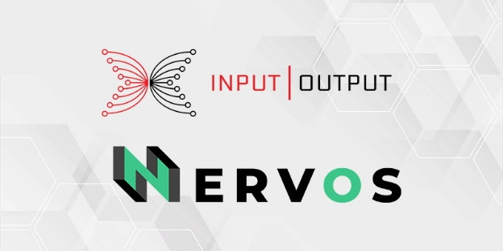

# Nervos partnership to build the first cross-chain bridge with Cardano
### **Our new collab lets Cardano and Nervos token holders transmit their value across both platforms while building interoperability across the crypto space**
 2 June 2021[ Eric Czuleger](tmp//en/blog/authors/eric-czuleger/page-1/) 3 mins read

### [**Eric Czuleger**](tmp//en/blog/authors/eric-czuleger/page-1/)
Senior Content Editor

Marketing & Communications

- 
- 
- 

IOHK and Nervos are teaming up to build a bridge of interoperability between Cardano and the Nervos Network. Once completed, this pioneering cross-chain bridge will enable users to transact assets between the two blockchains. The end goal is to foster greater interoperability while expanding the global reach and utility of both Nervos and Cardano.

IOHK và Nervos đang hợp tác để xây dựng một cây cầu tương tác giữa Cardano và Mạng lưới Nervos.
Sau khi hoàn thành, cây cầu chéo tiên phong này sẽ cho phép người dùng giao dịch tài sản giữa hai blockchains.
Mục tiêu cuối cùng là thúc đẩy khả năng tương tác cao hơn trong khi mở rộng phạm vi toàn cầu và tiện ích của cả Nervos và Cardano.

The Nervos ‘Common Knowledge Base’ ([CKB](https://coinmarketcap.com/currencies/nervos-network/historical-data/)) is a permissionless, layer 1, open-source, proof-of-work blockchain protocol focused on creating the foundations for an interoperable universal public network. It allows any crypto asset to be kept in a secure, immutable, and permissionless environment with the added benefit of smart contracts and layer 2 scaling. 

Nervos-Cơ sở kiến thức phổ biến '
Giao thức blockchain công việc tập trung vào việc tạo nền tảng cho một mạng công cộng phổ quát có thể tương tác.
Nó cho phép bất kỳ tài sản tiền điện tử nào được giữ trong một môi trường an toàn, bất biến và không cho phép với lợi ích bổ sung của hợp đồng thông minh và tỷ lệ lớp 2.

Nervos is developing this robust network through three key components. Together, these make up the Universal Passport, Nervos’ approach to next generation interoperability. 

Nervos đang phát triển mạng lưới mạnh mẽ này thông qua ba thành phần chính.
Cùng nhau, những điều này tạo nên hộ chiếu phổ quát, cách tiếp cận của Nervos -€ ™ đối với khả năng tương tác thế hệ tiếp theo.â

- **PW Core** – enables developers to build applications on all chains

- ** Core PW ** - Cho phép các nhà phát triển xây dựng các ứng dụng trên tất cả các chuỗi

- **Nervos’ Polyjuice** – an Ethereum-compatible layer that allows developers to port a smart contract from Ethereum to Nervos

- ** Polyjuice Nervosâ € ™

- **Force Bridge** – a trustless bridge that enables cross-chain transactions between Nervos and a spectrum of blockchains. Nervos will use Force Bridge to connect directly to Cardano, which means that users will be able to transact using their existing Cardano wallets.

- ** Cây cầu lực **- Một cây cầu không đáng tin cậy cho phép các giao dịch chuỗi chéo giữa Nervos và một loạt các blockchains.
Nervos sẽ sử dụng Force Bridge để kết nối trực tiếp với Cardano, điều đó có nghĩa là người dùng sẽ có thể giao dịch bằng cách sử dụng ví Cardano hiện có của họ.

## **Bridging blockchains with transportable tokens**

## ** Blockchain cầu nối với mã thông báo có thể vận chuyển **

So what does this mean in practice? Holders of Nervos CKByte (CKB) and ada will be able to transact both currencies interchangeably. Nervos users will also be able to take advantage of Cardano's native asset standard to create tokens that can be ported and used across both networks. On top of this, the bridge enables developers on both chains gain access to services and features to expand their DApp ecosystem and user bases. 

Vậy điều này có nghĩa là gì trong thực tế?
Những người nắm giữ Nervos CKBYTE (CKB) và ADA sẽ có thể giao dịch cả hai loại tiền tệ thay thế cho nhau.
Người dùng Nervos cũng sẽ có thể tận dụng tiêu chuẩn tài sản gốc của Cardano để tạo mã thông báo có thể được chuyển và sử dụng trên cả hai mạng.
Trên hết, cây cầu cho phép các nhà phát triển trên cả hai chuỗi có quyền truy cập vào các dịch vụ và các tính năng để mở rộng hệ sinh thái DAPP và cơ sở người dùng của họ.

[Mousebelt](https://www.mousebelt.com/), a full-service blockchain accelerator, will build the bridge with financial support from Nervos. The Cardano team will contribute expertise and resources to connect Cardano to the bridge. Development work is already underway and it is expected to be completed in the next six weeks. 

[MouseBelt] (https://www.mouseBelt.com/), Máy gia tốc blockchain đầy đủ dịch vụ, sẽ xây dựng cây cầu với sự hỗ trợ tài chính từ Nervos.
Nhóm Cardano sẽ đóng góp chuyên môn và nguồn lực để kết nối Cardano với cây cầu.
Công việc phát triển đã được tiến hành và dự kiến sẽ được hoàn thành trong sáu tuần tới.

'Using the Force Bridge to link the Nervos Network and Cardano is especially exciting given the relationship we have already built with IOHK,' said Kevin Wang, co-founder of Nervos. 'We have been growing our research and development partnership, but we will soon have a tangible bridge that will also showcase the power of the Force Bridge and push us further along the road to a functional and interoperable network.'

'Sử dụng cầu Lực để liên kết mạng lưới Nervos và Cardano đặc biệt thú vị với mối quan hệ mà chúng tôi đã xây dựng với IOHK', Kevin Wang, đồng sáng lập của Nervos nói.
'Chúng tôi đã phát triển quan hệ đối tác nghiên cứu và phát triển, nhưng chúng tôi sẽ sớm có một cây cầu hữu hình cũng sẽ thể hiện sức mạnh của cây cầu lực và đẩy chúng tôi đi dọc theo con đường đến một mạng lưới chức năng và có thể tương tác.'

This bridge is just part of our collaboration with Nervos. 'We share a vision of a world that works on a ‘constellation’ of interoperating blockchains,' says Romain Pellerin, CTO at Input Output. 'We believe that academic research is also fundamental to advancing the entire crypto space. Together we will also be co-authoring academic papers to pioneer improvements to the UTXO model, explore universal accounting standards, and contribute to the future development of decentralized technology through open-source research.'

Cây cầu này chỉ là một phần của sự hợp tác của chúng tôi với Nervos.
"Chúng tôi chia sẻ một tầm nhìn về một thế giới hoạt động trên một bộ phim liên tục", Romain Pellerin, CTO ở đầu ra.
'Chúng tôi tin rằng nghiên cứu học thuật cũng là cơ bản để thúc đẩy toàn bộ không gian tiền điện tử.
Cùng nhau, chúng tôi cũng sẽ là đồng tác giả các bài báo học thuật để cải tiến tiên phong cho mô hình UTXO, khám phá các chuẩn mực kế toán phổ quát và góp phần phát triển công nghệ phi tập trung trong tương lai thông qua nghiên cứu nguồn mở. '

Blockchain technology will only achieve mainstream acceptance when end users are not locked into one blockchain or standard, but can seamlessly access value and utility, regardless of which blockchain they are using. 'Bridges like this are an absolute necessity in order to ensure that users have a seamless experience,' continued Pellerin. ‘By connecting our communities and finding innovative new ways to work together, as we have been doing with Nervos, we can ensure that blockchain lives up to its promises of creating a fairer and more efficient global financial operating system.'

Công nghệ blockchain sẽ chỉ đạt được sự chấp nhận chính thống khi người dùng cuối không bị khóa vào một blockchain hoặc tiêu chuẩn, nhưng có thể truy cập liền mạch giá trị và tiện ích, bất kể họ đang sử dụng blockchain nào.
'Những cây cầu như thế này là một điều cần thiết tuyệt đối để đảm bảo rằng người dùng có trải nghiệm liền mạch', Pellerin tiếp tục.
"Kết nối các cộng đồng của chúng tôi và tìm ra những cách thức mới để làm việc cùng nhau, như chúng tôi đã làm với Nervos, chúng tôi có thể đảm bảo rằng Blockchain sống theo lời hứa của mình là tạo ra một hệ điều hành tài chính toàn cầu công bằng và hiệu quả hơn. '

*Check out the [Nervos website](https://www.nervos.org/) for more information on upcoming partnerships and research initiatives.*

*Kiểm tra [Trang web Nervos] (https://www.nervos.org/) để biết thêm thông tin về các sáng kiến đối tác và nghiên cứu sắp tới.*

