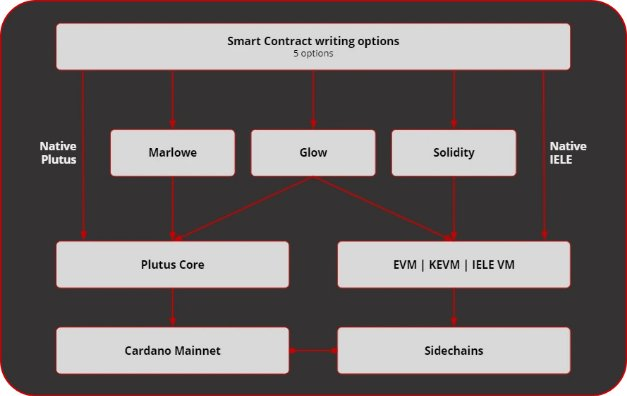

# A close look at the software running Cardano
### **Learn about the ‘stack’ of components that interact to run the blockchain platform**
 8 June 2021[ Niamh Ahern](tmp//en/blog/authors/niamh-ahern/page-1/) 5 mins read

### [**Niamh Ahern**](tmp//en/blog/authors/niamh-ahern/page-1/)
Education Manager

Education

- 
- 
- 
- 

Cardano has been designed in modules, with linked components that can be used in various ways. These components form the Cardano ‘platform stack’. They work together under the hood to support the construction and use of the live Cardano blockchain.

We are currently in the early testnet phase on the way to the Alonzo hard fork, which will bring full smart contract capability to Cardano. This process is highly complex, requiring the steady upgrade of the different elements which make up the Cardano platform, and their careful integration and testing. So, it is a good time to revisit these components, explain some of the terminology, and discover how they interact within the ‘platform stack’.
## **Elements of the Cardano platform stack**

**Figure 1. Components that communicate with the Cardano node**

** Hình 1. Các thành phần giao tiếp với nút Cardano **

The platform stack for Cardano includes these core components:

Ngăn xếp nền tảng cho Cardano bao gồm các thành phần cốt lõi này:

- Cardano node (and associated processes)

- Nút Cardano (và các quy trình liên quan)

- Cardano wallet

- Ví Cardano

- Wallet command line interface (CLI)

- Giao diện dòng lệnh ví (CLI)

- DB Sync (synchronizes blockchain data with a relational database)

- DB Sync (đồng bộ hóa dữ liệu blockchain với cơ sở dữ liệu quan hệ)

- PostgreSQL database (which interacts with GraphQL, REST API, and Smash)

- Cơ sở dữ liệu PostgreSQL (tương tác với GraphQL, API REST và Smash)

- Smash server

- Smash Server

- Rosetta API (blockchain communication protocol)

- API Rosetta (Giao thức truyền thông blockchain)

Note that the Daedalus wallet is not part of the core stack, but does communicate with the components (Figure 1). 

Lưu ý rằng ví Daedalus không phải là một phần của ngăn xếp lõi, nhưng không giao tiếp với các thành phần (Hình 1).

### **The node and the networking layer**

### ** Nút và lớp mạng **

First, let's take a look at the [Cardano node](https://github.com/input-output-hk/cardano-node). This software runs on your computer and underpins the network, enabling everyone to participate in the decentralized blockchain. The node integrates the consensus, ledger, and networking sub-components, providing top-level configuration, API, CLI, logging, memory management, and monitoring capabilities that can be used by other Cardano components or by skilled users. Daedalus is a full-node wallet, so if you are running that on your local machine, you are effectively helping to run the network. 

Đầu tiên, chúng ta hãy xem [Node Cardano] (https://github.com/input-output-hk/cardano-node).
Phần mềm này chạy trên máy tính của bạn và củng cố mạng, cho phép mọi người tham gia vào blockchain phi tập trung.
Node tích hợp sự đồng thuận, sổ cái và các thành phần phụ mạng, cung cấp cấu hình cấp cao nhất, API, CLI, ghi nhật ký, quản lý bộ nhớ và khả năng giám sát có thể được sử dụng bởi các thành phần Cardano khác hoặc người dùng lành nghề.
Daedalus là một ví đầy đủ nút, vì vậy nếu bạn đang chạy nó trên máy cục bộ của mình, bạn sẽ giúp chạy mạng một cách hiệu quả.

*The networking layer*

*Lớp mạng*

Next, we have the networking layer. This links each Cardano node into a distributed system that manages the blockchain and associated services. The network consists of a collection of nodes that communicate with each other to maintain the distributed ledger, support transaction submission, and interact with user wallets and other services. The core of the network is built around the decentralized nodes – the stake pools – that collectively validate blocks, and add new blocks to the chain. They are supported by dedicated relay nodes that manage network connections and establish the structure of the network as a whole. The dedicated consumer nodes that are run by the Daedalus wallet and other services connect to this network to track and submit transactions on-chain.

Tiếp theo, chúng tôi có lớp mạng.
Điều này liên kết từng nút Cardano vào một hệ thống phân tán quản lý blockchain và các dịch vụ liên quan.
Mạng bao gồm một bộ sưu tập các nút giao tiếp với nhau để duy trì sổ cái phân tán, hỗ trợ gửi giao dịch và tương tác với ví người dùng và các dịch vụ khác.
Cốt lõi của mạng được xây dựng xung quanh các nút phi tập trung - các nhóm cổ phần - xác nhận chung các khối và thêm các khối mới vào chuỗi.
Chúng được hỗ trợ bởi các nút chuyển tiếp chuyên dụng quản lý các kết nối mạng và thiết lập cấu trúc của toàn bộ mạng.
Các nút tiêu dùng chuyên dụng được điều hành bởi ví Daedalus và các dịch vụ khác kết nối với mạng này để theo dõi và gửi các giao dịch trên chuỗi.

Cardano nodes maintain connections with their peers. A set of mini-protocols enable communication between the nodes. Each mini-protocol implements a basic information exchange requirement, such as informing peers of the latest block, sharing blocks as needed, or sharing new transactions around the Cardano network. For connection purposes, mini-protocols are determined by the version of the network protocol. 

Các nút Cardano duy trì kết nối với các đồng nghiệp của họ.
Một tập hợp các giao thức nhỏ cho phép giao tiếp giữa các nút.
Mỗi giao thức mini thực hiện yêu cầu trao đổi thông tin cơ bản, chẳng hạn như thông báo cho các đồng nghiệp về khối mới nhất, chia sẻ các khối khi cần thiết hoặc chia sẻ các giao dịch mới xung quanh mạng Cardano.
Đối với mục đích kết nối, các giao thức mini được xác định bởi phiên bản của giao thức mạng.

### **Cardano wallet backend**

### ** Phụ trợ ví Cardano **

The [Cardano wallet](https://github.com/input-output-hk/cardano-wallet) backend component supports the graphical user interface of the Daedalus wallet. It is used to send and receive ada. Behind the scenes, the wallet runs a full Cardano node. Unlike a light client wallet, it loads the entire shared ledger and validates all transactions, thus bolstering the security of the blockchain for everyone.

[Ví Cardano] (https://github.com/input-oundput-hk/cardano-wallet) Thành phần phụ trợ hỗ trợ giao diện người dùng đồ họa của ví Daedalus.
Nó được sử dụng để gửi và nhận ADA.
Đằng sau hậu trường, ví chạy một nút Cardano đầy đủ.
Không giống như ví máy khách nhẹ, nó tải toàn bộ sổ cái được chia sẻ và xác nhận tất cả các giao dịch, do đó tăng cường bảo mật của blockchain cho mọi người.

### **Wallet command line interface (CLI)**

### ** Giao diện dòng lệnh ví (CLI) **

The wallet command line interface (CLI) supports interactions with the actual blockchain. More technically advanced users can use the CLI to work with a collection of tools for generating keys, constructing transactions, creating certificates, and performing other tasks. It is organized in a hierarchy of subcommands, and each level comes with its own built-in documentation of command syntax and options.

Giao diện dòng lệnh ví (CLI) hỗ trợ các tương tác với blockchain thực tế.
Người dùng tiên tiến về mặt kỹ thuật hơn có thể sử dụng CLI để làm việc với bộ sưu tập các công cụ để tạo khóa, xây dựng giao dịch, tạo chứng chỉ và thực hiện các tác vụ khác.
Nó được tổ chức trong một hệ thống phân cấp của các tiểu ban và mỗi cấp độ đi kèm với tài liệu tích hợp của riêng mình về cú pháp và tùy chọn lệnh.

### **DB Sync**

### ** DB Sync **

[DB Sync](https://github.com/input-output-hk/cardano-db-sync) is a component that follows the activities on the Cardano chain and stores blocks and transactions in PostgreSQL. As a ‘middleware’ component, it powers [cardano-graphql](https://github.com/input-output-hk/cardano-graphql). DB Sync stores blockchain data fetched from [cardano-node](https://github.com/input-output-hk/cardano-node) in an intermediate database to enable higher-level interfaces for blockchain exploration. It also provides a number of queries to fetch Cardano blockchain data from the PostgreSQL, and supports services such as the [Cardano Explorer](https://explorer.cardano.org/en.html), a graphical user interface that reflects the blockchain data in a straightforward way. Cardano GraphQL is a cross-platform API for the GraphQL data query language. 

.
Là một thành phần ’phần mềm trung gian, nó cung cấp năng lượng cho [cardano-graphql] (https://github.com/input-output-hk/cardano-graphql).
DB Sync lưu trữ dữ liệu blockchain được tìm nạp từ [Cardano-node] (https://github.com/input-oundput-hk/cardano-node) trong cơ sở dữ liệu trung gian để cho phép giao diện cấp cao hơn để khám phá blockchain.
Nó cũng cung cấp một số truy vấn để tìm nạp dữ liệu blockchain cardano từ postgresql và hỗ trợ các dịch vụ như [cardano explorer] (https://explorer.cardano.org/en.html), một giao diện người dùng đồ họa phản ánh blockchain
dữ liệu một cách đơn giản.
Cardano GraphQL là API đa nền tảng cho ngôn ngữ truy vấn dữ liệu GraphQL.

### **Rosetta API**

### ** API Rosetta **

The Rosetta application programming interface provides a high-level interface that aims to make the integration process easier, faster, and more reliable so that you can build once and integrate your blockchain everywhere. We have created a unique [cardano-rosetta](https://github.com/input-output-hk/cardano-rosetta) implementation to simplify the process of integration with Cardano. This interface is particularly useful for exchanges, since they can interact with the Cardano chain using the same interface that they use with other blockchains.

Giao diện lập trình ứng dụng Rosetta cung cấp giao diện cấp cao nhằm mục đích giúp quá trình tích hợp dễ dàng hơn, nhanh hơn và đáng tin cậy hơn để bạn có thể xây dựng một lần và tích hợp blockchain của mình ở mọi nơi.
Chúng tôi đã tạo ra một [Cardano-rosetta] (https://github.com/input-oundput-hk/cardano-rosetta) để đơn giản hóa quá trình tích hợp với Cardano.
Giao diện này đặc biệt hữu ích cho các trao đổi, vì chúng có thể tương tác với chuỗi Cardano sử dụng cùng một giao diện mà họ sử dụng với các blockchain khác.

### **Looking forward**

### **Nhìn về phía trước**

With [smart contracts](https://iohk.io/en/blog/posts/2021/04/08/smart-contracts-%E2%80%93-here-we-come/) coming to Cardano soon, this means that [Plutus](https://iohk.io/en/blog/posts/2021/04/13/plutus-what-you-need-to-know/), the native smart contract language, and other smart contract development languages like [Marlowe](https://iohk.io/en/blog/posts/2021/05/26/reimagining-peer-to-peer-finance-with-marlowe/) for finance and [Glow](https://glow-lang.org/) for DApps will be integrated into the Cardano stack. IO Global’s engineers will provide new and extended components to compile Plutus, Marlowe, and Glow scripts, submit them on-chain, and interact with them (Figure 2).

Với [Hợp đồng thông minh] (https://iohk.io/en/blog/posts/2021/04/08/smart-contracts-%E2%80
có nghĩa là [Plutus] (https://iohk.io/en/blog/posts/2021/04/13/plutus-what-you-meed-to-kn
Các ngôn ngữ phát triển như [Marlowe] (https://iohk.io/en/blog/posts/2021/05/26/reimagining-peer-to-peer-finance-with-marlowe/cho tài chính và [phát sáng] (https
: //glow-lang.org/) cho DAPP sẽ được tích hợp vào ngăn xếp Cardano.
Các kỹ sư của IO Global, sẽ cung cấp các thành phần mới và mở rộng để biên dịch Plutus, Marlowe và Glow Scscript, gửi chúng trên chuỗi và tương tác với chúng (Hình 2).

**Figure 2. Plutus, Marlowe, Glow, Solidity, and IELE can all be used to write Cardano smart contracts**

** Hình 2. Sao Diêm Vương, Marlowe, Glow, Solility và Iele đều có thể được sử dụng để viết Hợp đồng thông minh Cardano **

The [Alonzo protocol upgrade](https://iohk.io/en/blog/posts/2021/04/08/smart-contracts-%E2%80%93-here-we-come/) will build on recent token upgrades and is being deployed to the mainnet via several testnets. Our Plutus partners and Plutus Pioneers will help us to test Plutus Core and will be part of the user acceptance phase before mainnet deployment. At this point we will officially add the Plutus and Marlowe components, such as both interpreters, to Cardano’s platform stack. 

Nâng cấp [Nâng cấp giao thức Alonzo] (https://iohk.io/en/blog/posts/2021/04/08/smart-contracts-%E2%80%93
Nâng cấp và đang được triển khai cho Mainnet thông qua một số TestNet.
Các đối tác Plutus và Pioneers Plutus của chúng tôi sẽ giúp chúng tôi kiểm tra Core Plutus và sẽ là một phần của giai đoạn chấp nhận người dùng trước khi triển khai chính.
Tại thời điểm này, chúng tôi sẽ chính thức thêm các thành phần Plutus và Marlowe, chẳng hạn như cả hai phiên dịch viên, vào ngăn xếp nền tảng Cardano.

*To keep up to date with the Alonzo rollout, please check our social channels and blog page.*

*Để cập nhật các buổi giới thiệu Alonzo, vui lòng kiểm tra các kênh xã hội và trang blog của chúng tôi.*

