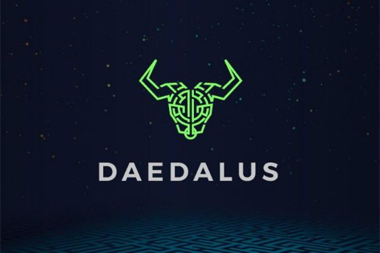

# Daedalus: from launch to Flight and beyond...
### **Daedalus has come a long way since its debut with Cardano in 2017. And as Cardano grows and evolves, so will our full-node wallet**
 16 June 2021[ Darko Mijić](tmp//en/blog/authors/darko-mijic/page-1/) 5 mins read

### [**Darko Mijić**](tmp//en/blog/authors/darko-mijic/page-1/)
Product Manager

Operations

- 
- 

As an ‘official’ Cardano’s wallet (alongside Yoroi’s browser and mobile offer) Daedalus offers a ‘window to the world’ of Cardano. While outwardly its UI may look just like an ‘app’, it is of course a full-node client. Every Daedalus instance is a live node connected to the Cardano network. Each instance executes the Cardano Ouroboros consensus protocol and plays its own part in the successful running of the Cardano network. This enables Daedalus to operate in a completely trustless fashion without relying on any centrally hosted servers. 

Là một ví Card Cardano chính thức (cùng với trình duyệt và đề nghị di động của Yoroi,) Daedalus cung cấp một cửa sổ cho thế giới của Cardano.
Mặc dù giao diện người dùng của nó có thể trông giống như một Ứng dụng Ứng dụng, nhưng tất nhiên nó là một ứng dụng khách đầy đủ.
Mỗi trường hợp Daedalus là một nút trực tiếp được kết nối với mạng Cardano.
Mỗi trường hợp thực hiện giao thức đồng thuận Cardano Ouroboros và đóng vai trò riêng của mình trong việc chạy thành công của mạng Cardano.
Điều này cho phép Daedalus hoạt động theo kiểu hoàn toàn không đáng tin cậy mà không cần dựa vào bất kỳ máy chủ được lưu trữ tập trung.

It also makes Daedalus a highly complex product, since it integrates and is dependent on core Cardano components and the Cardano codebase. As well as a wallet, Daedalus is a ‘console’ for the Cardano blockchain.

Nó cũng làm cho Daedalus trở thành một sản phẩm rất phức tạp, vì nó tích hợp và phụ thuộc vào các thành phần Cardano cốt lõi và cơ sở mã Cardano.
Cũng như ví, Daedalus là một ’bảng điều khiển cho blockchain Cardano.

Daedalus launched in 2017 with the Cardano mainnet launch. It offered a groundbreaking GUI wallet with presale redemption functionality since the first day of the Cardano network’s existence. Back then, it was common to launch a cryptocurrency with CLI wallets. Daedalus offered a graphical user interface (GUI) from the get-go and a much better user experience than the industry standard. It had its share of issues, of course, reflecting the immaturity and shortcomings of the early Cardano codebase. With the Byron reboot, we completely rebuilt the code. This had a corresponding impact on Daedalus, delivering a much more robust and reliable product.

Daedalus ra mắt vào năm 2017 với sự ra mắt của Cardano Mainnet.
Nó cung cấp một ví GUI đột phá với chức năng chuộc trước kể từ ngày đầu tiên của sự tồn tại của mạng Cardano.
Trước đó, người ta thường ra mắt một loại tiền điện tử với ví CLI.
Daedalus cung cấp giao diện người dùng đồ họa (GUI) từ GE-GO và trải nghiệm người dùng tốt hơn nhiều so với tiêu chuẩn ngành.
Tất nhiên, nó có phần của các vấn đề, phản ánh sự non nớt và thiếu sót của cơ sở mã Cardano đầu tiên.
Với việc khởi động lại Byron, chúng tôi đã xây dựng lại hoàn toàn mã.
Điều này có tác động tương ứng đến Daedalus, mang lại một sản phẩm mạnh mẽ và đáng tin cậy hơn nhiều.

Cardano has come a very long way since 2017, and especially since the Byron reboot. We have moved from a federated to a decentralized proof-of-stake system, with thousands of active pools run by a passionate community. We now have staking and delegation, with fully decentralized block production. We also launched our successful Daedalus Flight program, bringing new features to the mainnet early for power users to help us test and iterate. Most recently, we have added native token capability and Project Catalyst voting registration. Soon we shall enter the era of smart contracts. It's been an incredible journey and we’re just getting started.

Cardano đã đi một chặng đường rất dài kể từ năm 2017, và đặc biệt là kể từ khi khởi động lại Byron.
Chúng tôi đã chuyển từ một hệ thống chứng minh cổ phần phi tập trung, với hàng ngàn nhóm hoạt động được điều hành bởi một cộng đồng đam mê.
Bây giờ chúng tôi có cổ phần và phái đoàn, với sản xuất khối phi tập trung hoàn toàn.
Chúng tôi cũng đã ra mắt chương trình bay Daedalus thành công của chúng tôi, mang các tính năng mới đến Mainnet sớm cho người dùng Power để giúp chúng tôi kiểm tra và lặp lại.
Gần đây nhất, chúng tôi đã thêm khả năng mã thông báo gốc và đăng ký bỏ phiếu xúc tác dự án.
Chúng ta sẽ sớm tham gia vào thời đại của các hợp đồng thông minh.
Đó là một hành trình đáng kinh ngạc và chúng tôi mới bắt đầu.

This growing functionality on the blockchain has brought additional challenges, creating a product environment with a complex web of interdependencies. The corresponding technical and resource impact makes any fresh development especially challenging. So as we evolve the offering, it is increasingly important we focus on core capabilities, while also ensuring we get better at integrating the ‘voice of the customer.’

Chức năng phát triển này trên blockchain đã mang lại những thách thức bổ sung, tạo ra một môi trường sản phẩm với một mạng lưới phụ thuộc lẫn nhau.
Tác động tài nguyên và kỹ thuật tương ứng làm cho bất kỳ sự phát triển mới đặc biệt thách thức.
Vì vậy, khi chúng tôi phát triển việc cung cấp, điều ngày càng quan trọng, chúng tôi tập trung vào các khả năng cốt lõi, đồng thời đảm bảo chúng tôi tốt hơn trong việc tích hợp giọng nói của khách hàng.

### **Surveying the community**

### ** Khảo sát cộng đồng **

Earlier this year, we reached out to the community with a comprehensive survey to help us map the landscape and chart our path ahead, both in terms of short-term improvements and longer-term product strategy. 

Đầu năm nay, chúng tôi đã liên hệ với cộng đồng với một cuộc khảo sát toàn diện để giúp chúng tôi lập bản đồ cảnh quan và vạch ra con đường của chúng tôi phía trước, cả về cải thiện ngắn hạn và chiến lược sản phẩm dài hạn.

In total, **we have had 5,544 responses**. We’re publishing the report [here](https://input-output.typeform.com/report/FXTY6788/kxOCO8QzSYLDbktt). --daedalus-survey-iframe--

Tổng cộng, ** chúng tôi đã có 5.544 phản hồi **.
Chúng tôi xuất bản báo cáo [tại đây] (https://input-oundput.typeform.com/report/fxty6788/kxoco8qzsyldbktt).
-Daedalus-survey-iframe--

We encourage you to dive into the data. The results have provided us with some valuable insights, which continue to inform our strategic approach to product development. It shows a high level of satisfaction overall (average rating of 4.2 out of 5). The survey also identified some clear pain points. It was also clear that, while delegators are happy with their choices, the ranking system is a significant pain point for smaller stake pool operators. 

Chúng tôi khuyến khích bạn đi sâu vào dữ liệu.
Kết quả đã cung cấp cho chúng tôi một số hiểu biết có giá trị, tiếp tục thông báo cách tiếp cận chiến lược của chúng tôi để phát triển sản phẩm.
Nó cho thấy mức độ hài lòng cao tổng thể (xếp hạng trung bình là 4.2 trên 5).
Cuộc khảo sát cũng xác định một số điểm đau rõ ràng.
Rõ ràng là, trong khi các ủy viên hài lòng với lựa chọn của họ, hệ thống xếp hạng là một điểm đau đáng kể cho các nhà khai thác nhóm cổ phần nhỏ hơn.

The survey data also fed into a number of ideation sessions to follow up, dig deeper, and identify a number of specific areas for improvement. Top ranked in desirability were:

Dữ liệu khảo sát cũng được đưa vào một số phiên ý tưởng để theo dõi, đào sâu hơn và xác định một số lĩnh vực cụ thể để cải thiện.
Được xếp hạng hàng đầu trong mong muốn là:

1. A simpler and easier-to-understand ranking system that is more inclusive and ranks most stake pools, and does not depend on the amount of stake to be delegated as an input.

1. Một hệ thống xếp hạng đơn giản và dễ hiểu hơn, bao gồm nhiều hơn và xếp hạng hầu hết các nhóm cổ phần và không phụ thuộc vào số lượng cổ phần được ủy quyền làm đầu vào.

a. The **new ranking system** will be **configurable**, allowing users to more easily balance their delegation choices between established, saturated pools (with predictable rewards) alongside less established, smaller pools with their potentially larger (but less reliable) rewards.

một.
Hệ thống xếp hạng ** mới ** sẽ được định cấu hình **, cho phép người dùng dễ dàng cân bằng hơn các lựa chọn phái đoàn của họ giữa các nhóm đã thành lập, bão hòa (với phần thưởng có thể dự đoán được) cùng với các nhóm nhỏ hơn, ít được thiết lập với khả năng lớn hơn (nhưng kém tin cậy) của chúng)
phần thưởng.

b. **Encourage and promote community-curated SMASH servers** to provide different criteria for selecting pools, e.g., small and promising pools, pools from developing countries, charity or mission-driven pools, green and eco-friendly pools, etc.

b.
** Khuyến khích và thúc đẩy các máy chủ smash do cộng đồng lưu trữ ** để cung cấp các tiêu chí khác nhau để chọn nhóm, ví dụ, hồ bơi nhỏ và đầy hứa hẹn, hồ bơi từ các nước đang phát triển, các nhóm từ thiện hoặc các nhóm điều khiển nhiệm vụ, hồ bơi xanh và thân thiện với môi trường, v.v.

c. Looking at the feasibility of having importable, **community-curated** ranking calculations.

c.
Nhìn vào tính khả thi của việc có các tính toán xếp hạng ** có thể nhập khẩu, **.

2. **Delegation portfolios / multi-pool delegation** – the ability to delegate a wallet to several pools and the ability to share delegation portfolios.

2. ** Danh mục đầu tư / phái đoàn đa nhóm **-Khả năng ủy thác ví cho một số nhóm và khả năng chia sẻ danh mục đầu tư của phái đoàn.

2. More **information** on delegation, and using Daedalus in general, through improved UX and content.

2. Thêm ** thông tin ** về phái đoàn và sử dụng Daedalus nói chung, thông qua UX và nội dung được cải thiện.

2. More detail on **earned rewards**, and **improved graphical representation**. 

2. Thông tin chi tiết hơn về ** Phần thưởng kiếm được ** và ** Đại diện đồ họa được cải thiện **.

2. A complete **display and export of earned rewards per epoch for tax** and accounting purposes in both Daedalus and exportable CSV file.

2. Hiển thị hoàn chỉnh ** và xuất các phần thưởng kiếm được trên mỗi epoch cho thuế ** và mục đích kế toán trong cả tệp CSV Daedalus và xuất khẩu.

Other changes suggested for the future include: enabling communications between SPOs and delegators; improved wallet creation and restoration with wallet fingerprints; more fiat/crypto conversions for displaying wallet balances; a mobile and light version; and better help. In the longer term, improvements being looked into include a multicurrency wallet; a better news feed; and more multilingual versions.

Những thay đổi khác được đề xuất cho tương lai bao gồm: cho phép giao tiếp giữa các SPO và ủy quyền;
cải thiện việc tạo và phục hồi ví với dấu vân tay ví;
Chuyển đổi Fiat/Crypto hơn để hiển thị số dư ví;
một phiên bản di động và nhẹ;
Và giúp đỡ tốt hơn.
Về lâu dài, những cải tiến đang được xem xét bao gồm một ví đa tiền;
một nguồn cấp tin tức tốt hơn;
và nhiều phiên bản đa ngôn ngữ hơn.

### **Community intelligence and insights**

### ** Trí thông minh và hiểu biết cộng đồng **

The survey results have been a [valuable source of intelligence](https://ucarecdn.com/1fda65be-63cb-42a9-b98b-1cee01b314b5/execsummaryspos.pdf). All these suggestions have been taken fully on board and given due consideration. In recent months, the team’s focus has been on core native token capability, alongside functionality to support voting in Project Catalyst, hardware wallet support and more. And with Alonzo smart contracts around the corner, every team across the company continues to be very focused on core Goguen capability. However, the Daedalus team is now finalizing its approach to Daedalus enhancements with UX and UI specialists. This needs to be clearly set in the context of ongoing engineering priorities and work from the research team (to be shared soon) around elements such as rewards, fees, and parameters.

Các kết quả khảo sát là một [nguồn thông minh có giá trị] (https://ucarecdn.com/1fda65Be-63CB-42A9-B98B-1CEE01B314B5/execsummaryspos.pdf).
Tất cả những đề xuất này đã được thực hiện đầy đủ trên tàu và xem xét đúng.
Trong những tháng gần đây, nhóm tập trung vào nhóm đã tập trung vào khả năng mã thông báo cốt lõi, bên cạnh chức năng để hỗ trợ bỏ phiếu trong Project Catalyst, hỗ trợ ví phần cứng và hơn thế nữa.
Và với các hợp đồng thông minh của Alonzo quanh góc, mọi nhóm trong toàn công ty tiếp tục tập trung vào khả năng Goguen cốt lõi.
Tuy nhiên, nhóm Daedalus hiện đang hoàn thiện cách tiếp cận cải tiến Daedalus với các chuyên gia UX và UI.
Điều này cần được thiết lập rõ ràng trong bối cảnh các ưu tiên kỹ thuật đang diễn ra và làm việc từ nhóm nghiên cứu (sẽ sớm được chia sẻ) xung quanh các yếu tố như phần thưởng, phí và tham số.

Given these interdependencies, some elements present significant challenges. Equally, we have identified a number of ‘quick wins’. We’ll be convening further consultation and ideation sessions in July this summer– including exploring ideas around a more collaborative development model – to sanity check a few of the quick wins and explore the more nuanced challenges with the community that Daedalus is here to serve.

Với những sự phụ thuộc lẫn nhau này, một số yếu tố đưa ra những thách thức đáng kể.
Tương tự, chúng tôi đã xác định được một số ‘chiến thắng nhanh chóng.
Chúng tôi sẽ triệu tập các buổi tư vấn và ý tưởng thêm vào tháng 7 vào mùa hè này, bao gồm khám phá các ý tưởng xung quanh một mô hình phát triển hợp tác hơn - để kiểm tra một vài chiến thắng nhanh chóng và khám phá những thách thức nhiều sắc thái hơn với cộng đồng mà Daedalus đang ở đây để phục vụ.

