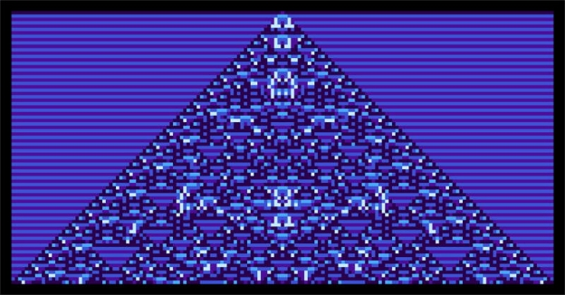

# Wolfram and Cardano build communities with NFTs and liveminting
### **An inspiring look at the role of NFTs from Wolfram Blockchain Labs CEO Jon Woodard**
 22 July 2021[ Jon Woodard](tmp//en/blog/authors/jon-woodard/page-1/) 5 mins read

### [**Jon Woodard**](tmp//en/blog/authors/jon-woodard/page-1/)
CEO (Wolfram Blockchain Labs)

Guest author

- 

As we emerge from the darkness of the pandemic, we can reconnect with our communities and re-focus on a shared vision for the future. We are at the cusp of a technological renaissance heralding new ways of forging strong connections. At Wolfram Blockchain Labs (WBL), we foresee a future where important moments can be forged, stored, and shared in real time to bring more communities together. The inspiration came from my recent trip to Bitcoin Miami 2021 where I attended the Cardano Meetup.

Khi chúng ta xuất hiện từ bóng tối của đại dịch, chúng ta có thể kết nối lại với các cộng đồng của mình và tập trung lại vào một tầm nhìn chung cho tương lai.
Chúng tôi đang ở trong tình trạng của một thời kỳ phục hưng công nghệ báo hiệu những cách thức mới để tạo ra các kết nối mạnh mẽ.
Tại Wolfram Blockchain Labs (WBL), chúng tôi thấy trước một tương lai nơi những khoảnh khắc quan trọng có thể được rèn, lưu trữ và chia sẻ trong thời gian thực để kết hợp nhiều cộng đồng lại với nhau.
Cảm hứng đến từ chuyến đi gần đây của tôi đến Bitcoin Miami 2021, nơi tôi đã tham dự cuộc gặp gỡ Cardano.

One of the best parts of my job as CEO of [Wolfram Blockchain Labs](https://www.wolframblockchainlabs.com/) is interacting with community members of our blockchain collaborators. When considering how the WBL ecosystem can become truly global and decentralized, I realized that decentralization is not just about changing technology. It is about changing how we interact with our communities while enabling new kinds of collaboration . 

Một trong những phần tốt nhất trong công việc của tôi là Giám đốc điều hành của [Wolfram Blockchain Labs] (https://www.wolframblockchainlabs.com/) đang tương tác với các thành viên cộng đồng của cộng tác viên blockchain của chúng tôi.
Khi xem xét làm thế nào hệ sinh thái WBL có thể trở nên thực sự toàn cầu và phi tập trung, tôi nhận ra rằng sự phân cấp không chỉ là thay đổi công nghệ.
Đó là về việc thay đổi cách chúng ta tương tác với các cộng đồng của chúng ta trong khi cho phép các loại hợp tác mới.

We can now connect communities through global networks, while working independently and collectively towards a shared future. This was on full display at the Cardano Meetup in Miami. In that room, I saw Cardano supporters united by a shared belief. Communities like this will become the rule rather than the exception in the future. 

Bây giờ chúng ta có thể kết nối các cộng đồng thông qua các mạng toàn cầu, đồng thời làm việc độc lập và tập thể hướng tới một tương lai chung.
Đây là màn hình đầy đủ tại cuộc gặp gỡ Cardano ở Miami.
Trong căn phòng đó, tôi thấy những người ủng hộ Cardano hợp nhất bởi một niềm tin chung.
Các cộng đồng như thế này sẽ trở thành quy tắc chứ không phải là ngoại lệ trong tương lai.

I was moved by everyone’s emphasis on building a global system to help individuals achieve financial independence for their families and communities. After witnessing the power of Cardano’s global community, I realized that this feeling of ‘togetherness’ is crystalized by non-fungible tokens (NFTs). Let me explain what I mean by this and what we’re going to do about it:

Tôi đã bị xúc động bởi sự nhấn mạnh của mọi người vào việc xây dựng một hệ thống toàn cầu để giúp các cá nhân đạt được sự độc lập tài chính cho gia đình và cộng đồng của họ.
Sau khi chứng kiến sức mạnh của cộng đồng toàn cầu của Cardano, tôi nhận ra rằng cảm giác "Togetherness" Togetherness này được kết tinh bởi các token không nổi (NFT).
Hãy để tôi giải thích ý của tôi về điều này và những gì chúng ta sẽ làm về nó:

**Experiencing NFTs**

** Trải nghiệm NFTS **

NFTs have sparked the global imagination in a way initial coin offerings (ICO)’s hype never did. Although the focus has largely been on speculation and cash value, the discussion has prompted the world to take a second look at decentralized systems, services, and applications. NFTs might feel like a fad, a bubble akin to tulip mania. However, at their heart, they are immutable, intractable representations of value and a unique identity.

Các NFT đã khơi dậy trí tưởng tượng toàn cầu theo cách mà các dịch vụ tiền xu ban đầu (ICO) không bao giờ làm.
Mặc dù trọng tâm phần lớn là đầu cơ và giá trị tiền mặt, cuộc thảo luận đã thúc đẩy thế giới có cái nhìn thứ hai về các hệ thống, dịch vụ và ứng dụng phi tập trung.
NFT có thể cảm thấy như một mốt, một bong bóng giống như Tulip Mania.
Tuy nhiên, ở trái tim của họ, chúng là những đại diện bất biến, khó hiểu của giá trị và một bản sắc duy nhất.

Collectibles are a remarkable way of showing what one considers valuable while connecting the individual with their global community, the same way everyone at the Cardano Meetup was connected. This is hugely powerful. While many models currently celebrate the ephemeral and the transient, NFTs are about the timeless. When we enable communities to record and celebrate milestones like birthdays, graduations, or weddings we can draw people together around common goals and look towards a common future.

Sưu tầm là một cách đáng chú ý để thể hiện những gì người ta coi là có giá trị trong khi kết nối cá nhân với cộng đồng toàn cầu của họ, giống như cách mọi người tại cuộc gặp gỡ Cardano được kết nối.
Điều này là cực kỳ mạnh mẽ.
Trong khi nhiều mô hình hiện đang ăn mừng phù du và thoáng qua, các NFT là về sự vượt thời gian.
Khi chúng tôi cho phép các cộng đồng ghi lại và tôn vinh các cột mốc như sinh nhật, tốt nghiệp hoặc đám cưới, chúng tôi có thể thu hút mọi người lại với nhau xung quanh các mục tiêu chung và hướng tới một tương lai chung.

**Liveminting with Wolfram Language and Cardano**

** Chỉ sống bằng ngôn ngữ Wolfram và Cardano **

Since January of 2021, WBL has been learning the nuances of Cardano and integrating the Cardano blockchain into the Wolfram Language. One of the most exciting places that we’re working with IOHK is in implementing NFT tools and auctions to bring [LiveMinting.com](https://www.liveminting.com/) to life, powered by Cardano. 

Kể từ tháng 1 năm 2021, WBL đã học được các sắc thái của Cardano và tích hợp blockchain Cardano vào ngôn ngữ Wolfram.
Một trong những địa điểm thú vị nhất mà chúng tôi làm việc với IOHK là triển khai các công cụ và đấu giá NFT để mang [liveminting.com] (https://www.liveminting.com/) cho cuộc sống, được cung cấp bởi Cardano.â

In an upcoming [livestream event](https://youtu.be/pMfrRFNCKhE) taking place on July 27th at 1:00 PM CT, Stephen Wolfram (CEO of Wolfram Research) and a panel of cultural critics will bring experiential NFTs to life in one of the world’s first ‘liveminting’ events — the process of minting (or processing) NFTs in real time on the Cardano blockchain. Liveminting will turn Wolfram’s Cellular Automata (items from the computational universe) into bespoke pieces of artwork certified into NFTs in real time. This will create a first-of-its-kind NFT.

Trong một sự kiện [LiveStream] sắp tới (https://youtu.be/pmfrrfnckhe) diễn ra vào ngày 27 tháng 7 lúc 1:00 chiều CT, Stephen Wolfram (CEO của Wolfram Research) và một hội đồng phê bình văn hóa sẽ đưa NFT trải nghiệm vào cuộc sống của
Trong một trong những sự kiện đầu tiên của thế giới - các sự kiện - € ™ - quá trình khai thác (hoặc xử lý) trong thời gian thực trên blockchain Cardano.
Việc sinh hoạt sẽ biến Automata di động của Wolfram (các mục từ Vũ trụ tính toán) thành các tác phẩm nghệ thuật được chứng nhận thành NFT trong thời gian thực.
Điều này sẽ tạo ra một NFT đầu tiên.

This is only the beginning of the solutions from the work of WBL and IOHK. WBL will soon introduce the MintNFT function into the Wolfram Language, which uses the Cardano blockchain integration. You can get a more detailed explanation of the exciting work we have done in Wolfram Language by reading my [Wolfram blog post](https://blog.wolfram.com/2021/07/21/liveminting-nfts-with-the-wolfram-language-on-the-cardano-blockchain/).

Đây chỉ là khởi đầu của các giải pháp từ công việc của WBL và IOHK.
WBL sẽ sớm giới thiệu chức năng Mintnft vào ngôn ngữ Wolfram, sử dụng tích hợp blockchain Cardano.
Bạn có thể nhận được một lời giải thích chi tiết hơn về công việc thú vị mà chúng tôi đã thực hiện trong ngôn ngữ Wolfram bằng cách đọc [bài đăng trên blog của tôi
Wolfram-Language-on-the-cardano-blockchain/).

**NFT analytics, communities, creators, and brands**

** NFT Analytics, cộng đồng, người sáng tạo và thương hiệu **

We believe that NFT makers and marketplaces will begin to thrive once they become generally accessible and understood. So, we are working on formalizing specific indicators and functions that will highlight analytics such as NFT performance and sales within a specific community. These analytics will not only give insight into the popularity of an NFT type, but also show how different types of NFTs can serve to draw community members together through shared experiences.

Chúng tôi tin rằng các nhà sản xuất NFT và thị trường sẽ bắt đầu phát triển mạnh khi họ trở nên dễ tiếp cận và hiểu.
Vì vậy, chúng tôi đang làm việc để chính thức hóa các chỉ số và chức năng cụ thể sẽ làm nổi bật các phân tích như hiệu suất NFT và doanh số trong một cộng đồng cụ thể.
Những phân tích này sẽ không chỉ cung cấp cái nhìn sâu sắc về sự phổ biến của một loại NFT, mà còn cho thấy các loại NFT khác nhau có thể phục vụ như thế nào để thu hút các thành viên cộng đồng lại với nhau thông qua các trải nghiệm được chia sẻ.

We see a future where creators of all types will be able to hold captivating liveminting events to highlight amazing experiences for their communities. Meanwhile, traditional brands increase connection and bolster a sense of belonging in the communities forming around their products. All of this will be powered by the Cardano blockchain and the Wolfram Language.

Chúng tôi thấy một tương lai nơi những người tạo ra tất cả các loại sẽ có thể tổ chức các sự kiện in hoa quyến rũ để làm nổi bật những trải nghiệm tuyệt vời cho cộng đồng của họ.
Trong khi đó, các thương hiệu truyền thống tăng kết nối và củng cố ý thức thuộc về các cộng đồng hình thành xung quanh các sản phẩm của họ.
Tất cả những điều này sẽ được cung cấp bởi Blockchain Cardano và ngôn ngữ Wolfram.

**An incentive for belonging**

** Một động lực cho việc thuộc về **

Experiential NFTs and the inherent feeling of belonging will undoubtedly spur Cardano community members to create NFT experiences for others outside Cardano. Much like we have seen with the immediate impact of NFTs on popular culture, these experiences will serve to draw more people into our community. 

Các NFT trải nghiệm và cảm giác thân thuộc vốn có chắc chắn sẽ thúc đẩy các thành viên cộng đồng Cardano tạo ra trải nghiệm NFT cho những người khác bên ngoài Cardano.
Giống như chúng ta đã thấy với tác động ngay lập tức của NFT đối với văn hóa đại chúng, những trải nghiệm này sẽ phục vụ để thu hút nhiều người hơn vào cộng đồng của chúng ta.

I’m excited that WBL is among the first to create these new NFT experiences. I am also excited to see what happens as we democratize these NFT tools so everyone can join in the fun. We believe that this will drive a global and social connection where users have more control over their creations, which will carry over as we democratize financial services.

Tôi rất vui mừng rằng WBL là một trong những người đầu tiên tạo ra những trải nghiệm mới này.
Tôi cũng rất vui mừng khi thấy những gì xảy ra khi chúng tôi dân chủ hóa các công cụ NFT này để mọi người có thể tham gia vào cuộc vui.
Chúng tôi tin rằng điều này sẽ thúc đẩy một kết nối toàn cầu và xã hội nơi người dùng có quyền kiểm soát nhiều hơn đối với các sáng tạo của họ, điều này sẽ tiếp tục khi chúng tôi dân chủ hóa các dịch vụ tài chính.

