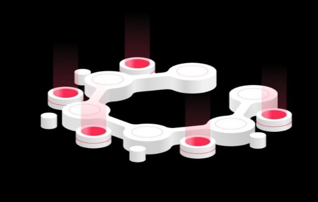
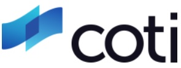
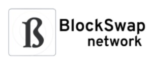
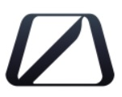

# A closer look at the cFund
### **First announced at last year’s Shelley summit, the cFund is an early-stage investment fund focused on innovative companies primarily utilizing the Cardano blockchain and its technology.**
 28 July 2021[ Fernando Sanchez](tmp//en/blog/authors/fernando-sanchez/page-1/) 5 mins read

### [**Fernando Sanchez**](tmp//en/blog/authors/fernando-sanchez/page-1/)
Technical Writer

Marketing and Communications

- 
- 

As we move closer to smart contracts on Cardano, fund activity is now accelerating. We spoke with David Roebuck, Principal at Wave Financial, to find out more about the fund and its goals.

Khi chúng tôi tiến gần hơn đến các hợp đồng thông minh trên Cardano, hoạt động quỹ hiện đang tăng tốc.
Chúng tôi đã nói chuyện với David Roebuck, hiệu trưởng tại Wave Financial, để tìm hiểu thêm về quỹ và mục tiêu của nó.

### **What is the cFund?**

### ** Cfund là gì? **

The cFund is a crypto-native hedge fund managed by Wave Financial in partnership with IOG. The fund employs an early-stage venture strategy and invests in innovative technology companies developing applications, businesses, and products being deployed on Cardano and in other R&D projects IOG is working on.

CFUND là một quỹ phòng hộ bản địa được quản lý bởi Wave Financial hợp tác với IOG.
Quỹ sử dụng chiến lược liên doanh giai đoạn đầu và đầu tư vào các công ty công nghệ sáng tạo đang phát triển các ứng dụng, doanh nghiệp và sản phẩm được triển khai trên Cardano và trong các dự án R & D khác IOG khác đang làm việc.

### **And why the name *c*Fund?**

### ** và tại sao tên*c*quỹ? **

The “c” in the name is a reference to the mathematical term “coefficient” which refers to the multiplier of a variable. Leveraging both IOG’s and Wave Financial’s domain expertise and industry connections, cFund is positioned to create a multiplier effect for its portfolio companies in terms of growth and reach.

Tên C C trong tên là một tham chiếu đến thuật ngữ toán học hệ số trực tuyến, trong đó đề cập đến hệ số nhân của một biến.
Tận dụng cả chuyên môn và kết nối công nghiệp của IOG và Wave Financial, CFund được định vị để tạo ra hiệu ứng nhân cho các công ty danh mục đầu tư của mình về tăng trưởng và tiếp cận.

### **What was the rationale for the introduction of the cFund?**

### ** Cơ sở lý luận cho việc giới thiệu cfund là gì? **

IOG is focused on accomplishing two objectives. One is enabling developers to build scalable, interoperable, and sustainable blockchain-based solutions. The other is to foster financial inclusion to the underserved populations of the world. Ultimately, IOG aims to create a new financial infrastructure for emerging economies by cultivating a community of DApps and protocols deployed on Cardano and other blockchains.

IOG tập trung vào việc hoàn thành hai mục tiêu.
Một là cho phép các nhà phát triển xây dựng các giải pháp dựa trên blockchain có thể mở rộng, có thể tương tác và bền vững.
Khác là thúc đẩy sự bao gồm tài chính cho các dân số không được bảo vệ trên thế giới.
Cuối cùng, IOG nhằm mục đích tạo ra một cơ sở hạ tầng tài chính mới cho các nền kinh tế mới nổi bằng cách nuôi dưỡng một cộng đồng DAPP và các giao thức được triển khai trên Cardano và các blockchain khác.

To help IOG achieve this vision, it partnered with Wave Financial, a digital asset manager with ~$500 million in assets under management across various different strategies and products, to create **cFund**.

Để giúp IOG đạt được tầm nhìn này, nó đã hợp tác với Wave Financial, một người quản lý tài sản kỹ thuật số với ~ 500 triệu đô la tài sản được quản lý trên các chiến lược và sản phẩm khác nhau, để tạo ** Cfund **.

### **How does the cFund fit in with the whole ecosystem (Cardano, Project Catalyst, etc)?**

### ** Làm thế nào để cfund phù hợp với toàn bộ hệ sinh thái (Cardano, Project Catalyst, v.v.)? **

While the cFund, IOG, and the Cardano Foundation all operate independently, they look for opportunities to collaborate. cFund in particular evaluates and provides strategic advice to its portfolio companies wishing to deploy on the Cardano blockchain.

Trong khi Cfund, IOG và Cardano Foundation đều hoạt động độc lập, họ tìm kiếm cơ hội hợp tác.
CFund cụ thể đánh giá và cung cấp lời khuyên chiến lược cho các công ty danh mục đầu tư của mình muốn triển khai trên blockchain Cardano.

### **Tell us more about the investment approach**

### ** Hãy cho chúng tôi biết thêm về phương pháp đầu tư **

cFund is funded by third-party, high-net worth individuals, family offices, and institutional investors (including IOG). cFund looks to invest in, and partner with, leading early-stage projects and businesses that primarily have a focus on the Cardano ecosystem and associated technology. The fund is already actively deploying capital and creating partnerships across the Cardano ecosystem.

CFund được tài trợ bởi các cá nhân có giá trị mạng cao thứ ba, văn phòng gia đình và các nhà đầu tư tổ chức (bao gồm IOG).
Cfund tìm cách đầu tư và hợp tác với các dự án và doanh nghiệp giai đoạn đầu, chủ yếu tập trung vào hệ sinh thái Cardano và công nghệ liên quan.
Quỹ đã tích cực triển khai vốn và tạo ra quan hệ đối tác trên hệ sinh thái Cardano.

When analyzing investment opportunities, cFund takes a disciplined approach that considers a multitude of factors when evaluating an opportunity. Firstly, the fund evaluates whether there is a clear need in the market for the offering a company provides and determines if other competitors can out-execute. In venture, we call this *timing the market*. Next, the fund evaluates the background of the team to determine if the founders have the knowledge, skills, resources, and ability to scale their company or project. The fund also considers possible exit scenarios.

Khi phân tích các cơ hội đầu tư, CFund thực hiện một cách tiếp cận kỷ luật xem xét vô số yếu tố khi đánh giá một cơ hội.
Đầu tiên, Quỹ đánh giá liệu có nhu cầu rõ ràng trên thị trường để cung cấp một công ty cung cấp và xác định xem các đối thủ khác có thể thực thi hay không.
Trong liên doanh, chúng tôi gọi đây là *thời gian thị trường *.
Tiếp theo, quỹ đánh giá nền tảng của nhóm để xác định xem những người sáng lập có kiến thức, kỹ năng, tài nguyên và khả năng mở rộng quy mô công ty hoặc dự án của họ hay không.
Quỹ cũng xem xét các kịch bản thoát có thể.

Since one of cFund’s primary objectives is to help Cardano build alliances across the blockchain space, one of the most important factors cFund considers during its due diligence process is whether or not the company can be a value-add to the Cardano ecosystem.

Vì một trong những mục tiêu chính của CFUND, là giúp Cardano xây dựng các liên minh trên toàn bộ không gian blockchain, một trong những yếu tố quan trọng nhất mà CFund xem xét trong quá trình siêng năng của mình là liệu công ty có thể là giá trị gia tăng đối với hệ sinh thái Cardano hay không.

One market that cFund has been deploying capital into is Decentralized Finance (DeFi), or more broadly, what is called *Open Finance*. cFund’s first investment in this market was COTI, a decentralized and scalable payments network for the global e-commerce market. COTI is a value-add because it plans to provide a bridge for DeFi applications wishing to deploy on the Cardano blockchain. The company is now developing ADA Pay, a gateway solution that enables merchants to accept payments in ada (the native protocol token for Cardano) with near-instant settlement. The company is also developing a stablecoin that will run on Cardano.

Một thị trường mà CFund đã triển khai vốn thành tài chính phi tập trung (DEFI), hoặc rộng hơn, cái được gọi là *tài chính mở *.
Đầu tư đầu tiên của CFUND vào thị trường này là Coti, một mạng lưới thanh toán phi tập trung và có thể mở rộng cho thị trường thương mại điện tử toàn cầu.
COTI là một giá trị gia tăng vì nó có kế hoạch cung cấp một cây cầu cho các ứng dụng DEFI muốn triển khai trên blockchain Cardano.
Công ty hiện đang phát triển ADA Pay, một giải pháp Gateway cho phép các thương nhân chấp nhận thanh toán trong ADA (mã thông báo giao thức gốc cho Cardano) với việc giải quyết gần như có.
Công ty cũng đang phát triển một stablecoin sẽ chạy trên Cardano.

Another DeFI investment in the portfolio is Blockswap, which is an automated liquidity protocol for proof of stake chains that allows users to re-stake their staked assets. Blockswap brings liquidity for staking activities, providing DeFi benefits to the network. Users will be able to re-stake their fully staked assets, earning yield without the use of a synthetic asset.

Một khoản đầu tư khác của DEFI vào danh mục đầu tư là Blockswap, đây là giao thức thanh khoản tự động để chứng minh chuỗi cổ phần cho phép người dùng đặt lại tài sản bị đặt cược của họ.
Blockswap mang lại tính thanh khoản cho các hoạt động đặt cược, cung cấp lợi ích của DECI cho mạng.
Người dùng sẽ có thể đặt lại các tài sản được đặt cược đầy đủ của họ, kiếm được năng suất mà không cần sử dụng tài sản tổng hợp.

cFund’s most recent investment in this space is Occam.Fi, a suite of DeFi solutions tailored for Cardano. The company’s first product is a decentralized funding platform. Through this launchpad, the next generation of disruptive DeFi applications will be able to raise capital using the Cardano blockchain. Overall, DeFi is one of a number of markets cFund invests in, but ideally the portfolio companies must have the capability of building on the Cardano ecosystem in some capacity.

Đầu tư gần đây nhất của CFund vào không gian này là Occam.fi, một bộ giải pháp Defi phù hợp với Cardano.
Sản phẩm đầu tiên của công ty là một nền tảng tài trợ phi tập trung.
Thông qua LaunchPad này, thế hệ ứng dụng DEFI đột phá tiếp theo sẽ có thể huy động vốn bằng blockchain Cardano.
Nhìn chung, DEFI là một trong một số thị trường đầu tư CFUND, nhưng lý tưởng nhất là các công ty danh mục đầu tư phải có khả năng xây dựng trên hệ sinh thái Cardano trong một số khả năng.

### **Aside from investment, what else do you offer?**

### ** Ngoài đầu tư, bạn còn cung cấp gì nữa? **

cFund is both a capital provider, an advisor, and a partner to its portfolio companies and the broader Cardano ecosystem. Leveraging IOG and Wave Financial’s resources, reputation, expertise, and network, cFund provides unparalleled access and guidance to its portfolio. cFund firmly believes in being a value-added investor. cFund aspires to be a management team's first call.

CFund vừa là nhà cung cấp vốn, cố vấn, vừa là đối tác của các công ty danh mục đầu tư và hệ sinh thái Cardano rộng lớn hơn.
Tận dụng các nguồn lực, danh tiếng, chuyên môn và mạng của IOG và Wave Financial, CFund cung cấp quyền truy cập và hướng dẫn vô song cho danh mục đầu tư của mình.
Cfund chắc chắn tin vào việc trở thành một nhà đầu tư giá trị gia tăng.
Cfund mong muốn trở thành một nhóm quản lý cuộc gọi đầu tiên.

### **If there are businesses reading this who might want to be considered for funding, what should they do?**

### ** Nếu có các doanh nghiệp đọc điều này, những người có thể muốn được xem xét để tài trợ, họ nên làm gì? **

Prospective projects and businesses can reach out to Wave Financial’s early-stage [distribution email](mailto:venture@wavegp.com), or directly message and/or follow me on [Twitter](https://twitter.com/@DavidMRoebuck).

Các dự án và doanh nghiệp tiềm năng có thể liên hệ với Wave Financial giai đoạn đầu [Email phân phối] (mailto: venture@wavegp.com), hoặc tin nhắn trực tiếp và/hoặc theo dõi tôi trên [Twitter] (https://twitter.com/@davidmroebuck
).

### **What is the long-term plan for the cFund?**

### ** Kế hoạch dài hạn cho cfund là gì? **

cFund aims to be the leading early-stage venture firm that invests primarily in Cardano blockchain based technologies besides becoming an integral part of the Cardano ecosystem. In line with IOG’s founding principle of *cascading disruption*, *the idea that most of the structures that form global financial, governance and social systems are inherently unstable and thus minor perturbations can cause a ripple effect that fundamentally re-configures the entire system.* cFund's goal is to identify and back technologies that force these perturbations together to push to a fair and transparent order for all stakeholders.

CFund nhằm mục đích trở thành công ty liên doanh giai đoạn đầu hàng đầu, đầu tư chủ yếu vào các công nghệ dựa trên blockchain cardano bên cạnh việc trở thành một phần không thể thiếu của hệ sinh thái Cardano.
Theo nguyên tắc sáng lập của IOG về sự gián đoạn *xếp tầng *, *Ý tưởng rằng hầu hết các cấu trúc hình thành các hệ thống tài chính, quản trị và xã hội toàn cầu vốn không ổn định và do đó các nhiễu loạn nhỏ có thể gây ra hiệu ứng gợn sóng cơ bản cấu hình lại toàn bộ hệ thống.
* Mục tiêu của CFund là xác định và sao lưu các công nghệ buộc các nhiễu loạn này lại với nhau để thúc đẩy một trật tự công bằng và minh bạch cho tất cả các bên liên quan.

*Thanks for your time, David.*

*Cảm ơn vì thời gian của bạn, David.*

#### **Additional resources**

#### ** Tài nguyên bổ sung **

- [cFund page](https://cfund.vc/)

- [Trang CFund] (https://cfund.vc/)

- [Wave Financial website](https://wavegp.com/)

- [Trang web tài chính sóng] (https://wavegp.com/)

- [Cardano website](https://cardano.org/)

- [Trang web Cardano] (https://cardano.org/)

