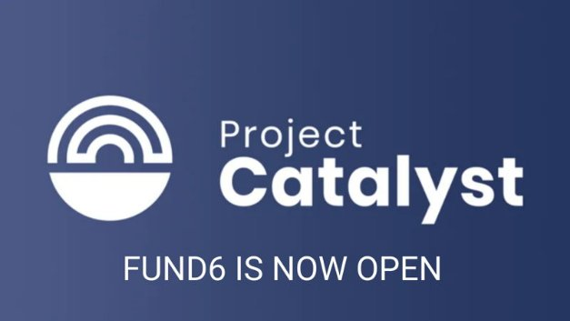

# Project Catalyst Fund6 – our biggest, boldest & best Cardano community innovation fund yet
### **Our exciting experiment continues with new challenges, new features and a $4m fund**
 13 August 2021[ Kriss Baird](tmp//en/blog/authors/kriss-braid/page-1/) 3 mins read

### [**Kriss Baird**](tmp//en/blog/authors/kriss-braid/page-1/)
Product Owner

Commercial

- 
- 
- 

This week, we launched [Project Catalyst Fund6](https://bit.ly/3ACVEEP), with $4m worth of ada available. Proposers can submit proposals for projects that received funding to address real-world challenges and help to build Cardano’s ecosystem. 

Tuần này, chúng tôi đã ra mắt [Project Catalyst Fund6] (https://bit.ly/3acveep), với ADA trị giá 4 triệu đô la có sẵn.
Những người đề xuất có thể gửi đề xuất cho các dự án nhận được tài trợ để giải quyết các thách thức trong thế giới thực và giúp xây dựng hệ sinh thái Cardano.

Fund6 is our most ambitious fund yet, with more funding being distributed in Fund6 than in all the previous funds combined. For Fund6, we expect around 150 new projects to be voted into existence by the community. There is also $40k worth of ada to be rewarded for proposal referrals. 

Fund6 là quỹ đầy tham vọng nhất của chúng tôi, với nhiều tài trợ được phân phối trong Fund6 so với tất cả các quỹ trước đó được kết hợp.
Đối với Fund6, chúng tôi hy vọng khoảng 150 dự án mới sẽ được cộng đồng bỏ phiếu.
Ngoài ra còn có ADA trị giá $ 40k để được khen thưởng cho các giới thiệu đề xuất.

18 challenges are available for proposers to respond to and the community votes on which projects receive funding, including 10 community-set challenges, where members of the community have defined the challenges to be addressed. 

18 thách thức có sẵn cho các nhà đề xuất để đáp ứng và phiếu bầu của cộng đồng về việc các dự án nhận được tài trợ, bao gồm 10 thách thức trong cộng đồng, trong đó các thành viên của cộng đồng đã xác định các thách thức cần giải quyết.

In addition:

Thêm vao Đoa:

## **Development upgrades to Catalyst protocol and tech**

## ** Nâng cấp phát triển lên giao thức Catalyst và Tech **

Fund6 features new significant upgrades to the Catalyst infrastructure including changes to reward incentives and a significant upgrade to the overall voting experience in the application. This makes it more equitable and attractive for community advisors as well as veteran community advisors to help assess the quality of proposals. 

Fund6 có các nâng cấp quan trọng mới cho cơ sở hạ tầng Catalyst bao gồm các thay đổi để thưởng cho các ưu đãi và nâng cấp đáng kể cho trải nghiệm bỏ phiếu tổng thể trong ứng dụng.
Điều này làm cho nó công bằng và hấp dẫn hơn đối với các cố vấn cộng đồng cũng như các cố vấn cộng đồng kỳ cựu để giúp đánh giá chất lượng của các đề xuất.

Voters also have the opportunity to participate using their Ledger and Trezor hardware wallets across Daedalus, Yoroi, and Adalite. 

Cử tri cũng có cơ hội tham gia bằng cách sử dụng ví Ledger và Trezor phần cứng của họ trên khắp Daedalus, Yoroi và Adalite.

Fund6 also sees the introduction of voting privacy so voters can take part with the feeling of complete confidence that their votes have tallied as expected and that they are private.

Fund6 cũng thấy việc giới thiệu quyền riêng tư bỏ phiếu để cử tri có thể tham gia với cảm giác hoàn toàn tự tin rằng phiếu bầu của họ đã được coi là mong đợi và họ là riêng tư.

Funded proposals can also benefit from an invitation to join our successful Plutus Pioneer training program, where participants can learn how to implement Plutus smart contracts into their application. 

Các đề xuất được tài trợ cũng có thể được hưởng lợi từ lời mời tham gia chương trình đào tạo Pioneer Plutus thành công của chúng tôi, nơi người tham gia có thể học cách thực hiện các hợp đồng thông minh Plutus vào ứng dụng của họ.

## **Fund5 key stats**

## ** Số liệu thống kê chính của Fund5 **

- ±33 thousand wallets, ±31k IdeaScale members, + more than 150 projects funded to date! 

- ± 33 nghìn ví, ± 31k thành viên có ý tưởng, + hơn 150 dự án được tài trợ cho đến nay!

- Total CA reviews submitted: ±3500

- Tổng số CA đánh giá đã gửi: ± 3500

- Total proposals submitted: 930

- Tổng số đề xuất đã gửi: 930

- Total funds allocated: $3,875,000

- Tổng số tiền được phân bổ: $ 3,875,000

- Insight shares: 1,100

- Cổ phiếu Insight: 1.100

- Total votes cast: ±611,000

- Tổng số phiếu bầu: ± 611.000

- Grassroots community thriving

- Cộng đồng cơ sở phát triển mạnh

- Still civil & constructive discourse even while in the middle of huge growth.

- Vẫn là diễn ngôn dân sự và mang tính xây dựng ngay cả khi ở giữa sự tăng trưởng rất lớn.

## **Key dates:**

## **Ngày quan trọng:**

- 11 August 2021: Fund6 launched at Town Hall with a [Charles Hoskinson keynote presentation](https://youtu.be/crs3lVaGejY)

- 11 tháng 8 năm 2021: Fund6 ra mắt tại Tòa thị chính với một bài thuyết trình chính [Charles Hoskinson] (https://youtu.be/crs3lvagejy)

- 12 August 2021: Innovation phases begin: Insight sharing – to share perspectives on challenges

- 12 tháng 8 năm 2021: Giai đoạn đổi mới bắt đầu: Chia sẻ cái nhìn sâu sắc - để chia sẻ quan điểm về những thách thức

- **19 August 2021: Proposal submission opens: 1 week for proposers to submit draft ideas to IdeaScale**

- ** 19 tháng 8 năm 2021: Đệ trình đề xuất mở: 1 tuần cho những người đề xuất gửi ý tưởng dự thảo cho IdeasCale **

- 26 August 2021: Refine ideas: Community provides structured feedback and Proposers edit proposals 

- 26 tháng 8 năm 2021: Tinh chỉnh ý tưởng: Cộng đồng cung cấp phản hồi và đề xuất có cấu trúc chỉnh sửa đề xuất

- **9 September 2021: Deadline to finalize proposals and register community advisors for the assessment stage**

- ** 9 tháng 9 năm 2021: Hạn chót để hoàn thiện các đề xuất và đăng ký cố vấn cộng đồng cho giai đoạn đánh giá **

- 7 October 2021: Fund6 voting begins

- 7 tháng 10 năm 2021: Bỏ phiếu của Fund6

- **1st week of November: Fund6 winners announced**

- ** Tuần 1 tháng 11: Người chiến thắng Fund6 đã công bố **

*Project Catalyst holds weekly Town Halls for the community to learn more about the fund, ask questions, and test out project ideas in the after-Town Hall breakout rooms.*

*Project Catalyst giữ các hội trường thị trấn hàng tuần cho cộng đồng tìm hiểu thêm về quỹ, đặt câu hỏi và kiểm tra các ý tưởng dự án trong các phòng đột phá hội trường sau thị trấn.*

*You can [register for Town Hall meetings here](https://bit.ly/3rCicSR), join the announcements [Telegram](https://t.me/cardanocatalyst) or subscribe to the [mailing list](https://bit.ly/3dSZJvx).*

*Bạn có thể [đăng ký cho các cuộc họp của tòa thị chính tại đây] (https://bit.ly/3rcicsr), tham gia các thông báo [Telegram] (https://t.me/cardanocatalyst) hoặc đăng ký vào [danh sách gửi thư] (https
: //bit.ly/3dszjvx).*

