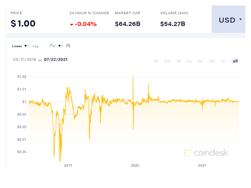

# Djed: implementing algorithmic stablecoins for proven price stability
### **Djed is the first coin to use formal verification to eliminate price volatility**
 18 August 2021[ Olga Hryniuk](tmp//en/blog/authors/olga-hryniuk/page-1/) 7 mins read

### [**Olga Hryniuk**](tmp//en/blog/authors/olga-hryniuk/page-1/)
Technical Writer

Marketing & Communications

- 
- 

Cryptocurrency volatility is one of the obstacles to its wider adoption. Blockchain technologies provide benefits such as transparency, data immutability, and proven security of financial operations. Yet, it is harder than fiat currencies to predict how the market will behave, or forecast the value of a digital currency. This hinders using cryptocurrencies as accounting and exchange units in daily operations.

Biến động tiền điện tử là một trong những trở ngại cho việc áp dụng rộng rãi hơn.
Các công nghệ blockchain cung cấp các lợi ích như minh bạch, tính bất biến dữ liệu và bảo mật đã được chứng minh của các hoạt động tài chính.
Tuy nhiên, việc dự đoán thị trường sẽ hoạt động như thế nào hoặc dự báo giá trị của một loại tiền kỹ thuật số.
Điều này cản trở việc sử dụng tiền điện tử làm đơn vị kế toán và trao đổi trong các hoạt động hàng ngày.

A stablecoin is a cryptocurrency pegged to a basket of fiat currencies or a single currency (eg, USD or EUR); commodities like gold or silver; stocks; or other cryptocurrencies. Stablecoins include mechanisms that maintain a low price deviation from their target price and so are useful to store or exchange value, as their built-in mechanisms remove the volatility. 

StableCoin là một loại tiền điện tử được gắn vào một giỏ tiền tệ fiat hoặc một loại tiền tệ duy nhất (ví dụ: USD hoặc EUR);
hàng hóa như vàng hoặc bạc;
cổ phiếu;
hoặc các loại tiền điện tử khác.
StableCoin bao gồm các cơ chế duy trì độ lệch giá thấp so với giá mục tiêu của chúng và vì vậy rất hữu ích để lưu trữ hoặc trao đổi giá trị, vì các cơ chế tích hợp của chúng loại bỏ sự biến động.

Some stablecoins lack transparency and liquidity of their reserves, which compromises their price stability. To address these challenges, IOG has teamed up with Emurgo, another of the three founding partners of Cardano, and the Ergo blockchain, which uses UTXO-based accounting like Cardano, to work on a stablecoin contract called Djed. Djed is based on algorithmic design. This means it uses smart contracts to ensure price stabilization, and that the coin will be useful for decentralized finance (DeFi) operations. 

Một số stabloin thiếu tính minh bạch và thanh khoản của dự trữ của họ, làm ảnh hưởng đến sự ổn định giá của chúng.
Để giải quyết những thách thức này, IOG đã hợp tác với Emurgo, một trong ba đối tác sáng lập của Cardano và Ergo Blockchain, sử dụng kế toán có trụ sở tại UTXO như Cardano, để làm việc với hợp đồng stablecoin có tên DJED.
DJED dựa trên thiết kế thuật toán.
Điều này có nghĩa là nó sử dụng các hợp đồng thông minh để đảm bảo ổn định giá và đồng xu sẽ hữu ích cho các hoạt động tài chính phi tập trung (DEFI).

## **How stablecoins work**

## ** Làm thế nào StableCoins hoạt động **

Different mechanisms contribute to the stability of the coin’s value and help eliminate price variations. These mechanisms are underpinned by the economic principles of supply and demand. 

Các cơ chế khác nhau góp phần vào sự ổn định của giá trị của đồng xu và giúp loại bỏ các biến đổi giá.
Các cơ chế này được củng cố bởi các nguyên tắc kinh tế của cung và cầu.

A common mechanism is backing the stablecoin by a reserve of the currency used as the peg. If demand is higher than the supply of sell or buy orders, this supply should be increased to avoid fluctuations in the price. Typically, stablecoin reserves are not stored in cash. Instead, they are kept in interest-bearing financial instruments such as bonds. The returns on these provide revenue for the operator. 

Một cơ chế phổ biến là sao lưu stablecoin bởi một dự trữ tiền tệ được sử dụng làm chốt.
Nếu nhu cầu cao hơn nguồn cung cấp hoặc mua hàng, nguồn cung này sẽ được tăng lên để tránh sự biến động của giá cả.
Thông thường, dự trữ stablecoin không được lưu trữ bằng tiền mặt.
Thay vào đó, họ được giữ trong các công cụ tài chính mang lãi suất như trái phiếu.
Lợi nhuận trên này cung cấp doanh thu cho nhà điều hành.

As long as the stablecoin is fully backed by reserves in the currency to which it is pegged – and the operator can react quickly to variations in demand – price stability is maintained. 

Miễn là stablecoin được hỗ trợ đầy đủ bởi các khoản dự trữ bằng loại tiền mà nó được chốt - và người vận hành có thể phản ứng nhanh với các biến thể về nhu cầu - độ ổn định giá được duy trì.

## **Common risks**

## ** Rủi ro chung **

Stablecoin reserves are commonly associated with investments. The lack of liquidity of these investments may prevent the operator from reacting quickly to demand. This compromises stability in the short term.

Dự trữ StableCoin thường được liên kết với các khoản đầu tư.
Việc thiếu thanh khoản của các khoản đầu tư này có thể ngăn người vận hành phản ứng nhanh chóng với nhu cầu.
Điều này thỏa hiệp sự ổn định trong ngắn hạn.

A drawback of fiat-backed stablecoins is that they require trust in the entities keeping the reserves. Lack of the reserves’ transparency or of the ‘full-backing’ claim, combined with inefficient stabilization measures, have already caused Tether stablecoin (USDT) to fall below $0.96, as shown in Figure 1.

Một nhược điểm của stablecoins được fiat hỗ trợ là họ yêu cầu niềm tin vào các thực thể giữ dự trữ.
Thiếu sự minh bạch của dự trữ hoặc yêu cầu của chính xác, kết hợp với các biện pháp ổn định không hiệu quả, đã khiến Tether StableCoin (USDT) giảm xuống dưới 0,96 đô la, như trong Hình 1.

Figure 1. Price of the Tether stablecoin (USDT) in the past three years

Hình 1. Giá của Tether StableCoin (USDT) trong ba năm qua

Issues of transparency do not arise when the backing asset is a cryptocurrency on a public blockchain. Furthermore, the use of smart contracts ensures efficient and reliable execution of stabilization measures due to its automated and secure mechanisms.

Các vấn đề về tính minh bạch không phát sinh khi tài sản ủng hộ là một loại tiền điện tử trên một blockchain công cộng.
Hơn nữa, việc sử dụng các hợp đồng thông minh đảm bảo thực hiện các biện pháp ổn định hiệu quả và đáng tin cậy do các cơ chế tự động và an toàn của nó.

## **Enhanced stabilization mechanisms of Djed algorithmic stablecoin**

## ** Cơ chế ổn định nâng cao của stablecoin thuật toán DJED **

Djed is a crypto-backed algorithmic stablecoin contract that acts as an autonomous bank. It operates by keeping a reserve of *base coins*, and minting and burning *stablecoins* and *reserve coins*. The contract maintains the peg of stablecoins to a target price by buying and selling stablecoins, using the reserve, and charging fees, which accumulate in the reserve, as shown in Figure 2. The ultimate beneficiaries of this revenue stream are holders of reserve coins, who boost the reserve with funds while assuming the risk of price fluctuation.

DJED là một hợp đồng stablecoin thuật toán được hỗ trợ bằng tiền điện tử hoạt động như một ngân hàng tự trị.
Nó hoạt động bằng cách giữ một dự trữ của *tiền cơ sở *, và khai thác và đốt *stablecoins *và *tiền dự trữ *.
Hợp đồng duy trì chốt của stabloin với giá mục tiêu bằng cách mua và bán stablecoins, sử dụng dự trữ và phí tính phí, tích lũy trong dự trữ, như trong Hình 2. Những người thụ hưởng cuối cùng của dòng doanh thu này là người nắm giữ tiền dự trữ,
Ai tăng dự trữ với tiền trong khi đảm nhận rủi ro biến động giá.

Figure 2. How Djed works

Hình 2. Cách hoạt động của DJ

The Djed stablecoin is designed as an asset pegged to a fiat currency (USD), along with a governing algorithm. This approach provides a stable means of exchange. But Djed is not limited to being pegged to the dollar. It can work with other currencies, as long as there are oracles providing the contract with the corresponding pricing index.

StableCoin DJed được thiết kế như một tài sản được gắn với tiền tệ fiat (USD), cùng với thuật toán quản lý.
Cách tiếp cận này cung cấp một phương tiện trao đổi ổn định.
Nhưng DJed không giới hạn là bị chốt vào đồng đô la.
Nó có thể hoạt động với các loại tiền tệ khác, miễn là có các nhà tiên tri cung cấp hợp đồng với chỉ số giá tương ứng.

## **The first formally verified stablecoin protocol**

## ** Giao thức StableCoin được xác minh chính thức đầu tiên **

Djed is the first *formally verified* stablecoin protocol. The use of formal methods in the programming process has greatly contributed to the design and stability properties of Djed. Using formal techniques, the properties are proven by mathematical theorems:

Djed là giao thức stableCoin * chính thức * chính thức.
Việc sử dụng các phương pháp chính thức trong quá trình lập trình đã đóng góp rất nhiều cho các đặc tính thiết kế và ổn định của DJED.
Sử dụng các kỹ thuật chính thức, các thuộc tính được chứng minh bằng các định lý toán học:

- **Peg upper and lower bound maintenance**: the price will not go above or beyond the set price. In the normal reserve ratio range, purchases and sales are not restricted, and users have no incentive to trade stablecoins outside the peg range in a secondary market.

- ** PEG BẢO HIỂM TRÊN VÀ HOẠT ĐỘNG LOWN **: Giá sẽ không vượt quá hoặc vượt quá giá đã đặt.
Trong phạm vi tỷ lệ dự trữ bình thường, các giao dịch mua và bán hàng không bị hạn chế và người dùng không có động cơ giao dịch stabloin bên ngoài phạm vi PEG trong một thị trường thứ cấp.

- **Peg robustness during market crashes**: up to a set limit that depends on the reserve ratio, the peg is maintained even when the price of the base coin falls sharply.

- ** Độ mạnh của PEG trong các vụ sụp đổ thị trường **: Tối đa giới hạn phụ thuộc vào tỷ lệ dự trữ, PEG được duy trì ngay cả khi giá của đồng tiền cơ sở giảm mạnh.

- **No insolvency**: no bank is involved, so there is no bank contract to go bankrupt.

- ** Không có khả năng thanh toán **: Không có ngân hàng nào liên quan, vì vậy không có hợp đồng ngân hàng nào để phá sản.

- **No bank runs**: all users are treated fairly and paid accordingly, so there is provably no incentive for users to race to redeem their stablecoins.

- ** Không có ngân hàng chạy **: Tất cả người dùng được đối xử công bằng và được trả tiền cho phù hợp, do đó, không có động cơ nào cho người dùng đua để đổi sao chổi của họ.

- **Monotonically increasing equity per reserve coin**: under some conditions, the reserve surplus per reserve coin is guaranteed to increase as users interact with the contract. Under these conditions, reserve coin holders are guaranteed to profit. 

- ** Tăng vốn chủ sở hữu trên mỗi đồng tiền dự trữ **: Trong một số điều kiện, thặng dư dự trữ trên mỗi đồng tiền dự trữ được đảm bảo tăng khi người dùng tương tác với hợp đồng.
Trong các điều kiện này, chủ sở hữu tiền dự trữ được đảm bảo lợi nhuận.

- **No reserve draining**: under some conditions, it is impossible for a malicious user to execute a sequence of actions that would steal reserves from the bank.

- ** Không thoát nước dự trữ **: Trong một số điều kiện, người dùng độc hại không thể thực hiện một chuỗi các hành động sẽ đánh cắp dự trữ từ ngân hàng.

- **Bounded dilution**: there is a limit to how many reserve coin holders and their profit can be diluted due to the issuance of more reserve coins.

- ** Pha loãng bị ràng buộc **: Có giới hạn về số lượng chủ sở hữu tiền dự trữ và lợi nhuận của họ có thể được pha loãng do phát hành nhiều tiền dự trữ hơn.

## **Djed versions**

## ** Phiên bản DJed **

There are two versions of Djed:

Có hai phiên bản DJED:

- **Minimal Djed**: this version is designed to be as simple, intuitive, and straightforward as possible, without compromising stability. 

- ** DJed tối thiểu **: Phiên bản này được thiết kế đơn giản, trực quan và đơn giản nhất có thể, mà không ảnh hưởng đến sự ổn định.

- **Extended Djed**: this more complex version provides some additional stability benefits. The main differences are the use of a continuous pricing model and dynamic fees to further incentivize the maintenance of the reserve ratio at an optimal level.

- ** Djed mở rộng **: Phiên bản phức tạp hơn này cung cấp một số lợi ích ổn định bổ sung.
Sự khác biệt chính là việc sử dụng mô hình định giá liên tục và phí động để khuyến khích tiếp tục duy trì tỷ lệ dự trữ ở mức tối ưu.

## **Implementations**

## ** triển khai **

IOG, Ergo, and Emurgo teams have been working on the implementation of the Djed algorithmic stablecoin contract earlier in 2021 to test different models. 

Các nhóm IOG, Ergo và Emurgo đã làm việc để thực hiện hợp đồng StableCoin thuật toán DJED trước đó vào năm 2021 để kiểm tra các mô hình khác nhau.

The first implementation of a Djed stablecoin contract was [SigmaUSD](https://sigmausd.io/#/) on Ergo. This was the first algorithmic stablecoin deployed on a UTXO-based ledger in Q1 2021. It had a fee of 1% for buying or selling operations, and an oracle that updated the exchange rate every hour. This initial version was subject to a reserve draining attack by an anonymous user who owned a large number of ERGs (Ergo’s native coin). The attack was ultimately unsuccessful, and it is estimated that the attacker lost $100,000. 

Việc thực hiện đầu tiên một hợp đồng stablecoin DJed là [Sigmausd] (https://sigmausd.io/#/) trên Ergo.
Đây là StableCoin thuật toán đầu tiên được triển khai trên sổ cái dựa trên UTXO vào quý 1 năm 2021. Nó có phí 1% khi mua hoặc bán hoạt động và một nhà tiên tri đã cập nhật tỷ giá hối đoái mỗi giờ.
Phiên bản ban đầu này phải chịu một cuộc tấn công thoát nước dự trữ bởi một người dùng ẩn danh, người sở hữu một số lượng lớn các ERG (đồng tiền gốc của Ergo).
Cuộc tấn công cuối cùng đã không thành công và ước tính kẻ tấn công đã mất 100.000 đô la.

To further discourage such attacks, this initial deployment of Minimal Djed was replaced by a version where the fee was set to 2%, the oracle updated every 12 minutes, and every oracle update was allowed to change the price by at most 0.49%, unless the price difference was greater than 50%. This provided stronger resilience against reserve draining attacks. 

Để khuyến khích các cuộc tấn công như vậy, việc triển khai ban đầu DJ được thay thế ban đầu đã được thay thế bằng một phiên bản trong đó phí được đặt thành 2%, Oracle được cập nhật cứ sau 12 phút và mỗi bản cập nhật của Oracle được phép thay đổi giá tối đa 0,49%, trừ khi
Sự khác biệt về giá lớn hơn 50%.
Điều này cung cấp khả năng phục hồi mạnh mẽ hơn chống lại các cuộc tấn công thoát nước dự trữ.

Djed has also been implemented by the IOG team in Solidity. One version uses the native currency of the Ethereum blockchain as a base coin, and another uses any ERC20-compliant token as a base coin. So far, these implementations have been deployed to testnets for Binance Smart Chain’s testnet, Avalanche’s Fuji, Polygon’s Mumbai, Ethereum’s Kovan, Ethereum’s Rinkeby, and RSK’s testnet.

DJED cũng đã được thực hiện bởi nhóm IOG trong sự vững chắc.
Một phiên bản sử dụng loại tiền gốc của blockchain Ethereum làm đồng tiền cơ sở và một phiên bản khác sử dụng bất kỳ mã thông báo tuân thủ ERC20 nào làm đồng tiền cơ sở.
Cho đến nay, các triển khai này đã được triển khai để thử nghiệm cho TestNet của Binance SMART, Fuji, Mumbai của Avalanche, Kovan, Ethereum, Rinke

## **Djed: Cardano implementation**

## ** DJed: Thực hiện Cardano **

The Alonzo update to Cardano will enable smart contracts using Plutus. Plutus is powered by Haskell, which guarantees a safe, full-stack programming environment.

Bản cập nhật Alonzo cho Cardano sẽ cho phép các hợp đồng thông minh bằng cách sử dụng Plutus.
Plutus được cung cấp bởi Haskell, nơi đảm bảo một môi trường lập trình đầy đủ, an toàn.

Draft implementation of an earlier version of Minimal Djed is [available in the Plutus language](https://github.com/input-output-hk/plutus/blob/master/plutus-use-cases/src/Plutus/Contracts/Stablecoin.hs). In this implementation, stablecoins and reserve coins are native assets uniquely identified by the hash of the monetary policy that controls their minting and burning according to the Djed protocol. This implementation also assumes that oracle data such as the exchange rate is provided as signed data directly to the transactions, instead of being posted on-chain.

Dự thảo thực hiện một phiên bản trước đó của DJed tối thiểu là [có sẵn bằng ngôn ngữ Plutus] (https://github.com/input-output
StableCoin.hs).
Trong quá trình thực hiện này, stablecoins và tiền dự trữ là tài sản bản địa được xác định duy nhất bởi băm của chính sách tiền tệ kiểm soát việc khai thác và đốt của họ theo giao thức DJED.
Việc triển khai này cũng giả định rằng dữ liệu của Oracle như tỷ giá hối đoái được cung cấp dưới dạng dữ liệu đã ký trực tiếp cho các giao dịch, thay vì được đăng trên chuỗi.

There is also an ongoing OpenStar implementation. OpenStar is a framework for private permissioned blockchains developed in Scala. The implementation of Djed using OpenStar follows the idea of off-chain smart contract execution to have a stablecoin on Cardano that does not depend on smart contracts executed on-chain.

Ngoài ra còn có một triển khai Openstar đang diễn ra.
OpenStar là một khung cho các blockchain được phép riêng được phát triển trong Scala.
Việc triển khai DJED bằng OpenStar theo ý tưởng thực thi hợp đồng thông minh ngoài chuỗi để có một stableCoin đối với Cardano không phụ thuộc vào các hợp đồng thông minh được thực hiện trên chuỗi.

To find out more about Djed stablecoin, see the [recently published research paper](https://iohk.io/en/research/library/papers/djeda-formally-verified-crypto-backed-pegged-algorithmic-stablecoin/) or check out the [presentation by Bruno Woltzenlogel Paleo](https://www.youtube.com/watch?v=zG-rxMCDIa0&t=8366s), IOG technical director, at Ergo summit 2021.

Để tìm hiểu thêm về DJED StableCoin, hãy xem [Bài nghiên cứu được công bố gần đây] (https://iohk.io/en/research/l Library/papers/djeda-pormally-versified-crypto-backed-pegged-algorithmic
Hoặc xem [Trình bày của Bruno Woltzenlogel Paleo] (https://www.youtube.com/watch?v=ZG-rxmcdia0&t=8366s), Giám đốc kỹ thuật của IOG, tại Ergo Summit 2021.

*We’d like to thank and acknowledge Bruno Woltzenlogel Paleo for his input to this article and support throughout the process of its creation.*

*Chúng tôi muốn cảm ơn và thừa nhận Bruno Woltzenlogel Paleo vì đầu vào của anh ấy cho bài viết này và hỗ trợ trong suốt quá trình sáng tạo của nó.*

