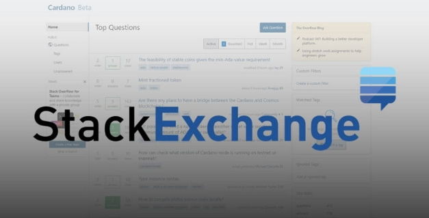

# Cardano Stack Exchange: a growing and vibrant community developer resource
### **Learn about this dedicated community hub that supports Cardano developers**
 19 August 2021[ Neil Burgess](tmp//en/blog/authors/neil-burgess/page-1/) 4 mins read

### [**Neil Burgess**](tmp//en/blog/authors/neil-burgess/page-1/)
Technical Writer

Marketing & Communications

- 
- 

The Cardano ecosystem is committed to supporting and growing our developer community. A vibrant, informed community is essential to the development of a decentralized, functional ecosystem with a diverse user base. In line with our open-source approach, as we evolve Cardano together, everyone can benefit from its decentralized financial solutions while delivering best-in-class blockchain technology. 

Hệ sinh thái Cardano cam kết hỗ trợ và phát triển cộng đồng nhà phát triển của chúng tôi.
Một cộng đồng sôi động, có hiểu biết là điều cần thiết cho sự phát triển của một hệ sinh thái chức năng, phi tập trung với cơ sở người dùng đa dạng.
Theo cách tiếp cận nguồn mở của chúng tôi, khi chúng tôi cùng nhau phát triển Cardano, mọi người đều có thể hưởng lợi từ các giải pháp tài chính phi tập trung của mình trong khi cung cấp công nghệ blockchain tốt nhất trong lớp.

To reach our common goals, it is essential that everyone participates in the development process and can always get the information, guidance, and assistance they need.

Để đạt được các mục tiêu chung của chúng tôi, điều cần thiết là mọi người đều tham gia vào quá trình phát triển và luôn có thể có được thông tin, hướng dẫn và hỗ trợ họ cần.

To support this mission, we are encouraging development talent and experts from across the globe to gather in one place – [Cardano Stack Exchange](https://cardano.stackexchange.com/). This developer hub is the ideal place to share experiences, ask and answer questions about all the streams of Cardano development and operations, and share resources. This site – being driven by members of the Cardano community – is one of the resources to help you learn how to develop decentralized applications (DApps) and write smart contracts.

Để hỗ trợ nhiệm vụ này, chúng tôi đang khuyến khích các tài năng phát triển và các chuyên gia từ khắp nơi trên thế giới tập trung tại một nơi - Trao đổi Stack Stack Cardano] (https://cardano.stackexchange.com/).
Trung tâm phát triển này là nơi lý tưởng để chia sẻ kinh nghiệm, hỏi và trả lời các câu hỏi về tất cả các luồng phát triển và hoạt động của Cardano, và chia sẻ tài nguyên.
Trang web này - được điều khiển bởi các thành viên của cộng đồng Cardano - là một trong những tài nguyên để giúp bạn học cách phát triển các ứng dụng phi tập trung (DAPP) và viết hợp đồng thông minh.

### **What is Stack Exchange?**

### ** Trao đổi ngăn xếp là gì? **

Cardano Stack Exchange originated from [Stack Overflow](https://en.wikipedia.org/wiki/Stack_Overflow), the free community website for developers created by [Jeff Atwood](https://en.wikipedia.org/wiki/Jeff_Atwood) and [Joel Spolsky](https://en.wikipedia.org/wiki/Joel_Spolsky) in 2008. The name was chosen by a voting process in April 2008 by readers of Coding Horror, Atwood's popular programming blog. From this beginning, the movement has grown to host many specialized [Stack Exchanges](https://stackexchange.com/sites). 

Cardano Stack Exchange có nguồn gốc từ [Stack Overflow] (https://en.wikipedia.org/wiki/stack_overflow), trang web cộng đồng miễn phí cho các nhà phát triển được tạo bởi [Jeff Atwood] (https://en.wikipedia.org/wiki/
Jeff_atwood) và [Joel Spolsky] (https://en.wikipedia.org/wiki/joel_spolsky) vào năm 2008, cái tên này được chọn bởi một quá trình bỏ phiếu vào tháng 4 năm 2008 bởi độc giả của mã hóa kinh dị
Ngay từ đầu, phong trào đã phát triển để tổ chức nhiều [trao đổi ngăn xếp] (https://stackexchange.com/sites).

One of the newest is dedicated to Cardano developers. Currently in beta, it is a community-moderated question-and-answer site where all Cardano developers, including Plutus pioneers, can get expert answers to a variety of questions, ranging from installation queries to configuration and implementation details.

Một trong những người mới nhất là dành riêng cho các nhà phát triển Cardano.
Hiện tại trong phiên bản beta, đây là một trang web câu hỏi và câu hỏi được điều chỉnh trong cộng đồng, nơi tất cả các nhà phát triển Cardano, bao gồm các nhà tiên phong của Plutus, có thể nhận được câu trả lời của chuyên gia cho nhiều câu hỏi, từ truy vấn cài đặt đến cấu hình và chi tiết triển khai.

This community-driven, decentralized philosophy of Stack Overflow fits particularly well with the open-source, decentralized philosophy of Cardano.

Triết lý phi tập trung của cộng đồng này về Stack Overflow rất phù hợp với triết lý phân cấp, phân cấp của Cardano.

### **How it works**

### **Làm thế nào nó hoạt động**

If you are stuck on an issue in Cardano, or curious about an element of its technology, the Stack Exchange is a great resource. It serves more as a place for specific questions about real problems than a discussion site like the [Cardano Forum](https://forum.cardano.org/). This format means that you can easily find the questions you are looking for without getting lost in long-winded discussion threads. Once you come on board, you will have the opportunity to search all previous questions and suggested resolutions.

Nếu bạn bị mắc kẹt về một vấn đề ở Cardano, hoặc tò mò về một yếu tố của công nghệ của nó, Sàn giao dịch Stack là một nguồn tài nguyên tuyệt vời.
Nó phục vụ nhiều hơn như một nơi cho các câu hỏi cụ thể về các vấn đề thực tế hơn một trang web thảo luận như [Diễn đàn Cardano] (https://forum.cardano.org/).
Định dạng này có nghĩa là bạn có thể dễ dàng tìm thấy các câu hỏi bạn đang tìm kiếm mà không bị lạc trong các chủ đề thảo luận dài dòng.
Khi bạn lên tàu, bạn sẽ có cơ hội tìm kiếm tất cả các câu hỏi trước đó và các nghị quyết được đề xuất.

Examples of questions currently being answered on the site include:

Ví dụ về các câu hỏi hiện đang được trả lời trên trang web bao gồm:

[What happens to staked ada after transferring ada to another wallet?](https://stackoverflow.com/questions/67611246/what-happens-to-staked-ada-after-tranfering-ada-to-another-to-wallet)

[Điều gì xảy ra với việc đặt ADA sau khi chuyển ADA sang ví khác?]
)

[What is the maximum number of addresses in a Cardano Wallet?](https://cardano.stackexchange.com/questions/2337/cardano-wallet-maximum-amount-of-addresses)

[Số lượng địa chỉ tối đa trong ví Cardano là bao nhiêu?]

[How to create a serialized transaction without a local full node?](https://cardano.stackexchange.com/questions/2335/how-can-i-create-a-serialized-transaction-that-can-be-submitted-to-the-blockchai)

[Làm thế nào để tạo một giao dịch tuần tự mà không có nút đầy đủ cục bộ?]
-to-the-blockchai)

Your question might have already been answered; in this case, you can see how many times it has worked for someone. On the other hand, if you have a new question, someone else will probably encounter the same issue, and your question and answer will be helpful for them.

Câu hỏi của bạn có thể đã được trả lời;
Trong trường hợp này, bạn có thể thấy nó đã làm việc cho ai đó bao nhiêu lần.
Mặt khác, nếu bạn có một câu hỏi mới, người khác có thể sẽ gặp phải vấn đề tương tự, và câu hỏi và câu trả lời của bạn sẽ hữu ích cho họ.

Cardano developers and support staff regularly check the site and will provide answers where they can. You can check for new questions too, and maybe provide an answer for someone else. The community [elects the moderators](https://stackoverflow.com/help/site-moderators) and upvotes questions and answers to show appreciation.

Các nhà phát triển Cardano và nhân viên hỗ trợ thường xuyên kiểm tra trang web và sẽ cung cấp câu trả lời ở nơi họ có thể.
Bạn cũng có thể kiểm tra các câu hỏi mới, và có thể cung cấp câu trả lời cho người khác.
Cộng đồng [chọn người điều hành] (https://stackoverflow.com/help/site-moderators) và các câu hỏi và câu trả lời nâng cao để thể hiện sự đánh giá cao.

The more you use the site, the more valuable it becomes. Users gain [reputation points](https://meta.stackexchange.com/questions/7237/how-does-reputation-work) by asking questions, upvoting questions and answers, and providing answers to fellow developers. Reputation points increase your overall score and earn you more site privileges. Many people find that explaining something to another developer is one of the best ways to deepen their own understanding. The best way to learn, as they say, is through teaching.

Bạn càng sử dụng trang web, nó càng trở nên có giá trị.
Người dùng đạt được [điểm danh tiếng] (https://meta.stackexchange.com/questions/7237/how-does-reputation-work) bằng cách đặt câu hỏi, nâng cao câu hỏi và câu trả lời và cung cấp câu trả lời cho các nhà phát triển đồng nghiệp.
Điểm danh tiếng tăng điểm tổng thể của bạn và kiếm cho bạn nhiều đặc quyền trang web hơn.
Nhiều người thấy rằng giải thích điều gì đó cho một nhà phát triển khác là một trong những cách tốt nhất để làm sâu sắc thêm sự hiểu biết của chính họ.
Cách tốt nhất để học, như họ nói, là thông qua giảng dạy.

### **How to get involved**

### **Làm thế nào để tham gia**

We’re very keen to establish and grow our Stack Exchange presence. The site is currently in beta and can only grow with community usage and support. This is where you come in. We’d like to encourage you to ask a question – or a bunch of them if you like! 

Chúng tôi rất muốn thiết lập và phát triển sự hiện diện trao đổi ngăn xếp của chúng tôi.
Trang web hiện đang ở phiên bản beta và chỉ có thể phát triển với việc sử dụng và hỗ trợ cộng đồng.
Đây là nơi bạn đến. Chúng tôi muốn khuyến khích bạn hỏi một câu hỏi - hoặc một loạt chúng nếu bạn thích!

The site is completely free to use. Just provide an email address, set your password, and you’re good to go!

Trang web hoàn toàn miễn phí để sử dụng.
Chỉ cần cung cấp một địa chỉ email, đặt mật khẩu của bạn và bạn sẽ tốt để đi!

When someone from the community answers your question, you can return the favor by helping your fellow developers with possible resolutions and suggestions to their questions. When you receive an answer that works for you, remember to accept and upvote it. Considering the search terms that others might use will help you write [a good question](https://stackoverflow.com/help/how-to-ask).

Khi ai đó trong cộng đồng trả lời câu hỏi của bạn, bạn có thể trả lại sự ủng hộ bằng cách giúp các nhà phát triển đồng nghiệp của bạn với các nghị quyết và đề xuất có thể cho câu hỏi của họ.
Khi bạn nhận được một câu trả lời phù hợp với bạn, hãy nhớ chấp nhận và nâng cao nó.
Xem xét các thuật ngữ tìm kiếm mà người khác có thể sử dụng sẽ giúp bạn viết [một câu hỏi hay] (https://stackoverflow.com/help/how-to-ask).

With the site currently still in beta phase, it needs wider adoption and activity to progress to full production. We encourage you to log on, get involved, and help make the site a valuable resource for everyone in the community.

Với trang web hiện vẫn đang trong giai đoạn beta, nó cần áp dụng và hoạt động rộng hơn để tiến tới sản xuất đầy đủ.
Chúng tôi khuyến khích bạn đăng nhập, tham gia và giúp làm cho trang web trở thành một nguồn tài nguyên quý giá cho mọi người trong cộng đồng.

*The Stack Exchange initiative is truly a Cardano community effort. So particular thanks to [all the contributors](https://area51.stackexchange.com/proposals/125174?phase=beta&users=reputation#tab-top) working to drive this project forward.*

*Sáng kiến Exchange Stack thực sự là một nỗ lực của cộng đồng Cardano.
Vì vậy, đặc biệt cảm ơn [tất cả những người đóng góp] (https://area51.stackexchange.com/proposals/125174?phase=beta&users=Ruptation#tab-top) Làm việc để thúc đẩy dự án này tiến lên.*

##### ***I would like to acknowledge Neil Burgess for his contribution to this article.***

##### *** Tôi muốn thừa nhận Neil Burgess vì sự đóng góp của anh ấy cho bài viết này. ***

