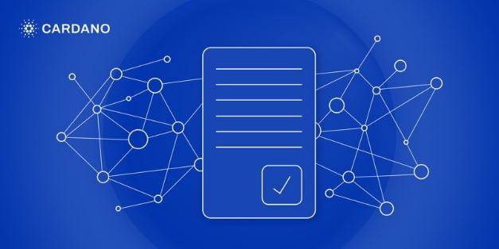

# No-surprises transaction validation on Cardano
### **Cardano's EUTXO model enables the deterministic nature of Plutus script execution**
 6 September 2021[ Polina Vinogradova](tmp//en/blog/authors/polina-vinogradova/page-1/) 12 mins read

### [**Polina Vinogradova**](tmp//en/blog/authors/polina-vinogradova/page-1/)
Research Engineer

Engineering

- 
- 
- 
- 

As the Alonzo hard fork brings core Plutus smart contract capability to Cardano, the ledger evolves to meet the growing need for the deployment of decentralized solutions. Cardano ledger design focuses on high assurance, security, and proven formal verification. In alignment with this strategy, it is also important to ensure that transaction processing is *deterministic*, meaning that a user can predict its impact and outcome before the actual execution. 

Khi Alonzo Hard Fork mang đến khả năng hợp đồng thông minh Core Plutus cho Cardano, sổ cái phát triển để đáp ứng nhu cầu ngày càng tăng để triển khai các giải pháp phi tập trung.
Thiết kế sổ cái Cardano tập trung vào sự đảm bảo cao, bảo mật và xác minh chính thức đã được chứng minh.
Liên kết với chiến lược này, điều quan trọng là phải đảm bảo rằng xử lý giao dịch là *xác định *, có nghĩa là người dùng có thể dự đoán tác động và kết quả của nó trước khi thực hiện thực tế.

The ability to guarantee the cost of transaction execution, and how the transaction behaves on the ledger *before* it is submitted, becomes even more prominent with the introduction of smart contract support. [Unspent Transaction Output (UTXO)](https://iohk.io/en/blog/posts/2021/03/11/cardanos-extended-utxo-accounting-model/)-based blockchains, like Cardano, provide such capabilities. Account-based blockchains, like Ethereum, are *indeterministic*, which means that they cannot guarantee the predictability of the transaction’s effect on-chain. This presents risks of monetary loss, unpredictably high fees, and additional opportunities for adversarial behavior.

Khả năng đảm bảo chi phí thực hiện giao dịch và cách giao dịch hành xử trên sổ cái * trước khi * nó được gửi, càng trở nên nổi bật hơn với việc giới thiệu hỗ trợ hợp đồng thông minh.
.
.
Các blockchain dựa trên tài khoản, như Ethereum, là *không xác định *, điều đó có nghĩa là họ không thể đảm bảo khả năng dự đoán của hiệu ứng giao dịch trên chuỗi.
Điều này đưa ra rủi ro mất tiền tệ, phí cao không thể đoán trước và cơ hội bổ sung cho hành vi bất lợi.

In this blog post, we take a closer look at the benefits of Cardano’s deterministic design that allows for secure transaction and script evaluation before execution. In the following blog post, coming later this week, we discuss the two phases of transaction validation on Cardano.

Trong bài đăng trên blog này, chúng tôi xem xét kỹ hơn về lợi ích của thiết kế xác định của Cardano cho phép đánh giá kịch bản và giao dịch an toàn trước khi thực hiện.
Trong bài đăng trên blog sau, đến cuối tuần này, chúng tôi thảo luận về hai giai đoạn xác thực giao dịch trên Cardano.

## **What is transaction determinism and why is it important?**

## ** Chủ nghĩa quyết định giao dịch là gì và tại sao nó lại quan trọng? **

Determinism, in the context of transaction and script processing, is a synonym for *predictability*. This means that a user can predict locally (off-chain) how their transaction will impact the on-chain state of the ledger, without: 

Chủ nghĩa xác định, trong bối cảnh giao dịch và xử lý tập lệnh, là một từ đồng nghĩa với *dự đoán *.
Điều này có nghĩa là người dùng có thể dự đoán cục bộ (ngoài chuỗi) giao dịch của họ sẽ tác động đến trạng thái trên chuỗi của sổ cái mà không có:

- unexpected script validation outcomes or failures

- Kết quả xác thực tập lệnh không mong muốn hoặc thất bại

- unexpected fees

- Phí bất ngờ

- unexpected ledger or script state updates.

- Sổ cái bất ngờ hoặc cập nhật trạng thái tập lệnh.

A transaction in a deterministic system might yet be rejected, even if constructed correctly. *Rejected* means that the transaction could not be applied to the ledger at all, therefore having no effect on its state, so no fees are paid. The reason this would happen is due to ledger changes caused by other transactions processed between the time when the initial transaction is constructed and the time it is processed. This can happen even with simple transactions. For example, another transaction might spend a UTXO that a user was also planning to spend. Determinism ensures that, whenever a transaction is accepted, it will only have predictable effects on the ledger state.

Một giao dịch trong một hệ thống xác định có thể bị từ chối, ngay cả khi được xây dựng chính xác.
* Bị từ chối* có nghĩa là giao dịch không thể được áp dụng cho sổ cái, do đó không có tác dụng đối với trạng thái của nó, do đó không có khoản phí nào được thanh toán.
Lý do điều này sẽ xảy ra là do thay đổi sổ cái gây ra bởi các giao dịch khác được xử lý trong thời gian giao dịch ban đầu được xây dựng và thời gian được xử lý.
Điều này có thể xảy ra ngay cả với các giao dịch đơn giản.
Ví dụ, một giao dịch khác có thể chi tiêu một UTXO mà người dùng cũng dự định chi tiêu.
Chủ nghĩa xác định đảm bảo rằng, bất cứ khi nào một giao dịch được chấp nhận, nó sẽ chỉ có các hiệu ứng có thể dự đoán được đối với trạng thái sổ cái.

## **Addressing the issue of indeterminism**

## ** Giải quyết vấn đề của chủ nghĩa không xác định **

*Indeterminism* means that we cannot predict what effects a transaction will have on the ledger before execution. When designing the ledger, as well as a smart contract interpreter, it is important to foresee conditions in which indeterminism *might* occur, and make design decisions to avoid them. One of the main hazards in such a case is access to mutable ledger data, that is data that can be changed or altered. When the changes a transaction or a smart contract make to the ledger depend on its state at the time of processing, rather than only the contents of the transaction, indeterminism might become an issue. 

* Chủ nghĩa không xác định* có nghĩa là chúng ta không thể dự đoán ảnh hưởng của giao dịch nào đối với sổ cái trước khi thực hiện.
Khi thiết kế sổ cái, cũng như một thông dịch viên hợp đồng thông minh, điều quan trọng là phải thấy trước các điều kiện trong đó chủ nghĩa không xác định * có thể * xảy ra và đưa ra quyết định thiết kế để tránh chúng.
Một trong những mối nguy hiểm chính trong trường hợp như vậy là truy cập vào dữ liệu sổ cái có thể thay đổi, đó là dữ liệu có thể thay đổi hoặc thay đổi.
Khi thay đổi giao dịch hoặc hợp đồng thông minh cho sổ cái phụ thuộc vào trạng thái của nó tại thời điểm xử lý, thay vì chỉ nội dung của giao dịch, chủ nghĩa không xác định có thể trở thành một vấn đề.

Ethereum is notably susceptible to this problem. For example, gas prices, or a decentralized exchange (DEX) rate can fluctuate between the time a user submits a transaction and the time it gets processed. This results in unexpected gas fees, or price changes of assets being purchased. Or a script might simply fail, resulting in high execution costs (hundreds of dollars) and no other effect. This could occur, for instance, if the funds available to cover the gas costs run out mid-execution. Deterministic ledger design eliminates these possibilities.

Ethereum đáng chú ý đến vấn đề này.
Ví dụ: giá xăng hoặc tỷ lệ trao đổi phi tập trung (DEX) có thể dao động giữa thời gian người dùng gửi giao dịch và thời gian được xử lý.
Điều này dẫn đến phí gas bất ngờ, hoặc thay đổi giá của tài sản được mua.
Hoặc một kịch bản có thể đơn giản là thất bại, dẫn đến chi phí thực hiện cao (hàng trăm đô la) và không có hiệu quả nào khác.
Điều này có thể xảy ra, ví dụ, nếu các khoản tiền có sẵn để trang trải chi phí gas hết việc thực hiện giữa.
Thiết kế sổ cái xác định loại bỏ những khả năng này.

Other possible sources of indeterminism include allowing scripts to see: 

Các nguồn có thể khác của chủ nghĩa không xác định bao gồm cho phép các tập lệnh xem:

- data in the block containing the transaction, but not included in any transaction, e.g., system randomness, block header, or the current slot number 

- Dữ liệu trong khối chứa giao dịch, nhưng không bao gồm trong bất kỳ giao dịch nào, ví dụ: tính ngẫu nhiên của hệ thống, tiêu đề khối hoặc số khe hiện tại

- data altered or substituted by an adversary, which might change the outcome of script validation, while the transaction itself remains processable.

- Dữ liệu bị thay đổi hoặc thay thế bởi một đối thủ, có thể thay đổi kết quả của xác thực tập lệnh, trong khi bản thân giao dịch vẫn có thể xử lý được.

In most systems, there are ways to mitigate these issues with improved script-writing practices, or layer-2 solutions. Cardano is designed to guarantee predictable outcomes for all scripts and transactions.

Trong hầu hết các hệ thống, có nhiều cách để giảm thiểu các vấn đề này với các thực tiễn viết kịch bản được cải thiện hoặc các giải pháp Layer-2.
Cardano được thiết kế để đảm bảo kết quả dự đoán cho tất cả các tập lệnh và giao dịch.

## **How basic UTXO model benefits in terms of determinism**

## ** Làm thế nào các lợi ích mô hình UTXO cơ bản về chủ nghĩa xác định **

The Cardano ledger is built on a UTXO accounting model, which means that assets are stored on the ledger in *unspent outputs*, rather than in *accounts*. Each of these outputs specifies quantities of assets stored therein, together with its address. Unspent outputs are *immutable*, so a transaction might consume the entire output, but it cannot alter it. 

Sổ cái Cardano được xây dựng trên mô hình kế toán UTXO, điều đó có nghĩa là các tài sản được lưu trữ trên sổ cái trong *đầu ra không sử dụng *, thay vì trong *tài khoản *.
Mỗi đầu ra này chỉ định số lượng tài sản được lưu trữ trong đó, cùng với địa chỉ của nó.
Đầu ra chưa được sử dụng là *bất biến *, vì vậy một giao dịch có thể tiêu thụ toàn bộ đầu ra, nhưng nó không thể thay đổi nó.

To transfer assets, a transaction consumes one or more outputs and creates new ones, which, in total, contain the same quantities of assets as the ones consumed. These quantities -and their UTXO addresses- are specified in the outputs of the transaction. The only way a transaction can influence the effect of another transaction applied to the ledger is by spending the same UTXO as the later transaction attempts to spend, thus causing the node to reject it. This is the key feature on which the UTXO model relies for maintaining determinism. 

Để chuyển tài sản, một giao dịch tiêu thụ một hoặc nhiều đầu ra và tạo ra tài sản mới, trong tổng số, có chứa cùng một lượng tài sản như tài sản được tiêu thụ.
Các đại lượng này - và địa chỉ UTXO của chúng - được chỉ định trong các đầu ra của giao dịch.
Cách duy nhất một giao dịch có thể ảnh hưởng đến hiệu ứng của một giao dịch khác được áp dụng cho sổ cái là chi tiêu cùng UTXO như giao dịch sau này cố gắng chi tiêu, do đó khiến nút từ chối nó.
Đây là tính năng chính mà mô hình UTXO phụ thuộc vào việc duy trì chủ nghĩa quyết định.

A UTXO ledger has both benefits and drawbacks over the account-based model. The latter will encounter fewer instances of transactions blocking one another, for example. Unlike UTXOs, accounts are mutable ledger data. So a transaction might see, for example, a different quantity of assets in an account, depending on whether it was processed before or after another transaction that updates that same account. This circumstance might not cause the transaction to be rejected, but it could result in different – and unpredictable – changes to the ledger.

Một sổ cái UTXO có cả lợi ích và nhược điểm so với mô hình dựa trên tài khoản.
Ví dụ, cái sau sẽ gặp ít trường hợp giao dịch hơn.
Không giống như UTXOS, các tài khoản là dữ liệu sổ cái có thể thay đổi.
Vì vậy, một giao dịch có thể thấy, ví dụ, một lượng tài sản khác trong tài khoản, tùy thuộc vào việc nó được xử lý trước hay sau khi giao dịch khác cập nhật cùng một tài khoản đó.
Tình huống này có thể không khiến giao dịch bị từ chối, nhưng nó có thể dẫn đến các thay đổi khác nhau và không thể đoán trước được đối với sổ cái.

Spending a UTXO is just one example of an action a transaction can take. Next, we explain what transaction actions are, and how they can be validated. The most significant set of changes introduced in Alonzo are changes to the process of action validation.

Chi tiêu một UTXO chỉ là một ví dụ về một hành động mà một giao dịch có thể thực hiện.
Tiếp theo, chúng tôi giải thích các hành động giao dịch là gì và làm thế nào chúng có thể được xác nhận.
Tập hợp các thay đổi quan trọng nhất được giới thiệu trong Alonzo là những thay đổi đối với quá trình xác thực hành động.

## **Validating actions with signatures and scripts**

## ** Hành động xác thực với chữ ký và tập lệnh **

An important aspect of processing a transaction is validating the actions it is taking. A transaction is *taking an action* when it contains data in the specific field to that action. For example, a transaction is *spending UTXO U* when it contains a reference to U in its input field, and it is *minting a token X* when its mint field contains X. 

Một khía cạnh quan trọng của việc xử lý một giao dịch là xác nhận các hành động mà nó đang thực hiện.
Một giao dịch là * thực hiện một hành động * khi nó chứa dữ liệu trong trường cụ thể cho hành động đó.
Ví dụ: một giao dịch là * chi tiêu utxo u * khi nó chứa một tham chiếu đến u trong trường đầu vào của nó và nó đang * khai thác mã thông báo x * khi trường bạc hà của nó chứa X.

When the node processes a transaction, it verifies whether it can perform the action it intends to. For this, the author of the transaction must provide relevant pieces of data, e.g., scripts, redeemers, or signatures. A common example of an action that requires validation is spending a UTXO locked with a public key. The transaction must provide a signature from the corresponding private key to perform this action.

Khi nút xử lý một giao dịch, nó sẽ xác minh xem nó có thể thực hiện hành động mà nó dự định hay không.
Đối với điều này, tác giả của giao dịch phải cung cấp các phần dữ liệu có liên quan, ví dụ: tập lệnh, người mua lại hoặc chữ ký.
Một ví dụ phổ biến về một hành động yêu cầu xác nhận là chi tiêu UTXO bị khóa với khóa công khai.
Giao dịch phải cung cấp một chữ ký từ khóa riêng tương ứng để thực hiện hành động này.

Cardano uses scripts to validate actions. These scripts, which are pieces of code, implement pure functions with *True* or *False* outputs. *Script validation* is the process of invoking the script interpreter to run a given script on appropriate arguments.

Cardano sử dụng các tập lệnh để xác nhận các hành động.
Các tập lệnh này, là các đoạn mã, thực hiện các hàm thuần túy với các đầu ra * true * hoặc * false *.
* Xác thực tập lệnh* là quá trình gọi trình thông dịch tập lệnh để chạy một tập lệnh nhất định trên các đối số thích hợp.

Script validation can be performed for the following actions:

Có thể thực hiện xác thực tập lệnh cho các hành động sau:

- Spending a UTXO locked by a script address: the script that is run is the one whose hash forms the address. 

- Chi tiêu một UTXO bị khóa bởi một địa chỉ tập lệnh: tập lệnh được chạy là tên có băm tạo thành địa chỉ.

- Minting a token: the script that is run is the one whose hash forms the policy ID of the token being minted. 

- Đứng đầu một mã thông báo: Tập lệnh được chạy là cái có băm tạo thành ID chính sách của mã thông báo được đúc.

- Reward withdrawal: the script that is run is the one whose hash forms the staking address.

- Rút tiền thưởng: Kịch bản được chạy là cái có băm tạo thành địa chỉ đặt cược.

- Applying a certificate: the script that is run is the one whose hash forms the certificate author’s credential.

- Áp dụng chứng chỉ: Tập lệnh được chạy là bản có hàm băm hình thành chứng chỉ của Chứng chỉ.

Besides letting the node know which script to run, all transaction actions indicate how to assemble arguments passed to that script. 

Bên cạnh việc cho nút biết nên chạy tập lệnh nào, tất cả các hành động giao dịch đều cho biết cách lắp ráp các đối số được truyền cho tập lệnh đó.

Cardano’s multi-asset ledger (Mary) supports simple *multisig* and *timelock* scripting languages. These allow users to specify signatures required to perform an action (such as spending a UTXO or minting a non-fungible token (NFT)), and the time interval in which it can be performed. A timelock script can never see the actual slot number in the transaction that includes it. Timelock can only see the *validity interval* of the carrying transaction. Allowing a timelock script to see the current slot number (i.e., data coming from the block, rather than the author) would break determinism. This is ensured by the fact that a user cannot know the exact slot in which the transaction gets processed, and therefore they cannot predict how the script will behave. 

Ledger đa tài sản (Mary) của Cardano hỗ trợ các ngôn ngữ kịch bản * multisig * và * Timelock * đơn giản * và * Timelock *.
Những điều này cho phép người dùng chỉ định chữ ký cần thiết để thực hiện một hành động (chẳng hạn như chi tiêu UTXO hoặc khai thác mã thông báo không bị nấm (NFT)) và khoảng thời gian có thể được thực hiện.
Một tập lệnh Timelock không bao giờ có thể thấy số khe thực tế trong giao dịch bao gồm nó.
Timelock chỉ có thể thấy khoảng thời gian * tính hợp lệ * của giao dịch mang theo.
Cho phép tập lệnh Timelock xem số khe hiện tại (nghĩa là, dữ liệu đến từ khối, thay vì tác giả) sẽ phá vỡ chủ nghĩa quyết định.
Điều này được đảm bảo bởi thực tế là người dùng không thể biết vị trí chính xác trong đó giao dịch được xử lý và do đó họ không thể dự đoán cách tập lệnh sẽ hoạt động.

Mary scripts, unlike Plutus contracts in Alonzo, are very limited in what they can express. The Alonzo hard fork ushers in a new era of powerful, stateful contracts that do not compromise the deterministic ledger property.

Mary Script, không giống như các hợp đồng Plutus ở Alonzo, rất hạn chế trong những gì họ có thể thể hiện.
Alonzo Hard Fork mở ra trong một kỷ nguyên mới của các hợp đồng trạng thái mạnh mẽ, mạnh mẽ, không làm tổn hại đến tài sản sổ cái xác định.

## **Plutus scripts**

## ** SCRIPT SLUTUS **

Alonzo introduces a new approach to transaction validation on Cardano due to the implementation of Plutus scripts. The [extended unspent transaction output](https://iohk.io/en/blog/posts/2021/03/12/cardanos-extended-utxo-accounting-model-part-2/) (EUTXO) model, deployed as part of Alonzo, provides the ledger infrastructure to support Plutus contracts. Below, we provide a high-level overview of ledger and transaction changes. For more details about working with the ledger and Plutus scripts, check out the [Plutus Pioneer program](https://www.youtube.com/watch?v=IEn6jUo-0vU&list=PLK8ah7DzglhhJzuiz7X33UCHSTYPB-8Jt)!

Alonzo giới thiệu một cách tiếp cận mới để xác thực giao dịch trên Cardano do thực hiện các tập lệnh Plutus.
[Đầu ra giao dịch mở rộng] (https://iohk.io/en/blog/posts/2021/03/12/cardanos-extends-utxo-accounting-model-part-2/) (EUTXO)
Một phần của Alonzo, cung cấp cơ sở hạ tầng sổ cái để hỗ trợ các hợp đồng Plutus.
Dưới đây, chúng tôi cung cấp một cái nhìn tổng quan cấp cao về sổ cái và thay đổi giao dịch.
Để biết thêm chi tiết về việc làm việc với sổ cái và các tập lệnh Plutus, hãy xem [Chương trình Pioneer Plutus] (https://www.youtube.com/watch?v=ien6juo-0vu&list=PlK8AH7DZGLHHJZUIZ7X3333

Alonzo changes the data on the ledger as follows: 

Alonzo thay đổi dữ liệu trên sổ cái như sau:

1. Plutus scripts can lock UTXOs.

1. SCRIPT SLUTUS có thể khóa utxos.

1. A new component, added to the contents of the output parts of UTXOs, enables script state-like functionality. In addition to assets and an address, a UTXO locked by Plutus scripts also contains a *datum*. A datum is a piece of data that can be thought of as an interpretation of the script state. 

1. Một thành phần mới, được thêm vào nội dung của các phần đầu ra của UTXOS, cho phép chức năng giống như kịch bản.
Ngoài tài sản và một địa chỉ, một UTXO bị khóa bởi các tập lệnh Plutus cũng chứa một *mốc dữ liệu *.
Một mốc thời gian là một phần dữ liệu có thể được coi là một cách giải thích của trạng thái tập lệnh.

1. There are a number of new protocol parameters used to impose additional validation requirements on transactions. These include upper limits on computational resources that scripts can consume. 

1. Có một số tham số giao thức mới được sử dụng để áp đặt các yêu cầu xác thực bổ sung cho các giao dịch.
Chúng bao gồm các giới hạn trên đối với các tài nguyên tính toán mà tập lệnh có thể tiêu thụ.

To support Plutus scripts, transactions have been upgraded as follows:

Để hỗ trợ các tập lệnh Plutus, các giao dịch đã được nâng cấp như sau:

1. For each of its actions, the transaction now carries a user-specified argument, called a *redeemer*. Depending on the script, a redeemer can serve a different purpose. For example, it can act as the bid the user places in an auction, or the user’s guess in a guessing game, among many other functions.

1. Đối với mỗi hành động của mình, giao dịch hiện thực hiện một đối số do người dùng chỉ định, được gọi là *Redeemer *.
Tùy thuộc vào kịch bản, một người cứu chuộc có thể phục vụ một mục đích khác.
Ví dụ, nó có thể hoạt động như giá thầu của người dùng trong một cuộc đấu giá hoặc đoán của người dùng trong một trò chơi đoán, trong số nhiều chức năng khác.

1. The transaction specifies computational execution budgets for each script.

1. Giao dịch chỉ định ngân sách thực thi tính toán cho mỗi tập lệnh.

1. To ensure that a transaction can pay its execution fee, Alonzo introduces additional pieces of data, which we’ll discuss in a follow-up blog post. 

1. Để đảm bảo rằng một giao dịch có thể trả phí thực hiện của mình, Alonzo giới thiệu các phần dữ liệu bổ sung, mà chúng ta sẽ thảo luận trong một bài đăng trên blog tiếp theo.

1. Transactions contain an integrity hash, needed to ensure that it has not been compromised, outdated, etc. 

1. Các giao dịch chứa hàm băm toàn vẹn, cần thiết để đảm bảo rằng nó chưa bị xâm phạm, lỗi thời, v.v.

There are also some changes to the specifics of Alonzo transaction validation as compared to Mary. For each action, the node assembles script arguments expected by the Plutus interpreter, including:

Ngoài ra còn có một số thay đổi đối với các chi tiết cụ thể của xác thực giao dịch Alonzo so với Mary.
Đối với mỗi hành động, nút lắp ráp các đối số tập lệnh được dự kiến bởi trình thông dịch Sao Diêm Vương, bao gồm:

- the datum

- Datum

- the redeemer

- Đấng cứu chuộc

- execution budget

- Ngân sách thực thi

- a summary of the transaction. 

- Một bản tóm tắt của giao dịch.

The node performs new, Alonzo-specific checks that ensure the transaction is constructed correctly. For example, it must not exceed the maximum execution resource budget. It also invokes the Plutus script interpreter to run the scripts.

Nút thực hiện các kiểm tra mới, cụ thể của Alonzo để đảm bảo giao dịch được xây dựng chính xác.
Ví dụ, nó không được vượt quá ngân sách tài nguyên thực thi tối đa.
Nó cũng gọi trình thông dịch tập lệnh Plutus để chạy các tập lệnh.

**Datum objects vs script state**

** Đối tượng Datum so với trạng thái tập lệnh **

Like mutable accounts, mutable script state falls squarely into the ‘mutable ledger data’ category of indeterminism sources. We already saw that the UTXO model avoids the mutable accounts indeterminism issue. It can also help us reimagine the concept of script state in a way that maintains determinism. If a UTXO is locked by a Plutus script, that UTXO’s script code is associated with its address. The state-analog of this script is the datum stored in that UTXO. When a transaction spends that UTXO, it gets deleted from the ledger, including the datum. However, the contents of the Plutus script could enforce that the transaction carrying it must also create a UTXO containing a specific datum that can be viewed as the updated script state. 

Giống như các tài khoản có thể thay đổi, trạng thái kịch bản có thể thay đổi rơi vào tình trạng dữ liệu sổ cái có thể xảy ra vào các nguồn dữ liệu không xác định.
Chúng tôi đã thấy rằng mô hình UTXO tránh được vấn đề không xác định tài khoản có thể thay đổi.
Nó cũng có thể giúp chúng ta tái hiện khái niệm về trạng thái kịch bản theo cách duy trì chủ nghĩa quyết định.
Nếu một UTXO bị khóa bởi một tập lệnh Plutus, mã tập lệnh của UTXO đó được liên kết với địa chỉ của nó.
Phân tích trạng thái của tập lệnh này là dữ liệu được lưu trữ trong UTXO đó.
Khi một giao dịch chi tiêu UTXO đó, nó sẽ bị xóa khỏi sổ cái, bao gồm cả dữ liệu.
Tuy nhiên, nội dung của tập lệnh Plutus có thể thực thi rằng giao dịch mang nó cũng phải tạo ra một UTXO chứa một mốc dữ liệu cụ thể có thể được xem là trạng thái tập lệnh được cập nhật.

**Script execution budget**

** Ngân sách thực thi tập lệnh **

The non-deterministic gas model can charge users unpredictably large fees. In Cardano scripts, this source of indeterminism is addressed by requiring that the resource budget itself, as well as the fee required to cover this budget, are included in the transaction. In Alonzo, a user can predict both locally when constructing the transaction. Script execution necessarily returns either *True* or *False*, and will not loop indefinitely. The reason for this is that every operation a script performs takes a non-zero amount of resources, which are tracked by the interpreter. If the budget specified by the transaction is exceeded, script execution terminates and returns *False*. 

Mô hình khí không xác định có thể tính phí cho người dùng các khoản phí lớn không thể đoán trước được.
Trong các tập lệnh của Cardano, nguồn gốc của chủ nghĩa không xác định này được giải quyết bằng cách yêu cầu chính ngân sách tài nguyên, cũng như phí cần thiết để chi trả cho ngân sách này, được bao gồm trong giao dịch.
Trong Alonzo, người dùng có thể dự đoán cả địa phương khi xây dựng giao dịch.
Thực thi tập lệnh nhất thiết phải trả về *true *hoặc *false *và sẽ không lặp lại vô thời hạn.
Lý do cho điều này là mọi hoạt động mà một tập lệnh thực hiện đều có một lượng tài nguyên khác không, được trình thông dịch theo dõi.
Nếu ngân sách được chỉ định bởi giao dịch bị vượt quá, việc thực thi tập lệnh sẽ chấm dứt và trả về *false *.

## **Transaction validation in Alonzo**

## ** Xác thực giao dịch trong Alonzo **

Addressing the possible sources of indeterminism, the following key points make the outcomes of script and transaction validation predictable:

Giải quyết các nguồn có thể của chủ nghĩa không xác định, các điểm chính sau đây làm cho kết quả của tập lệnh và xác thực giao dịch có thể dự đoán được:

- the script interpreter will always terminate and return the same validation result when applied to the same arguments

- Trình thông dịch tập lệnh sẽ luôn chấm dứt và trả về kết quả xác thực tương tự khi được áp dụng cho cùng một đối số

- a transaction necessarily fixes all arguments that will be passed to the script interpreter during validation 

- Một giao dịch nhất thiết phải sửa tất cả các đối số sẽ được chuyển cho trình thông dịch tập lệnh trong quá trình xác thực

- a transaction specifies all the actions it is taking that require script validation

- Một giao dịch chỉ định tất cả các hành động mà nó đang thực hiện yêu cầu xác thực tập lệnh

- compulsory signatures on a transaction ensure that it cannot be altered by an adversary in a way that causes scripts to fail

- Chữ ký bắt buộc trên một giao dịch đảm bảo rằng nó không thể bị thay đổi bởi một kẻ thù theo cách khiến các tập lệnh không thành công

- applying a transaction in the EUTXO ledger model is deterministic.

- Áp dụng một giao dịch trong mô hình sổ cái EUTXO là xác định.

The last point is largely inherited from the UTXO model, as Alonzo ledger protocol updates remain, for the most part, consistent with updates in previous eras (including the delegation scheme, etc.). After the Alonzo upgrade, script validation failure or success does affect how a transaction is processed (more about this in part 2!). However, the *True* or *False* outcome, as well as ledger changes associated with either outcome, are predictable for a given transaction.

Điểm cuối cùng được kế thừa phần lớn từ mô hình UTXO, vì phần lớn các bản cập nhật của Sổ cái Alonzo vẫn phù hợp với các bản cập nhật trong các thời đại trước (bao gồm chương trình phái đoàn, v.v.).
Sau khi nâng cấp Alonzo, lỗi xác thực tập lệnh hoặc thành công không ảnh hưởng đến cách xử lý giao dịch (thêm về điều này trong Phần 2!).
Tuy nhiên, kết quả * hoặc * sai *, cũng như các thay đổi sổ cái liên quan đến kết quả, có thể dự đoán được cho một giao dịch nhất định.

The deterministic behavior of Cardano’s script and transaction validation is not a natural outcome of using the EUTXO model. To ensure this property, the IOG team had to carefully track the source of every piece of data which a script is allowed to see.

Hành vi xác định của kịch bản và xác thực giao dịch của Cardano không phải là kết quả tự nhiên của việc sử dụng mô hình EUTXO.
Để đảm bảo thuộc tính này, nhóm IOG đã phải theo dõi cẩn thận nguồn của mọi dữ liệu mà tập lệnh được phép xem.

*The deterministic evaluation property is formally specified in the [Alonzo specification](https://hydra.iohk.io/build/7172824/download/1/alonzo-changes.pdf), and the IOG team has also sketched proof that the interpreter gets only those arguments that would not break the property.*

*Thuộc tính đánh giá xác định được chỉ định chính thức trong [Đặc điểm kỹ thuật Alonzo] (https://hydra.iohk.io/build/7172824/doad/1/alonzo-changes.pdf), và nhóm IOG cũng đã phác thảo bằng chứng cho thấy bằng chứng rằng bản
Thông dịch viên chỉ nhận được những đối số sẽ không phá vỡ tài sản.*

*In our second blog post, we’ll take a closer look at the 2-phase validation process of Cardano transactions. So, keep an eye out later this week for part two.*

*Trong bài đăng trên blog thứ hai của chúng tôi, chúng tôi sẽ xem xét kỹ hơn về quy trình xác thực 2 pha của các giao dịch Cardano.
Vì vậy, hãy để mắt đến cuối tuần này cho Phần hai.*

