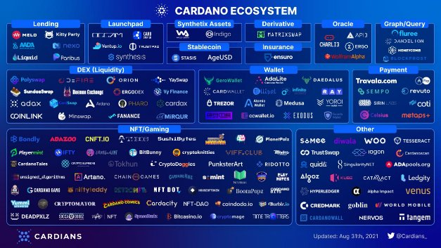

# Today will feel like a destination. Yet a new, exciting journey begins...
### **The Alonzo upgrade is an epochal moment in the birth of a new ecosystem**
 12 September 2021[ Tim Harrison](tmp//en/blog/authors/tim-harrison/page-1/) 10 mins read

### [**Tim Harrison**](tmp//en/blog/authors/tim-harrison/page-1/)
VP of Community & Ecosystem

Communications

- 
- 
- 
- 

Later today, we'll deploy Plutus smart contract capabilities onto the Cardano mainnet via a hard fork combinator (HFC) protocol upgrade event.

Cuối ngày hôm nay, chúng tôi sẽ triển khai các khả năng hợp đồng thông minh Plutus trên Cardano Mainnet thông qua sự kiện nâng cấp giao thức Hard Fork Combinator (HFC).

The *Alonzo* upgrade will bring highly anticipated capabilities to Cardano through the integration of Plutus scripts onto the blockchain. These will allow the implementation of smart contracts on Cardano, enabling a host of new use cases for decentralized applications (DApps) for the very first time. 

Nâng cấp * Alonzo * sẽ mang lại các khả năng rất được mong đợi cho Cardano thông qua việc tích hợp các tập lệnh Plutus lên blockchain.
Những điều này sẽ cho phép thực hiện các hợp đồng thông minh trên Cardano, cho phép một loạt các trường hợp sử dụng mới cho các ứng dụng phi tập trung (DAPP) lần đầu tiên.

It’s only just the beginning. But this is still a moment for celebration. As a community, we have been on an incredible journey together. Rightly, we should allow ourselves to acknowledge the tremendous efforts made by so many to get here. This will also be a time for reflection on the challenges we've collectively overcome. 

Nó chỉ là sự khởi đầu chỉ là khởi đầu.
Nhưng đây vẫn là một khoảnh khắc cho lễ kỷ niệm.
Là một cộng đồng, chúng tôi đã có một hành trình đáng kinh ngạc cùng nhau.
Đúng vậy, chúng ta nên cho phép bản thân thừa nhận những nỗ lực to lớn được thực hiện bởi rất nhiều người để đến đây.
Đây cũng sẽ là thời gian để suy ngẫm về những thách thức mà chúng tôi đã vượt qua.

While we might allow ourselves some brief downtime, this is no moment to rest up. And there is certainly no room for hubris. This is where the mission truly begins as we – the whole community – start delivering on the vision we have all been working towards for so long. Building a decentralized system that extends economic identity and opportunity to everyone, everywhere.

Mặc dù chúng ta có thể cho phép bản thân một số thời gian chết ngắn gọn, nhưng đây không phải là thời điểm để nghỉ ngơi.
Và chắc chắn không có chỗ cho sự kiêu ngạo.
Đây là nơi mà nhiệm vụ thực sự bắt đầu khi chúng ta - toàn bộ cộng đồng bắt đầu thực hiện tầm nhìn mà tất cả chúng ta đã làm việc quá lâu.
Xây dựng một hệ thống phi tập trung mở rộng bản sắc kinh tế và cơ hội cho mọi người, ở khắp mọi nơi.

## **The road to here**

## ** Con đường đến đây **

While many years of research and development have prepared the ground, it was the [Byron reboot](https://iohk.io/en/blog/posts/2020/03/30/what-the-byron-reboot-means-for-cardano/) in March 2020 that truly laid the foundations for the network we have today, by providing a robust and scalable code base on which to build. In July the same year, the [Shelley upgrade](https://cryptoslate.com/cardano-has-launched-the-shelley-mainnet-heres-what-you-need-to-know/) shifted Cardano from a federated model towards a decentralized one.

Mặc dù nhiều năm nghiên cứu và phát triển đã chuẩn bị nền tảng, nhưng đó là [Byron khởi động lại] (https://iohk.io/en/blog/posts/2020/03/30/what-the-byron-reboot-mean-
for-cardano/) vào tháng 3 năm 2020 đã thực sự đặt nền móng cho mạng chúng ta có ngày hôm nay, bằng cách cung cấp một cơ sở mã mạnh mẽ và có thể mở rộng để xây dựng.
Vào tháng 7 cùng năm, [Nâng cấp Shelley] (https://cryptoslate.com/cardano-has-launched-thelley-mainnet-heres-what-you-heed-to-kn
mô hình hướng tới một người phi tập trung.

Since the end of March 2021, when we adjusted the network decentralization parameter to D=0, every block has been produced by a [decentralized network](https://iohk.io/en/blog/posts/2021/03/31/decentralization-to-d-0-day-and-beyond/) from a community of 2,868 stake pools.

Kể từ cuối tháng 3 năm 2021, khi chúng tôi điều chỉnh tham số phân cấp mạng thành d = 0, mọi khối đã được tạo ra bởi [mạng phi tập trung] (https://iohk.io/en/blog/posts/2021/03/31
.

It’s a remarkable staking ecosystem that continues to grow rapidly. According to statistics from Cardano data aggregation tool [Pooltool](https://pooltool.io/), the number of ada staking wallets today stands at 825,755. This represents an increase of 35%+ since June. At the time of writing, the total ada delegated to stake pools is valued at $ 59.86 billion, accounting for 71.4% percent of total ada supply ($ 83.9b).

Đây là một hệ sinh thái đặt cược đáng chú ý tiếp tục phát triển nhanh chóng.
Theo số liệu thống kê từ công cụ tổng hợp dữ liệu Cardano [pooltool] (https://pooltool.io/), số ví của ADA ngày nay đứng ở mức 825.755.
Điều này thể hiện mức tăng 35%+ kể từ tháng Sáu.
Tại thời điểm viết bài, tổng số ADA được ủy thác cho các nhóm cổ phần được định giá 59,86 tỷ USD, chiếm 71,4% tổng số cung cấp ADA (83,9 tỷ đô la).

March’s [Mary](https://iohk.io/en/blog/posts/2021/02/04/native-tokens-to-bring-new-utility-to-life-on-cardano/) upgrade created a multi-asset network and introduced native tokens. As well as providing an alternative to the ERC20-type model, Mary released a Cambrian Explosion of creativity. With low minting and transaction fees and, uniquely, no need for smart contracts for Cardano NFTs, we have seen the blooming of an incredible NFT ecosystem. According to data from [pool.pm](https://pool.pm/tokens) (powered by Smaug pool), Cardano has seen 780,436 tokens minted to date and 19,419 policies. All without the need for smart contracts.

[Mary] (https://iohk.io/en/blog/posts/2021/02/04/native-tokens-to-ning-new-tility-to-life-cardano/) Nâng cấp
đã tạo ra một mạng đa tài sản và giới thiệu mã thông báo gốc.
Cùng với việc cung cấp một giải pháp thay thế cho mô hình kiểu ERC20, Mary đã phát hành một vụ nổ sáng tạo của Cambri.
Với phí khai thác và giao dịch thấp và, duy nhất, không cần hợp đồng thông minh cho Cardano NFT, chúng tôi đã thấy sự nở rộ của một hệ sinh thái NFT đáng kinh ngạc.
Theo dữ liệu từ [pool.pm] (https://pool.pm/tokens) (được cung cấp bởi nhóm Smaug), Cardano đã thấy 780.436 mã thông báo cho đến nay và 19.419 chính sách.
Tất cả không cần hợp đồng thông minh.

## **Enter Alonzo**

## ** Nhập Alonzo **

The Alonzo upgrade (named after the pioneering American mathematician [Alonzo Church](https://en.wikipedia.org/wiki/Alonzo_Church)), will build on this success. Deployed using the same [HFC technology](https://iohk.io/en/blog/posts/2020/05/07/combinator-makes-easy-work-of-shelley-hard-fork/) used in previous upgrades, this will mark the beginning of a fresh period of rapid growth. By allowing Plutus scripts to be written and executed on-chain, we’ll have the backbone for a new decentralized application platform, enabling numerous DApp and decentralized finance (DeFi) use cases – from simple swap type apps to decentralized exchanges (DEXs), and more complex computational programs such as Oracles and crypto-backed algorithmic stablecoins.

Việc nâng cấp Alonzo (được đặt theo tên của nhà toán học người Mỹ tiên phong [Nhà thờ Alonzo] (https://en.wikipedia.org/wiki/Alonzo_Church)), sẽ xây dựng thành công này.
Được triển khai bằng cách sử dụng cùng [Công nghệ HFC] (https://iohk.io/en/blog/posts/2020/05/07/combinator-makes-easy-work-of-shelley-hard-fork/) được sử dụng trong các nâng cấp trước đó
, Điều này sẽ đánh dấu sự khởi đầu của một giai đoạn mới của sự tăng trưởng nhanh chóng.
Bằng cách cho phép các tập lệnh Plutus được viết và thực thi trên chuỗi, chúng tôi sẽ có xương sống cho một nền tảng ứng dụng phi tập trung mới, cho phép nhiều trường hợp sử dụng tài chính phi tập trung (DEFI) từ các ứng dụng hoán đổi đơn giản để trao đổi phân cấp (
Dexs), và các chương trình tính toán phức tạp hơn như Oracles và StableCoin thuật toán được hỗ trợ bằng tiền điện tử.

So, we have one of the most decentralized, sustainable, robust, and advanced blockchain platforms in the world, run by a skilled community of stake pool operators (SPOs). We enjoy an informed and passionate community of delegators. We have a thriving NFT ecosystem, attracted by the ease and low-cost of minting. Oh, and a roadmap for future governance through *Voltaire* and ultimate scalability through *Basho* and Hydra scaling. The future is bright and stretches far; we’ll continue to travel the long road together.

Vì vậy, chúng tôi có một trong những nền tảng blockchain phi tập trung, bền vững, mạnh mẽ và tiên tiến nhất trên thế giới, được điều hành bởi một cộng đồng người vận hành nhóm cổ phần (SPO) lành nghề.
Chúng tôi tận hưởng một cộng đồng ủy quyền và đam mê của các ủy viên.
Chúng ta có một hệ sinh thái NFT thịnh vượng, bị thu hút bởi sự dễ dàng và chi phí thấp của việc khai thác.
Oh, và một lộ trình cho quản trị trong tương lai thông qua * voltaire * và khả năng mở rộng cuối cùng thông qua * basho * và hydra tỷ lệ.
Tương lai tươi sáng và trải dài xa;
Chúng tôi sẽ tiếp tục đi trên con đường dài cùng nhau.

## **The birth of a new developer ecosystem**

## ** Sự ra đời của một hệ sinh thái nhà phát triển mới **

All the core building blocks are in place. Platform. Vision. Mission. Community. It is still very early days for smart contracts and DeFi, yet we have made great progress already.

Tất cả các khối xây dựng cốt lõi được đặt tại chỗ.
Nền tảng.
Tầm nhìn.
Sứ mệnh.
Cộng đồng.
Vẫn còn rất sớm cho các hợp đồng thông minh và Defi, nhưng chúng tôi đã đạt được tiến bộ rất lớn.

Thousands of developers have been taking part in the [Plutus Pioneers course](https://testnets.cardano.org/en/plutus-pioneer-program/), learning the fundamentals of Cardano’s native development framework. Scores of projects have already started developing in Plutus and are at various stages of expertise and readiness. Hundreds of projects have been actively working on the various Cardano testnets and privately-hosted solutions. Some 150 projects are developing their ideas via Cardano’s [Project Catalyst](https://iohk.io/en/blog/posts/2021/02/12/our-million-dollar-baby-project-catalyst/) innovation program, the world’s largest decentralized innovation fund. In the latest round, 800 – yes, 800 – projects applied for $4m-worth of funding. With a treasury now worth well north of $1bn at today’s values, and [33k+ members](https://cardano.ideascale.com/), the future for building on Cardano couldn’t be brighter.

Hàng ngàn nhà phát triển đã tham gia vào [khóa học Pioneers Plutus] (https://testnets.cardano.org/en/plutus-pioneer-program/), học các nguyên tắc cơ bản của khung phát triển bản địa của Cardano.
Điểm số của các dự án đã bắt đầu phát triển ở Plutus và đang ở các giai đoạn khác nhau của chuyên môn và sẵn sàng.
Hàng trăm dự án đã tích cực làm việc trên các thử nghiệm Cardano khác nhau và các giải pháp lưu trữ tư nhân.
Khoảng 150 dự án đang phát triển ý tưởng của họ thông qua [Project Catalyst] của Cardano (https://iohk.io/en/blog/posts/2021/02/12/Our
Chương trình đổi mới, quỹ đổi mới phi tập trung lớn nhất thế giới.
Trong vòng mới nhất, 800-Có, 800 dự án được áp dụng cho tài trợ trị giá 4 triệu đô la.
Với một kho bạc hiện có giá trị ở phía bắc 1 tỷ đô la với giá trị ngày hôm nay và [33K+ thành viên] (https://cardano.ideascale.com/), tương lai để xây dựng trên Cardano không thể sáng hơn.

For a snapshot of just how many projects and organizations comprise the ecosystem, visit our [Essential Cardano](https://github.com/input-output-hk/essential-cardano/blob/main/essential-cardano-list.md) repo. Or check out the various excellent ecosystem maps (these are representative, though none are comprehensive) out there like those from the [Cardians](https://twitter.com/Cardians_/status/1432534228890124294?s=20) (see Figure 1). These don’t represent what projects will be visible right away. But they offer a beautiful vista.

Để có ảnh chụp nhanh về số lượng dự án và tổ chức bao gồm hệ sinh thái, hãy truy cập [Cardano cần thiết của chúng tôi (https://github.com/input-output
) repo.
Hoặc kiểm tra các bản đồ hệ sinh thái tuyệt vời khác nhau (đây là đại diện, mặc dù không có gì toàn diện) như các bản đồ từ [Cardian] (https://twitter.com/cardians_/status/143253428890124294?s=20) (xem Hình 1
).
Những điều này không đại diện cho những dự án sẽ được nhìn thấy ngay lập tức.
Nhưng họ cung cấp một vista đẹp.

Figure 1. Ecosystem map by @Cardians\_

Hình 1. Bản đồ hệ sinh thái của @Cardians \ _

We look forward to seeing these projects evolve as they head towards deployment. Some are close to the launch pad, others further off. Following the release of our first full public testnet earlier this month, and now the mainnet, we expect to see many start to ramp up their development activity.

Chúng tôi mong muốn được thấy các dự án này phát triển khi chúng hướng tới triển khai.
Một số gần với bệ phóng, một số khác xa hơn.
Sau khi phát hành Testnet công khai đầu tiên của chúng tôi vào đầu tháng này, và bây giờ là Mainnet, chúng tôi hy vọng sẽ thấy nhiều người bắt đầu tăng cường hoạt động phát triển của họ.

## **We are still early**

## ** Chúng tôi vẫn còn sớm **

Let us be clear. There will be bumps in the road. Early user experiences might not be perfect. Some early DApps will have issues. We'll see some great development teams and some poor ones. This is a permissionless, decentralized blockchain, so this is inevitable. And a few DApps may prove insecure. Cardano’s secure layer 1 platform offers robustness and high assurance – and Plutus is designed to minimize the potential for exploits. But poor coding practice can always introduce risks for DApp users. Inevitably too, we can expect bad actors looking to take advantage via hacks, exploits, and the likes. 

Hãy để chúng tôi rõ ràng.
Sẽ có những va chạm trên đường.
Trải nghiệm người dùng sớm có thể không hoàn hảo.
Một số DAPP sớm sẽ có vấn đề.
Chúng ta sẽ thấy một số nhóm phát triển tuyệt vời và một số nhóm nghèo.
Đây là một blockchain không được phép, phi tập trung, vì vậy điều này là không thể tránh khỏi.
Và một vài DAPP có thể chứng minh không an toàn.
Nền tảng Lớp 1 an toàn của Cardano cung cấp sự mạnh mẽ và đảm bảo cao và Plutus được thiết kế để giảm thiểu tiềm năng khai thác.
Nhưng thực tiễn mã hóa kém luôn có thể đưa ra rủi ro cho người dùng DAPP.
Chắc chắn cũng vậy, chúng ta có thể mong đợi các diễn viên xấu muốn tận dụng lợi thế thông qua các vụ hack, khai thác và thích.

As a community, we need to be vigilant as our ecosystem matures. In fact, we believe that to mature across the industry as a whole, certification needs to be taken more seriously. At the [summit](https://summit.cardano.org/), we’ll announce plans on how – along with a number of strategic partners – we’ll be supporting the creation of new standards and solutions.

Là một cộng đồng, chúng ta cần cảnh giác khi hệ sinh thái của chúng ta trưởng thành.
Trên thực tế, chúng tôi tin rằng để trưởng thành trong toàn ngành, chứng nhận cần phải được thực hiện nghiêm túc hơn.
Tại [Hội nghị thượng đỉnh] (https://summit.cardano.org/), chúng tôi sẽ công bố kế hoạch về cách thức - cùng với một số đối tác chiến lược - chúng tôi sẽ hỗ trợ việc tạo ra các tiêu chuẩn mới
và giải pháp.

## **Do Your Own Research**

## ** thực hiện nghiên cứu của riêng bạn **

As ever, we encourage everyone to do your own research (DYOR). Look to your fellow community members for ‘crowdsourced due diligence’ and provide your own contributions. Look for projects with a positive history of open and transparent communication, properly maintained social channels/websites, and technical track records. Be sensible out there, especially in these early days. Alongside confidence in DApp security and project intent, DApp discovery will also be key to the healthy growth of the Cardano ecosystem. So expect to hear more on that at the summit, too.

Như mọi khi, chúng tôi khuyến khích mọi người thực hiện nghiên cứu của riêng bạn (Dyor).
Hãy tìm đến các thành viên cộng đồng của bạn để tìm kiếm sự siêng năng và cung cấp những đóng góp của riêng bạn.
Tìm kiếm các dự án có lịch sử tích cực về giao tiếp mở và minh bạch, duy trì đúng các kênh/trang web xã hội và hồ sơ theo dõi kỹ thuật.
Hãy hợp lý ngoài kia, đặc biệt là trong những ngày đầu.
Bên cạnh sự tự tin vào ý định bảo mật và dự án của DAPP, Dapp Discovery cũng sẽ là chìa khóa cho sự phát triển lành mạnh của hệ sinh thái Cardano.
Vì vậy, mong đợi được nghe nhiều hơn về điều đó tại hội nghị thượng đỉnh, quá.

The summit will also be a time for celebration, although there will be those who will seek to sour this. While our community is always open to being challenged in good faith, we have grown too used to Twitter’s and Reddit’s fear, uncertainty, and doubt (FUD) – from the biased and the willfully ignorant. Every project receives its share of this toxicity, and a greater degree is inevitable around major releases.

Hội nghị thượng đỉnh cũng sẽ là một thời gian cho lễ kỷ niệm, mặc dù sẽ có những người sẽ tìm cách làm cho điều này.
Mặc dù cộng đồng của chúng tôi luôn sẵn sàng bị thách thức với đức tin tốt, nhưng chúng tôi đã quá quen với nỗi sợ hãi, không chắc chắn và nghi ngờ của Twitter và Reddit từ những người thiên vị và cố ý không biết gì.
Mỗi dự án nhận được phần độc tính này, và mức độ lớn hơn là không thể tránh khỏi xung quanh các bản phát hành chính.

This is a disappointing element of our immature industry. We need to do better if we want to accelerate wider adoption. The FUD has been particularly virulent this past week. For me, it's a daily part of the job. Fortunately, most of my colleagues focus on building and don't concern themselves too much with CryptoTwitterâ„¢. 

Đây là một yếu tố đáng thất vọng trong ngành công nghiệp chưa trưởng thành của chúng ta.
Chúng ta cần phải làm tốt hơn nếu chúng ta muốn tăng tốc áp dụng rộng hơn.
FUD đã đặc biệt độc hại trong tuần qua.
Đối với tôi, đó là một phần hàng ngày của công việc.
May mắn thay, hầu hết các đồng nghiệp của tôi tập trung vào việc xây dựng và không quan tâm đến bản thân quá nhiều với Cryptotwitterâ.

We shall see plenty more FUD and nonsense over the weeks ahead. Things will likely get uglier before they get better. Whatever. This will only strengthen our resolve to prove the naysayers wrong. We also have a vibrant and passionate community that never fails to support the project and respond with facts and courtesy. That continues to make everyone working on Cardano exceptionally proud. Thank you.

Chúng ta sẽ thấy nhiều hơn và vô nghĩa trong những tuần tới.
Mọi thứ có thể sẽ trở nên xấu hơn trước khi chúng trở nên tốt hơn.
Sao cũng được.
Điều này sẽ chỉ củng cố quyết tâm của chúng tôi để chứng minh những người không tán thành sai.
Chúng tôi cũng có một cộng đồng sôi động và đam mê không bao giờ thất bại trong việc hỗ trợ dự án và phản hồi với các sự kiện và lịch sự.
Điều đó tiếp tục làm cho tất cả mọi người làm việc trên Cardano đặc biệt tự hào.
Cảm ơn bạn.

## **We are still early**

## ** Chúng tôi vẫn còn sớm **

Let’s remain steadfast through the storm. And focus instead on a bright horizon. We expect to see the first simple smart contract scripts deployed on Cardano within hours of the HFC event. It will take a while longer for more sophisticated DApps to start rolling out via the public testnet. With hundreds of projects building behind the scenes, we expect to see projects deploy through September and October, and accelerate through Q4. Especially with launchpads, tools and frameworks, including the Plutus Application Backend (PAB), and community-created APIs becoming available.

Hãy duy trì sự kiên định trong cơn bão.
Và tập trung thay vào đó vào một chân trời sáng sủa.
Chúng tôi hy vọng sẽ thấy các tập lệnh hợp đồng thông minh đơn giản đầu tiên được triển khai trên Cardano trong vài giờ của sự kiện HFC.
Sẽ mất nhiều thời gian hơn để các DAPP tinh vi hơn để bắt đầu tung ra thông qua Testnet công khai.
Với hàng trăm dự án xây dựng phía sau hậu trường, chúng tôi hy vọng sẽ thấy các dự án được triển khai đến tháng 9 và tháng 10 và tăng tốc đến quý 4.
Đặc biệt là với Launchpads, công cụ và khung, bao gồm cả phụ trợ ứng dụng Plutus (PAB) và API do cộng đồng tạo ra có sẵn.

There are high expectations resting on this upgrade. Some unreasonably so. Cardano watchers may be expecting a sophisticated ecosystem of consumer-ready DApps available immediately after the upgrade. Expectations need to be managed here. We should remember that another [well-known blockchain project](https://www.coindesk.com/tech/2020/07/31/ethereum-history-in-5-charts/) which launched in July 2015 had to wait over two years before its first DApp (something to do with cats?) gained real user traction.

Có những kỳ vọng cao nằm trên nâng cấp này.
Một số một cách vô lý như vậy.
Những người theo dõi Cardano có thể đang mong đợi một hệ sinh thái tinh vi của các DAPP sẵn sàng cho người tiêu dùng có sẵn ngay sau khi nâng cấp.
Kỳ vọng cần được quản lý ở đây.
Chúng ta nên nhớ rằng một [dự án blockchain nổi tiếng khác] (https://www.coindesk.com/tech/2020/07/31/ethereum-history-in-5-parts/) ra mắt vào tháng 7 năm 2015 phải chờ đợi
Hơn hai năm trước DAPP đầu tiên của nó (một cái gì đó để làm với mèo?) Đã đạt được lực kéo người dùng thực sự.

## **Steady iteration and improvements**

## ** Lặp lại và cải tiến ổn định **

Over the coming months, we’ll continue our cadence of fortnightly releases of new code, regular maintenance upgrades, and major HFC events each quarter. We shall continue to tune and optimize the platform, adjust performance, and refine pricing parameters as we track and monitor usage patterns. Only real usage will reveal how we need to adjust our flexible and scalable platform over the months of growth ahead. We shall also be looking to the growing developer community and the Cardano Improvement Proposal (CIP) process to bring further capability based on key requirements and needs.

Trong những tháng tới, chúng tôi sẽ tiếp tục nhịp điệu các bản phát hành hai tuần một lần về mã mới, nâng cấp bảo trì thường xuyên và các sự kiện lớn của HFC mỗi quý.
Chúng tôi sẽ tiếp tục điều chỉnh và tối ưu hóa nền tảng, điều chỉnh hiệu suất và tinh chỉnh các tham số giá khi chúng tôi theo dõi và giám sát các mẫu sử dụng.
Chỉ sử dụng thực sự sẽ tiết lộ cách chúng ta cần điều chỉnh nền tảng linh hoạt và có thể mở rộng trong những tháng tăng trưởng phía trước.
Chúng tôi cũng sẽ tìm đến cộng đồng nhà phát triển đang phát triển và quy trình đề xuất cải tiến Cardano (CIP) để mang lại khả năng hơn dựa trên các yêu cầu và nhu cầu chính.

The Alonzo HFC event will deploy Plutus 1.0, the core platform which itself will continue to evolve and bring more functionality over the coming months. Plutus is our native language, but of course, it is only the beginning here too. New bridges, sidechains, and other layer 2 solutions will bring in fresh options and an ever wider developer base. Future upgrades stemming from the work being done on Hydra will add further capability. Research papers like stablecoins, Babel coins, and stable fees will also in time start moving toward the prototype phase, bringing further innovation to the longer-term roadmap.

Sự kiện Alonzo HFC sẽ triển khai Plutus 1.0, nền tảng cốt lõi mà chính nó sẽ tiếp tục phát triển và mang lại nhiều chức năng hơn trong những tháng tới.
Plutus là ngôn ngữ bản địa của chúng ta, nhưng tất nhiên, nó cũng chỉ là khởi đầu ở đây.
Những cây cầu mới, sidechains và các giải pháp Lớp 2 khác sẽ mang lại các tùy chọn mới và cơ sở phát triển rộng hơn ngày càng lớn.
Các nâng cấp trong tương lai xuất phát từ công việc đang được thực hiện trên hydra sẽ thêm khả năng.
Các tài liệu nghiên cứu như stablecoin, tiền xu Babel và phí ổn định cũng sẽ kịp thời bắt đầu chuyển sang giai đoạn nguyên mẫu, mang lại sự đổi mới hơn nữa cho lộ trình dài hạn.

So, while we remain focused on continuing to research and develop longer-term utility for the platform, the ecosystem will evolve fast over the coming months. It's going to be quite a ride, with a huge amount of activity within the community. 

Vì vậy, trong khi chúng tôi vẫn tập trung vào việc tiếp tục nghiên cứu và phát triển tiện ích dài hạn cho nền tảng, hệ sinh thái sẽ phát triển nhanh trong những tháng tới.
Nó sẽ là một chuyến đi khá lớn, với một lượng lớn hoạt động trong cộng đồng.

## **Exciting times ahead**

## ** Thời gian thú vị phía trước **

The Alonzo upgrade is a transformational network upgrade that will catalyze a blossoming ecosystem of developers, creators, and innovators. Later this month, we’ll have the [Cardano summit](https://summit.cardano.org/). This week, we finalized the sessions. With over 100 sessions and more than 40 hours of content spread over multiple tracks across two full days, this will be the most significant event in Cardano’s history. It will be a celebration across virtual worlds and real-life meetups, a showcase of where we are today, and a forum to talk about where we’re heading. A reflection of a budding ecosystem that, while young, has always shown great maturity of purpose. And a platform for exciting new announcements.

Việc nâng cấp Alonzo là một bản nâng cấp mạng chuyển đổi sẽ xúc tác một hệ sinh thái đang nở rộ của các nhà phát triển, người sáng tạo và nhà đổi mới.
Cuối tháng này, chúng tôi sẽ có [Hội nghị thượng đỉnh Cardano] (https://summit.cardano.org/).
Tuần này, chúng tôi đã hoàn thiện các phiên.
Với hơn 100 phiên và hơn 40 giờ nội dung lan truyền trong nhiều bản nhạc trong hai ngày đầy đủ, đây sẽ là sự kiện quan trọng nhất trong lịch sử của Cardano.
Đó sẽ là một lễ kỷ niệm trên các thế giới ảo và các cuộc gặp gỡ ngoài đời thực, một chương trình giới thiệu về nơi chúng ta đang ở ngày hôm nay, và một diễn đàn để nói về nơi chúng ta đang hướng tới.
Một sự phản ánh của một hệ sinh thái vừa chớm nở, trong khi trẻ, luôn cho thấy sự trưởng thành tuyệt vời của mục đích.
Và một nền tảng cho các thông báo mới thú vị.

So as we pass the epoch boundary today, let's take that moment. We can allow ourselves a celebratory whisky or two (even if it's just a cheeky splash in our morning coffee for our friends in Asia and the Southern hemisphere).

Vì vậy, khi chúng ta vượt qua ranh giới kỷ nguyên ngày hôm nay, hãy dành thời điểm đó.
Chúng ta có thể cho phép mình là một hoặc hai loại rượu whisky ăn mừng (ngay cả khi đó chỉ là một sự nổi giận trong cà phê buổi sáng của chúng ta cho bạn bè của chúng ta ở châu Á và Nam bán cầu).

Let’s be proud of what we have achieved. But this is where the real work begins.

Hãy tự hào về những gì chúng ta đã đạt được.
Nhưng đây là nơi công việc thực sự bắt đầu.

Let’s go.

Hãy đi.

