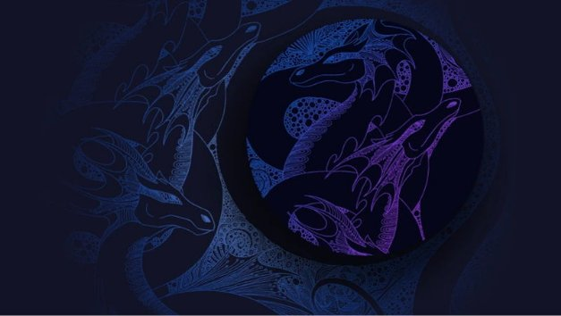

# Hydra – Cardano’s solution for ultimate Layer 2 scalability
### **Scalability is baked into the Cardano development roadmap; enter Hydra**
 17 September 2021[ Sebastian Nagel](tmp//en/blog/authors/sebastian-nagel/page-1/) 7 mins read

### [**Sebastian Nagel**](tmp//en/blog/authors/sebastian-nagel/page-1/)
Software Engineering Lead

Engineering

- 
- 
- 

The Alonzo upgrade enables the creation of smart contracts, decentralized applications (DApps), and other applications on top of Cardano. 

Nâng cấp Alonzo cho phép tạo ra các hợp đồng thông minh, các ứng dụng phi tập trung (DAPP) và các ứng dụng khác trên đỉnh Cardano.

Alonzo marks a significant milestone in the Cardano journey, deploying base level scripting capability that will, in turn, enable further innovation and network development. It also starts the process of transforming a transactions & tokens based blockchain into a dynamic confluence of creativity, financial inclusion, and decentralized development.

Alonzo đánh dấu một cột mốc quan trọng trong hành trình Cardano, triển khai khả năng kịch bản cấp cơ sở sẽ cho phép đổi mới và phát triển mạng hơn nữa.
Nó cũng bắt đầu quá trình chuyển đổi một blockchain dựa trên giao dịch & mã thông báo thành một hợp lưu năng động của sự sáng tạo, bao gồm tài chính và phát triển phi tập trung.

Among the most exciting of the fresh developments enabled by Alonzo is Hydra, a key layer 2 solution to further improve Cardano's scalability layering a new protocol on top of the existing layer 1 blockchain.

Trong số những phát triển mới nhất trong số các phát triển mới được ALONZO kích hoạt là HYDRA, một giải pháp Lớp 2 quan trọng để cải thiện hơn nữa khả năng mở rộng của Cardano một giao thức mới trên đầu của blockchain Lớp 1 hiện có.

### **Hydra: Cardano’s layer 2 solution**

### ** Hydra: Cardano Lớp giải pháp 2

In a blockchain network, a consensus algorithm creates a secure and trustless environment by ensuring agreement on a transaction history. Cardano uses Ouroboros, an efficient proof-of-stake consensus algorithm, for this very purpose. But Cardano also, just like any permissionless blockchain, faces challenges when trying to scale to achieve the throughput required to support applications in the real world, including payment, identification, game, or mobile services. After all, the blockchain needs to reach global consensus on each and every transaction. 

Trong một mạng lưới blockchain, thuật toán đồng thuận tạo ra một môi trường an toàn và không tin cậy bằng cách đảm bảo thỏa thuận về lịch sử giao dịch.
Cardano sử dụng Ouroboros, một thuật toán đồng thuận bằng chứng cổ phần hiệu quả, cho mục đích này.
Nhưng Cardano cũng vậy, giống như bất kỳ blockchain nào không được phép, phải đối mặt với những thách thức khi cố gắng mở rộng quy mô để đạt được thông lượng cần thiết để hỗ trợ các ứng dụng trong thế giới thực, bao gồm thanh toán, nhận dạng, trò chơi hoặc dịch vụ di động.
Rốt cuộc, blockchain cần đạt được sự đồng thuận toàn cầu trên mỗi giao dịch.

Cardano transactions incur fees. The people who run the network (in the case of Cardano, the stake pool operator community) need to be rewarded appropriately for the part they play, so fees need to be set at a sustainable level. Users want to pay fees they deem acceptable. In addition, the blockchain needs to be protected against Denial-of-Service (DoS) attacks, for example. Fees can therefore not be set so low as to open up undue risk – DoS events must be made prohibitively costly to a potential attacker. Storage is also a concern, as an ever-growing transaction history can lead to storage problems. Effectively, the most successful blockchains risk becoming ‘victims’ of that very success.

Giao dịch Cardano phải trả phí.
Những người điều hành mạng (trong trường hợp của Cardano, cộng đồng vận hành nhóm cổ phần) cần được thưởng một cách thích hợp cho phần họ chơi, vì vậy phí cần phải được đặt ở cấp độ bền vững.
Người dùng muốn trả phí mà họ cho là chấp nhận được.
Ngoài ra, ví dụ, blockchain cần được bảo vệ chống lại các cuộc tấn công từ chối dịch vụ (DOS).
Do đó, các khoản phí không thể được đặt ở mức thấp đến mức mở ra rủi ro không đáng có - các sự kiện DOS phải được thực hiện một cách nghiêm túc tốn kém cho một kẻ tấn công tiềm năng.
Lưu trữ cũng là một mối quan tâm, vì một lịch sử giao dịch ngày càng tăng có thể dẫn đến các vấn đề lưu trữ.
Thực tế, các blockchain thành công nhất có nguy cơ trở thành ’nạn nhân của chính thành công đó.

Hydra is a layer 2 scalability solution that seeks to address all these concerns and aims to maximize throughput, minimize latency, incurring low to no costs, and greatly reducing storage requirements.

Hydra là một giải pháp khả năng mở rộng lớp 2 nhằm tìm cách giải quyết tất cả các mối quan tâm này và nhằm mục đích tối đa hóa thông lượng, giảm thiểu độ trễ, phát sinh thấp đến không có chi phí và giảm đáng kể các yêu cầu lưu trữ.

### **Scaling isomorphically**

### ** tỷ lệ đẳng hướng trên hình ảnh **

So how does it do this? By providing more efficient means of processing transactions off-chain for a set of users, while using the main-chain ledger as the secure settlement layer, Hydra keeps security guarantees while remaining loosely coupled to the main chain. Not requiring global consensus, it can adapt to a broad range of applications. For example, Hydra allows Tx fees and minimum UTXO Value to be configured as low as 1 or 2 lovelaces, critical to microtransactions and the use cases these unlock.

Vậy làm thế nào để nó làm điều này?
Bằng cách cung cấp các phương tiện xử lý giao dịch hiệu quả hơn cho một tập hợp người dùng, trong khi sử dụng sổ cái chuỗi chính làm lớp giải quyết an toàn, HydRA giữ bảo đảm bảo mật trong khi vẫn được ghép nối lỏng lẻo với chuỗi chính.
Không yêu cầu sự đồng thuận toàn cầu, nó có thể thích ứng với một loạt các ứng dụng.
Ví dụ, hydra cho phép phí TX và giá trị UTXO tối thiểu được cấu hình thấp đến 1 hoặc 2 lovelaces, quan trọng đối với các giao dịch vi mô và các trường hợp sử dụng các trường hợp mở khóa.

Most importantly though, Hydra introduces the concept of [isomorphic state channels](https://eprint.iacr.org/2020/299.pdf): that is, to reuse the same ledger representation to yield uniform, off-chain ledger siblings, which we call Heads (hence the Hydra name, which references the [mythological, multi-headed creature](https://en.wikipedia.org/wiki/Lernaean_Hydra)). Specifically for Cardano, this means that native assets, non-fungible tokens (NFTs), and Plutus scripting are available inside *each* Hydra Head. Isomorphism permits a natural extension of the system, rather than a bolted-on one.

Quan trọng nhất, hydra giới thiệu khái niệm [các kênh trạng thái đẳng cấu] (https://eprint.iacr.org/2020/299.pdf): nghĩa là sử dụng lại cùng một đại diện của sổ cái để mang lại sự đồng nhất, anh chị em sổ cái ngoài chuỗi.
, mà chúng ta gọi là những người đứng đầu (do đó là tên hydra, trong đó tham chiếu [sinh vật thần thoại, nhiều đầu] (https://en.wikipedia.org/wiki/Lernaean_hydra)).
Cụ thể đối với Cardano, điều này có nghĩa là tài sản bản địa, mã thông báo không bị nấm (NFT) và Scripting Plutus có sẵn bên trong * mỗi * đầu hydra.
Đồng đẳng cho phép một phần mở rộng tự nhiên của hệ thống, thay vì được bắt vít.

Many of the transactions currently handled by the main-chain or application running on the main chain can benefit directly from Hydra, because it understands just the same transaction formats and signatures. This greatly lowers the entry barrier to Hydra for existing and potential new customers, who can reuse Cardano's tried-and-tested infrastructure for building wallets and applications interacting with the layer 2 system. Also, a Hydra Head can be created without initial funds on a receiving party’s side, which allows for a smooth user experience.

Nhiều giao dịch hiện đang được xử lý bởi chuỗi chính hoặc ứng dụng chạy trên chuỗi chính có thể được hưởng trực tiếp từ Hydra, bởi vì nó chỉ hiểu các định dạng và chữ ký giao dịch tương tự.
Điều này làm giảm đáng kể rào cản gia nhập đối với Hydra cho các khách hàng mới và tiềm năng hiện tại, những người có thể sử dụng lại cơ sở hạ tầng đã thử và thử nghiệm của Cardano để xây dựng ví và ứng dụng tương tác với hệ thống Lớp 2.
Ngoài ra, một đầu hydra có thể được tạo ra mà không cần tiền ban đầu ở phía bên nhận, cho phép trải nghiệm người dùng suôn sẻ.

### **Developing a proof of concept**

### ** Phát triển bằng chứng về khái niệm **

We have already implemented the basic Hydra Head protocol as a proof of concept hydra-node. A developer preview will be ready by the time of the upcoming Cardano Summit. This will enable developers (or anyone interested) to run one or more hydra-nodes online, opening a Hydra Head with a limited number of participants, and feeding transactions to it. Users can expect to see a working prototype over a dedicated testnet, plus early benchmarking figures and documentation in this GitHub [repository](https://github.com/input-output-hk/hydra-poc). There likely will not be any user-facing components (wallets, user interface, etc.) available just yet.

Chúng tôi đã triển khai giao thức đầu hydra cơ bản như là một bằng chứng về khái niệm hydra nút.
Một bản xem trước của nhà phát triển sẽ sẵn sàng vào thời điểm Hội nghị thượng đỉnh Cardano sắp tới.
Điều này sẽ cho phép các nhà phát triển (hoặc bất kỳ ai quan tâm) chạy một hoặc nhiều nút hydra trực tuyến, mở đầu hydra với số lượng người tham gia hạn chế và cung cấp các giao dịch cho nó.
Người dùng có thể mong đợi được nhìn thấy một nguyên mẫu hoạt động trên một testnet chuyên dụng, cộng với các số liệu và tài liệu điểm chuẩn sớm trong GitHub [kho lưu trữ] này (https://github.com/input-output-hk/hydra-poc).
Có khả năng sẽ không có bất kỳ thành phần nào đối mặt với người dùng (ví, giao diện người dùng, v.v.).

It is also important to make a point about transactions per second (TPS), too often rather clumsily used as the sole measure of ‘success’ when it comes to scalability. Some people tend to rate a network on the basis of its maximum throughput measured in throughput (TPS). While this is a reasonable measure for ‘legacy’ systems where there is high predictability and conformity (e.g., the VISA network) it is a less useful metric for distributed systems. Instead, our initial focus is on latency (the time that elapses until a transaction is confirmed) as another, more practical way to measure speed of blockchain transactions. On the mainnet, minimum latency is 20 seconds (one block). This is the starting point. In a layer 2 system like Hydra, it is possible to achieve confirmation times of *less than one second*. Terms like ‘one million TPS’ have been used before. It is a bold number, and while this remains as an aspirational target, the ultimate goal of any system is the flexibility to grow capability with demand. Throughput measured in TPS per Hydra head is secondary, and mostly limited by the available hardware. In principle, by adding increasing numbers of Hydra heads to the system, arbitrarily high throughput can be achieved by the system as a whole.

Nó cũng quan trọng để đưa ra quan điểm về các giao dịch mỗi giây (TPS), quá thường xuyên được sử dụng một cách vụng về làm thước đo duy nhất của ‘thành công khi nói đến khả năng mở rộng. Một số người có xu hướng đánh giá một mạng trên cơ sở thông lượng tối đa của nó được đo trong thông lượng (TPS). Mặc dù đây là một biện pháp hợp lý cho các hệ thống di sản, nơi có khả năng dự đoán và sự phù hợp cao (ví dụ: mạng visa), nó là một số liệu ít hữu ích hơn cho các hệ thống phân tán. Thay vào đó, trọng tâm ban đầu của chúng tôi là độ trễ (thời gian trôi qua cho đến khi một giao dịch được xác nhận) như một cách khác, thực tế hơn để đo tốc độ của các giao dịch blockchain. Trên chính, độ trễ tối thiểu là 20 giây (một khối). Đây là điểm khởi đầu. Trong một hệ thống lớp 2 như Hydra, có thể đạt được thời gian xác nhận *ít hơn một giây *. Các thuật ngữ như ‘một triệu TPS đã được sử dụng trước đó. Đó là một con số táo bạo, và trong khi điều này vẫn là một mục tiêu khao khát, mục tiêu cuối cùng của bất kỳ hệ thống nào là tính linh hoạt để phát triển khả năng theo nhu cầu. Thông lượng được đo bằng TPS trên mỗi đầu hydra là thứ yếu và chủ yếu bị giới hạn bởi phần cứng có sẵn. Về nguyên tắc, bằng cách thêm số lượng đầu hydra vào hệ thống ngày càng tăng, thông lượng cao tùy ý có thể đạt được bởi toàn bộ hệ thống.

### **Hydra's evolution over time**

### ** Sự tiến hóa của Hydra theo thời gian **

In the short term, we will keep developing the hydra-node and the Hydra Head protocol until it becomes a solid and stable foundation for the community (and us!) to build real-world applications. These new apps will benefit from fast settling and low-to-no-cost transactions. We are also actively developing other key features, including the support of multiple heads per node, persistence, and Head protocol extensions

Trong ngắn hạn, chúng tôi sẽ tiếp tục phát triển giao thức Hydra-Node và Hydra Head cho đến khi nó trở thành nền tảng vững chắc và ổn định cho cộng đồng (và Hoa Kỳ!) Để xây dựng các ứng dụng trong thế giới thực.
Những ứng dụng mới này sẽ được hưởng lợi từ việc giải quyết nhanh chóng và các giao dịch thấp đến không chi phí.
Chúng tôi cũng đang tích cực phát triển các tính năng chính khác, bao gồm sự hỗ trợ của nhiều đầu cho mỗi nút, sự kiên trì và phần mở rộng giao thức đầu

In the medium term, say 6-12 months, progress will greatly depend on the results of our research and experimentation, plus feedback from the developer community. We are researching ways to interconnect multiple Hydra Heads to increase the “reach” of our layer 2 solution, for example, and also testing different methods to make it easier to integrate and use Hydra. One of the most exciting visions for the long term is the development of ‘Virtual Heads’ by running the Hydra Head protocol *inside* Hydra Heads, thus fully utilizing the isomorphism of our Layer 2 solution. Herein lies true, *theoretical limitless* scalability.

Trong trung hạn, giả sử 6-12 tháng, tiến trình sẽ phụ thuộc rất nhiều vào kết quả nghiên cứu và thử nghiệm của chúng tôi, cộng với phản hồi từ cộng đồng nhà phát triển.
Chúng tôi đang nghiên cứu các cách để kết nối nhiều đầu hydra để tăng khả năng tiếp cận của giải pháp Lớp 2 của chúng tôi, và cũng kiểm tra các phương pháp khác nhau để dễ dàng tích hợp và sử dụng hydra.
Một trong những tầm nhìn thú vị nhất trong thời gian dài là sự phát triển của đầu ảo, bằng cách chạy giao thức đầu hydra * bên trong * đầu hydra, do đó sử dụng đầy đủ sự đẳng cấu của giải pháp lớp 2 của chúng tôi.
Ở đây có sự thật, * Lý thuyết vô hạn * Khả năng mở rộng.

### **Flexibility is key to scalability & growth**

### ** Tính linh hoạt là chìa khóa cho khả năng mở rộng & tăng trưởng **

The overarching concept for Hydra is the provision of a pioneering layer 2 scalability solution suitable for Cardano, a third-generation, UTXO-based blockchain capable of supporting smart contracts. Hydra will drive down costs while increasing throughput and maintaining security.

Khái niệm bao quát cho HYDRA là việc cung cấp một giải pháp khả năng mở rộng Lớp 2 tiên phong phù hợp với Cardano, blockchain thế hệ thứ ba, dựa trên UTXO có khả năng hỗ trợ các hợp đồng thông minh.
Hydra sẽ giảm chi phí trong khi tăng thông lượng và duy trì bảo mật.

Hydra replicates the main chain's functionality while minimizing friction for users, but still allows the flexibility of having a different fee / cost structure and timing constraints on the layer 2. Any successful ecosystem balances the needs of all users. We want this ecosystem to serve the needs of individual consumers, enterprises, professionals, and the growing list of DApps and their developers. 

Hydra sao chép chức năng của chuỗi chính trong khi giảm thiểu ma sát cho người dùng, nhưng vẫn cho phép tính linh hoạt của việc có cấu trúc phí / chi phí khác nhau và các ràng buộc về thời gian trên Lớp 2. Bất kỳ hệ sinh thái thành công nào cũng cân bằng nhu cầu của tất cả người dùng.
Chúng tôi muốn hệ sinh thái này phục vụ nhu cầu của người tiêu dùng, doanh nghiệp, chuyên gia và danh sách ngày càng tăng của DAPPS và các nhà phát triển của họ.

With the Alonzo hard fork, Cardano will start on a new journey as a smart contract platform, enabling technologies like Hydra, which in turn will dramatically improve Cardano’s scalability, and thus further its adoption.

Với Alonzo Hard Fork, Cardano sẽ bắt đầu một hành trình mới như một nền tảng hợp đồng thông minh, cho phép các công nghệ như Hydra, từ đó sẽ cải thiện đáng kể khả năng mở rộng của Cardano, và do đó tiếp tục áp dụng.

*At the [Cardano Summit 2021](https://summit.cardano.org/), taking place 25-26 September, we’ll talk more about Hydra, its progress to date, and goals for the future. Make sure you join us! And you might also like to check out [this video explainer](https://www.youtube.com/watch?v=7ySUbFpTrAk).*

*Tại [Cardano Summit 2021] (https://summit.cardano.org/), diễn ra vào ngày 25-26 tháng 9, chúng tôi sẽ nói thêm về Hydra, tiến trình của nó cho đến nay và các mục tiêu cho tương lai.
Hãy chắc chắn rằng bạn tham gia với chúng tôi!
Và bạn cũng có thể muốn xem [Người giải thích video này] (https://www.youtube.com/watch?v=7ySubFptrak).*

#### ***Matthias Benkort, Arnaud Bailly, and Fernando Sanchez also contributed to this piece.***

#### *** Matthias Benkort, Arnaud Bailly và Fernando Sanchez cũng đã đóng góp cho tác phẩm này. *** ***

