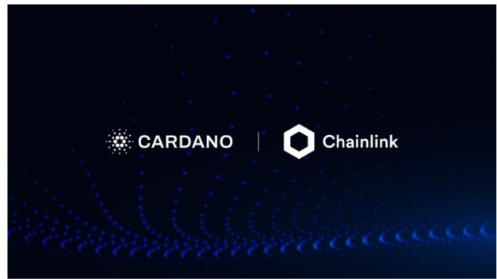

# Cardano to integrate Chainlink oracles for real-time market data
### **Our new collaboration will add additional support for developers building smart contracts for Cardano DeFi applications**
 25 September 2021[ Tim Harrison](tmp//en/blog/authors/tim-harrison/page-1/) 4 mins read

### [**Tim Harrison**](tmp//en/blog/authors/tim-harrison/page-1/)
VP of Community & Ecosystem

Communications

- 
- 
- 
- 

At the heart of the potential of DeFi and RealFi is the use of blockchain-based peer-to-peer technology to build reliable and transparent financial products using oracles and smart contracts. During today’s Cardano Summit, we announced an exciting new strategic collaboration with Chainlink Labs that will help developers build smart contracts for Cardano DeFi applications.

Trọng tâm của tiềm năng của Defi và Realfi là việc sử dụng công nghệ ngang hàng dựa trên blockchain để xây dựng các sản phẩm tài chính đáng tin cậy và minh bạch bằng cách sử dụng các nhà tiên tri và hợp đồng thông minh.
Trong Hội nghị thượng đỉnh Cardano hôm nay, chúng tôi đã công bố một sự hợp tác chiến lược mới thú vị với Chainlink Labs sẽ giúp các nhà phát triển xây dựng hợp đồng thông minh cho các ứng dụng Cardano Defi.

Access to real-world databases will be supplied through Chainlink’s decentralized ‘oracle’ networks which provide tamper-proof, high-quality external data to blockchains, enabling ‘smart contracts’ to execute around datasets such as election results, sports stats, and cryptocurrency rates. Another example that might be quite useful is in the provision of weather data. Chainlink Labs works with several FinTech startups that are trying to enable parametric insurance in sub-Saharan Africa. Secure, verifiable and robust weather data is a key input required for such parametric insurance contracts.

Truy cập vào cơ sở dữ liệu trong thế giới thực sẽ được cung cấp thông qua các mạng không phân cấp-cung cấp các dữ liệu bên ngoài của Pusper-Proof, chất lượng cao cho các blockchains như
Kết quả bầu cử, thống kê thể thao và tỷ lệ tiền điện tử.
Một ví dụ khác có thể khá hữu ích là trong việc cung cấp dữ liệu thời tiết.
Chainlink Labs làm việc với một số công ty khởi nghiệp fintech đang cố gắng cho phép bảo hiểm tham số ở châu Phi cận Sahara.
Dữ liệu thời tiết an toàn, có thể kiểm chứng và mạnh mẽ là một đầu vào chính cần thiết cho các hợp đồng bảo hiểm tham số đó.

Chainlink provides oracle services to power hybrid smart contracts on any blockchain. Chainlink oracle networks enable smart contracts to reliably connect to any external API, leveraging secure off-chain computations for feature-rich applications. Chainlink currently secures tens of billions of dollars across DeFi, insurance, gaming, and other major industries, offering global enterprises and leading data providers a universal gateway to all blockchains.

Chainlink cung cấp dịch vụ Oracle cho các hợp đồng thông minh Hybrid Power Hybrid trên bất kỳ blockchain nào.
Chainlink Oracle Networks cho phép các hợp đồng thông minh kết nối đáng tin cậy với bất kỳ API bên ngoài nào, tận dụng các tính toán ngoài chuỗi an toàn cho các ứng dụng giàu tính năng.
Chainlink hiện đảm bảo hàng chục tỷ đô la trên toàn bộ Defi, bảo hiểm, chơi game và các ngành công nghiệp lớn khác, cung cấp cho các doanh nghiệp toàn cầu và các nhà cung cấp dữ liệu hàng đầu một cửa ngõ toàn cầu cho tất cả các blockchains.

As the preferred oracle solution for Cardano, developers using the blockchain will be able to feed Chainlink’s institutional-grade data into their smart contracts – blockchain-based digital agreements that execute automatically once certain predefined conditions are met.

Vì giải pháp Oracle ưa thích cho Cardano, các nhà phát triển sử dụng blockchain sẽ có thể cung cấp dữ liệu cấp thể chế của Chainlink vào các hợp đồng thông minh của họ-các thỏa thuận kỹ thuật số dựa trên blockchain thực hiện tự động sau khi đáp ứng một số điều kiện được xác định trước.

After market price feeds, support for other Chainlink decentralized services will follow: sports data for prediction markets, weather data for parametric insurance products, and verifiable randomness for gaming and digital collectables such as non-fungible tokens (NFTs). 

Sau khi nguồn cấp dữ liệu về giá thị trường, hỗ trợ cho các dịch vụ phi tập trung khác của Chainlink sẽ tuân theo: dữ liệu thể thao cho thị trường dự đoán, dữ liệu thời tiết cho các sản phẩm bảo hiểm tham số và tính ngẫu nhiên có thể kiểm chứng được đối với các bộ sưu tập trò chơi và kỹ thuật số như Token không bị tăng (NFT).

This collaboration between IOHK and Chainlink Labs will give access to a wealth of secure data, helping DeFi achieve its promise of building a less costly and more inclusive global economic system. Initially, information feeds for real-time market prices will be linked to Cardano. Over time, additional data feeds on sports and weather will follow, for use with insurance, gaming, and NFTs.

Sự hợp tác này giữa IOHK và Chainlink Labs sẽ cho phép truy cập vào vô số dữ liệu an toàn, giúp Defi đạt được lời hứa xây dựng một hệ thống kinh tế toàn cầu ít tốn kém hơn và toàn diện hơn.
Ban đầu, nguồn cấp dữ liệu thông tin cho giá thị trường thời gian thực sẽ được liên kết với Cardano.
Theo thời gian, các nguồn cấp dữ liệu bổ sung cho thể thao và thời tiết sẽ theo sau, để sử dụng với bảo hiểm, chơi game và NFT.

IOHK Founder Charles Hoskinson said: “Oracles are essential to making real-world data accessible on Cardano and they support advanced smart contracts, such as DeFi applications. 

Người sáng lập IOHK Charles Hoskinson cho biết: "Coracles rất cần thiết để làm cho dữ liệu trong thế giới thực có thể truy cập được trên Cardano và họ hỗ trợ các hợp đồng thông minh nâng cao, chẳng hạn như các ứng dụng DEFI.

“IOHK is committed to providing developers with the most secure and robust tooling for building useful solutions on Cardano, making it an easy choice to integrate Chainlink’s market-leading oracle solution.” 

"IOHK cam kết cung cấp cho các nhà phát triển công cụ an toàn và mạnh mẽ nhất để xây dựng các giải pháp hữu ích trên Cardano, khiến nó trở thành một lựa chọn dễ dàng để tích hợp giải pháp Oracle dẫn đầu thị trường của Chainlink.

He added: “Not only will integrating Chainlink price feeds reduce the go-to-market time for Cardano developers, but it will establish a secure foundation for Cardano’s DeFi ecosystem, helping make Cardano more trusted by users around the world.” 

Ông nói thêm: Không chỉ tích hợp các nguồn cấp dữ liệu về giá ChainLink làm giảm thời gian tiếp thị cho các nhà phát triển Cardano, nhưng nó sẽ thiết lập một nền tảng an toàn cho hệ sinh thái Defi của Cardano, giúp Cardano tin tưởng hơn bởi người dùng trên thế giới.
"

Sergey Nazarov, co-founder of Chainlink, said: “We’re excited to leverage our extensive experience and expertise by establishing native support for Chainlink on the Cardano blockchain and supporting its next stage of growth into markets like DeFi and beyond.

Sergey Nazarov, đồng sáng lập của Chainlink, cho biết: "Chúng tôi rất hào hứng tận dụng kinh nghiệm và chuyên môn sâu rộng của chúng tôi bằng cách thiết lập hỗ trợ bản địa cho Chainlink trên blockchain Cardano và hỗ trợ giai đoạn phát triển tiếp theo của nó vào các thị trường như Defi và hơn thế nữa.

“Similar to programming interfaces in web app development, developers building DeFi applications on Cardano will be able to plug-and-play Chainlink price feeds into their smart contracts to quickly gain access to high-quality, real-time price data on a wide range of assets while still maintaining robust security and uptime. Ultimately, this will empower developers on Cardano to build next-generation applications quicker and more securely.”

"Nhi đồng với giao diện lập trình trong phát triển ứng dụng web, các nhà phát triển xây dựng các ứng dụng Defi trên Cardano sẽ có thể cắm các nguồn cấp dữ liệu ChainLink vào hợp đồng thông minh của họ để nhanh chóng truy cập vào dữ liệu giá cả thời gian thực chất lượng cao trên một
Phạm vi tài sản trong khi vẫn duy trì bảo mật mạnh mẽ và thời gian hoạt động.
Cuối cùng, điều này sẽ trao quyền cho các nhà phát triển trên Cardano để xây dựng các ứng dụng thế hệ tiếp theo nhanh hơn và an toàn hơn.

Niki Ariyasinghe, head of blockchain partnerships at Chainlink Labs, said: “We have a tremendous amount of respect for the Cardano ecosystem. Obviously for the technical team behind Cardano – IOG and so on – but also for the collaborative nature of the community as well." 

Niki Ariyasinghe, người đứng đầu quan hệ đối tác blockchain tại Chainlink Labs, cho biết: "Chúng tôi có một sự tôn trọng rất lớn đối với hệ sinh thái Cardano.
Rõ ràng đối với đội ngũ kỹ thuật đằng sau Cardano - IOG, v.v., nhưng cũng vì bản chất hợp tác của cộng đồng. "

Ariyasinghe added: "Cross-chain interoperability is another longer-term goal. This is really a framework for enabling bridges between different chains and enabling a multi-chain world. So this is something that we hope to collaborate on with the Cardano ecosystem as well.”

Ariyasinghe nói thêm: "Khả năng tương tác chuỗi chéo là một mục tiêu dài hạn khác. Đây thực sự là một khuôn khổ để cho phép các cầu nối giữa các chuỗi khác nhau và cho phép một thế giới đa chuỗi.
.â €

