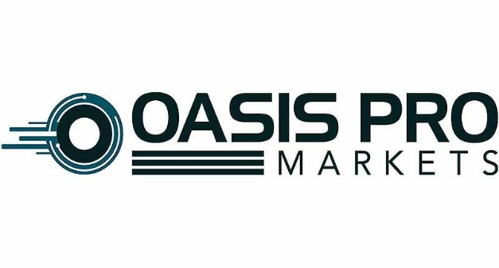

# Oasis Pro deal will give developing world better access to financial markets
### **Partnership aims to break dominance banks have on low-risk investment from primary bond markets**
 26 September 2021[ Anthony Quinn](tmp//en/blog/authors/anthony-quinn/page-1/) 2 mins read

### [**Anthony Quinn**](tmp//en/blog/authors/anthony-quinn/page-1/)
Editor

Marketing & Communications

- 
- 
- 
- 

IOHK and Oasis Pro have formed a ground-breaking partnership to develop an alternative trading system that will use blockchain technology to open up participation in primary bond markets to developing countries.

IOHK và OASIS PRO đã hình thành mối quan hệ đối tác đột phá để phát triển một hệ thống giao dịch thay thế sẽ sử dụng công nghệ blockchain để mở ra sự tham gia vào thị trường trái phiếu chính cho các nước đang phát triển.

The two companies are joining forces to create a bond issuance platform. Oasis Pro is the parent company of Oasis Pro Markets, which already operates a multi-asset alternative trading system called OATSPRO in the US. This allows secondary trading of public and private multi-asset digital securities.

Hai công ty đang gia nhập lực lượng để tạo ra một nền tảng phát hành trái phiếu.
Oasis Pro là công ty mẹ của Oasis Pro Market, đã vận hành một hệ thống giao dịch thay thế đa tài sản có tên OATSPRO ở Mỹ.
Điều này cho phép giao dịch thứ cấp của chứng khoán kỹ thuật số đa tài sản công cộng và tư nhân.

The Oasis Pro technology facilitates digital cash for digital securities transactions, and the use of the Cardano blockchain to remove the need for intermediaries such as banks from the process will cut trading fees by half. The combined platform provides a viable and secure financing alternative for governments of developing nations.

Công nghệ OASIS Pro tạo điều kiện cho tiền mặt kỹ thuật số cho các giao dịch chứng khoán kỹ thuật số và việc sử dụng blockchain Cardano để loại bỏ sự cần thiết của các trung gian như ngân hàng khỏi quy trình sẽ cắt giảm một nửa phí giao dịch.
Nền tảng kết hợp cung cấp một sự thay thế tài chính khả thi và an toàn cho các chính phủ của các quốc gia đang phát triển.

With recent reductions in foreign aid and investment, many governments are struggling to access capital. The integration of OATSPRO technology with users of Cardano’s ada cryptocurrency – with a market capitalization of $70 billion – will enable a new source of foreign investment to be tapped for crucial infrastructure projects.

Với việc giảm gần đây về viện trợ và đầu tư nước ngoài, nhiều chính phủ đang đấu tranh để tiếp cận vốn. Sự tích hợp của công nghệ yến mạch với người dùng tiền điện tử Ada của Cardano - với vốn hóa thị trường trị giá 70 tỷ USD sẽ cho phép một nguồn mới
đầu tư nước ngoài được khai thác cho các dự án cơ sở hạ tầng quan trọng.

John O’Connor, director of African operations at IO Global, said: ‘At IO Global, our mission is to build systems which widen and democratize access to vital financial and social services, for both governments and citizens alike. This was the drive for our partnership with the Ethiopian Ministry of Education this year to bring provable educational credentials to students and teachers across the country, and it is the same for our work with Oasis.

John Oâ € ™ Connor, Giám đốc điều hành châu Phi tại IO Global, cho biết: "IO Global, nhiệm vụ của chúng tôi là xây dựng các hệ thống mở rộng và dân chủ hóa việc tiếp cận các dịch vụ tài chính và xã hội quan trọng, cho cả chính phủ và công dân.
Đây là nỗ lực cho sự hợp tác của chúng tôi với Bộ Giáo dục Ethiopia trong năm nay để mang lại thông tin giáo dục có thể chứng minh cho học sinh và giáo viên trên cả nước, và điều này cũng giống như công việc của chúng tôi với OASIS.

‘Systems like the one Oasis is developing are essential to bridge the growing global investment gap and give developing nations the tools to level the playing field and invest in critical infrastructure.’

Các hệ thống như One Oasis đang phát triển rất cần thiết để thu hẹp khoảng cách đầu tư toàn cầu đang phát triển và cung cấp cho các quốc gia đang phát triển các công cụ để san bằng sân chơi và đầu tư vào cơ sở hạ tầng quan trọng.

Pat LaVecchia, chief executive of Oasis, said: ‘Developing nations often lack the access to overseas capital that other nations have. We want to ensure that this changes. IO Global’s vision to democratize opportunity aligns closely with our desire to ensure access to financial markets for developing nations, and this partnership represents a key step in enabling greater accessibility to international capital markets for those that require it.’

Pat Lavecchia, giám đốc điều hành của Oasis, cho biết: "Các quốc gia phát triển thường thiếu quyền truy cập vào vốn ở nước ngoài mà các quốc gia khác có.
Chúng tôi muốn đảm bảo rằng điều này thay đổi.
Tầm nhìn của IO Global để dân chủ hóa cơ hội phù hợp chặt chẽ với mong muốn của chúng tôi để đảm bảo quyền truy cập vào thị trường tài chính cho các quốc gia đang phát triển và sự hợp tác này thể hiện một bước quan trọng trong việc cho phép tiếp cận thị trường vốn quốc tế nhiều hơn cho những người yêu cầu.

