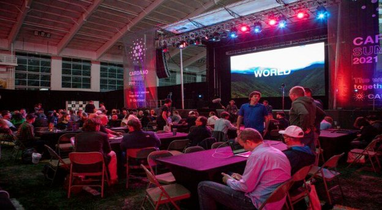

# Building on the Cardano Summit
### **As well as a showcase for all things Cardano, the summit weekend also provided a platform for working with our growing developer community**
 12 October 2021[ Fernando Sanchez](tmp//en/blog/authors/fernando-sanchez/page-1/) 6 mins read

### [**Fernando Sanchez**](tmp//en/blog/authors/fernando-sanchez/page-1/)
Technical Writer

Marketing and Communications

- 
- 

The recent two-day [Cardano Summit](https://summit.cardano.org/) offered the perfect opportunity to interact with the global developer community. This landmark event became the stage where Cardano, its partners, and developers came together to form a synergistic whole of creativity and interaction. This collaboration yielded some impressive results. 

Hội nghị thượng đỉnh [Cardano] hai ngày gần đây (https://summit.cardano.org/) đã mang đến cơ hội hoàn hảo để tương tác với cộng đồng nhà phát triển toàn cầu.
Sự kiện mang tính bước ngoặt này trở thành giai đoạn mà Cardano, các đối tác và các nhà phát triển đã cùng nhau tạo thành một toàn bộ sự sáng tạo và tương tác.
Sự hợp tác này mang lại một số kết quả ấn tượng.

IOG teams organized, or were closely involved with coding challenges and hackathons that served to showcase the evolving potential of Cardano for hosting decentralized applications (DApps) and smart contracts. We learned a lot from these experiences, and had a lot of fun doing it.

Các nhóm IOG được tổ chức hoặc tham gia chặt chẽ với các thử thách mã hóa và hackathon phục vụ để thể hiện tiềm năng phát triển của Cardano để lưu trữ các ứng dụng phi tập trung (DAPP) và hợp đồng thông minh.
Chúng tôi đã học được rất nhiều từ những trải nghiệm này, và đã có rất nhiều niềm vui khi làm điều đó.

Two particular events stand out: the Plutus Capstone Challenge, which was organized and hosted by IOG (special hat tip to the IO community team’s Matthew Capps for his efforts), and the WyoHackathon, an event that ran concurrently to the Cardano Summit. IOG teams helped organize some of the challenge categories at this event, with IOG's Hernán Rajchert and Pablo Lamela acting as judges.

Hai sự kiện đặc biệt nổi bật: Thử thách Capstone Plutus, được tổ chức và tổ chức bởi IOG (Mũ mũ đặc biệt cho Matthew Capps của nhóm cộng đồng IO cho những nỗ lực của anh ấy), và Wyohackathon, một sự kiện diễn ra đồng thời với Hội nghị thượng đỉnh Cardano
.
Các nhóm IOG đã giúp tổ chức một số hạng mục thử thách tại sự kiện này, với Hernán Rajchert và Pablo Lamela của IOG đóng vai trò là thẩm phán.

### **Plutus Capstone Challenge**

### ** Thử thách Capstone Plutus **

Cardano has reached many milestones in recent months, including the delivery of a ‘programmable’ mainnet and smart contracts with the Alonzo hard fork.

Cardano đã đạt được nhiều cột mốc trong những tháng gần đây, bao gồm cả việc cung cấp một hợp đồng thông minh và hợp đồng thông minh và hợp đồng thông minh với Alonzo Hard Fork.

A new development ecosystem is now emerging, with the Plutus Pioneer program as one of its cornerstone community initiatives. Two cohorts have graduated since the program's launch in early March 2021, with over three thousand taking this valuable primer in Plutus and functional programming.

Một hệ sinh thái phát triển mới hiện đang nổi lên, với chương trình Pioneer Plutus là một trong những sáng kiến cộng đồng nền tảng của nó.
Hai đoàn hệ đã tốt nghiệp kể từ khi chương trình ra mắt vào đầu tháng 3 năm 2021, với hơn ba nghìn người dùng mồi có giá trị này trong Sao Diêm Vương và lập trình chức năng.

As well as a celebration of the journey so far, we wanted to use the Cardano Summit to recognize our Plutus Pioneers and Plutus developer partners and offer them the chance to showcase their skills with a ‘capstone’ event.

Cũng như một lễ kỷ niệm của cuộc hành trình cho đến nay, chúng tôi muốn sử dụng Hội nghị thượng đỉnh Cardano để nhận ra các đối tác của nhà phát triển Plutus và nhà phát triển Plutus và cung cấp cho họ cơ hội thể hiện các kỹ năng của họ với một sự kiện "Capstone.

Our Summit Capstone event brought together developers from around the world to solve coding challenges. The challenges were specifically chosen to provide tools that the whole community could use to help them build Plutus decentralized applications (DApps), a chain index explorer, for example. The event consisted of a per-region 8-hour period, following the sun from Asia-Pacific, through Europe, and to the United States. The event ended as the sun set on Saturday.

Sự kiện Capstone Summit của chúng tôi đã tập hợp các nhà phát triển từ khắp nơi trên thế giới để giải quyết các thách thức mã hóa.
Các thách thức được chọn đặc biệt để cung cấp các công cụ mà cả cộng đồng có thể sử dụng để giúp họ xây dựng các ứng dụng phi tập trung (DAPP) của Plutus, một trình khám phá chỉ mục chuỗi, chẳng hạn.
Sự kiện này bao gồm khoảng thời gian 8 giờ, sau Mặt trời từ Châu Á-Thái Bình Dương, qua Châu Âu và Hoa Kỳ.
Sự kiện kết thúc khi mặt trời lặn vào thứ bảy.

### **About the event**

### ** về sự kiện **

For each region, a team of experienced Plutus engineers from IOG and five partner companies mentored the participants. We kept the Capstone deliberately low-key and informal – a learning experience, and ‘testbed’ for future events. Still, participants were eager and took the challenges seriously. In particular, the IOG team was struck by the attendees’ desire to work together and invest longer than the allotted time in working out complex solutions.

Đối với mỗi khu vực, một nhóm các kỹ sư Plutus có kinh nghiệm từ IOG và năm công ty đối tác đã hướng dẫn những người tham gia.
Chúng tôi giữ capstone cố tình thấp và không chính thức-một trải nghiệm học tập, và "Testbed" cho các sự kiện trong tương lai.
Tuy nhiên, những người tham gia vẫn háo hức và thực hiện các thử thách nghiêm túc.
Cụ thể, nhóm IOG đã bị tấn công bởi những người tham dự mong muốn làm việc cùng nhau và đầu tư lâu hơn so với thời gian được quy định trong việc thực hiện các giải pháp phức tạp.

We received very positive feedback on the communication and organization of the event itself, and especially on the quality of support provided by the Plutus experts at IOG, [Metalamp](https://en.metalamp.io/), [MLabs](https://mlabs.city/), [Obsidian](https://www.obsidians.io/), and DQuadrant. Three of our mentors were graduates from a 2020 Haskell training course by Dr. Lars Brünjes. It’s fantastic to see this positive evolution, as these graduates have now reached a stage where they are able to help developers build Plutus applications. We also saw the beginning of the use of Cardano Stack Exchange, with problems being posted, soon followed by solutions.

Chúng tôi đã nhận được phản hồi rất tích cực về giao tiếp và tổ chức sự kiện, và đặc biệt là về chất lượng hỗ trợ được cung cấp bởi các chuyên gia Plutus tại IOG, [Metalamp] (https://en.metalamp.io/), [MLABS] (
https://mlabs.city/), [obsidian] (https://www.obsidians.io/), và dquadrant.
Ba trong số các cố vấn của chúng tôi đã tốt nghiệp từ khóa đào tạo Haskell năm 2020 của Tiến sĩ Lars Brünjes.
Thật tuyệt vời khi thấy sự tiến hóa tích cực này, vì những sinh viên tốt nghiệp này đã đạt đến một giai đoạn mà họ có thể giúp các nhà phát triển xây dựng các ứng dụng Sao Diêm Vương.
Chúng tôi cũng đã thấy sự khởi đầu của việc sử dụng Sàn giao dịch Stack Cardano, với các vấn đề được đăng, sau đó là các giải pháp.

By the end of the event, teams of pioneers had made 16 polished submissions, reasoning about and attempting to solve challenges. These included NFT-authentication for DApps, distribution tools for Cardano-API wallet-funds, designing a trinket-to-gold ‘smelter’ game for concurrency, and many others.

Đến cuối sự kiện, các nhóm tiên phong đã thực hiện 16 bài nộp được đánh bóng, lý luận về và cố gắng giải quyết các thách thức.
Chúng bao gồm xác thực NFT đối với các DAPP, các công cụ phân phối cho các loại ví tiền Cardano-API, thiết kế một trò chơi nhỏ-TO-TO-€ ˜

Apart from the satisfaction of bringing Cardano developers together in this celebration of our budding Plutus community, the enthusiasm and positive uptake of this foundational coding challenge encourages us to run more in the future. We plan to extend competition periods, include team events, and turn on event marketing to bring the whole developer ecosystem into the fun.

Ngoài sự hài lòng của việc đưa các nhà phát triển Cardano đến với nhau trong lễ kỷ niệm cộng đồng Plutus vừa chớm nở của chúng ta, sự nhiệt tình và tích cực của thử thách mã hóa nền tảng này khuyến khích chúng ta chạy nhiều hơn trong tương lai.
Chúng tôi dự định kéo dài thời gian cạnh tranh, bao gồm các sự kiện nhóm và bật tiếp thị sự kiện để đưa toàn bộ hệ sinh thái nhà phát triển vào cuộc vui.

### **The winners**

### **Người chiến thắng**

This Plutus Pioneer Capstone brought together Pioneers, our partners, and our IOG teams in a synergistic effort that really paid off. 

Capstone Pioneer Pioneer Plutus này đã tập hợp những người tiên phong, các đối tác của chúng tôi và các nhóm IOG của chúng tôi trong một nỗ lực hiệp đồng thực sự đã được đền đáp.

The winners of the Capstone event 2021 were, by region:

Những người chiến thắng của sự kiện Capstone 2021, theo khu vực:

**APAC Asia Region**

** Vùng APAC Châu Á **

- [NFT Authentication Tool](https://github.com/ganeshnithyanandam/OAuth-NFT), by ganesh#9022 - $5,000 prize

- [Công cụ xác thực NFT] (https://github.com/ganeshnithyanandam/oauth-nft), bởi Ganesh#9022 - Giải thưởng $ 5.000 $ 5.000

**EMEA Europe Region**

** Khu vực EMEA Châu Âu **

- [Cardano-CLI Wallet Test Tool](https://github.com/domy2018developer/ppc-emea), by domy2018developer#8139 - $2,000 prize

- [Công cụ kiểm tra ví Cardano-cli] (https://github.com/domy2018developer/ppc-emea), bởi DOMY2018Develer#8139- $ 2.000 Giải thưởng

- [Cardano-CLI Transaction Editor](https://github.com/Titan-C/cardano.el), by #Titan-c#2872 - $1,000 prize

-[Biên tập viên giao dịch Cardano-cli] (https://github.com/titan-c/cardano.el), bởi #Titan-C #2872-$ 1.000 Giải thưởng

- [Cardano-CLI Integration Testing toolkit](https://github.com/zwilling/plutus-integration-testing-toolkit), by flippy#1542 - $500 prize

-[Bộ công cụ kiểm tra tích hợp Cardano-cli] (https://github.com/zwilling/plutus-egration-testing-toolkit), bởi Flippy#1542-$ 500 Giải thưởng

- ["Tokenomia" - Native Tokens Toolbox](https://github.com/smart-chain-fr/tokenomia), by Nicolas Henin [Smart Chain]#7822 - $500 prize

-]

**USA Region**

** Khu vực Hoa Kỳ **

- [Win-win Dispute Resolution Application](https://github.com/Loxe-Inc/mediation-contract), by mks#4918 - $5,000 prize

-

- [PiggyBank Savings Application](https://github.com/eselkin/param-pb-pab), by eponymousEli#4492 - $3,000 prize

- [Ứng dụng tiết kiệm Piggybank] (https://github.com/eselkin/param-pb-pab), bởi cùng tên

It was a great start to IOG’s plans for similar events over the coming months. Congratulations to all the winners and thanks to everyone who took part.

Đó là một khởi đầu tuyệt vời cho kế hoạch của IOG cho các sự kiện tương tự trong những tháng tới.
Xin chúc mừng tất cả những người chiến thắng và cảm ơn tất cả những người đã tham gia.

### **WyoHackathon 2021**

### ** Wyohackathon 2021 **

Meanwhile in Laramie, Wyoming, there was a weekend event that ran from 6pm on Friday September 24th to 9am on Sunday September 26th, with people taking part live from the University of Wyoming, or online from anywhere in the world using Discord and submitting their entries through DevPost. Representatives from IOG contributed to the event by helping with some challenge categories and acting as judges. 

Trong khi đó ở Laramie, bang Utah, đã có một sự kiện cuối tuần diễn ra từ 6 giờ tối thứ Sáu ngày 24 tháng 9 đến 9 giờ sáng Chủ nhật ngày 26 tháng 9, với những người tham gia trực tiếp từ Đại học Wyoming, hoặc trực tuyến từ bất cứ đâu trên thế giới bằng cách sử dụng sự bất hòa và gửi các mục nhập của họ
thông qua DevPost.
Đại diện của IOG đã đóng góp cho sự kiện này bằng cách giúp đỡ với một số loại thách thức và làm giám khảo.

The WyoHackathon featured several categories, with 140 participants and 20 submissions registered in total.

Wyohackathon có một số loại, với 140 người tham gia và 20 bài nộp được đăng ký tổng cộng.

The IOG team helped to organize two [Marlowe](https://docs.cardano.org/marlowe/learn-about-marlowe)-related categories. 

Nhóm IOG đã giúp tổ chức hai [Marlowe] (https://docs.cardano.org/marlowe/learn-about- marlowe).

- Marlowe contracts - Find existing financial agreements that could be modeled as Marlowe contracts and develop them inside the [Marlowe Playground](https://alpha.marlowe.iohkdev.io/#/)

- Hợp đồng Marlowe - Tìm các thỏa thuận tài chính hiện tại có thể được mô hình hóa thành hợp đồng Marlowe và phát triển chúng bên trong [Sân chơi Marlowe] (https://alpha.marlowe.iohkdev.io/#/)

- Marlowe future - Envision how you might modify the various components of the Marlowe Suite

- Tương lai Marlowe - Hình dung làm thế nào bạn có thể sửa đổi các thành phần khác nhau của bộ Marlowe

### **Prizes**

### ** Giải thưởng **

There were five submissions to the Marlowe categories, and the prizes were distributed as follows.

Có năm bài nộp cho các loại Marlowe, và các giải thưởng được phân phối như sau.

The winning entries for the Marlowe contracts category were:

Các mục chiến thắng cho danh mục Hợp đồng Marlowe là:

- #1 ($5,000 prize) - [Pass through billing](https://devpost.com/software/marlowe-contract-pass-through-billing) - Considers the scenario where a vendor resells or lends a product to a client and takes a commission depending on whether there is a dispute.

- #1 (Giải thưởng 5.000 đô la)-[Thông qua thanh toán] (https://devpost.com/software/marlowe-contract-pass-through-billing)-xem xét kịch bản trong đó nhà cung cấp bán lại hoặc cho khách hàng cho khách hàng và cho khách hàng và cho vay một sản phẩm cho khách hàng và
mất một khoản hoa hồng tùy thuộc vào việc có tranh chấp hay không.

- #2 ($2,000 prize) - [Pizza delivery](https://devpost.com/software/marlowe-pizza-delivery-accountability-contract) - A contract that gives a partial (or full) refund, depending on how late the delivery was. The implementation only asked the client, so it didn’t consider the possibility of a malicious client.

- #2 (Giải thưởng $ 2.000)-[Giao hàng pizza] (https://devpost.com/software/marlowe-pizza-delivery-cactability-contract)-Hợp đồng hoàn trả một phần (hoặc đầy đủ), tùy thuộc vào mức độ trễ muộn
Việc giao hàng là.
Việc triển khai chỉ hỏi khách hàng, vì vậy nó không xem xét khả năng của một khách hàng độc hại.

- #3 ($1,000 prize) - [Turing toil](https://devpost.com/software/proof-of-workout) - Uses a hypothetical oracle that returns muscle strength to incentivize two gym buddies to motivate them and motivate each other.

- #3 (Giải thưởng $ 1.000) - [Turing Brun] (https://devpost.com/software/proof-of-workout) - sử dụng một nhà tiên tri giả thuyết trở lại sức mạnh cơ bắp để khuyến khích hai người bạn tập thể dục để thúc đẩy họ và thúc đẩy nhau
.

There was just one winning entry for the Marlowe future category:

Chỉ có một mục chiến thắng cho hạng mục Marlowe Future:

- #1 ($1,000 prize) - [Company Merger](https://devpost.com/software/marlowe-company-merger) - Takes stocks from two different companies and combines them, considering the value of the original stocks according to a hypothetical oracle.

- #1 (Giải thưởng $ 1.000) - [sáp nhập công ty] (https://devpost.com/software/marlowe-company-gr
Oracle giả thuyết.

We would also like to thank Colin Hobbins from the Plutus engineering team for participating on-site on the presentation of the Hackathon, and Kegan McIlwain and Stone Olguin for supporting participants on-site and over Discord.

Chúng tôi cũng xin cảm ơn Colin Hobbins từ nhóm Kỹ thuật Plutus vì đã tham gia tại chỗ trong buổi thuyết trình của Hackathon, và Kegan McIlwain và Stone Olguin vì đã hỗ trợ người tham gia tại chỗ và vượt qua sự bất hòa.

Speaking about the event, IOHK researcher and developer Pablo Lamela said 'It was very refreshing to see how original all the submissions were. I think this kind of insight will help us know how to make Marlowe even better and more useful for users.'

Nói về sự kiện này, nhà nghiên cứu và nhà phát triển IOHK Pablo Lamela cho biết 'Thật là rất mới mẻ khi thấy tất cả các bài nộp nguyên bản như thế nào.
Tôi nghĩ rằng loại cái nhìn sâu sắc này sẽ giúp chúng tôi biết cách làm cho Marlowe thậm chí còn tốt hơn và hữu ích hơn cho người dùng. '

### **Conclusion**

### **Sự kết luận**

The Capstone event confirmed that there is great interest in Cardano amongst the developer community following the Alonzo update. Cardano is now a versatile, scalable platform that supports DApps and smart contracts, something that has been warmly welcomed by the wider community.

Sự kiện Capstone đã xác nhận rằng có sự quan tâm lớn đối với Cardano trong cộng đồng nhà phát triển sau bản cập nhật Alonzo.
Cardano hiện là một nền tảng đa năng, có thể mở rộng, hỗ trợ DAPP và hợp đồng thông minh, một điều được cộng đồng rộng lớn chào đón.

The Summit was just a 48 hours-long event, but that doesn't mean that our close collaboration with the community ends there. Quite the opposite. We will continue developing and expanding Cardano's features over the coming weeks and months, providing the developer community with the required tools and support to interact with our ecosystem.

Hội nghị thượng đỉnh chỉ là một sự kiện kéo dài 48 giờ, nhưng điều đó không có nghĩa là sự hợp tác chặt chẽ của chúng tôi với cộng đồng kết thúc ở đó.
Hoàn toàn ngược lại.
Chúng tôi sẽ tiếp tục phát triển và mở rộng các tính năng của Cardano trong những tuần và tháng tới, cung cấp cho cộng đồng nhà phát triển các công cụ cần thiết và hỗ trợ để tương tác với hệ sinh thái của chúng tôi.

*Catch up on all the announcements and sessions from the [Cardano Summit 2021](https://summit.cardano.org/) website and [IOG’s Twitter](https://twitter.com/InputOutputHK).*

*Hãy bắt kịp tất cả các thông báo và phiên từ [Cardano Summit 2021] (https://summit.cardano.org/) và [Twitter của IOG] (https://twitter.com/inputoutputhk).

